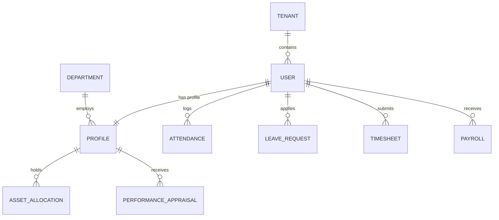

# Database Schema Requirements

## Overview

This document defines the normalized relational database schema for the Employee Management System. The design prioritizes data integrity, auditability (essential for HR), and query performance.

---

## 🏗 ER Diagram (Logic Flow)

---

## 📁 Core Tables & Schema

### 1. `users` (Authentication & RBAC)

| Column          | Type   | Constraints       | Description                          |
| :-------------- | :----- | :---------------- | :----------------------------------- |
| `id`            | UUID   | Primary Key       | Unique User ID                       |
| `email`         | String | Unique, Not Null  | Work email                           |
| `password_hash` | String | Not Null          | Argon2/Bcrypt hash                   |
| `role`          | Enum   | Not Null          | `admin`, `hr`, `manager`, `employee` |
| `status`        | Enum   | Default: `active` | `active`, `suspended`, `terminated`  |

### 2. `profiles` (Core HR Data)

| Column         | Type   | Constraints      | Description                    |
| :------------- | :----- | :--------------- | :----------------------------- |
| `id`           | UUID   | Primary Key      | Linked to User ID              |
| `employee_id`  | String | Unique, Not Null | Company ID (e.g., EMP101)      |
| `dept_id`      | UUID   | Foreign Key      | Reference to `departments`     |
| `manager_id`   | UUID   | Foreign Key      | Reference to another `user.id` |
| `joining_date` | Date   | Not Null         | Date of joining                |
| `designation`  | String | Not Null         | Job title                      |
| `compensation` | JSONB  | -                | Encrypted salary breakdown     |

### 3. `attendance` (Time Tracking)

| Column       | Type      | Constraints | Description                      |
| :----------- | :-------- | :---------- | :------------------------------- |
| `id`         | UUID      | Primary Key | Entry ID                         |
| `user_id`    | UUID      | Foreign Key |                                  |
| `check_in`   | Timestamp | Not Null    |                                  |
| `check_out`  | Timestamp | Nullable    |                                  |
| `ip_address` | String    | -           | Check-in source                  |
| `status`     | Enum      | -           | `present`, `half_day`, `on_duty` |

### 4. `leave_requests` (Time Off)

| Column          | Type | Constraints        | Description                       |
| :-------------- | :--- | :----------------- | :-------------------------------- |
| `id`            | UUID | Primary Key        |                                   |
| `user_id`       | UUID | Foreign Key        |                                   |
| `leave_type_id` | UUID | Foreign Key        | Reference to `leave_types`        |
| `start_date`    | Date | Not Null           |                                   |
| `end_date`      | Date | Not Null           |                                   |
| `status`        | Enum | Default: `pending` | `pending`, `approved`, `rejected` |
| `approved_by`   | UUID | Foreign Key        | Manager ID                        |

### 5. `departments` (Organization Structure)

| Column    | Type   | Constraints      | Description                  |
| :-------- | :----- | :--------------- | :--------------------------- |
| `id`      | UUID   | Primary Key      |                              |
| `name`    | String | Unique, Not Null | Engineering, HR, Sales, etc. |
| `head_id` | UUID   | Foreign Key      | Manager of Department        |

### 6. `leave_types` (Policy Configuration)

| Column         | Type    | Constraints | Description           |
| :------------- | :------ | :---------- | :-------------------- |
| `id`           | UUID    | Primary Key |                       |
| `name`         | String  | Not Null    | Annual, Sick, Casual  |
| `annual_quota` | Integer | Not Null    | Days allowed per year |

### 7. `payroll` (Compensation Records)

| Column          | Type    | Constraints | Description                  |
| :-------------- | :------ | :---------- | :--------------------------- |
| `id`            | UUID    | Primary Key |                              |
| `user_id`       | UUID    | Foreign Key |                              |
| `month`         | Integer | 1-12        |                              |
| `year`          | Integer | -           |                              |
| `base_salary`   | Numeric | Not Null    |                              |
| `tax_deduction` | Numeric | Not Null    |                              |
| `net_payable`   | Numeric | Not Null    |                              |
| `status`        | Enum    | -           | `draft`, `processed`, `paid` |

### 8. `performance_appraisals` (PMS)

| Column           | Type    | Constraints | Description            |
| :--------------- | :------ | :---------- | :--------------------- |
| `id`             | UUID    | Primary Key |                        |
| `user_id`        | UUID    | Foreign Key |                        |
| `cycle_id`       | UUID    | Foreign Key | e.g., FY24-Q3          |
| `self_rating`    | Integer | 1-5         |                        |
| `manager_rating` | Integer | 1-5         |                        |
| `final_score`    | Numeric | -           | Weighted average score |

### 9. `assets` (Inventory)

| Column        | Type   | Constraints | Description               |
| :------------ | :----- | :---------- | :------------------------ |
| `id`          | UUID   | Primary Key |                           |
| `name`        | String | Not Null    | Macbook Pro, iPhone, etc. |
| `serial_no`   | String | Unique      |                           |
| `assigned_to` | UUID   | Foreign Key | Nullable (if in stock)    |

---

## ⚡ Database Technology: PostgreSQL

We are using **PostgreSQL** as our primary database engine.

- **Reasoning**: It offers ACID compliance for financial (Payroll) data, robust support for relational hierarchies (Manager/Employee reporting), and JSONB fields for flexible data storage (like Tax declaration proofs).

---

## ⚡ Performance & Security Requirements

### Indexing Strategy

- **Search Optimization**: B-tree indexes on `profiles.employee_id` and `users.email`.
- **Filtering**: Index on `attendance.user_id` and `attendance.check_in` for fast history lookup.
- **Relational Integrity**: Foreign Key indexes on all `_id` columns to prevent slow join operations.

### Audit Logging

- Every change to `payroll` and `profiles` tables must trigger an entry in an `audit_logs` table (Timestamp, Field, OldValue, NewValue, ChangedBy).

### Data Integrity

- **Soft Deletes**: Use a `deleted_at` timestamp instead of hard deleting employee records.
- **Consistency**: Use DB Transactions for Payroll generation to ensure "all-or-nothing" execution.
