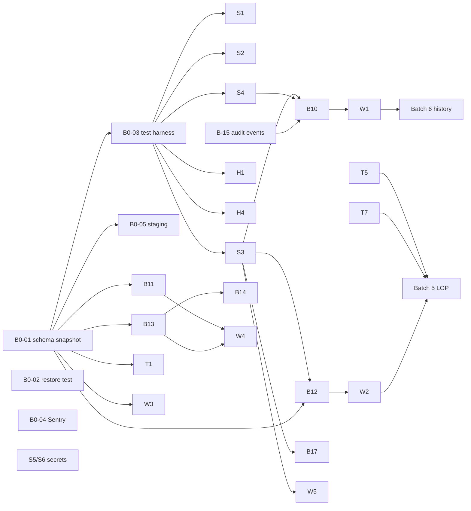

# EMS Remediation Baseline

**Baseline commit:** `83c1e84` (main) · **Prepared:** 2026-10-01 · **Mode:** read-only (no source changed)
**Inputs:** [PRODUCTION_READINESS_AUDIT.md](PRODUCTION_READINESS_AUDIT.md), [SUPPLEMENTARY_AUDITS.md](SUPPLEMENTARY_AUDITS.md)

This document maps each finding to the actual code (file, function, line) and its current behaviour. For each one it states the required behaviour, dependencies, migration need, API and UI impact, regression risk, required test, and implementation order. Every location below was opened and re-checked against `83c1e84` during this pass.

> ### Execution rule (binding on every implementer, human or agent)
> **No item may be implemented from this baseline alone.** Before modifying anything for a finding, re-open every referenced source file at current `HEAD` and confirm that the code, lines and behaviour still match this baseline. If they differ (another PR landed, lines moved, behaviour changed), **stop and report the drift**. Do not adapt silently.
>
> Every item's PR description must contain this report, in this order:
> ```text
> Baseline finding       : <ID + one line>
> Source verified        : <files/functions re-opened at HEAD <sha>; match | drift: …>
> Current behavior       : <observed, with evidence: test output, query result, or code path>
> Proposed change        : <what and why>
> Files affected         : <list; anything outside the item's scope must be justified>
> Migration impact       : <none | file + dry-run output + idempotency proof>
> Tests added            : <names>
> Regression checks      : <auth matrix, route contract, tsc, existing suites, manual role walk-through>
> Result                 : <before/after behavior; DoD checklist §13 ticked>
> ```

---

## 0. Read this first: corrections to the agreed plan

Re-verifying the code surfaced three issues that change the plan.

### 0.1 The security blockers are missing from the P0 table

The revised priority table covers data safety and workflow, but it does not include the main report's **S1–S6**: the backdoor password, the password-reset takeover chain, unguarded payroll/approval APIs, the manager→super_admin escalation, and leaked/default secrets. Fixing data integrity first while any employee can approve their own password reset, or run `POST /payroll/process`, leaves the system exploitable. **They are placed in Batch 1A below, ahead of the B-10…B-17 data fixes (Batch 1B).** All are small.

### 0.2 New finding: the repository cannot rebuild the database that the code expects (schema drift)

| Code writes to | Created by repo scripts? | Evidence |
|---|---|---|
| `payroll_entries.payroll_run_id` | **No.** Not created by `initDb.ts`, `db/schema.ts` or `db/migration_v3.ts` | `payroll.repository.ts:80-83` writes it; `initDb.ts:29-41` defines the table without it |
| `payroll_history.name` | **No.** Never added anywhere | `payroll.repository.ts:93` |
| `payroll_history.status` + `UNIQUE(employee_id,month,year,tenant_id)` | Only by `src/scripts/phase2_migrations.ts`, which is **not called by `npm run db:setup`** (`scripts/db-setup.ts` runs `initDb`, `initializeDatabase` and `runMigrationV3` only) | `phase2_migrations.ts:26-113`; `scripts/db-setup.ts:12-20` |

**Implication:** the live Supabase schema was changed by hand at some point. The repo is not its source of truth. A fresh environment built from the repo (staging, a DR restore target, or a new tenant) would fail on the first payroll run (`ON CONFLICT` with no matching constraint, missing columns). **Every migration in this plan must be written against a schema snapshot of the live DB, not against the repo scripts.** This is item B0-01.

### 0.3 New finding: 16 frontend calls hit routes that do not exist

`docs/audit/tools/route_contract_check.py` compared every `api.get/post/put/delete` call in `client/src` with the 124 Express routes. These are the calls with no matching route:

| Client call | File | Consequence |
|---|---|---|
| `POST payroll/run` | `payroll/sections/PayRuns.tsx:37` | **"Run payroll" button 404s.** The backend route is `POST /payroll/process` |
| `POST /payroll/profiles` | `payroll/components/CreateProfileModal.tsx` | Cannot create salary profiles from the UI |
| `GET /payroll/payslip/:id/monthly`, `/yearly` | `payroll/sections/EmployeePayroll.tsx`, `DocumentsPayslips.tsx` | Payslip download 404s |
| `GET /payroll/documents/bulk-payslips` | `DocumentsPayslips.tsx` | 404 |
| `GET /payroll/tax-statutory/summary` | `payroll/sections/TaxStatutory.tsx` | 404 |
| `GET /payroll/deadlines/latest`, `POST /payroll/deadlines` | `payroll/sections/Approvals.tsx` | 404 |
| `GET /claims/admin`, `PUT /claims/:id/approve`, `PUT /claims/:id/reject` | `payroll/sections/Approvals.tsx` | Claims approval 404s (the backend has `PUT /claims/:id/status`) |
| `GET /approvals/pending`, `PUT /approvals/:id/:action` | `settings/components/ApprovalsTab.tsx:33,49` | Settings approvals tab 404s |
| `GET /reports/holidays` | `dashboard/components/widgets/OrgCalendarWidget.tsx` | Calendar widget gets no holidays |
| `GET /timesheets` | `timesheet/pages/Timesheets.tsx` | 404 |

In addition, `GET /payroll/history/:employeeId` exists but is a **stub that always returns `[]`** (`payroll.routes.ts:16-18`).

**Implication for priorities:** the payroll module is **not operable from the UI**. The only working way to run payroll is a direct call to the **unguarded** `POST /payroll/process`. So "payroll duplicate runs" (P0 in your table) is really two problems: the **security** problem (an unguarded API) is P0, and the **duplicate-run** problem is best solved once, inside the payroll state machine (Batch 3), when the UI is reconnected. An interim guard is still specified (B-12), because the API is reachable today.

### 0.4 New finding: the two manager columns use different ID spaces

- `employees.reporting_manager_id` holds a **users.id**. The employee list joins `LEFT JOIN users m ON e.reporting_manager_id = m.id` (`employees.repository.ts:18`), and the UI's ManagerPicker writes it (`AddEmployeeModal.tsx:695`).
- `employees.manager_id` is compared with an **employees.id**. The Approvals inbox filters with `ap.manager_id = $2`, where `$2 = currentEmployeeId` from `getEmployeeIdByUserId` (`approvals.repository.ts:4-15`), and employee delete clears `manager_id` (`employees.repository.ts:350`).

So "consolidating" the two columns is not a rename. It needs an ID translation (users.id ↔ employees.id through `employees.user_id`) and a decision on which identity a "manager" is. Item W-3.

### 0.5 New finding: attendance has two schemas, and the employee list reads the wrong one

Check-in writes `attendance(employee_id, check_in_time, date, …)` (`attendance.repository.ts:49-56`). The employee list computes `is_checked_in` from `attendance.user_id` and `attendance.check_in` (`employees.repository.ts:20`). The "checked in" badge (`EmployeeTable.tsx:428,608`) is therefore probably always false for new check-ins [I]. The index `idx_attendance_user_date (user_id, check_in)` (`db/schema.ts:279`) covers the legacy columns. Item T-7.

---

## 1. Design decisions (agreed refinements)

### 1.1 Employee lifecycle model

The existing data uses lower-case `employees.status` values: `onboarding`, `active`, `inactive`, `terminated` (grep counts: `active` 18, `onboarding` 7, `terminated` 2). The UI compares these strings directly. **Keep the column and the lower-case values. Extend the set rather than introducing new casing.**

```text
onboarding ──► active ──► notice_period ──► exited ──► archived
                 ▲  │
                 └──┘ (reversal of resignation: notice_period → active)
```

| Rule | Detail |
|---|---|
| Probation is **not** a state | It stays an attribute (`probation_end_date`, `confirmation_date`). Making it a state would break every `status === 'active'` check. |
| `exited` | Set when `exit_date` passes, or immediately on termination. User login is deactivated. **All history is retained.** Excluded from future payroll runs whose period starts after `exit_date`. |
| `archived` | Hidden from default lists; read-only; still reportable; eligible for retention policy later (P3). |
| Legacy mapping | `terminated` → `exited` (backfill). `inactive` → **needs a data review** (could mean exited or suspended); query the counts before mapping. |
| Enforcement | Transitions go through one service method, `EmployeesService.transitionStatus(id, to, ctx)`, with an allowed-transition table. DB constraint added as `CHECK (...) NOT VALID`, then `VALIDATE` after the backfill. |
| Delete | `DELETE /employees/:id` becomes "exit now" (→ `exited`) for backward compatibility. Hard delete is removed from the request path. |

### 1.2 Payroll run model

```text
draft ──► calculated ──► review ──► approved ──► finalized ──► paid
  │            │            │           │
  └────────────┴────────────┴───────────┴──► cancelled
```

| Rule | Detail |
|---|---|
| Storage | Add `payroll_runs.status TEXT NOT NULL DEFAULT 'draft'`, plus `calculated_at`, `approved_by`, `approved_at`, `finalized_at`, `paid_at`, `created_by`. **Backfill existing runs as `paid`**, which is what they effectively are today. |
| One live run per period | Partial unique index `ON payroll_runs(tenant_id, year, month) WHERE status <> 'cancelled'`. Requires de-duplicating existing duplicate runs first (B0-01 query). |
| Transition guard | `UPDATE payroll_runs SET status=$to … WHERE id=$id AND status=$from`. Zero rows updated → 409. |
| History | `payroll_history` is written **only on `paid`**, not on calculate. This fixes "paid immediately". |
| Recalculation | Allowed only in `draft`/`calculated`/`review`. It deletes and re-inserts that run's `payroll_entries` inside a transaction. |
| Permissions | Existing catalogue entries (`schema.ts:332-337`): `payroll:run` (create, calculate), `payroll:adjust` (review edits), `payroll:finalize` (approve, finalize, mark paid). Separation of duties: `approved_by ≠ created_by`. |
| Backward compatibility | `POST /payroll/process` remains a shim: create a draft and calculate it. It **no longer** writes history. The UI's `POST payroll/run` becomes an alias of the same handler. |
| **Invariant: separation of duties** | `approved_by <> created_by` and `finalized_by <> created_by` are enforced in the service **and** by a DB `CHECK` on `payroll_runs`. A per-tenant override exists only for single-operator tenants; it is off by default and audited when used. |
| **Invariant: deterministic calculation** | Given the same inputs (tenant, employee set, pay period, salary configuration, attendance, leave, adjustments, tax configuration), calculation produces byte-identical `payroll_entries`. To make this hold: (a) at `calculated`, snapshot the inputs into `payroll_run_inputs` (JSONB per employee plus the config versions) and store an `inputs_hash` on the run; (b) calculation reads **only** from the snapshot, never from live tables mid-run; (c) no `Date.now()`, `NOW()` or random values in calculated fields (today the run ID uses `Date.now()`, `payroll.service.ts:201`; IDs may stay, but values must not depend on them); (d) explicit rounding rules, applied in a fixed order; (e) any input change requires recalculation, which creates a new snapshot version. A recalculation test asserts the same hash gives the same output. Batch 5 reconciliation depends on this. |

### 1.3 Approval transitions (all approval types)

Every approval UPDATE gets `AND status = 'pending'` (or the type's equivalent pending state), plus `RETURNING`. Zero rows → `409 APPROVAL_ALREADY_DECIDED`. `approved_by` always comes from `req.user`, never from the request body.

---

## 2. Batch overview and order

| Batch | Theme | Items | Exit criteria |
|---|---|---|---|
| **0** | Safety net (before any change) | B0-01…B0-05 | Live schema snapshot committed; a restore has been tested; test harness runs; Sentry receiving errors; staging rebuilt from the snapshot |
| **1A** | Security P0 | S1, S2, S3, S4, S5/S6, H1, H4 | Authorization test matrix green; secrets rotated |
| **1B** | Data safety & truthfulness (B-10…B-17) | B-10…B-17 | No code path hard-deletes history; leave approvable end to end; approval races return 409; fake controls hidden |
| **2** | Tenant & data-integrity hardening | T-1…T-8 | No tenant fallback literals; leave and attendance validated |
| **3** | Workflow & state machines | W-1…W-6 | Lifecycle and payroll state machines live; one manager identity; one approval inbox; route contract check = 0 |
| **4** | Production operations | O-1…O-8 | `/ready`, structured logs, alerts, CI, versioned migrations, runbook |
| **5** | Payroll correctness | P-1… | Two parallel-run cycles reconciled |
| **6** | Lifecycle / history / exit | L-1… | Job history and exit/F&F in production |
| **7** | Enterprise SaaS | E-1… | Tenant provisioning, SSO/MFA, export, retention |

The batches are sequential. Items inside a batch can be done in parallel unless a dependency is listed. **Each item should be its own PR, with its tests.**

### 2.1 Release boundaries and gates

PRs merge to `main` behind the gates below and ship as **releases**. Each release is tagged, so it is a clean rollback point.

```text
RELEASE 0 — Safety            B0-01  B0-02  B0-03  B0-04  B0-05
   ═══ HARD GATE: B0-01 and B0-02 complete and signed off; B0-05 staging rebuilt from the snapshot ═══
RELEASE 1 — Security          S1  S2  S3  S4  S5/S6  H1  H4
   ═══ GATE: authorization matrix green on staging; secrets rotated ═══
RELEASE 2 — Data Safety       B-10 … B-17
   ═══ GATE: data-safety tests green on staging with a production-like data copy ═══
RELEASE 3 — Tenant integrity  T-1 … T-8
RELEASE 4 — Workflow          W-1 … W-6   (W-3 has its own gate, see §7)
RELEASE 5 — Operations        O-1 … O-8
RELEASE 6+ — Payroll correctness, lifecycle, enterprise (not started until Release 5 is done)
```

**No work from a later release starts until the previous gate has passed.** The B0 gate is absolute. No migration may be written before `0000_live_schema.sql` exists, because the repo's own scripts do not describe the production schema (§0.2).

Reference chain for every schema change:
```text
Production DB → 0000_live_schema.sql → numbered migrations → staging → production
```
`initDb.ts`, `db/schema.ts`, `db/migration_v3.ts` and `scripts/phase2_migrations.ts` are **historical references only** from Release 0 onward.

---

## 3. Batch 0 — Safety net

### B0-01 Live schema snapshot and drift report
- **Finding:** §0.2 (new)
- **Current:** The DB schema is defined by four overlapping scripts that fail silently (`initDb.ts`, `db/schema.ts`, `db/migration_v3.ts`, the unwired `scripts/phase2_migrations.ts`). The live DB differs from all of them.
- **Required (two files, structure and diagnostics kept apart):**
  - `server/db/baseline/0000_live_schema.sql`: **structural DDL only.** Use `pg_dump --schema-only --no-owner --no-privileges --schema=public` (plus any other app schemas found). **Must not contain:** data, `COPY`/`INSERT`, role passwords, connection strings, Supabase-internal schemas (`auth`, `storage`, `realtime`, `supabase_*`, `extensions` internals), or comments carrying environment details. Review the file for secrets before committing it.
  - `server/db/baseline/0000_live_schema.md`: diagnostics, **aggregate counts only, no row-level personal data.**
    - (1) A structural inventory confirming each category was captured: tables, columns, indexes, constraints (PK/UNIQUE/CHECK), foreign keys, triggers, functions, enums/types, RLS policies, extensions, sequences.
    - (2) A drift table: repo scripts vs live, per table and column.
    - (3) Diagnostic query results:
      - duplicate payroll runs per `(tenant_id, month, year)`
      - existence of `payroll_entries.payroll_run_id`, `payroll_history.name`/`status`, and the `UNIQUE(employee_id,month,year,tenant_id)` constraint
      - `leave_requests` rows with `employee_id IS NULL`, and the legacy-vs-current column usage counts
      - `employees.status` value counts
      - rows where `manager_id` and `reporting_manager_id` disagree (count only)
      - `attendance` rows using `user_id`/`check_in` vs `employee_id`/`check_in_time`
      - `tenant_id` value distribution (NULL / `''` / `'default'` / `'tenant_default'` / other) per core table
      - DB `SHOW timezone`
      - triggers on `leave_requests` and `attendance`
      - row counts per table (scale reference)
    - (4) The exact SQL used for each diagnostic, so it can be re-run.
- **Dependencies:** Read-only production DB access, granted by the owner. Run diagnostics as a read-only role.
- **Migration:** None (read-only)
- **API / UI impact:** None
- **Risk:** Information exposure if done carelessly; mitigated by the exclusions above and an owner review of both files.
- **Test:** B0-05 rebuilds staging from this file. If the rebuild fails, the snapshot is incomplete.
- **Order:** 1st. **Hard gate for everything after Release 0.**

### B0-02 Backup and restore verification
- **Finding:** Main report Phase 5 / Supplementary Audit 4 [U]
- **Required:** Confirm the Supabase backup tier and PITR. Perform **one restore into a scratch project** and smoke-test login and the employee list against it. Document RPO and RTO.
- **Dependencies:** Supabase dashboard access
- **Migration / API / UI impact:** None
- **Risk:** None
- **Order:** Parallel with B0-01

### B0-03 Test harness
- **Current:** No tests exist. Importing `server/src/index.ts` has side effects: `start()` runs at module load (`index.ts:203`), which calls `app.listen`, `seedPermissionsAndSuperAdmin()` and registers process handlers.
- **Required:**
  - Split `index.ts` into `app.ts` (builds and exports the Express app, no side effects) and `index.ts` (calls `start()`). Vercel keeps importing `index.ts`, so its behaviour is unchanged.
  - Add `vitest` + `supertest`, and a test DB created from the B0-01 snapshot (Docker Postgres or a Supabase branch).
  - Add factories for a tenant and the roles (super_admin, admin, hr, manager, employee) with the seeded permission sets.
- **Dependencies:** B0-01
- **Migration:** None
- **API / UI impact:** None
- **Risk:** Low (`export default app` is preserved for `@vercel/node`)
- **Test:** A smoke test (`GET /api/v1/health` returns 200)
- **Order:** After B0-01

### B0-04 Minimal error visibility
- **Required:** Sentry on server (Express error handler) and client (ErrorBoundary), with environment tags. This lands before Batch 1 so that regressions caused by the fixes are visible.
- **Migration:** None
- **API / UI impact:** None
- **Risk:** Very low
- **Configuration:** `sendDefaultPii: false`. Scrub the `Authorization` header, `password`, `temp_password`, `refreshToken`, `resetToken` and email fields before sending. Off when the DSN is unset (local development and tests).
- **Order:** Parallel with B0-03

### B0-05 Staging environment (added: needed by DoD item 14)
- **Finding:** There is no staging environment (Supplementary Audit 4). DoD item 14 ("staging smoke test passes") cannot be met without one.
- **Required:**
  - A separate Supabase project (or branch) built **only** from `0000_live_schema.sql`, with synthetic seed data: no production personal data, and roles covering super_admin, admin, hr, manager, employee and a custom role.
  - A separate app deployment (Vercel preview or Render service) pointed at it, with its own JWT secrets.
  - A smoke script covering login for each role, the employee list, check-in, leave apply, and the approvals list.
- **Dependencies:** B0-01
- **Migration:** None
- **API / UI impact:** None
- **Risk:** None
- **Test:** The schema rebuild succeeds and the smoke script passes. **A failed rebuild means B0-01 is incomplete.**
- **Order:** After B0-01

---

## 4. Batch 1A — Security P0

Every item adds or tightens a check. Users who hold the right permissions see no behaviour change. The **authorization test matrix** (one test per route: *employee → 403, permitted role → 2xx*) is written first and lands with the first item.

### S1 Master password backdoor
- **File/function:** `server/src/modules/auth/auth.service.ts` → `AuthService.login()` L23-25
- **Current:** `admin@company.com` + `admin123`/`Admin@123` always authenticates
- **Required:** Lines removed. Admin uses the real stored hash.
- **Dependencies:** Confirm the real admin password works **before** deploying (otherwise admin is locked out). If it does not, reset it via a one-off script.
- **Migration:** None
- **API impact:** None
- **UI impact:** None
- **Risk:** Low (admin lockout, mitigated as above)
- **Test:** Login with `admin123` → 401 (unless that is the real stored password)
- **Order:** 1A-1

### S5 / S6 Secrets
- **Files:** `server/src/config/env.ts` L9-10 (`JWT_SECRET`/`JWT_REFRESH_SECRET` defaults); git history `server/.env` (commits `160ac22`…`283f78d`)
- **Required:** Rotate the DB password and both JWT secrets in Vercel/Render. Change the schema to `z.string().min(32)` with no default. The process fails fast if they are missing.
- **Dependencies:** Platform environment-variable access
- **Migration:** None
- **API / UI impact:** All sessions are invalidated once (users log in again)
- **Risk:** Low
- **Test:** Booting without `JWT_SECRET` throws
- **Order:** 1A-2 (rotate first, then the code change)

### S2 Password-reset takeover chain
- **Files/functions:**
  - `approvals.routes.ts:14` → `updateApprovalAction` (no authorization)
  - `approvals.service.ts:25-128` → `ApprovalsService.updateApprovalAction()` (the default branch handles any `type`, including `password_reset`)
  - `auth.service.ts` → `requestPasswordReset()` L141-192 returns `requestId`; `checkPasswordResetStatus()` L194-216 returns `resetToken`; `resetPasswordWithApproval()` L218-257 makes the token optional (L246)
  - `auth.service.ts:144-146` user enumeration (404 for an unknown email)
- **Required:**
  - (a) `authorize('approvals:approve')` on the action route, and `password_reset` approvals require `settings:manage`.
  - (b) The status endpoint never returns `resetToken`.
  - (c) After approval, the token is emailed to the user. Store only its SHA-256 hash with a 30-minute expiry, single use.
  - (d) The token is **required** on reset.
  - (e) The same generic response whether or not the email exists.
- **Dependencies:** SMTP configured (`services/emailService.ts`)
- **Migration:** Additive. `reset_token_hash` and `reset_expires_at` in `approvals.metadata` (JSONB, no DDL) or new columns.
- **API impact:** `GET /auth/forgot-password/status` drops the `resetToken` field.
- **UI impact:** `ForgotPasswordModal.tsx` (528 LOC) must take the token from the emailed link or code instead of the status response.
- **Risk:** Medium (flow change); end-to-end test required
- **Test:** Employee approves `PR-*` → 403. Status response has no token. Reset without a token → 400. Reusing a token → 400.
- **Order:** 1A-3

### S3 Unguarded mutating and sensitive endpoints
- **Routes → required permission** (catalogue from `db/schema.ts:306-360`):

| Route (file:line) | Handler | Add |
|---|---|---|
| `POST /payroll/process` (`payroll.routes.ts:26`) | `processPayroll` | `payroll:run` |
| `PUT /payroll/employees/:id` (`:13`) | `updatePayrollProfile` | `payroll:manage` |
| `GET /payroll/employees`, `/runs`, `/activity`, `/pending-approvals`, `/live-summary`, `/deadlines`, `/tax-summary` (`:12-25`) | various | `payroll:view` (the employee self-view uses `payroll:view_own` on a self-scoped endpoint) |
| `PUT /leave/:id/approve` (`leaves.routes.ts:36`) | `approveLeave` | `leave:approve`; and ignore `approved_by` from the body (`leaves.controller.ts:29-31`) |
| `PUT/DELETE /leave/requests/:id`, `/leave/:id` (`:30-38`) | update/delete | owner-or-`leave:approve` check |
| `POST /approvals/:id/action` (`approvals.routes.ts:14`) | `updateApprovalAction` | `approvals:approve` |
| `PUT /timesheets/:id/approve` (`timesheets.routes.ts:29`) | `approveTimesheet` | `timesheet:approve` |
| `PUT /claims/:id/status`, `GET /claims` (`claims.routes.ts:14-15`) | | `claims:approve` (seeded by `seedPermissions.ts:57`) |
| `GET /audit-logs` (`audit/read/read.routes.ts:9`) | `getLogs` | `audit:view` |
| `GET /reports/admin`, `/dashboard`, `/analytics`, `/summary`, `/departments` (`reports.routes.ts:10-23`) | analytics | `reports:view` |
| `GET /users` (`users.routes.ts:12`) | `getUsers` | `employees:view` |

- **Dependencies:** The permission vocabulary. Use the `schema.ts` set, and pass **both** spellings where `seedPermissions.ts` differs (e.g. `['employees:view','employees:read']`) until W-5 unifies them.
- **Migration:** None
- **API impact:** 403 for under-privileged callers (intended)
- **UI impact:** Non-admin users must not call these routes. Check `EmployeePayroll.tsx` (employee payslip view), which currently reads `GET /payroll/employees`. It needs a self-scoped endpoint (`GET /payroll/me`) **in the same PR**, or employees lose their payroll page.
- **Risk:** **Medium.** Highest regression potential in Batch 1, which is why the authorization test matrix and a manual run-through for each role are required.
- **Test:** Authorization matrix for each row
- **Order:** 1A-4

### S4 Legacy role map → manager escalation
- **Files/functions:** `core/security/authorize.ts` → `authorize()` L77-131, `ROLE_TO_PERMISSIONS` L69-75, `dashboard_type` bypass L93. Affected guards:

| Guard | Who should have access | Who gets in today |
|---|---|---|
| `settings/index.ts:11` | admins | managers |
| `employees.routes.ts:50,68,71` (create, bulk, **delete**) | HR/admin | **managers can hard-delete employees** |
| `documents.routes.ts:15-16` | HR/admin | managers |
| `performance.routes.ts:14` and `reviews.routes.ts:14` | managers and above | **all employees** |
| `governance*.routes.ts` | HR/admin | managers |

- **Required (minimal, P0):** Replace these guards with explicit permissions: `settings:manage`; `employees:create`/`employees:delete`; `documents:manage` (seeded in `seedPermissions.ts:60`); `governance:manage`; for performance, a new `performance:manage` permission. Leave `ROLE_TO_PERMISSIONS` in place for any other callers for now; it is removed in W-5.
- **Migration:** Seed `performance:manage` and grant it to the admin, hr and manager roles.
- **API impact:** 403 for the escalation paths
- **UI impact:** None (the UI already hides Settings from managers by role)
- **Risk:** Low-Medium
- **Test:** Manager: `PUT /settings/users/:id/role` → 403; `DELETE /employees/:id` → 403. Employee: `POST /performance` → 403.
- **Order:** 1A-5

### H1 Plaintext temporary passwords
- **Files/functions:**
  - `auth.service.ts:20` (plaintext comparison in `login()`)
  - `settings/user-assignments/user-assignments.service.ts:30,57,74` (`Math.random()` generation)
  - `user-assignments.routes.ts:25` → `getTempPassword` (reveal endpoint)
  - `user-assignments.repository.ts:9,38`
- **Required:** Generate with `crypto.randomBytes`. Return it **once** in the create/reset response. Store only the bcrypt hash in `password`, plus `is_password_temp=true`. Remove the plaintext comparison and the reveal endpoint.
- **Migration:** `UPDATE users SET temp_password = NULL` once all temp users have a hashed password (verify first that `password` already holds the hash: `initDb.ts:495` sets both).
- **API impact:** `GET /settings/users/:id/temp-password` removed (return 410)
- **UI impact:** `settings/components/UsersTab.tsx` (503 LOC) shows the password only at create/reset time, with a copy button
- **Risk:** Low-Medium (admins lose "view later")
- **Test:** The temp password logs in once; `mustChangePassword` is enforced; the reveal endpoint returns 410
- **Order:** 1A-6

### H4 Destructive bootstrap scripts
- **Files:** `initDb.ts:450-463` (resets admin to `admin123` on every `db:setup`); `scripts/seedPermissions.ts:139-147` (forces `admin@company.com` to super_admin on every boot); `index.ts:194` (seeding at startup)
- **Required:** `db:setup` must never overwrite an existing user's password. Super-admin bootstrap becomes an explicit one-time CLI (`npm run bootstrap:admin -- --email … --password-from-env`). Permission seeding moves out of `start()` into `db:setup` (it is idempotent).
- **Migration:** None
- **API / UI impact:** None
- **Risk:** Low (startup gets faster)
- **Test:** Running `db:setup` twice leaves the admin password hash unchanged
- **Order:** 1A-7

---

## 5. Batch 1B — Data safety & truthfulness (B-10…B-17)

### B-10 Employee hard delete → exit
- **Finding:** A2-1 (+ S4: managers can trigger it)
- **File/function:** `employees.repository.ts` → `EmployeesRepository.delete()` L331-380 (12 child-table `DELETE`s **without a tenant filter**, then the employee row; soft delete only as an error fallback). Called by `EmployeesService.deleteEmployee()` (`employees.service.ts:532-534`) ← `deleteEmployee` controller (`employees.controller.ts:132-140`; tenant falls back to `'tenant_default'` at L133) ← `DELETE /employees/:id` (`employees.routes.ts:71`) ← `EmployeeTable.tsx:252`.
- **Current:** All payroll, leave, timesheet, claim, loan and review history is destroyed.
- **Required (interim, ahead of the W-1 state machine):**
  - `delete()` becomes: `UPDATE employees SET status='exited', exit_date=COALESCE(exit_date, CURRENT_DATE), deleted_at=NOW() WHERE id=$1 AND tenant_id=$2`, and deactivate the linked user (by `user_id`, falling back to email).
  - **No child rows are touched.**
  - Remove the `'tenant_default'` fallback in the controller.
  - Audit event `EMPLOYEE_EXITED`.
- **Dependencies:** S4 (delete guard), B-15 (audit event)
- **Migration:** None. `deleted_at`, `exit_date` and `status` already exist. Lists already filter `deleted_at IS NULL` (`employees.repository.ts:21-22`).
- **API impact:** Same route and response shape; the message text changes to "Employee exited".
- **UI impact:** Rename the button and confirm dialog to "Exit employee" in `EmployeeTable.tsx`. Existing views of history (payslips, leave) keep working.
- **Risk:** Low. Check every query that should exclude exited staff (e.g. headcount in `analyticsService.ts` already counts `terminated OR deleted_at`, L107). **Add `exited` to that filter.**
- **Test:**
  - After the call, the `payroll_entries`, `leave_requests` and `timesheets` row counts are unchanged.
  - The user cannot log in.
  - The employee is absent from the list.
  - A manager gets 403.
- **Order:** 1B-1

### B-11 Leave requests invisible to the approval inbox
- **Finding:** A1-3, A2-9
- **Files/functions:**
  - Writer: `leaves.repository.ts` → `LeavesRepository.applyLeave()` L9-16 (inserts `user_id, leave_type_id`; `employee_id` stays NULL)
  - Reader: `approvals.repository.ts` → `ApprovalsRepository.getApprovals()` L9-120. Its leave branch L44-57 does `JOIN employees e ON l.employee_id = e.id` and reads the legacy `l.type`.
  - Approver path: `ApprovalsService.updateApprovalAction()` → `updateLeaveStatus()` (`approvals.repository.ts:183-185`)
- **Current [C code / I outcome]:** New leave requests are dropped by the inner join, so approvers never see them. The UI has no other approve path (`client/src/modules/leave/*` has no approve call).
- **Required:**
  - (a) `applyLeave` resolves and stores `employee_id` (via `employees.user_id = $userId AND tenant_id`).
  - (b) The inbox leave branch joins `LEFT JOIN leave_types lt ON lt.id = l.leave_type_id` and selects `COALESCE(lt.name, l.type)`.
  - (c) Backfill `leave_requests.employee_id` from `user_id`.
- **Dependencies:** B0-01 (confirm the NULL counts and that no trigger exists)
- **Migration:** **Yes**, a data backfill: `UPDATE leave_requests lr SET employee_id = e.id FROM employees e WHERE lr.employee_id IS NULL AND e.user_id = lr.user_id AND e.tenant_id = lr.tenant_id`. Idempotent.
- **API impact:** None (the inbox shape is unchanged)
- **UI impact:** Leaves now appear in `/approvals`
- **Risk:** Low
- **Test:** End to end. Employee applies → admin's `GET /approvals` contains `leave-{id}` with the correct type name → approve → status `approved`, `approved_by` set.
- **Order:** 1B-2 (**verify with the 10-minute manual test first**)

### B-12 Payroll: interim run guard and exited staff excluded
- **Finding:** A2-3 (c, e)
- **File/function:** `payroll.service.ts` → `PayrollService.processPayroll()` L200-250; `payroll.repository.ts` → `getAllPayrollProfiles()` L66-69, `createPayrollRun()` L71-76
- **Current:** Any number of runs per month; every profile in the tenant is paid, including exited staff.
- **Required (interim, until W-2):**
  - Inside the transaction, take `SELECT pg_advisory_xact_lock(hashtext(tenant||year||month))`. If a run exists for `(tenant, month, year)`, return 409 `PAYROLL_RUN_EXISTS`.
  - Profiles join `employees` with `deleted_at IS NULL AND status NOT IN ('exited','terminated','archived') AND (exit_date IS NULL OR exit_date >= first day of the period)`.
- **Dependencies:** S3 (guard), B0-01 (existing duplicates)
- **Migration:** None for the interim. The unique index arrives in W-2 after de-duplication.
- **API impact:** 409 on a repeat run
- **UI impact:** None (the UI cannot reach this route today, §0.3)
- **Risk:** Low
- **Test:** Two concurrent `process` calls give one 200 and one 409. An exited employee gets no entry.
- **Order:** 1B-3

### B-13 Approval state races
- **Finding:** A2-2
- **Files/functions (each UPDATE lacks a status precondition):**

| Function | Location |
|---|---|
| `LeavesRepository.approveLeave()` | `leaves.repository.ts:37-44` |
| `TimesheetsRepository.approveTimesheet()` | `timesheets.repository.ts:54-61` |
| `ClaimsRepository.updateClaimStatus()` | `claims.repository.ts:25-28` |
| `ApprovalsRepository.updateLeaveStatus()` | `approvals.repository.ts:183-185` |
| `ApprovalsRepository.updateEmployeeStatus()` | `:187-189` |
| `ApprovalsRepository.updateTimesheetStatus()` | `:191+` |
| `ApprovalsRepository.updateApprovalStatus()` | `:199-203` (also accepts `tenant_id IS NULL OR ''`) |

- **Required:** Add `AND status = <pending state>` with `RETURNING id`. Services throw `AppError.conflict` when 0 rows are updated. Drop the `IS NULL`/`''` tenant clauses (data backfill first, see the migration line).
- **Dependencies:** B0-01 (approval rows with a NULL tenant)
- **Migration:** Backfill `approvals.tenant_id` where it is NULL or `''`
- **API impact:** 409 on a second decision
- **UI impact:** `Approvals.tsx:53` should show "already decided" and refresh
- **Risk:** Low
- **Test:** For each type: two parallel approve calls give one 200 and one 409; approving an approved item gives 409.
- **Order:** 1B-4

### B-14 Attendance regularization auto-approved
- **Finding:** A2-4
- **File/function:** `attendance.repository.ts` → `AttendanceRepository.regularize()` L124-131 (inserts `status='present'`); `AttendanceService.regularize()` (`attendance.service.ts:101-107`); schema `attendance.schema.ts` (`regularizeSchema`: date and times are free strings, `.passthrough()`)
- **Required:**
  - Insert with `status='pending_regularization'` and a reason, and create an `approvals` row of type `attendance_regularization`. On approval, set `present`.
  - Validate: date ≤ today and within a configurable window (e.g. 30 days); check-out after check-in; no existing completed record for that date.
- **Dependencies:** B-13 (state guard pattern)
- **Migration:** None (`status` is free text). Optional `CHECK` later.
- **API impact:** The response message becomes "submitted for approval"
- **UI impact:** `AttendanceHistory`/`AttendanceCalendar` must render the pending state; `/approvals` gets a new type label
- **Risk:** Medium (attendance-derived reports must treat `pending_regularization` as not present)
- **Test:** Future date → 400. Duplicate → 409. Approve → `present`. Reports exclude pending rows.
- **Order:** 1B-5

### B-15 Audit coverage
- **Finding:** A2-14
- **Current:** `DomainEventType.AUDIT_LOG_REQUESTED` is published only in `auth.controller.ts` (login, logout, profile update). Listener: `modules/audit/audit.listeners.ts`.
- **Required:** Publish the event (actor, tenant, entity, before/after for changed fields, with secrets redacted) from:
  - `EmployeesService.createEmployee`, `.updateEmployee`, `.bulkUpload`, `.deleteEmployee`/exit
  - `PayrollService.processPayroll` and `PayrollService.updatePayrollProfile`
  - `ApprovalsService.updateApprovalAction`, `LeavesService.approveLeave`, timesheet and claim approvals
  - `rbac.controller` role and permission changes
  - `user-assignments` create, role and status changes, password reset
- **Dependencies:** None (the plumbing exists)
- **Migration:** None
- **API / UI impact:** None (the audit page already reads `audit_logs`)
- **Risk:** Low (fire-and-forget event; must not throw into the request)
- **Test:** Each listed action creates one `audit_logs` row with the right actor and entity
- **Order:** Early in 1B. B-10 to B-14 should emit through it.

### B-16 Fake security controls
- **Finding:** Supplementary §3.4
- **File:** `client/src/modules/settings/components/SecurityTab.tsx` L18 (`mfa_enabled`) and L155 (MFA Enforcement toggle), plus the `require_numbers`/`require_uppercase`/`require_special_char` toggles. Zero references in `server/src`.
- **Required:** Hide them, or mark them clearly as "Not yet enforced" (disabled). Leave the stored config untouched.
- **Migration:** None
- **API impact:** None
- **UI impact:** Settings → Security
- **Risk:** None
- **Test:** UI snapshot or manual check
- **Order:** Any time in 1B

### B-17 Dead endpoints and controls
- **Finding:** §0.3 (16 calls), A1-7
- **Required, by group:**

| Group | Fix |
|---|---|
| Settings → Approvals tab (`ApprovalsTab.tsx:33,49`) | Replace it with a link to `/approvals` (consolidation) |
| Claims approve/reject (`payroll/sections/Approvals.tsx:43`) | Call the existing `PUT /claims/:id/status {status}`; `GET /claims/admin` → `GET /claims` |
| `POST payroll/run` (`PayRuns.tsx:37`) | **Do not enable yet.** Leave it disabled with "Payroll runs move to the reviewed workflow" until W-2. Enabling it now would expose the old "paid immediately" behaviour through the UI. |
| Payslips, bulk payslips, tax-statutory, deadlines, create profile | Hide the controls until implemented (Batch 5), or implement the read-only ones that have data (`payroll_entries`) |
| `GET /reports/holidays`, `GET /timesheets` | Point them at existing data, or remove the widget/call |
| Export / Export PDF / Filter buttons (`EmployeeTable.tsx:325`, `Reports.tsx:126-131`) | Implement CSV export of the current employee list (client-side, from the loaded page or a new `GET /employees/export` guarded by `reports:export`), or hide |

- **Dependencies:** S3 for any newly wired route
- **Migration:** None
- **API impact:** Possibly `GET /employees/export`
- **UI impact:** As listed
- **Risk:** Low
- **Test:** Add `route_contract_check.py` to CI with the expected result "0 unmatched", allowlisting dynamic paths
- **Order:** End of 1B

---

## 6. Batch 2 — Tenant & data-integrity hardening

| ID | Finding | File / function | Current | Required | Migration | API / UI impact | Risk | Test |
|---|---|---|---|---|---|---|---|---|
| T-1 | Tenant fallback literals (H5) | 37 sites under `server/src/modules/**/*.repository.ts`, e.g. `EmployeesRepository.findById` L110-118, `.update` L123-125, `.updateEmployeeProfile` L127-137, list join L19 | `OR tenant_id IN ('tenant_default','default')` | Strict `tenant_id = $n` | Backfill NULL/legacy `tenant_id` to the real tenant, then `SET NOT NULL` (NOT VALID → VALIDATE) on core tables | None single-tenant | Medium. If any rows hold `'default'` while users hold `'tenant_default'`, they disappear, so the B0-01 counts drive the backfill. | Cross-tenant read/write → 404 |
| T-2 | `leave_types` unscoped (A2-8) | `LeavesRepository.getLeaveTypes()` L4-7; `getLeaveTypeById()`; `getUserAndLeaveTypeName()` L82-86 | `SELECT * FROM leave_types` | Add `WHERE tenant_id=$1` | None | None | Low | Tenant B's types are invisible to tenant A |
| T-3 | Unscoped child deletes | `EmployeesRepository.delete()` | Removed by B-10 | Delete the dead code | None | None | None | n/a |
| T-4 | Retry of non-idempotent writes (A2-12) | `config/db.ts` → `query()` L67-82 | Retries any "timeout"/reset error | Retry only when the SQL starts with `SELECT`, or via an explicit `{idempotent:true}` option | None | None | Low | A failing insert is not retried |
| T-5 | Check-in race + TZ (A2-5, A2-6) | `AttendanceService.checkIn()` L42-57; `AttendanceRepository.getOpenSession()` L22-32, `.checkIn()` L49-57, `.checkOut()` L59-69 | Check-then-insert; `CURRENT_DATE` in DB TZ; check-out only for today | Partial unique index `ON attendance(employee_id) WHERE check_out_time IS NULL`; compute `date` in a tenant TZ setting (default `Asia/Kolkata`); check-out closes the latest open session regardless of date (cap at, e.g., 16h) | Index (after closing duplicate open sessions) | None | Medium (TZ shift changes which day early-morning punches land on, so announce it) | Parallel check-in → one 409; check-in at 00:30 IST lands on the correct date |
| T-6 | Leave validation (A2-7) | `LeavesService.applyLeave()` L16-30; `applyLeaveSchema` | No date, overlap or balance checks | `end ≥ start`; no overlap with pending or approved leave; sufficient balance (calendar-day method kept **for now**; working-day counting is P-track); split cross-year | None | 400/409 with messages | Low | Each rule has a negative test |
| T-7 | Attendance dual schema (§0.5) | `EmployeesRepository` list query L20; index `schema.ts:279` | Reads `user_id`/`check_in` | Join on `a.employee_id = e.id AND a.date = <today in tenant TZ> AND a.check_out_time IS NULL` | Index `(employee_id, date)` | Badge becomes correct | Low | Checked-in employee shows the badge |
| T-8 | IDOR on sub-resources (H6) | `employees.controller.ts` → `getEducation` L62-65, `getExperience` L79-82, `getEmergencyContacts` L96-99; services take no tenant | Any ID, any tenant | Tenant-scope the queries; owner or `employees:view` | None | None | Low | Employee reading another employee's emergency contacts → 403 |

---

## 7. Batch 3 — Workflow & state machines

| ID | Item | Files / functions | Required | Migration | API / UI impact | Risk | Test |
|---|---|---|---|---|---|---|---|
| W-1 | Employee lifecycle (§1.1) | `EmployeesService.updateEmployee()` L166-308 (status currently free text, `submodels.ts:117`); `ApprovalsService.updateApprovalAction()` onboarding branch L31-60; B-10 exit | `transitionStatus()` with an allowed-transition table; `status` is removed from the free-form update payload; resign → `notice_period` (with `exit_date = today + notice_period_days`); nightly job: `notice_period` → `exited` on `exit_date` | Backfill `terminated`→`exited`; `CHECK NOT VALID` then `VALIDATE` | New `POST /employees/:id/transition`; the profile status dropdown uses it | Medium | Every allowed transition succeeds; disallowed ones give 409; exited employees are excluded from payroll and login |
| W-2 | Payroll state machine (§1.2) | `PayrollService.processPayroll()`; `PayrollRepository.createPayrollRun/insertPayrollEntry/upsertPayrollHistory` L71-98; UI `PayRuns.tsx` | States, transitions, separation of duties; history only on `paid`; `POST /payroll/process` and `POST /payroll/run` → create draft + calculate | **Yes:** `payroll_runs.status` and audit columns; backfill `paid`; de-duplicate; partial unique index; **add the missing `payroll_entries.payroll_run_id` / `payroll_history.name` columns if B0-01 shows they are absent**; fold `phase2_migrations.ts` into the versioned migrations | New `POST /payroll/runs/:id/{calculate,submit,approve,finalize,mark-paid,cancel}`; re-enable the Run button with a stepper UI | Medium-High (financial) | Full transition matrix; illegal transitions → 409; approver = creator → 403; history written once on `paid` |
| W-3 | Manager identity (§0.4) | `employees.manager_id` (employees.id space) vs `reporting_manager_id` (users.id space); `ApprovalsRepository.getApprovals()` L13-15; `EmployeesRepository` list L18; `AddEmployeeModal.tsx:695`; `ManagerPicker.tsx` | **Decision:** canonical = `reporting_manager_id` holding an **employees.id** (stable across user re-creation). Backfill from both columns (translate users.id → employees.id via `employees.user_id`). Keep `manager_id` as a generated or synced copy for one release, then drop it. | **Yes:** backfill plus a conflict report where the two columns disagree (resolved by HR before cut-over) | The approvals scoping query uses the canonical column; the employee list join changes to `employees m ON m.id = e.reporting_manager_id`; ManagerPicker returns employee IDs | **High:** touches hierarchy, approvals and the org tree (`governance/org-tree`). Run behind the conflict report. | Manager sees exactly their direct reports' requests; org tree unchanged for consistent records |
| W-3 gate | **Conflict-report-first procedure (W-3 is not a column conversion)** | n/a | **Step 1 (read-only):** generate a report with one row per employee: `employee_id, current_manager_id, current_reporting_manager_id, translated_reporting_manager_employee_id, conflict_type (agree / differ / untranslatable / self-reference / cycle / manager exited), proposed_resolution`. **Step 2:** HR reviews and records a resolution for every non-`agree` row (an admin page or a signed-off CSV, stored as an audit artifact). **Step 3:** apply the resolutions in a migration that writes **only** resolved rows and logs each change. **Step 4:** re-run the report. **Only when `conflicts = 0`** does the canonical column become authoritative in queries. Until then the old queries stay. | Report query + resolution table | None until step 4 | Report only: none | Re-running the report after step 3 shows 0 conflicts; the approvals-scoping test passes on a staging copy |
| W-4 | One approval inbox (A1-5) | Two leave-approval paths: `LeavesService.approveLeave()` vs `ApprovalsService.updateApprovalAction()` → `updateLeaveStatus()` | Every type's approval goes through one service per domain (`LeavesService.decide()` and so on), which `ApprovalsService` delegates to. Notifications, `approved_by` and audit are identical whichever path is used. | None | `/approvals` becomes the single UI; Settings and Payroll approval tabs become filtered links | Low-Medium | Same side effects through both endpoints |
| W-5 | Unified permissions, permission-driven UI (main report M1-M3) | `seedPermissions.ts:26-69` vs `schema.ts:306-360`; `authorize.ts` `ROLE_TO_PERMISSIONS`; client `authStore.ts:90-130`, `Sidebar.tsx:36-107`, `App.tsx:65-127`, `Dashboard.tsx:53-55`, `<Can>` | One catalogue (`schema.ts` names); map `read→view` and `manage→create/update/delete` in a reversible migration; every route uses permission strings; drop the legacy map and the `dashboard_type=admin` bypass; return permissions from `/auth/refresh`; the client fetches `/auth/me` on load; Sidebar, routes and buttons use `hasPermission` | **Yes:** `role_permissions` remap, keeping the old rows until verified | UI visibility follows the Admin Panel within one token refresh (≤15 min) | Medium (broad). Feature-flag the client switch and keep `allowedRoles` as a fallback for one release. | Role × route × menu matrix; changing a role's permissions is reflected after refresh without re-login |
| W-6 | Session hardening (H2, H3) | `AuthService.refresh()` L60-96 (no DB comparison); `authorize.ts:16-17` (`?token=`); SSE `EmployeeTable.tsx:126`, `realtime/connections` | Store a hash of the refresh token; compare on refresh; revoke on logout, password change and exit; SSE uses a 60-second single-use ticket from `POST /realtime/ticket` | Column `refresh_token_hash` (keep `refresh_token` until cut-over) | SSE URL changes | Low-Medium | A logged-out refresh token → 401; `?token=` rejected on non-SSE routes |

---

## 8. Batch 4 — Production operations

| ID | Item | File | Required | Risk |
|---|---|---|---|---|
| O-1 | Health / ready | `index.ts:86-93` (static, version hard-coded `2.0.0`) | `/health` liveness; `/ready` runs `SELECT 1` with a 2s timeout; version from `package.json`/commit SHA | Very low |
| O-2 | Structured logging + request IDs | `console.*` everywhere; `authorize.ts:119-124` logs email and the full permission list | pino + `x-request-id` middleware; redact tokens, passwords and emails | Low |
| O-3 | Process resilience | `index.ts:169-184` swallows `uncaughtException` | Log, flush Sentry, exit non-zero; the platform restarts the process | Low |
| O-4 | Alerts | none | Uptime on `/ready`; Sentry alert rules on 5xx rate; alert on payroll transition failures | Very low |
| O-5 | Versioned migrations | `initDb.ts`, `db/schema.ts`, `db/migration_v3.ts`, `scripts/phase2_migrations.ts`, all with `.catch(()=>{})` | `node-pg-migrate` (or a numbered SQL runner with a `schema_migrations` table). Baseline = B0-01 snapshot. Every Batch 1-3 migration is re-expressed as a numbered file. Legacy scripts are frozen and marked deprecated (not deleted, for reference). | Low |
| O-6 | CI | none | GitHub Actions: `tsc` for both packages, vitest, route contract check, `npm audit --omit=dev` (warning only) | None |
| O-7 | One deploy target | `vercel.json` and `render.yaml` | Choose one. The SSE plus in-memory bus favours a long-running process (Render), or keep Vercel and move realtime to Supabase Realtime (Batch 7). | Low |
| O-8 | Runbook | none | Rollback (app plus "migrations are forward-only, expand/contract"), restore steps from B0-02, secret rotation, payroll incident procedure | None |

---

## 9. Batches 5–7 (outline; detailed baselines to follow)

**Batch 5 — Payroll correctness.** Prerequisite: W-2 is live.

- **P-1** Attendance- and leave-driven LOP. Inputs: `attendance` (T-5/T-7 fixed) and approved unpaid leave.
- **P-2** Proration for joiners and leavers (`join_date`, `exit_date`).
- **P-3** Arrears and reimbursements as run-level adjustments (`payroll:adjust`).
- **P-4** Tax engine: regime (`payroll_profiles.tax_regime` already exists), slab tables per FY (reference: `server/public/tax_slabs_FY2025_26.pdf`), monthly TDS projection, rounding.
- **P-5** Statutory caps and configuration: PF wage ceiling, ESI threshold, PT by state. Replace the constants in `payroll.service.ts:217-220`.
- **P-6** Payslip generation (wires the §0.3 payslip routes).
- **P-7** Reconciliation report against the incumbent payroll, for two parallel cycles.

**Batch 6 — Lifecycle and history.**

- **L-1** `employee_job_history` (effective-dated: position, department, manager, CTC, employment type). Written by W-1 transitions and by `updateEmployee` change detection (which already builds `changes[]` at `employees.service.ts:227-284`, so persist it instead of only emailing it).
- **L-2** Probation tracking: reminders, confirm/extend, confirmation letter.
- **L-3** Resignation request → approval → `notice_period`.
- **L-4** Exit clearance checklist, F&F settlement (feeds a final payroll run), relieving and experience letters (static templates already exist in `server/public/Company_Offer_latter_and_certificate/`).
- **L-5** Holiday calendar CRUD (A1-6), which T-6 working-day counting then uses.

**Batch 7 — Enterprise SaaS.**

- **E-1** Tenant provisioning API and invite flow.
- **E-2** Isolation test suite, with optional Postgres RLS as defence in depth.
- **E-3** SSO (OIDC first).
- **E-4** MFA (TOTP) actually enforced, which lets the B-16 toggles come back.
- **E-5** SCIM.
- **E-6** Data export and audit export (`audit/export/export.service.ts` is currently a placeholder).
- **E-7** Retention, archival and erasure policy aligned with the `archived` state.
- **E-8** Configurable leave and payroll policies per tenant.

---

## 10. Dependency graph (Batches 0–3)



---

## 11. Regression-protection rules for every PR

1. **Additive first.** New columns are nullable or defaulted, new routes sit beside old ones, and old routes become shims. Remove things only in a later release (expand → migrate → contract).
2. **No destructive DDL** in Batches 1–3. Constraints are added `NOT VALID` and validated after the backfill.
3. **Every PR includes:** tests for the changed behaviour, a still-green authorization matrix, and the route contract check.
4. **Data migrations are idempotent and logged.** Each one has a dry-run query whose output is attached to the PR.
5. **Financial changes (B-12, W-2, Batch 5)** require a second reviewer and a staging run against a copy of production data.
6. **No feature work in modules being remediated** until their batch exits.
7. **Preserve valid data.** Every remediation must preserve existing valid business data, unless this baseline explicitly identifies that data as invalid.
8. **No silent fixes of ambiguous history.** Ambiguous records must be **reported and resolved explicitly** by an accountable person, never guessed by a migration. Each case gets a report query, a resolution record (who, when, decision) and an audit-log entry. This applies in particular to:

   | Ambiguity | Report produced by | Resolved in |
   |---|---|---|
   | `employees.status = 'inactive'` | B0-01 counts → W-1 report | W-1 (product owner decides the meaning) |
   | `manager_id` vs `reporting_manager_id` conflicts | W-3 step 1 | W-3 (HR) |
   | Duplicate payroll runs per period | B0-01 → W-2 de-duplication report | W-2 (finance owner chooses the run of record; others marked `cancelled`, never deleted) |
   | NULL / `''` / `'default'` tenants | B0-01 → T-1 report | T-1 (owner confirms the tenant mapping) |
   | Legacy leave records (`employee_id`/`type` vs `user_id`/`leave_type_id`) | B0-01 → B-11 report | B-11 (only rows with an unambiguous user↔employee link are backfilled; the rest are reported) |
   | Attendance legacy columns / open sessions | B0-01 → T-5/T-7 report | T-5/T-7 (HR confirms how to close stale sessions) |
   | Existing `payroll_history` rows marked `paid` | B0-01 → W-2 report | W-2 (kept as-is; flagged `legacy_unverified` rather than recomputed) |

---

## 12. Open questions for the product owner

1. What does the existing `inactive` employee status mean (exited, suspended, long leave)? This determines the W-1 backfill.
2. Is the manager an employee record or a user account? W-3 recommends employee.
3. Which is the primary deployment target, Vercel or Render? (O-7)
4. Payroll separation of duties: can the same person approve and finalize?
5. Regularization window: how many days back may employees regularize? (B-14)
6. Retention periods for exited-employee records (statutory minimum versus policy). (E-7)
7. Is there a legitimate single-operator payroll tenant that needs the separation-of-duties override? (W-2)

---

## 13. Definition of Done (applies to every item)

```text
A remediation item is DONE only when:

 1. Source finding is re-verified at current HEAD (execution rule, top of document).
 2. Implementation is complete — the full required behavior, not only the obvious line.
 3. Migration (if any) is tested against the baseline schema and a staging data copy.
 4. Unit tests pass.
 5. Integration tests pass.
 6. Authorization matrix passes.
 7. Route-contract check passes (0 unmatched, allowlist reviewed).
 8. Existing relevant tests pass.
 9. No new TypeScript errors (server and client `tsc --noEmit`).
10. No unrelated files were modified (diff reviewed; any exception justified in the PR).
11. Migration is idempotent (running it twice produces no change and no error).
12. Rollback/recovery procedure is documented where applicable.
13. PR contains before/after behavior evidence.
14. Staging smoke test passes (B0-05).
15. The corresponding item in §14 is marked RESOLVED with the PR link and release tag.
```

"Implemented" without all 15 points is reported as **IN PROGRESS**, never as done.

---

## 14. Status tracker

Last verified: 2026-10-02, see [`RELEASE_0_VERIFICATION.md`](RELEASE_0_VERIFICATION.md). **Release 0 gate: BLOCKED.**

| Release | Item | Status | PR | Notes |
|---|---|---|---|---|
| 0 | B0-01 Schema snapshot + drift report | BLOCKED: owner evidence absent (verified 2026-10-02) | branch `release-0/safety-net` | `diagnostics.sql` + README done and validated on a stand-in DB. **Owner must run** the dump and diagnostics; then `0000_live_schema.md` is written. See `RELEASE_0_REPORT.md` |
| 0 | B0-02 Backup/restore verification | BLOCKED: no restore drill (verified 2026-10-02) | same | `docs/runbooks/backup-restore.md` done. **Owner must perform** the restore drill and approve RPO/RTO |
| 0 | B0-03 Test harness | BLOCKED: unit PASS; integration needs B0-01 snapshot | same | `app.ts` split verified behavior-identical; unit suite green (4/4); integration harness validated on a stand-in; real run needs `0000_live_schema.sql` |
| 0 | B0-04 Sentry | BLOCKED: no DSNs/staging; deployed Node unverified | same | Server and client wired, off without DSN (verified identical); scrubbing verified locally (0 leaks). **Owner must** create Sentry projects and set DSNs; verify in staging |
| 0 | B0-05 Staging | BLOCKED: no staging project; needs B0-01 | same | Rebuild, seed, smoke and guard done and validated locally. **Owner must** create the staging project and deployment |
| 1 | S1 · S2 · S3 · S4 · S5/S6 · H1 · H4 | BLOCKED (gate 0) | | |
| 2 | B-10 … B-17 | BLOCKED (gate 1) | | |
| 3 | T-1 … T-8 | BLOCKED (gate 2) | | |
| 4 | W-1 … W-6 | BLOCKED (gate 3) | | W-3 has its own conflict gate |
| 5 | O-1 … O-8 | BLOCKED (gate 4) | | |
| 6+ | Payroll correctness · Lifecycle · Enterprise | NOT STARTED | | Not before Release 5 |
