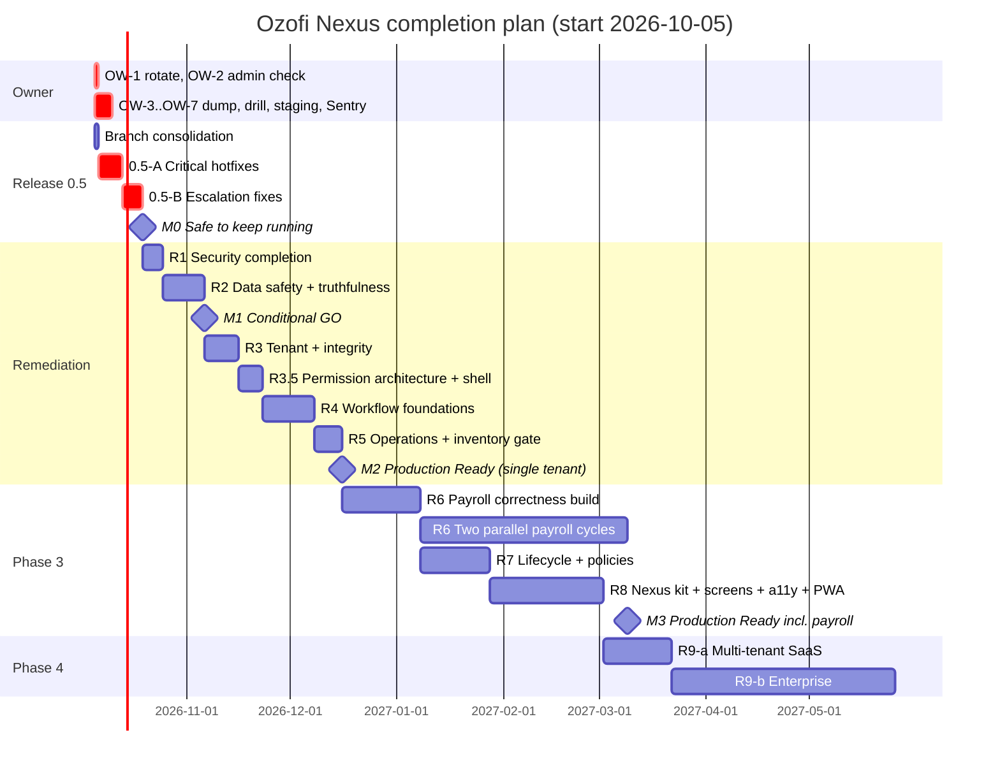

# Ozofi Nexus: Master Completion Plan

**Date:** 2026-10-04 · **Covers:** the whole path from today's state (score 29/100, NOT READY) to Enterprise Ready.

**Inputs:**
- [`PRODUCT_EVOLUTION_UPGRADE_REPORT.md`](PRODUCT_EVOLUTION_UPGRADE_REPORT.md): what is wrong, with evidence.
- [`EMS_REMEDIATION_BASELINE.md`](EMS_REMEDIATION_BASELINE.md): the agreed per-item remediation specs, release gates and Definition of Done.

> **How this document relates to the baseline.** The baseline stays authoritative for item specs (S1…W-6, T-1…T-8, O-1…O-8), the **Regression-protection rules (§11)** and the **Definition of Done (§13)**. This plan adds four things:
> 1. an **emergency hotfix release (0.5)** so Critical holes don't wait on the gate;
> 2. **N-items**: about 25 audit findings the baseline doesn't cover;
> 3. **Releases 6–9**, the product-completion work beyond remediation;
> 4. a **calendar, milestones, owner checklist and operating model**.
>
> Effort figures are engineer-days for one engineer working with an AI pair **[Assumption]**. Two engineers compress the calendar by about 40%, not 50%, because of the gates.

---

## Revision 1 (2026-10-04): review feedback adopted

A review of this plan asked for strict phasing: **no R6–R9 work until security, permissions, tenancy, data integrity and operations are fixed**. It also asked for inventories to be complete before any new feature. Outcome:

| Review point | Decision | Where |
|---|---|---|
| Four phases: P1 = R0.5-A, R0.5-B, R1, R2 · P2 = R3–R5 · P3 = R6–R8 · P4 = R9 | **Adopted.** Phases now frame the releases | §1, §9 |
| Defer all UX work to Phase 3 | **Adopted.** UX-0 (Nexus kit) is no longer a parallel track; with one engineer it diluted focus anyway | §8 R8, §9 |
| Phase 1 target 50–55 | **Adopted** (unchanged from M1 ~52) | §1 |
| Phase 2 = "Production Ready (single tenant)", 65–70 | **Adopted with a condition:** R3–R5 don't fix statutory payroll maths (flat TDS, no PF ceiling, no payslips; upgrade report BR-14…17). So at the end of Phase 2, payroll runs in **shadow mode**: calculated and reviewed, but not the system of record for disbursal until R6 reconciles two cycles. Projected score 62–65 rather than 65–70, because the payroll and enterprise dimensions don't move in Phase 2 **[A]** | §1 M2, decision D13 |
| Execution order puts owner actions at step 10 | **Changed.** OW-1 (rotate the secrets leaked in git history) and OW-2 (neutralise `admin@company.com`) are **day 1**: those credentials are exploitable now, before any code ships. OW-4 (role/permission export) must precede 0.5-B, because HF-9 removes the admin bypass and needs it to avoid locking HR out | §3, §12 |
| Push and merge Release 0, then Nexus, before the hotfixes | **Adopted.** Nexus first also avoids a conflict: HF-3 edits `ForgotPasswordModal.tsx`, which Nexus redesigned | §4 |
| Inventories must be 100% complete before any new feature | **Adopted as a gate, implemented as CI checks rather than documents.** The audit already produced first drafts of every inventory; documents drift, tests don't | New §13 |

## Revision 2 (2026-10-04): second review adopted

| Review point | Decision | Where |
|---|---|---|
| Split HF-9: remove the `dashboard_type` bypass immediately after OW-4; keep permission cleanup in 0.5-B | **Adopted, with a correction.** Removing the bypass alone does **not** close manager → super_admin: a manager still reaches `/settings` through the role-name map and can assign themselves `super_admin`, which passes unconditionally (`authorize.ts:89`). So **HF-9A = bypass removal + the HF-10 no-escalation rule**, shipped together as **0.5-A2**. It also needs the OW-4 diff first: without the bypass, HR and admin need explicit grants for the 0.5-A guards (`payroll:*`, `audit:view`, `claims:approve`) | §5.1a |
| Move the permission-driven shell (sidebar, navigation, dashboard widgets, route visibility from the manifest) into **R3.5** | **Adopted.** W-5, N-15 and N-16 move out of R4. Note: menu visibility is UX consistency, not a security control. Enforcement is the server guards (0.5, R1). The reason to do it earlier is that it forces the single catalogue | §6 |
| Weeks 11–14 = R4 + R5 | **Not feasible as stated.** Remaining R4 (≈15 d) + R5 (≈8 d) ≈ 23 days vs ≈20 working days. **M2 moves to week 15–16** for one engineer; it holds week 14 only with a second engineer on R5 | §9 |
| **Payroll freeze gate** | **Adopted and widened** (§8 R6). None of the frozen capabilities exists today (no disbursal integration, bank file or accounting export) **[C]**, so the freeze governs how R6 builds them: behind a flag that stays off until two cycles are reconciled and signed off | §8 |
| "ONE catalogue / guard / manifest / sidebar registry / authorization matrix"; no role literals, `dashboard_type`, or email-based admin detection | **Adopted as the R4 exit criterion**, enforced by CI checks (inventory row 9) | §6, §13 |
| No R8, UX, PWA, white-label, custom fields, workflow engine, SCIM, SSO or multi-tenant work before M2 | **Already in force** (Revision 1) | §8 |

---

## 0. Where you actually are

| # | Fact | Evidence |
|---|---|---|
| 1 | **`main` is still `83c1e84`.** Release 0 (`release-0/safety-net`) and Nexus (`feat/nexus-brand-foundation`) exist **only locally** and were never pushed. Whatever is deployed runs pre-Release-0 code **[Inferred from `origin/main = 83c1e84`]** | `git branch -a` |
| 2 | The **Release 0 gate has been BLOCKED since 2026-10-02**, solely on owner actions: schema dump, restore drill, staging, Sentry | `release1_handoff.json`, `RELEASE_0_VERIFICATION.md` |
| 3 | **Every Critical security finding is live on `main`**: the backdoor, account takeover, open payroll, self-approval and the cross-tenant PII leak | Upgrade report §5.0 |
| 4 | The baseline's absolute gate ("no Release 1 work until Release 0 passes") **keeps those holes open as long as owner actions stall.** Most of the Critical fixes need **no schema change**, so they don't actually depend on the gate | Baseline §2.1; Upgrade report §12.1 |
| 5 | About 25 findings from the new audit are **not in the baseline**. Examples: `/reports/profile` cross-tenant leak, `dashboard_type` bypass (only in Release 4 there), `role` field escalation, `PUT /users/profile` IDOR, SMTP password exposure, client identity backdoor, broken API error contract, helmet/CORS/trust-proxy, email HTML escaping, PDF/SMTP inside transactions, lint/CI, dead code | §7 below |

---

## 1. The plan at a glance

```mermaid
flowchart LR
  subgraph NOW["Week 1–2"]
    OA[Owner actions\nrotate secrets · dump schema · restore drill · staging · Sentry]
    BR[Branch consolidation\npush + merge R0 and Nexus]
    HFA[Release 0.5-A\nCritical hotfixes, code-only]
    HFB[Release 0.5-B\nescalation fixes, needs role dump]
  end
  subgraph P1["PHASE 1, weeks 1–6: exploits and data integrity → ~52"]
    R1[R1 Security completion] --> R2[R2 Data safety + truthfulness]
  end
  subgraph P2["PHASE 2, weeks 7–14: tenancy, RBAC, operations → 62–65\nProduction Ready, single tenant, payroll in shadow mode"]
    R3[R3 Tenant + integrity] --> R35[R3.5 Permission architecture + shell] --> R4[R4 Workflow foundations] --> R5[R5 Operations + 9-control gate in CI]
  end
  subgraph P3["PHASE 3, months 4–7: business completeness → 75+"]
    R6[R6 Payroll correctness\n+2 parallel cycles] --> R7[R7 Lifecycle + policies] --> R8[R8 Nexus UX everywhere]
  end
  subgraph P4["PHASE 4, months 8–12: enterprise SaaS → 85+"]
    R9[R9 Tenancy, RLS, SSO, MFA, workflow engine, SCIM, custom fields, API, webhooks]
  end
  OA --> HFB
  BR --> HFA --> HFB --> R1
  OA -->|B0 gate| R1
  R2 --> R3
  R5 -->|Phase 2 gate: all 9 controls green| R6
  R8 --> R9
```

### Milestones

| Milestone | Meaning | Exit criteria (all required) | Target | Projected score **[A]** |
|---|---|---|---|---|
| **M0: Safe to keep running** | No anonymous or any-employee Critical exploit remains | Release 0.5-A and 0.5-B deployed; secrets rotated; `admin@company.com` neutralised; deny-path tests green in CI | **End of week 2** | ~40 |
| **M1: Conditional GO (internal pilot)** | One tenant, trusted users, real data | B0 gate passed; R1 + R2 released; authz matrix green on staging; leave approvable end-to-end; no fabricated UI data | **Week 6** | ~52 |
| **M2: Production Ready (single tenant, payroll in shadow mode)** — end of Phase 2 | Can be run, observed and recovered; core HR is safe for real use | R3, R3.5, R4, R5 released; permission-architecture exit met; versioned migrations; CI gates; `/ready`; alerts; one host; restore drilled; **all 9 Inventory & Authorization Gate controls green in CI (§13)**; payroll runs calculated and reviewed but **not** the system of record for disbursal (D13) | **Week 15–16** (week 14 with a second engineer on R5) | 62–65 |
| **M3: Production Ready including payroll** — Phase 3 | Payroll trustworthy, lifecycle complete, UX modernised | R6 with **2 reconciled parallel payroll cycles**; R7 (exit/F&F, leave engine); R8 (Nexus across all screens) | **Month 6–7** | 75+ |
| **M4: Multi-tenant SaaS** | Can sell to customer #2 | R9-a: tenant provisioning, RLS, per-tenant branding, plan and seat enforcement, billing | **Month 8** | ~76 |
| **M5: Enterprise Ready** | Passes enterprise procurement | R9-b: SSO, enforced MFA, workflow engine, custom fields, exports, retention, DPDP controls, India statutory pack | **Month 12** | ~85 |

---

## 2. Decisions needed this week

| ID | Decision | Recommendation | Blocks |
|---|---|---|---|
| **D1** | Is production live with real employee or salary data? | If **yes**, Release 0.5 is an emergency: do it before anything else | Urgency of everything |
| **D2** | Approve **Release 0.5** as a documented exception to the baseline's absolute B0 gate? | **Yes.** It is code-only (no DDL, no data migration), each fix only *removes* access that should never have existed, and it ships with deny-path tests. The B0 gate still governs every schema change | Release 0.5 |
| **D3** | Hosting target: Vercel or Render? | **API on Render (or Fly), static client on Vercel.** SSE, long requests and in-memory state don't fit serverless. Fix the Render build (TypeScript as a build dependency; full `VITE_API_URL`) | O-7, realtime |
| **D4** | Capacity: how many engineers, and how many hours a week? | Plan assumes 1 FTE + AI pair. Also name a **second reviewer** for financial PRs (baseline §11.5) | Calendar |
| **D5** | Is the reset flow "admin approves, then the user gets an email link" acceptable? | **Yes.** It keeps today's admin-approval UX but moves the token to email | HF-3 |
| **D13** | Is the system used for **real** salary disbursal today? | If yes, keep the current process, but treat Nexus figures as indicative and reconcile them against an external calculation until R6 completes. At the end of Phase 2, payroll runs in **shadow mode** (calculate and review only) | M2 definition, R6 urgency |
| **D6–D12** | Baseline §12 open questions: `inactive` meaning, manager identity, payroll SoD, regularization window, retention periods, single-operator payroll | Answer before R4 (W-1, W-2, W-3) and R6 | R4, R6 |

---

## 3. Owner checklist: things only a human can do

These are on the critical path. Agents must not perform them (baseline execution rules).

| # | Action | Time | How | Unblocks |
|---|---|---|---|---|
| **OW-1** | **Rotate secrets now:** Supabase DB password, `JWT_SECRET`, `JWT_REFRESH_SECRET` (new random values of 48+ bytes). Update the hosting env. All sessions are logged out, so announce it | 30 min | Supabase dashboard → Database → reset password; `openssl rand -base64 48` ×2 | SEC-07/08; M0 |
| **OW-2** | In production: does `admin@company.com` exist and is it active? If yes, set a strong unique password **and** deactivate it once a named super-admin exists | 15 min | `SELECT id, is_active, role FROM users WHERE email='admin@company.com';` | SEC-01 until HF-1 ships |
| **OW-3** | **B0-01:** run `diagnostics.sql` (read-only) + `pg_dump --schema-only`; commit `0000_live_schema.sql` | 1 h | `server/db/baseline/README.md` §3 | B0 gate, HF-B, all migrations |
| **OW-4** | Also export the effective permissions per role (needed by HF-B) | 10 min | `SELECT r.tenant_id, r.name, r.dashboard_type, p.module\|\|':'\|\|p.action FROM roles r LEFT JOIN role_permissions rp ON rp.role_id=r.id LEFT JOIN permissions p ON p.id=rp.permission_id ORDER BY 1,2,4;` | HF-B |
| **OW-5** | **B0-02:** restore drill into a scratch project; record RPO/RTO | 2 h | `docs/runbooks/backup-restore.md` | B0 gate |
| **OW-6** | **B0-05:** staging Supabase project + deployment with staging-only secrets; run rebuild ×2 + smoke | 2 h | `docs/runbooks/staging.md` | B0 gate; allow-path tests |
| **OW-7** | **B0-04:** Sentry projects `ems-api` / `ems-web`; set DSNs (confirm Node ≥ 20.19 first) | 30 min | `docs/runbooks/monitoring.md` | B0 gate |
| **OW-8** | GitHub: push branches; protect `main` (PR required, CI required, no force-push) | 15 min | Repo settings | CI, every PR |
| **OW-9** | Answer D1–D5 | 30 min | Reply in chat or edit §2 | Releases 0.5–1 |

**Total owner time is about 7 hours.** It's the single biggest schedule risk: the gate has already been stalled for two days.

---

## 4. Day 1: branch consolidation

1. Tag the rollback point: `git tag v0-baseline 83c1e84`.
2. Push `release-0/safety-net` → PR to `main`. Release 0 was verified to change no behaviour (route table, startup logs and responses are byte-identical; `RELEASE_0_VERIFICATION.md` checks 6–10). Merge it.
3. Rebase `feat/nexus-brand-foundation` onto the new `main` → PR. It touches only the auth screens, tokens and brand config. Before merging, confirm `tsc` and the client tests pass. Merge it.
4. From here on, **every item branches from `main`, one item per PR**. Tag each release `v0.5-a`, `v0.5-b`, `v1.0`, … so each one is a rollback point.
5. Delete the stale branches (`adithyan`, `manu`, `narendhar`, `final-integration`, `unified-ems`) after confirming they're fully merged or abandoned.

---

## 5. Release 0.5: Emergency hotfixes (code-only)

**Rules (in addition to baseline §11):**
- No DDL and no data migration.
- Each change removes access or exposure only.
- Each change ships with **DB-free deny-path tests**. They use supertest plus a locally signed test JWT, and the guard rejects the request before any DB call, the same pattern as `server/test/unit/app.test.ts`.
- Allow-path checks run in the staging smoke once OW-6 is done.

### 5.1 Release 0.5-A: ship within ~5 working days (does not need the schema dump)

Admin and HR keep full access in 0.5-A because the `dashboard_type='admin'` bypass is left alone until 0.5-B. So adding guards here **cannot lock out legitimate admin or HR users**. It only removes access from managers, employees and custom roles that never should have had it.

| ID | Fix | Files | Acceptance test | Effort |
|---|---|---|---|---|
| **HF-1** | Delete the master-password branch. Remove the `admin@company.com` super_admin coercion from boot seeding. Remove the admin password reset and the personal-email demo users from `initDb` | `auth.service.ts:23-25`; `seedPermissions.ts:138-149`; `initDb.ts:449-465,487-497` | Login `admin@company.com`/`admin123` → 401 (the unit test mocks the repo to return a user with a different hash) | 0.5 |
| **HF-2** | JWT secrets required, at least 32 characters, with no defaults outside `NODE_ENV=test`; the process exits on boot if they're missing (pairs with OW-1) | `config/env.ts:9-10` | Boot with an empty `JWT_SECRET` in production mode → process exits non-zero | 0.25 |
| **HF-3** | Password reset: `forgot-password` and `/status` **never return** `resetToken` or `requestId`. On approval, email the user a single-use, 30-minute link. `reset-password` **requires** the token. `completePasswordReset` is tenant-scoped. Generic enumeration message | `auth.service.ts:141-257`; `auth.repository.ts:572-576`; `emailService.ts`; `ForgotPasswordModal.tsx` (poll status only, then "check your email") | No token → 400; wrong token → 401; reused token → 401; `/status` body contains no token | 1.5 |
| **HF-4** | Approvals action: deny if the actor is the requester or the subject employee; `type` must equal the stored type; `password_reset` actionable only with `settings:manage`; `WHERE status='pending'` → 409 otherwise (baseline B-13 subset) | `approvals.routes.ts:13-14`; `approvals.service.ts:20-92`; `approvals.repository.ts` | Self-approve → 403; second decision → 409; employee approving a password reset → 403 | 1 |
| **HF-5** | Guards: payroll (`payroll:view`/`payroll:manage`/`payroll:run`); `GET /audit-logs` (`audit:view`); `PUT /leave/:id/approve`, `PUT /timesheets/:id/approve`, `PUT /claims/:id/status` (type permission + no self-approval + `approved_by` from the JWT only); `GET /claims` (all) → `claims:approve` | `payroll.routes.ts`; `read.routes.ts`; `leaves.*`; `timesheets.*`; `claims.*` (baseline S3 table) | One deny test per route for the `employee` role | 1 |
| **HF-6** | Cross-tenant reads: add `tenant_id = $jwt` to `getEmployeeProfile`, manager/employee/team dashboards (plus the self/team scope check), employee education/experience/emergency-contact reads, `/employees/check-email`, timesheet entries | `analyticsService.ts:364-466,613-684`; `reports.controller.ts:13-40`; `employees.repository.ts:209-289,311-321`; `timesheets.repository.ts:25-43` | A tenant-B token reading a tenant-A employee id → 404 (unit test with a stubbed repo asserting the tenant parameter is passed) | 1 |
| **HF-7** | Stop secret exposure: drop `temp_password` from `GET /settings/users`; disable `GET /settings/users/:id/temp-password`; mask `smtp_pass` on read (keep it if the submitted value equals the mask) | `user-assignments.repository.ts:9`; `user-assignments.routes.ts`; `configuration.repository.ts:18-24` | The response body contains neither the key `temp_password` nor the SMTP password | 0.5 |
| **HF-8** | CI: GitHub Actions running server+client `tsc`, unit tests, `check:routes`, gitleaks on push and PR | `.github/workflows/ci.yml` | A PR shows green checks; `main` protection requires them | 0.5 |

**0.5-A total ≈ 6.25 days.** Deploy as soon as it's green. Then re-run the route-contract check: it must still show 18 unmatched, unchanged.

### 5.1a Release 0.5-A2: privilege-escalation cut (Revision 2), as soon as the OW-4 diff is reviewed

| ID | Fix | Files | Acceptance test | Effort |
|---|---|---|---|---|
| **HF-9A** | Remove the `dashboard_type==='admin'` pass (`authorize.ts:93`) and the client mirror (`authStore.ts:94,123`). `dashboard_type` becomes UI layout only. **Pre-deploy:** diff the OW-4 export against every permission-string guard; grant the missing ones to legitimate roles (HR, admin) with a reviewed, logged one-off SQL attached to the PR | `authorize.ts:88-93`; `authStore.ts`; OW-4 diff | Role with `dashboard_type='admin'` but no `payroll:view` → 403 on `/payroll/employees`; HR passes every route on its reviewed "needs" list (staging) | 0.5 |
| **HF-10** (moved here) | No escalation: `super_admin` assignable only by `super_admin`; role assignment and creation cannot grant permissions the actor lacks; `role`/`role_id` ignored on `POST/PUT /employees` without `rbac:assign`; system roles read-only | as in §5.2 | Manager assigning self `super_admin` → 403; HR creating an employee with `role:'super_admin'` → 403 | 1 |

0.5-A2 ships with its own tag (`v0.5-a2`). HF-9 in §5.2 becomes **HF-9B**: remove `ROLE_TO_PERMISSIONS` and rewrite role-name guards as explicit permissions.

### 5.2 Release 0.5-B: ship in week 2 (needs OW-4, the role/permission export)

| ID | Fix | Files | Acceptance test | Effort |
|---|---|---|---|---|
| **HF-9B** | **Remove the `ROLE_TO_PERMISSIONS` expansion** (the `dashboard_type` bypass is already gone in 0.5-A2). Every route guard lists explicit `module:action` permissions. **Before deploying**, diff the OW-4 export against the new guards; any permission a legitimate role needs but lacks is granted by a reviewed, logged one-off SQL (data change, approved by the owner, attached to the PR) | `authorize.ts:69-111`; every `authorize([...])` call site; `settings/index.ts:11`; `organization.routes.ts:11` | A manager calling `/settings/*` → 403; a HR user retains every route in the OW-4-derived "HR needs" list (staging smoke) | 2 |
| ~~HF-10~~ | *Moved to 0.5-A2 (§5.1a).* Spec: `role`/`role_id` ignored on `POST/PUT /employees` unless `rbac:assign`; role assignment and creation cannot grant a permission the actor lacks; system roles' permissions are read-only | `employees.service.ts:259-260,342-345`; `user-assignments.service.ts:98-103`; `rbac.service.ts:51-98` | — | (counted in 0.5-A2) |
| **HF-11** | IDOR: `PUT /users/profile` updates only `req.user.id`; `PUT /performance/:id` requires `performance:manage` and the reviewer; documents read: owner or `documents:view`; leave edit/delete: owner only while pending | `users.controller.ts:7-11`; `reviews.routes.ts`; `documents.service.ts:12-19`; `leaves.repository.ts:46-67` | Cross-user attempts → 403 | 1 |
| **HF-12** | Field-level: strip `annual_ctc`, `bank_account_number` and `personal_email` from `GET /employees` and profile responses unless `payroll:view` (or self) | `employees.repository.ts:7-21`; `employees.service.ts:37-39`; `analyticsService.ts:636-684` | Employee-role list response has none of these keys | 1 |
| **HF-13** | Sessions: refresh compares with the stored `users.refresh_token` (an existing column, so no DDL); logout and password change clear it; the Topbar logout calls `POST /auth/logout` | `auth.service.ts:60-100`; `Topbar.tsx:118` | Refresh after logout → 401 | 0.5 |
| **HF-14** | Client: remove the `System Admin`/admin-email override; store `dashboard_type` from the login response; drop the `'employee'` default | `authStore.ts:102-109`; `LoginPage.tsx:58-66` | Unit test on `hasAnyRole` | 0.5 |

**0.5-B total ≈ 6 days.** After deploying: M0 is reached; re-score security (expected about 5/10).

---

## 6. Releases 1–5: Remediation (baseline, amended)

Each release ends at its baseline gate (§2.1). Items are specified in the baseline unless prefixed **N-** (§7). Release 0.5 items close part of baseline S1–S4/H1; the remainder is listed.

| Release | Scope | Gate (exit) | Effort | Weeks |
|---|---|---|---|---|
| **R0 (gate)** | B0-01…B0-05: agent work is done; owner actions OW-3…OW-7 | Snapshot committed; restore drilled; staging rebuilt; Sentry receiving | owner ~6 h | 1–2 |
| **R1: Security completion** | S1/S2/S3/S4 remainder (after Release 0.5); S5/S6 (optional history purge with `git filter-repo`); **H1** plaintext temp passwords removed end-to-end (one-time set-password links; expand/contract on the column); **H4** destructive bootstrap scripts; **N-1** helmet + `trust proxy` + exact CORS allow-list; **N-2** escape all HTML email interpolation; **N-3** password policy (min 10, enforced server-side) + forgot-password enumeration fix; **N-4** `?token=` accepted only on SSE (until the W-6 ticket); **N-5** `npm audit` high fixes (axios, form-data, lodash) | **Authz matrix populated (one row per route × role) and green on staging**; secrets rotated | 6 d | 3 |
| **R2: Data safety & truthfulness** | B-10 hard delete → exit; B-11 leave visible in the inbox; B-12 interim payroll guard + exited excluded; B-13 approval races; B-14 regularization becomes a request; B-15 audit coverage; B-16 fake security controls; B-17 dead endpoints; **N-6** fix the client API error contract (`api.ts:171-177`) so messages render; **N-7** remove fabricated metrics (Reports trends, deep-dive KPIs, Strategic Assets, mock announcements, OperationalStream, PCI-DSS badges); **N-8** move PDF/SMTP out of the employee-create transaction (send after commit); **N-9** claims: `employee_id` from the JWT, `amount > 0`; **N-10** timesheet entries locked after submit/approve + a real transaction | Data-safety tests green on staging with a production-like copy → **M1** | 12 d | 4–6 |
| **R3: Tenant & integrity** | T-1…T-8; **N-11** one pg pool (delete `database/client.ts`, `db.ts`, `db/connection.ts` shims); **N-12** pagination on approvals, leave, claims, payroll employees, settings users, documents, performance, with `limit ≤ 100`; **N-13** expression indexes (`lower(email)`, `lower(personal_email)`, partial on reset approvals) + range predicates replacing `::date`; **N-14** per-tenant uniqueness plan for email/department/employee code (report first; enforced in R9-a) | No tenant fallback literals; cross-tenant test suite green | 10 d | 7–8 |
| **R3.5: Permission architecture + permission-driven shell** (Revision 2, moved from R4) | **W-5** one typed permission catalogue (`core/security/permissions.ts`; reversible remap of the two vocabularies) and every route guarded by catalogue constants; **N-15** manifest `GET /auth/permissions` + `/auth/me` on boot and after refresh; **one route/sidebar registry** `{path, element, permission, navSection, widget?}` feeding `App.tsx`, `Sidebar`, Topbar search, `ProtectedRoute` and the dashboard widget grid; `<Can>`/`usePermission` on every mutating action (EmployeeTable, Organization, Payroll sections, Users/Roles tabs); **N-16** remove the remaining client role literals (`GeneratePayroll.tsx:30`, `Profile.tsx:92`, `Timesheets.tsx:126`, `Topbar.tsx:338-342`, `Dashboard.tsx:53-55`). Client switch behind a flag with `allowedRoles` fallback for one release (baseline W-5) | A custom role granted `employees:view` sees and opens Employees; revoking a permission removes the menu, route and buttons within one token refresh; menu × route × action matrix green | 7 d | 9–10 |
| **R4: Workflow foundations** | W-1 lifecycle; W-2 payroll state machine (Run re-enabled with a stepper; **`finalized`/`paid` blocked by the payroll freeze, §8 R6**); W-3 manager identity (conflict-report gate); W-4 one approvals inbox; W-6 session hardening (hashed refresh, SSE ticket) | State machines live; route contract = 0 unmatched. **Permission-architecture exit (Revision 2), all CI-enforced:** ONE catalogue · ONE guard system · ONE manifest · ONE route/sidebar registry · ONE authorization matrix; zero role literals, zero `dashboard_type` authorization, zero email/name-based admin detection (inventory row 9) | 15 d | 11–13 |
| **R5: Operations** | O-1 health/ready; O-2 pino + request IDs; O-3 exit on uncaught; O-4 alerts; O-5 versioned migrations (baseline = snapshot; legacy scripts frozen); O-6 CI (extends HF-8 with integration tests against a Postgres service container); O-7 single host (D3); O-8 runbook; **N-17** ESLint flat config + `any` ratchet; **N-18** delete ~1,400 lines of dead modules + junk files (`att_ours/theirs.tsx`, `check_user.js` ×2, `server/scratch/*`, `client/ts_*.txt`, `cleanup_data.js`, stray screenshot); **N-19** UTF-8 README with real setup; **N-20** drop unused deps (`adm-zip`, `tailwind-merge`, `ts-node`, `nodemon`), move `@types/*` to dev | All O-items DONE; inventory gate signed (§13) → **M2** | 8 d | 14–16 |

**Remediation total ≈ 58 engineer-days, plus about 12 for Release 0.5.**

---

## 7. Scope added to the baseline (N-items and HF-items)

| New ID | Finding (upgrade report ref) | Why it was missing / where it lands |
|---|---|---|
| HF-6 | `/reports/profile`, manager/employee/team reports cross-tenant (SEC-05) | The baseline guards `/reports/*` with `reports:view` but adds no tenant or scope predicate |
| HF-9A/9B | `dashboard_type='admin'` global bypass; HR seeded with it (SEC-06b); role-name map | The baseline defers it to W-5 (R4). Escalation path → 0.5-A2 (bypass) and 0.5-B (map) |
| HF-10 | `role` field on `POST/PUT /employees` creates super_admin (SEC-06c) | Not in the baseline |
| HF-11 | `PUT /users/profile` IDOR; `PUT /performance/:id`; documents read for custom roles | Partly in the S4 table; IDOR missing |
| HF-7 | `smtp_pass` returned; temp-password read endpoint (SEC-10, SEC-14) | H1 removes storage in R1; the exposure is stopped now |
| HF-12 | CTC/bank in `GET /employees` for every role (SEC-12) | Not in the baseline |
| HF-3 (part) | `completePasswordReset` updates every tenant's user with that email | Not in the S2 spec |
| HF-14 | Client identity backdoor `name==='System Admin'` | Not in the baseline |
| N-1…N-5 | helmet, trust proxy, CORS, email HTML escaping, password policy, `?token=`, npm high vulns (SEC-15…20, 24) | Not in the baseline |
| N-6, N-7 | Client error contract; fabricated metrics (beyond the "fake security controls" in B-16) | Not in the baseline |
| N-8 | PDF/SMTP inside DB transactions → ghost credentials (P1) | Not in the baseline |
| N-9, N-10 | Claims body `employee_id` / negative amounts; timesheet entries editable after approval | B-13 covers approve races only |
| N-11…N-14 | Three pools; unbounded lists; index misses; global uniqueness | T-4 covers retries only |
| N-15, N-16 | Permission manifest; leftover client role literals | Implied by W-5; made explicit |
| N-17…N-20 | Lint, dead code, README, dependency hygiene | Not in the baseline |

**Action:** append the HF- and N-items to the baseline's §14 status tracker so there is one tracker, not two.

---

## 8. Releases 6–9: Product completion

### Payroll freeze gate (Revision 2): in force from today until R6 sign-off

Until **Cycle 1 and Cycle 2 are each reconciled and signed off in writing by the finance owner** (P-7), the system must **not**:

| Frozen capability | Exists today? | How the freeze is enforced |
|---|---|---|
| Automatic salary disbursal or payment-provider integration | No **[C]** | Not built before sign-off |
| Bank transfer file generation | No **[C]** | Built in R6 behind flag `payroll.bank_file`, default **off** |
| Accounting / GL exports, payroll register as a system of record | No **[C]** | Flag `payroll.accounting_export`, default **off** |
| Statutory filings (PF ECR, Form 24Q/16) | No **[C]** | Flag `payroll.statutory_files`, default **off** |
| Publishing payslips to employees as final | No (payslip API 404s) **[C]** | Payslips render watermarked **"Provisional: not for payment"** until sign-off |
| Pay-run states `finalized` / `paid` | No (W-2 adds them) | Transitions return 403 `PAYROLL_FROZEN` unless the tenant flag `payroll.live` is set **and** a sign-off record exists |
| Legacy `POST /payroll/process` writing `payroll_history` as `paid` | **Yes** (`payroll.service.ts:200-254`) | 0.5-A guards it (`payroll:run`); B-12 (R2) adds the interim run guard; W-2 turns it into a draft-only shim |

**Sign-off record:** `payroll_signoffs(tenant_id, cycle, period, reconciled_variance, signed_by, signed_at, evidence_uri)`. Flipping `payroll.live` requires two rows and is audit-logged. This also resolves D13: until then, payroll is shadow-only.

### R6: Payroll correctness (baseline Batch 5): months 4–6

| Item | Scope | Effort |
|---|---|---|
| P-5 + rates | One pure `computePayslip(inputs, rateTableVersion)`; rate tables per FY: PF wage ceiling, ESI on monthly gross, PT by state, regime-aware TDS slabs and monthly projection; explicit rounding order. **Delete the 4 divergent formulas** (`payroll.service.ts:24,118,192,217`) and the client magic numbers (`TaxStatutory.tsx:49-52`) | 6 |
| Statutory identity | PAN, UAN, ESIC number and PT state on employee/payroll profile (encrypted at rest) | 2 |
| P-1, P-2 | LOP from attendance and unpaid leave; joiner/leaver proration | 4 |
| P-3 | Arrears, reimbursements (linked to claims), one-off adjustments | 3 |
| P-6 | Payslip PDF (reuse `utils/pdfGenerator.ts`), self-service download, bulk payslips; implements the 404'd payslip routes | 3 |
| Registers | Payroll register CSV/XLSX, bank transfer file, PF ECR file | 3 |
| P-7 | **Parallel run against the incumbent payroll for 2 consecutive monthly cycles**; reconcile to ₹0 variance or explained differences | 2 + 2 calendar months |
| Tests | Table-driven boundary tests (₹15k PF, ₹21k ESI, slab edges, regimes); determinism hash test (baseline §1.2) | included |

**Exit:** two reconciled cycles signed off by the finance owner. This is the main calendar constraint on M3.

### R7: Lifecycle & policies (baseline Batch 6 + additions): months 5–6

- **L-1…L-5**: job history, probation, resignation → notice → exit, clearance + F&F (feeds a final payroll run), relieving/experience letters, holiday calendar CRUD.
- **Leave policy engine**: accrual, carry-forward, proration, half-day, working-day counting (holidays and weekly-offs), per-grade policies, encashment hook into F&F. About 8 days.
- **Attendance policy**: shift definitions, late-mark rules, regularization window, LOP rule feeding R6. About 5 days.
- **Tenant-branded documents**: offer and experience letters take the employer name and logo from tenant settings, not hard-coded Ozofi (`offer-letter/pdf.generator.ts:101,208-210,231`). About 2 days.
- **Exit:** a hire-to-exit E2E test passes on staging.

### R8: Experience (Nexus everywhere): parallel track

**Phase 3 only (Revision 1).** No UX work starts before M2. The only UI changes in Phases 1–2 are the remediation items that touch screens: N-6 error contract, N-7 fabricated data removal, W-5 permission-driven shell, the HF-3 reset modal.

| Step | Scope | Effort |
|---|---|---|
| UX-0 | Nexus kit: Table (server sort/filter/paginate, selection, bulk bar, CSV), Dialog/ConfirmDialog, Combobox (debounced), URL-synced Tabs, PageHeader, StatCard, Skeleton/Empty/Error, one Toast; TanStack Query data layer | 8 |
| UX-1 (after R4) | Responsive shell (mobile drawer), Nexus shell colours, per-route error boundaries, `usePageTitle` everywhere | 3 |
| UX-2 | Screen migration by traffic and risk: Employees → Approvals (bulk) → Leave → Attendance (team view) → Timesheets → Payroll (My Pay vs Admin, pay-run stepper) → Reports (honest KPIs, period selector, exports) → Audit (server query) → Settings (URL sections; remove unenforced toggles until enforced) → Organization (merge deep-dive) → Profile (merge MySpaceProfile) | 15 |
| UX-3 | WCAG 2.1 AA pass + axe in CI; plain-language copy pass | 3 |
| UX-4 | PWA for ESS: check-in, leave, payslip | 4 |

**Exit:** every screen scores ≥ 7 on the upgrade-report rubric; no `alert()`/`confirm()`; Nexus tokens only.

### R9: Enterprise SaaS (baseline Batch 7 + additions): months 6–12

| Phase | Items | Effort |
|---|---|---|
| **R9-a → M4 (month 8)** | E-1 tenant provisioning + invites; E-2 isolation suite + **Postgres RLS** on every tenant table (`SET LOCAL app.tenant_id`); per-tenant uniqueness enforced (from N-14); plan and seat enforcement (`tenants.plan`, `max_employees` already exist); billing integration; per-tenant white-label | 20 |
| **R9-b → M5 (month 12)** | E-3 SSO (OIDC → SAML); E-4 enforced MFA (TOTP/WebAuthn) + password policy from settings; E-5 SCIM; **workflow engine** (multi-level chains, conditions, delegation, SLA/escalation on pg-boss); **custom fields** + forms; E-6 data and audit export; E-7 retention, archival, erasure + DPDP Act 2023 controls (consent, DSAR export); field-level encryption for bank/PII; append-only audit (revoke UPDATE/DELETE; hash chain); **India statutory pack** (Form 24Q/16, LWF, gratuity, investment declarations using the existing `investment_deadlines` table); public API with server-issued scoped keys + outbound webhooks via an outbox + Slack/Teams delivery | 55–70 |
| Optional suite breadth | ATS → onboarding; performance cycles with OKR/360; surveys; helpdesk | backlog after M5 |

---

## 9. Calendar (1 FTE + AI pair)

Calendar days in the chart are working-day estimates **[A]**. The two parallel payroll cycles are **calendar-bound** (two real pay months), so start R6 early enough that the cycles fall on real month-ends.

---

## 10. Operating model: how every item gets done

1. **One item = one branch = one PR**, named `fix/<ID>-<slug>` or `feat/<ID>-<slug>`, branched from `main`.
2. **Definition of Done = baseline §13** (15 points). Anything short of it is reported as IN PROGRESS.
3. **PR template** (add as `.github/pull_request_template.md`): item ID; finding re-verified at HEAD (file:line); behaviour before and after; tests added (deny and allow); authz matrix and route-contract result; migration dry-run output (if any); rollback note; second reviewer for financial items.
4. **AI-pair sessions:** start each with `Implement <ID> from docs/audit/MASTER_COMPLETION_PLAN.md and EMS_REMEDIATION_BASELINE.md; re-verify the finding at HEAD first; follow baseline §11 and §13; one PR.` The existing `EXECUTION_PROMPT_RELEASE_0.md` is the template to copy per release.
5. **Tracking:** baseline §14 is the single status tracker (append HF/N items). Update it in the same PR that resolves the item.
6. **Re-score:** re-run the audit at M1, M2 and M3; the upgrade-report rubric (§13) is the scorecard.

---

## 11. Risks to this plan

| Risk | Likelihood | Mitigation |
|---|---|---|
| Owner actions keep stalling (already 2 days) | **High** | Release 0.5 removes the security dependency on them. OW-3…OW-7 are about 6 hours; book a fixed half-day this week |
| 0.5-B locks HR or admin out of something legitimate | Medium | OW-4 permission export diffed against the new guards **before** deploy; one-off grants reviewed; staging smoke per role; tag `v0.5-a` as the rollback point |
| Single maintainer (bus factor 1 since April) | High | Name a second reviewer (D4); the docs in this folder plus the CI gates make the work transferable |
| Production schema differs from the code (payroll run may already fail) | Medium | OW-3 snapshot first; every migration from R1 onwards is based on it (baseline rule) |
| W-3 manager-identity conflicts and W-2 payroll de-duplication need human decisions | Medium | Baseline conflict-report-first procedure; answer D6–D12 early |
| Payroll parallel-run variance | Medium | Determinism hash + boundary tests before the first cycle; the finance owner is involved from R6 start |
| Vercel serverless vs SSE and long requests | Certain if Vercel stays | D3 decision; move the API to a long-running host in R5 (O-7) |
| Scope creep into features before M2 | Medium | Baseline §11.6: no feature work in modules being remediated; new feature requests go to the R6–R9 backlog |

---

## 12. The next 10 working days

| Day | Engineer (+AI) | Owner |
|---|---|---|
| 1 | Tag `v0-baseline`; push and merge Release 0 and Nexus; HF-8 CI workflow; HF-1 backdoor removal | OW-1 rotate secrets; OW-2 admin check; OW-8 branch protection; answer D1–D5 |
| 2 | HF-2 env fail-fast; HF-3 reset flow (start) | OW-3 schema dump + diagnostics; OW-4 permission export |
| 3 | HF-3 finish; HF-4 approvals action | OW-7 Sentry |
| 4 | HF-5 guards; HF-7 secret exposure | OW-6 staging project |
| 5 | HF-6 tenant predicates; deny-test pass; **deploy 0.5-A**, tag `v0.5-a` | OW-5 restore drill |
| 6 | Write `0000_live_schema.md` from OW-3; OW-4 permission diff; **HF-9A + HF-10 → deploy 0.5-A2**, tag `v0.5-a2` | Review and approve any one-off permission grants |
| 7 | HF-9B guards rewrite (role names → permissions) | — |
| 8 | HF-11 IDOR | — |
| 9 | HF-12 field filter; HF-13 sessions; HF-14 client backdoor | — |
| 10 | Staging smoke per role; **deploy 0.5-B**, tag `v0.5-b` → **M0**; B0 gate review | Sign off the B0 gate → R1 starts |

---

## 13. Inventory & Authorization Gate: 9 CI-enforced controls (Revision 1, renamed in Revision 3)

**Rule:** no new feature work (anything in R6–R9 or the backlog) starts until all **9 controls** below are **green in CI**. A control counts as complete only when a test fails if code drifts from it. A document alone doesn't count.

The audit already produced the first drafts. What's left is turning them into checks.

| # | Inventory | First draft (exists today) | Becomes enforced by | "100%" means | Completed in |
|---|---|---|---|---|---|
| 1 | **Route inventory** | Track C §6b.2 (128 routes); `npm run check:routes` + `route_contract_baseline.txt` | `check:routes` in CI (HF-8), with **0 unmatched** client↔server calls | Every mounted route is listed; every client call resolves; dead route files deleted (N-18) | HF-8 (wired), R4 (0 unmatched), R5 (dead files gone) |
| 2 | **API inventory** | Same source plus request schemas (`*.schema.ts`) | Generated OpenAPI from the zod schemas; CI fails if a route has no schema or the spec changes without review | Every route has a request schema and a documented response envelope; Settings endpoints validated (today: 0 of 18) | R5 |
| 3 | **Permission inventory** | Two seeded catalogues (`schema.ts:306-360`, `seedPermissions.ts:26-69`) | A single typed catalogue `core/security/permissions.ts`; a lint/test rejects any `authorize()` argument that isn't a catalogue constant | One vocabulary; no role-name guards; every non-public route has a permission | HF-9B (no role names), R3.5 W-5 (one catalogue) |
| 4 | **Role inventory** | OW-4 export (live) + `schema.ts:363-393` | A migration-owned seed of system roles × permissions × scope; a snapshot test of the expected matrix | Every role's effective permissions are known, reviewed and versioned; no `dashboard_type` bypass | HF-9A (reviewed), R3.5 (versioned) |
| 5 | **Authorization matrix** (route × role × scope) | Empty harness `authz.matrix.test.ts:31` | That test file, one row per route × seeded role, allow and deny | Rows = routes × roles; all green on staging | 0.5-A (deny rows, DB-free), R1 gate (full matrix) |
| 6 | **Database inventory** | Track C §4c (reconstructed); `0000_live_schema.sql` **missing** | OW-3 snapshot + versioned migrations; CI rebuilds the DB from migrations and diffs it against the committed schema | The repo builds the exact production schema; no column used by code is absent; legacy scripts frozen | B0 gate (snapshot), R5 O-5 (migrations + diff) |
| 7 | **Tenant-isolation inventory** | Track C §4c.4 (fallback sites + unscoped queries) | A tenant test suite (tenant A token vs tenant B rows for every repository read/write) + a CI grep that fails on `'tenant_default'` or `'default'` literals in SQL | 0 fallback literals; every tenant-table query takes `tenant_id`; suite green | HF-6 (worst leaks), R3 T-1 (literals), R3 gate (suite) |
| 8 | **Workflow inventory** | Track C §3 (15 workflow maps) | State-machine tables in code (W-1 lifecycle, W-2 payroll, approval transitions §1.3) with transition-matrix tests | Every status column has an allowed-transition table and tests; no free-text status writes | R4 |

| 9 | **Permission-architecture invariants** (Revision 2) | Upgrade report §6.1 hard-coded list | CI greps that fail on: role-name literals in guards or UI conditions (`role ===`, `includes(role)`, `'super_admin'` outside the catalogue/seed), any `dashboard_type` read in authorization code, email or name based admin detection (`admin@company.com`, `'System Admin'`), and `authorize()` arguments that aren't catalogue constants | All greps return 0 | R4 exit |

**The gate consists of 9 CI-enforced controls. No Phase 3 feature work may begin until all 9 are green.**

**Owner of the gate:** the release-gate reviewer signs off at the end of R5 that all 9 controls are green in CI. That sign-off is the Phase 2 → Phase 3 transition.

---

## Revision 3 (2026-10-05): execution control

- The gate is named **Inventory & Authorization Gate: 9 CI-enforced controls** everywhere. The earlier "seven inventories" and "six inventories" wording is removed.
- The coding agent runs under the **Master Execution Prompt** supplied by the owner on 2026-10-05: inspect → reproduce → patch → test → audit → PR → gate → next item. One item per branch and PR. The stop conditions and response format in that prompt are binding.
- **Execution Day 1 = 2026-10-05.** Reconnaissance baseline: `docs/audit/EXECUTION_BASELINE.md`.

---

## Revision 4 (2026-10-05): D5 revised, HF-3/HF-4 decisions

- **D5 revised (owner decision):** password reset is **self-service through a single-use, 30-minute emailed token**. Administrator approval is **not** required, and reset requests do not appear in the Approvals inbox. Implemented by HF-3 (`4210d83`). Supersedes baseline S2(c) wording ("after approval, the token is emailed").
- **Reset-email delivery is a known gap:** HF-3 sends the email without awaiting it (so the response time does not reveal whether an account exists). That is not reliable on a serverless host. Before production it must move to a persisted, retried mechanism (outbox / job queue, N-8 / R5). Not a blocker for the controlled phase.
- **Legacy raw reset tokens** left in old `approvals` rows are unusable under the new flow. They must be removed only through a controlled maintenance operation with backup evidence, not an ad-hoc production command.
- **HF-4** (approval actions): permission per real record type, no self-approval, claimed type must match the record, pending-only, tenant-strict, atomic (row lock), identity from the token, audit event. The parallel unguarded decision routes (`PUT /leave/:id/approve`, `PUT /timesheets/:id/approve`, `PUT /claims/:id/status`, `POST /attendance/regularize`) are HF-5/B-14 scope.

---

## Revision 5 (2026-10-05): HF-5 decisions

- **Direct decision routes now use the one central path.** `PUT /leave/:id/approve`, `PUT /timesheets/:id/approve` and `PUT /claims/:id/status` call the HF-4 `ApprovalsService.updateApprovalAction`, so permission, self-approval, tenant, pending-only, row lock and audit are identical to the inbox. The leave/timesheet routes keep their historical side effects (approver recorded from the token, applicant notified, timesheet remarks).
- **Attendance regularization is now a request** (`approvals` row type `attendance_regularization`, status `pending`). It needs `attendance:regularize` or `attendance:manage` to decide, can never be decided by the requester, and only an approval writes the attendance record. Not decided: the regularization window (baseline open question 5) and the full R2/B-14 workflow (reason capture, notifications, locking).
- **Own-pay rule:** nobody can change their own salary structure (403), regardless of role.
- **Permissions used** (no new catalogue entries): `leave:approve`, `timesheet:approve`, `claims:approve`, `attendance:regularize|manage`, `payroll:view|manage|run`, `audit:view`, `reports:view`, `employees:view`. Several exist only in the `seedPermissions` vocabulary (`claims:approve`) or `schema.ts` (`audit:view`, `payroll:*`), so HF-9A's OW-4 diff must confirm each legitimate role actually holds them.
- **Payroll freeze unchanged.** There are no approve/finalize/mark-paid/export/bank-file routes today; only salary edit and `/payroll/process` exist, and both are now guarded.
