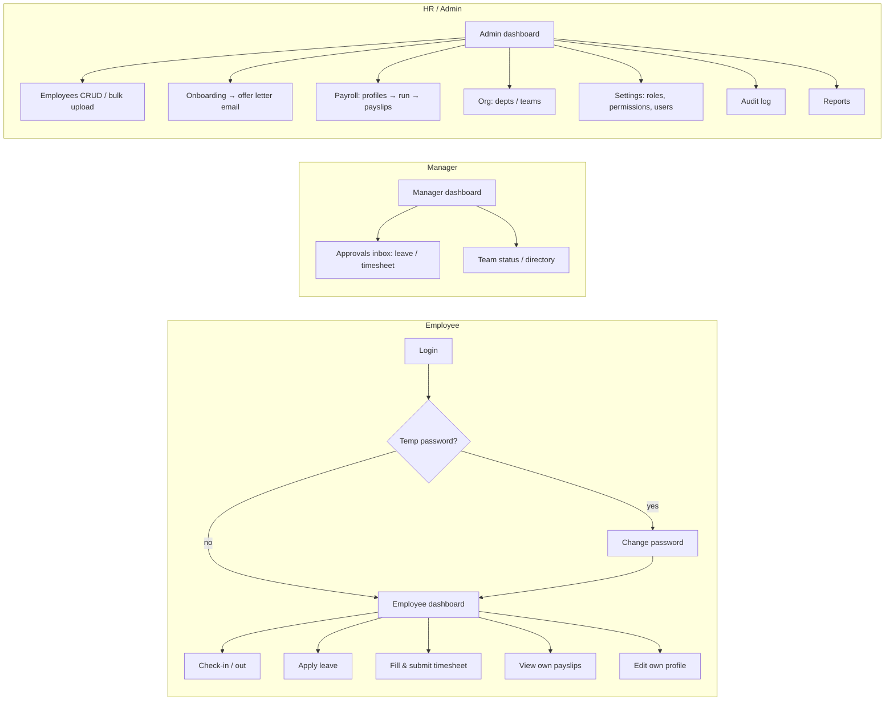
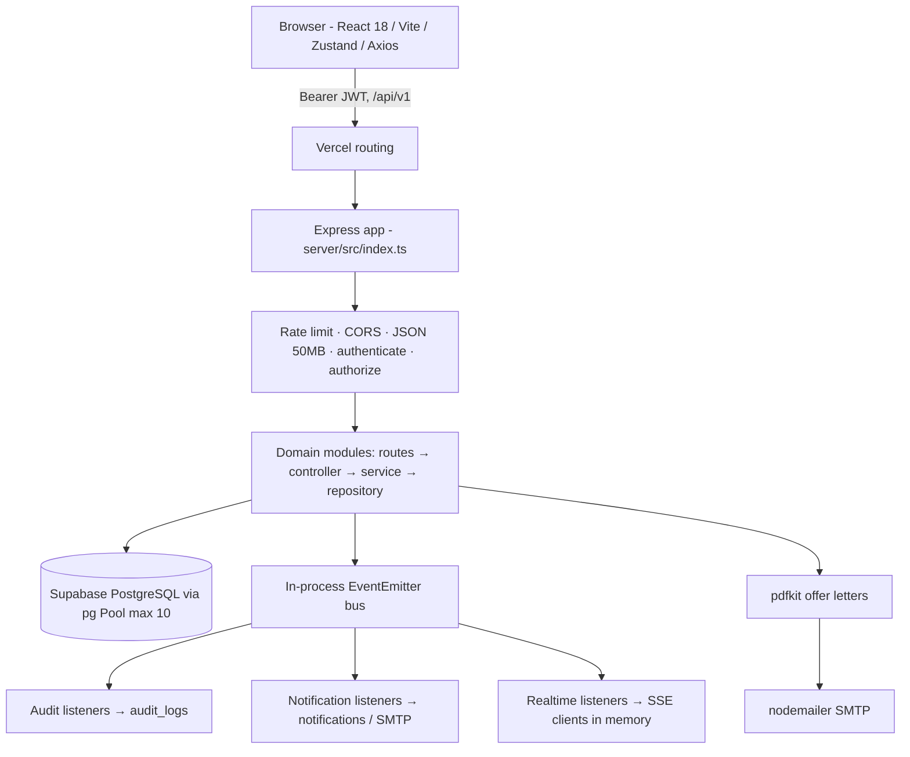
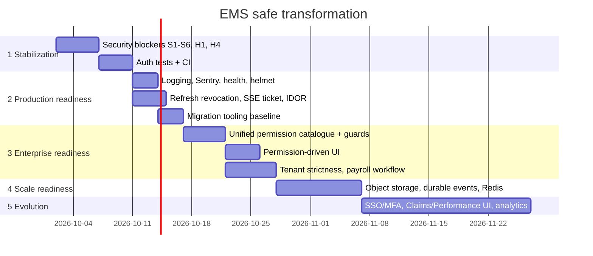

# EMS — Production Readiness & Refinement Audit

**Repository:** `3oconnects/employee_management_system` (branch `main`, HEAD `83c1e84`)
**Audit date:** 2026-10-01
**Method:** Direct reading of source, config, schema/migration code, and git history. Both `server` and `client` were type-checked (`tsc --noEmit`, both pass). No running instance and no production database were inspected.

**Evidence labels:** **[C]** Confirmed (code was read; file:line cited) · **[I]** Inferred (indirect evidence, stated) · **[U]** Unknown: not enough evidence in the repository.

---

## 0. TL;DR

EMS is a feature-rich, multi-tenant-ready **HRMS** (HR management system) with a clean modular backend (Express + PostgreSQL/Supabase) and a React/Vite frontend. It covers people, attendance, leave, timesheets, payroll, approvals, org structure, onboarding with offer letters, audit and RBAC.

The architecture is sound and worth keeping. **The product cannot safely go live today.** The reason is authorization, not missing features:

1. A **hard-coded master password** lets anyone log in as `admin@company.com` (`server/src/modules/auth/auth.service.ts:23`).
2. **Any logged-in employee can take over the super-admin account**: they request a password reset, approve it themselves through `/approvals/:id/action`, and then reset the password. The full chain is in §6.1.
3. **Most write APIs have no permission check.** Any employee can run payroll, approve leave (including their own), approve claims and timesheets, read every salary, and read the audit log.
4. **Managers can open the whole Settings/RBAC API** and change their own role to `super_admin`, because legacy role names are mapped to permissions (§4.3).
5. **Real secrets were committed to git history**: `server/.env` with `DATABASE_URL` and JWT secrets (commits `160ac22` → `283f78d`, deleted in `2c25bcf`).

None of these needs a rewrite. Each one is a small, local fix. Section 10 lists the launch blockers and the order to fix them.

---

## PHASE 1 — Product Discovery

### 1.1 Product identity

| Question | Answer | Evidence |
|---|---|---|
| What is it? | An all-in-one HRMS / Employee Management System | `README.md` overview; module tree under `server/src/modules/*` and `client/src/modules/*` [C] |
| Business problem | Brings HR operations into one place: employee records, attendance, leave, timesheets, payroll (Indian statutory: PF/ESI/PT/TDS), approvals, org hierarchy, onboarding and offer letters | `payroll.service.ts:217-220` (PF 12%, PT 200, ESI 0.75%); `server/public/tax_slabs_FY2025_26.pdf` [C] |
| Organisation | Branded for **Ozofi**: offer-letter, experience-letter and internship-certificate templates | `server/public/Company_Offer_latter_and_certificate/*`, `services/offer-letter/email.template.ts:82` [C] |
| Deployment target | Vercel (frontend static plus `@vercel/node` API). A Render blueprint also exists. | `vercel.json`, `render.yaml`; CORS allows `ozofi-homie.vercel.app` (`server/src/index.ts:64`) [C] |
| Tenancy | Multi-tenant by design (`tenant_id` on every table, `tenants` table). In practice it runs single-tenant (`tenant_default`). | `server/src/db/schema.ts:23-299`; `initDb.ts:153,165` [C] |

### 1.2 Users and roles

The system roles come from `ROLE_PERMISSIONS_MAP` (`server/src/db/schema.ts:363-393`) and `seedPermissions.ts` [C]:

| Persona | Role / `dashboard_type` | Main capabilities |
|---|---|---|
| **Super Administrator** | `super_admin` (system role, `is_system=true`) | Everything; bypasses every check (`authorize.ts:89`) |
| **Administrator** | `admin`, `dashboard_type=admin` | Everything; `dashboard_type=admin` also bypasses every check (`authorize.ts:93`) |
| **HR** | `hr` | Employee CRUD, onboarding, attendance and leave management, payroll run, reports |
| **Manager** | `manager`, `dashboard_type=manager` | Team view, leave and timesheet approval, attendance management, reports |
| **Employee** | `employee` | Self-service: check-in/out, leave, timesheets, own payslips, own profile |
| **Custom roles** | Any name, created in Settings → Roles | Driven by `role_permissions` (designed to be dynamic, see Phase 4) |

### 1.3 Module inventory

| Module | Backend | Frontend | Purpose | Classification | Maturity | Criticality |
|---|---|---|---|---|---|---|
| Auth | `modules/auth` | `modules/auth` | Login, refresh, password change, admin-approved reset | Core | Beta: functional but insecure (§6) | Critical |
| Employees | `modules/employees` (+ `submodels.ts`) | `modules/employees` | Directory, CRUD, bulk CSV upload, education/experience/emergency | Core | Beta | Critical |
| Attendance | `modules/attendance` | `modules/attendance` | Check-in/out, history, regularize, weekly hours | Core | Beta | High |
| Leave | `modules/leaves` | `modules/leave` | Apply, balances, approve | Core | Beta: approval not authorized (§4) | High |
| Timesheets | `modules/timesheets` | `modules/timesheet` (1,316-line page) | Weekly entries, submit, approve | Core | Beta | Medium |
| Payroll | `modules/payroll` | `modules/payroll` (7 sections) | Salary profiles, pay runs, payslips, tax summary | Core | **MVP**: simplified tax, not idempotent (§8) | Critical (financial) |
| Approvals | `modules/approvals` | `modules/approvals` | Unified inbox: leave, onboarding, timesheet, claim, dept/team creation, password reset | Core | Beta: no authorization | Critical |
| Organization / Governance | `modules/organization`, `modules/governance/*` | `modules/organization` | Departments, teams, org tree, structural deep-dive | Supporting | Beta | Medium |
| Onboarding | Through employees and approvals; `services/offer-letter/*` | `modules/onboarding` | Candidate pipeline, offer-letter PDF and email | Supporting | Beta | Medium |
| Reports / Analytics | `modules/reports`, `services/analyticsService.ts` (699 LOC) | `modules/reports`, dashboards | Admin, manager and employee dashboards; workforce and payroll reports | Supporting | Beta | Medium |
| Settings / RBAC | `modules/settings/{rbac,configuration,user-assignments}` | `modules/settings` (11 tabs) | Roles, permission matrix, users, branding, email, policies | Administrative | Beta: guard bypass (§4.3) | Critical |
| Audit | `modules/audit/{read,write}` + event listeners | `modules/audit` | Audit log write (event-driven) and read | Administrative | Beta: read has no authorization | High |
| Notifications | `modules/notifications/*` | Topbar | In-app notifications, email channel | Supporting | Beta | Low |
| Realtime | `modules/realtime/*` (SSE) | `EmployeeTable.tsx:126` | Presence and live updates | Supporting | **Experimental**: in-memory, breaks on serverless | Low |
| Documents | `modules/documents` | Profile → Documents | Employee document metadata (no file storage) | Supporting | MVP | Medium |
| Claims | `modules/claims` | **No UI** (0 references in `client/src`) [C] | Expense claims | **Experimental** (backend only) | Prototype | Low |
| Performance | `modules/performance/*` | **No UI** (0 references) [C] | Reviews, goals, ratings | **Experimental** (backend only) | Prototype | Low |
| Landing page | none | `modules/public/pages/LandingPage.tsx` | Marketing page | **Legacy/dead**: not routed in `App.tsx` [C] | n/a | None |
| Legacy settings router | `modules/settings/settings.routes.ts` (446 LOC) | none | Older monolithic settings API | **Legacy/dead**: not imported anywhere [C] | n/a | None |

### 1.4 User journeys



| Workflow | Frequency | Criticality | State |
|---|---|---|---|
| Login / token refresh | Every session | Critical | Works, but has a backdoor and the reset flow can be abused (§6) |
| Daily check-in/out | Daily, every user | High | Works [I: route + validation present] |
| Leave apply → approve | Weekly | High | **Broken authorization**: anyone can approve (`leaves.routes.ts:36`) |
| Timesheet submit → approve | Weekly | Medium | **Broken authorization** (`timesheets.routes.ts:29`) |
| Monthly payroll run | Monthly | Critical | Can be run by any user; reruns create duplicate runs (§8) |
| Permission change in Admin Panel → UI | Ad hoc | High | **Does not apply until re-login** (§4.4) |
| Password reset (forgot) | Ad hoc | Critical | **Exploitable** (§6.1) |
| Dashboard Announcements widget | Daily | Low | **Mock data**: `AnnouncementsWidget.tsx:6` `MOCK_ANNOUNCEMENTS` [C] |

---

## PHASE 2 — Current Maturity

**Verdict: Beta.** It is feature-complete enough for internal pilots. It is not production-ready because authorization and secrets are unsafe.

| Dimension | Score /10 | Evidence |
|---|---|---|
| Functional completeness | **7** | 17 backend modules, 13 routed pages, payroll, offer letters, RBAC UI. Claims and performance have no UI. One widget uses mock data. |
| Reliability | **5** | Central error handler with PG error mapping (`core/errors/errorHandler.ts`), transactions (`database/transaction.ts`), DB retry (`config/db.ts`). But `uncaughtException` is swallowed and the process keeps running (`index.ts:169-180`), and there are no tests. |
| Security | **2** | Backdoor password, broken authorization on most mutating APIs, privilege escalation, leaked secrets, default JWT secrets (§6) |
| Performance | **5** | Lazy-loaded routes (`App.tsx:12-27`), paginated employee list. But permission seeding runs on every cold start, base64 avatars in the DB, N+1 inserts in payroll. |
| Scalability | **4** | In-memory SSE and event bus, pool `max:10` per instance, no cache, no queue (§7) |
| User experience | **7** | Rich, consistent Tailwind UI, role dashboards, forced temp-password change. Oversized pages. |
| Developer experience | **4** | Good module convention (routes/controller/service/repository/schema). But two migration systems, duplicate DB and error modules, no lint config committed, no tests, no CI, stray scratch files. |
| Operational readiness | **3** | One health endpoint. Console logging only. No monitoring, no versioned migrations, no backup or restore documentation. |

---

## PHASE 3 — Architecture

### 3.1 System diagram



### 3.2 Backend

| Aspect | Finding | Evidence |
|---|---|---|
| Style | Modular monolith, layered (routes/controller/service/repository/schema with Zod). Good foundation; keep it. | e.g. `modules/leaves/*` [C] |
| Events | In-process `EventEmitter` with typed events and a registry. Clean decoupling for audit, notifications and realtime. Not durable: events are lost on crash or serverless freeze. | `core/events/eventBus.ts`, `registry.ts` [C] |
| Queues | None [C] | n/a |
| File storage | None. Documents store `filePath` metadata only (`documents.schema.ts`). Avatars are stored as base64 strings in DB columns (`Profile.tsx:291` `compressedBase64`). | [C] |
| Duplication | Two DB modules (`config/db.ts` and `database/client.ts` with different timeouts); two error handlers (`middleware/errorHandler.ts` and `core/errors/errorHandler.ts`); `performance.routes.ts` duplicated by `performance/reviews/reviews.routes.ts`; `governance.routes.ts` duplicated by `org-tree` and `sync` routes; dead `settings.routes.ts` | [C] |
| Maintainability | Good per module. The cross-cutting security code is inconsistent (role names vs permission strings). | §4 |
| Extensibility | Adding a module follows a clear recipe. The permission catalogue is duplicated in two places (§3.4). | [C] |

### 3.3 Frontend

| Aspect | Finding | Evidence |
|---|---|---|
| Structure | Feature modules under `client/src/modules/*` with components, pages and hooks | [C] |
| State | Zustand `authStore` persisted to **sessionStorage**, including access and refresh tokens (the code comment says otherwise) | `store/authStore.ts:132-142` [C] |
| Routing | React Router v6, lazy pages, `ProtectedRoute` with `allowedRoles` (**role names**, not permissions) | `App.tsx:64-130` [C] |
| API layer | One Axios instance with a refresh-token queue | `services/api.ts` [C] |
| Design system | Single `components/ui/index.tsx` (457 LOC) plus Tailwind tokens. Duplicate `StatCard` components (`dashboard/components/StatCard.tsx`, `StatsCard.tsx`, `payroll/components/StatCard.tsx`). | [C] |
| Oversized files | `Timesheets.tsx` 1,316 · `ProfileHeader.tsx` 952 · `EmployeeTable.tsx` 917 · `AddEmployeeModal.tsx` 762 · `Profile.tsx` 650 | `wc -l` [C] |
| Permission component | `<Can>` exists but is **never used** outside its own file | grep: 1 file [C] |

### 3.4 Database

- **Schema sources (4, overlapping):** `server/src/initDb.ts` (27 `CREATE TABLE`s), `server/src/db/schema.ts` (tenancy and RBAC plus `ALTER TABLE`s), `server/src/db/migration_v3.ts` (5 tables plus indexes), `server/src/scripts/phase2_migrations.ts`. They are orchestrated by `server/scripts/db-setup.ts`. [C]
- **No migration versioning.** There is no migrations table and no up/down scripts. Statements are wrapped in `.catch(() => {})`, so failures are **silently ignored** (`schema.ts:419`, `initDb.ts:276-291`) [C].
- **Two permission catalogues that disagree:** `seedPermissions.ts:26-69` seeds `employees:read/manage`, `attendance:read`, `profile:read/edit`. `schema.ts:306-360` seeds `employees:view/create/update/delete`, `attendance:view`, `profile:view/update`. Both run, so the DB holds both vocabularies, and route guards reference a mix [C].
- **Indexes present:** tenant, user, status and created_at indexes on major tables (`schema.ts:269-299`, `migration_v3.ts:136-144`) [C]. **Likely missing** [I]: a functional index on `LOWER(users.email)` and `LOWER(employees.email)`. Login (`auth.repository.ts:10-12`) and many joins use `LOWER(email)`, which `idx_users_email` cannot serve. Also `approvals(type, (metadata->>'email'))` for reset lookups, and composite `(tenant_id, user_id, check_in)` on attendance.
- **Integrity concerns:** `employees ↔ users` are joined by **email string** (`auth.repository.ts:10`, `employees.repository.ts:113`) rather than consistently by `employees.user_id`. An email change can orphan the link. `tenant_id` is nullable on many tables (added through `ALTER ... ADD COLUMN`, `schema.ts:91-225`). `role_id` defaults to the magic number `4` (`auth.repository.ts:7`).
- **Tenant isolation leak:** repositories accept rows from `'tenant_default'`/`'default'` regardless of the caller's tenant (`employees.repository.ts:113-135`, plus 37 occurrences across `modules/`). `approvals.repository.ts:201` also accepts `tenant_id IS NULL`. This is harmless while single-tenant and a cross-tenant breach once multi-tenant [C].

---

## PHASE 4 — Permissions & Dynamic Access Audit (critical)

### 4.1 Summary matrix

| Layer | Dynamic (permission-driven)? | Evidence |
|---|---|---|
| Sidebar | **No, mostly role-based.** Items list hard-coded `roles: [...]`; `hasModule()` applies only after the role check passes, and core modules are always shown | `Sidebar.tsx:36-73, 96-107` [C] |
| Route protection | **No, role names only** (`allowedRoles`) | `App.tsx:65-127` [C] |
| API protection | **Partial and broken.** About 15 guarded routes in total. Most mutating endpoints have none. | §4.2 [C] |
| Dashboard widgets | **No.** Chosen by `dashboard_type` or role name | `Dashboard.tsx:53-55` [C] |
| Buttons / actions | **No.** `<Can>` and `hasPermission` are unused [C]. Backend action checks use hard-coded role arrays (`employees.controller.ts:47,71,88,105`). | [C] |
| View/Create/Edit/Delete/Export/Approve | Permissions exist in the catalogue (`schema.ts:306-360`) but are **not enforced** for approve, export, payroll run, audit view and similar actions | [C] |
| Admin Panel change takes effect immediately? | **No.** Permissions are frozen into the JWT at login (`auth.service.ts:28-43`); the backend picks up changes at the next refresh (≤15 min). The **frontend never reloads permissions**: refresh returns only tokens (`auth.controller.ts:348-352`) and `/auth/me` is never fetched on load. Sidebar, routes and buttons change only after logout and login. | [C] |

### 4.2 API endpoints with no authorization beyond "is logged in" [C]

| Endpoint | Impact |
|---|---|
| `POST /payroll/process` (`payroll.routes.ts:26`) | Any employee runs payroll |
| `PUT /payroll/employees/:id` (`:13`) | Any employee edits anyone's salary profile |
| `GET /payroll/employees`, `/history/:employeeId`, `/tax-summary` | Any employee reads all salaries |
| `PUT /leave/:id/approve` (`leaves.routes.ts:36`) | Self-approval of leave. `approved_by` is also taken from the request body (`leaves.controller.ts:29-31`) |
| `PUT/DELETE /leave/requests/:id`, `/leave/:id` | Edit or delete other people's leave (tenant-scoped only) [I: no owner check in controller] |
| `POST /approvals/:id/action` (`approvals.routes.ts:14`) | Approve anything, **including password resets** (§6.1) |
| `PUT /timesheets/:id/approve` (`timesheets.routes.ts:29`) | Self-approval |
| `PUT /claims/:id/status`, `GET /claims` | Approve or read all claims |
| `GET /audit-logs` (`audit/read/read.routes.ts:9`) | Any employee reads the full audit trail |
| `GET /reports/admin`, `/analytics`, `/profile/:employeeId`, `/manager?userId=` | Org-wide analytics and other users' profiles |
| `GET /users` | Full user list |
| `GET /employees/:id/education`, `/experience`, `/emergency-contacts` | Any user's PII; the controller passes no tenant (`employees.controller.ts:62-65`) |
| `GET /documents/:employeeId` | Role-filtered in the service [I], not at the route |

### 4.3 The legacy role→permission mapping causes privilege escalation [C]

`server/src/core/security/authorize.ts:69-75` maps role-name guards to a list of permissions and grants access if **any one** of them matches:

```
admin:   ['settings:manage','employees:view',...,'reports:view']
hr:      ['employees:view',...,'leave:approve',...,'attendance:manage']
manager: ['employees:view','leave:approve','reports:view','attendance:view']
```

The consequences:

- **Settings guard** `authorize(['admin','super_admin','hr','settings:manage'])` (`settings/index.ts:11`). A seeded **manager** has `employees:view`, `leave:approve` and `reports:view` (`schema.ts:376-384`), so the manager passes. The manager can then call `PUT /settings/users/:id/role` on themselves (`user-assignments.routes.ts:27`) and assign `super_admin`. **Privilege escalation.**
- **Performance create** `authorize([MANAGER, HR, ADMIN, SUPER_ADMIN])` (`performance.routes.ts:14`). The `manager` mapping contains `attendance:view`, which every **employee** has, so every employee passes.
- **Governance and document verify/delete** guards `['admin','hr',...]` let managers through.
- `dashboard_type === 'admin'` is a blanket bypass (`authorize.ts:93`). Any custom role created with an admin dashboard layout silently becomes super-user.

### 4.4 All hard-coded permission logic (file paths)

| File | Hard-coding |
|---|---|
| `server/src/core/security/authorize.ts:69-75` | `ROLE_TO_PERMISSIONS` legacy map |
| `server/src/core/security/authorize.ts:89,93` | `super_admin` and `dashboard_type=admin` bypass |
| `server/src/core/security/authorize.ts:159-164` | `ELEVATED_ROLES` set used by `requireSelfOrAdmin`. Custom roles cannot view other users' data; any role literally named `manager` can view anyone's |
| `server/src/modules/employees/employees.controller.ts:47,71,88,105` | `['admin','super_admin','hr'].includes(user.role)` |
| `server/src/modules/employees/employees.routes.ts:47-71` | Role-name arrays |
| `server/src/modules/documents/documents.routes.ts:15-16` | `UserRole.HR/ADMIN/SUPER_ADMIN` |
| `server/src/modules/performance/performance.routes.ts:14,16`; `reviews/reviews.routes.ts:14,16` | `UserRole.*` |
| `server/src/modules/governance/*.routes.ts` | `['admin','hr','super_admin']` |
| `server/src/modules/settings/index.ts:11` | `['admin','super_admin','hr', ...]` |
| `server/src/modules/auth/auth.service.ts:23` | `admin@company.com` master password |
| `server/src/scripts/seedPermissions.ts:139-147` | Forces `admin@company.com` to `super_admin` on **every boot** |
| `client/src/store/authStore.ts:94,108,112-114,123,126` | Role names, `admin@company.com` and `'System Admin'` name override, `coreEmployeeModules` |
| `client/src/components/layout/Sidebar.tsx:36-73,102` | `roles: [...]` per item, `coreModules` |
| `client/src/App.tsx:65-127` | `allowedRoles` per route |
| `client/src/modules/dashboard/pages/Dashboard.tsx:53-55` | `dashboard_type` / role selection |

---

## PHASE 5 — Production Readiness

| Area | State | Risk | Evidence |
|---|---|---|---|
| Error handling | Centralised handler, `AppError`, PG error mapping, stack only in development. **But** `uncaughtException` handler logs and continues, which leaves the process in an undefined state. `unhandledRejection` only warns. | Medium | `core/errors/errorHandler.ts`; `index.ts:169-184` [C] |
| Logging | `console.*` only, with no request IDs and no structured logs. 403s log the full permission list and email (`authorize.ts:119-124`). | Medium | [C] |
| Monitoring / APM | None | High | [C] (no Sentry/OTel dependency) |
| Audit trail | Good design (event-driven, `audit_logs` with indexes; login and logout are audited). Read access is unprotected. Coverage of payroll and approval actions is [U]. | Medium | `auth.controller.ts:302`, `audit.listeners.ts` [C] |
| Health checks | `/api/v1/health` returns a static OK; it never checks the DB | Low | `index.ts:86-93` [C] |
| Backups / recovery | Not in repo. Supabase may provide them [U]. | High | n/a |
| Deployment | Two configs (`vercel.json` legacy `builds`, `render.yaml`). Serverless deployment conflicts with SSE and the in-memory bus. Permission seeding runs inside `start()` on every cold start (`index.ts:194`). | High | [C] |
| Environment management | `config/env.ts` validates with Zod **but defaults the JWT secrets** to `ems_secret`/`ems_refresh_secret` (`env.ts:9-10`). `.env.example` also suggests weak values. | Critical | [C] |
| Secrets | `server/.env` (DB URL, JWT secrets) is in git history across 7 commits. `client/.env` is tracked (comments only, harmless). | Critical | `git log -- server/.env` [C] |
| Data protection | TLS to the DB with `rejectUnauthorized:false` (no certificate verification, `config/db.ts:26,39`). Plaintext `temp_password` column, readable via `GET /settings/users/:id/temp-password`. PII endpoints unguarded (§4.2). | High | [C] |
| Migrations | Unversioned and fail silently (§3.4) | High | [C] |
| Tests / CI | **None** (no test files, no `.github/`) | High | [C] |

---

## PHASE 6 — Security Audit

### 6.1 Critical

| # | Finding | Evidence | Impact | Fix (low-risk) |
|---|---|---|---|---|
| S1 | **Master password backdoor**: `admin@company.com` accepts `admin123` / `Admin@123` regardless of the stored hash | `server/src/modules/auth/auth.service.ts:23-25` | Anyone who knows the default email gets super-admin | Delete lines 23-25 |
| S2 | **Self-service account takeover.** (1) Any user calls `POST /auth/forgot-password {email:"admin@company.com"}`; the response contains `requestId`. (2) The same user calls `POST /approvals/PR-…/action {action:"approve", type:"password_reset"}`; there is no authorization, and the default branch updates `approvals.status` (`approvals.service.ts:126-128`, `approvals.routes.ts:14`). (3) They call `GET /auth/forgot-password/status?email=…`, which returns `resetToken` (`auth.service.ts:207`). (4) They call `POST /auth/reset-password`. The token is **optional** anyway (`auth.service.ts:246`). | cited | Full takeover of any account, including super-admin | Require `approvals:approve` on the action route. Never return `resetToken` from status. Make the token mandatory, single-use and time-limited, and deliver it by email only. |
| S3 | **Missing authorization on mutating and sensitive APIs** (§4.2) | cited | Payroll fraud, self-approval, salary and PII disclosure | Add `authorize('<module>:<action>')` per route (additive; does not break callers that hold the permission) |
| S4 | **Privilege escalation through the legacy role mapping** (§4.3) | `authorize.ts:69-75,108-111` | Manager → super_admin | Replace role-name guards with explicit permissions; remove the `ROLE_TO_PERMISSIONS` fallback once the routes are migrated |
| S5 | **Secrets in git history** | `server/.env` in commits `160ac22`…`283f78d` | DB compromise; JWT forgery if the secrets are still in use | Rotate the DB password and both JWT secrets now. Optionally purge history (`git filter-repo`) and force-push, coordinated with the team. |
| S6 | **Default JWT secrets** | `server/src/config/env.ts:9-10` | Forged tokens if the environment variable is unset | Make the secrets required (`z.string().min(32)`) and fail fast in production |

### 6.2 High

| # | Finding | Evidence |
|---|---|---|
| H1 | Plaintext temp passwords stored and compared (`temp_password === passwordRaw`), and retrievable via API | `auth.service.ts:20`; `user-assignments.routes.ts:25`; `user-assignments.service.ts:30,57,74` uses `Math.random()` |
| H2 | Refresh tokens are not validated against the DB value, so logout does not revoke them (refresh only verifies the JWT signature) | `auth.service.ts:60-90` vs `updateRefreshToken` |
| H3 | Access token accepted from the `?token=` query string (leaks into logs and Referer); used for SSE | `authorize.ts:16-17`; `EmployeeTable.tsx:126` |
| H4 | `initDb` resets `admin@company.com` to `admin123` on every `db:setup` run | `initDb.ts:450-463` |
| H5 | Tenant-isolation bypass through `'tenant_default'`/`'default'`/`NULL` fallbacks (37 sites) | `employees.repository.ts:113-135`, `approvals.repository.ts:201` |
| H6 | IDOR on education, experience and emergency-contact reads (no tenant, no owner check) | `employees.controller.ts:62-65,79-82,96-99` |
| H7 | DB TLS without certificate verification | `config/db.ts:26,39` |
| H8 | User enumeration: forgot-password returns 404 "No registered user" | `auth.service.ts:144-146` |

### 6.3 Medium

- Weak password policy (minimum 6 characters) (`auth.service.ts:123,220`). bcrypt cost 10 is acceptable.
- No `helmet` security headers; no CSP [C: not in `package.json`].
- CORS allows **any** `*.vercel.app` origin with `credentials:true` (`index.ts:66`). Bearer tokens limit the CSRF impact, but tighten it anyway.
- A 50 MB JSON body limit (`index.ts:78-79`) invites memory-exhaustion DoS.
- Auth rate limit is per IP only, with no per-account lockout. `/forgot-password/status` shares the auth limiter [C].
- Tokens are stored in `sessionStorage`, so any XSS can steal them. React escaping helps; the only `dangerouslySetInnerHTML` is a static style block (`Dashboard.tsx:408`).
- Email templates interpolate user data into HTML without escaping (`offer-letter/email.template.ts:82,85`), which allows HTML injection into outgoing emails.
- Employees can change their own `reporting_manager_id` and `email` (not on the restricted list, `employees.controller.ts:54`).
- `/public` static folder serves company templates without authentication (`index.ts:82`). Probably intended [I].

### 6.4 Low / Positive

- **SQL injection:** all user values are parameterised. Dynamic `SET` clauses use whitelisted column maps (`employees.submodels.ts`). No injection found [C].
- Zod validation on most mutating routes [C]. Some endpoints have no schema: `forgot-password`, `reset-password`, all `settings/*` and education/experience saves.
- Short access-token TTL (15 min) and refresh rotation [C].
- OAuth: not used [C].

---

## PHASE 7 — Performance & Scale

| Load | Ready? | Notes |
|---|---|---|
| 100 users | **Yes**, once the security fixes are in | Single instance or Vercel is fine |
| 1,000 users | **Mostly.** Fix the items below first. | Pool `max:10` per instance against the Supabase pooler; base64 avatars inflate rows and payloads; analytics queries [U] |
| 10,000 users | **No** | SSE clients and event bus are in-memory (`connections.service.ts:10`), so broadcasts miss other instances. No caching. Payroll run loops per employee inside a single transaction (`payroll.service.ts:208-240`), which is N+1 and holds a long transaction. No background jobs. |
| 100,000 users | **No** | Needs queue/worker for payroll and email, Redis pub/sub for realtime, read replicas or materialised analytics, partitioned `audit_logs`/`attendance` |

**Bottlenecks [C unless noted]:**

1. `seedPermissionsAndSuperAdmin()` runs about 60+ sequential queries on every cold start (`index.ts:194`, `seedPermissions.ts:89-136`), which adds serverless latency.
2. Login query uses `LOWER(email)` with an OR across `employees.personal_email` and no functional index (`auth.repository.ts:10-12`).
3. Avatars stored as base64 in `users.avatar_url`/`employees.avatar_url` and returned in list queries [I].
4. The `query()` retry wrapper retries on *any* message containing "timeout" (`config/db.ts:75`). Writes that are not idempotent can be duplicated.
5. Frontend: route-level code splitting is good. `lodash` is a full import dependency [I]. There are no chart libraries (custom SVG charts), which keeps the bundle lean. Actual bundle size [U] (not built).
6. No HTTP caching or ETags and no server cache layer [C].

---

## PHASE 8 — Refinement Opportunities (no rewrites)

### Quick wins (low risk, high value)

| # | Current | Desired | Business impact | Technical impact | Risk | Effort |
|---|---|---|---|---|---|---|
| Q1 | Backdoor password (`auth.service.ts:23`) | Removed | Closes trivial takeover | 3-line delete | Very low | 5 min |
| Q2 | Approvals action open to all | `authorize('approvals:approve')`; skip `password_reset` unless `settings:manage` | Stops takeover and self-approval | 1 line per route | Low | 30 min |
| Q3 | Reset token returned by status, optional on reset | Never returned; required, single-use, 30-min expiry | Closes the account-takeover chain | Service change | Low | 2 h |
| Q4 | Payroll, leave-approve, timesheet-approve, claims-status and audit-read unguarded | `authorize('payroll:run')`, `'leave:approve'`, `'timesheet:approve'`, `'claims:approve'`, `'audit:view'`, `'payroll:view'` | Financial integrity and privacy | Additive guards | Low (admins bypass) | 2 h |
| Q5 | JWT secret defaults | Required, ≥32 chars | Prevents forged tokens | `env.ts` | Low | 15 min |
| Q6 | Leaked secrets | Rotated | Removes live exposure | Ops task | Low | 1 h |
| Q7 | `approved_by` taken from body | Always `req.user.userId` | Accurate audit trail | 1 line | Very low | 5 min |
| Q8 | Health returns a static OK | `SELECT 1` with a timeout, and a `/ready` endpoint | Real uptime signal | Small | Very low | 30 min |
| Q9 | Frontend permissions only updated at login | Call `/auth/me` on app load and after refresh; return permissions on refresh | Admin changes take effect within one refresh cycle | Small | Low | 2 h |
| Q10 | `helmet`, 50 MB body limit | `helmet()`; 2 MB default, larger only on the bulk-upload route | Hardening | Small | Low | 30 min |

### Medium improvements

| # | Current | Desired | Impact | Risk | Effort |
|---|---|---|---|---|---|
| M1 | Two permission vocabularies | One canonical catalogue (`schema.ts` `module:action` set) with a migration that maps `read→view` and `manage→create/update/delete`; `seedPermissions.ts` imports it | Predictable RBAC | Medium (data migration; run it in a transaction and keep the old rows until verified) | 1-2 d |
| M2 | Role-name guards and `ROLE_TO_PERMISSIONS` | Every route uses explicit permissions; delete the legacy map; keep only the `super_admin` bypass; drop the `dashboard_type=admin` bypass | Truly dynamic RBAC; closes S4 | Medium | 2-3 d |
| M3 | Frontend role checks | `ProtectedRoute requiredPermission`, Sidebar `permission` per item, `<Can>` on buttons; keep `allowedRoles` as a fallback during the transition | Admin Panel changes drive the UI | Low-Medium | 2-3 d |
| M4 | Refresh token not checked against the DB | Store a SHA-256 hash and compare on refresh; logout and password change revoke it | Real session revocation | Low | 0.5 d |
| M5 | Plaintext temp passwords | Hash only; show once at creation; `crypto.randomBytes` | Credential safety | Low (the reveal-later UI must change) | 1 d |
| M6 | Unversioned migrations with silent `.catch` | Adopt `node-pg-migrate` (or a simple numbered SQL runner with a `schema_migrations` table). Baseline the current schema as migration 0001. | Safe schema evolution | Low (baseline is non-destructive) | 1-2 d |
| M7 | No tests | Supertest suite for auth and authorization (one test per guarded route: 403 for an employee, 200 for permitted) plus a GitHub Actions CI running `tsc` and the tests | Prevents regressions | Very low | 2-3 d |
| M8 | Console logs | `pino` with request IDs; Sentry on server and client | Diagnosability | Low | 1 d |
| M9 | Tenant fallbacks (`'tenant_default'`) | Strict `tenant_id = $n`; backfill NULLs; `NOT NULL` constraint | Ready for real multi-tenancy | Medium (verify data first) | 2 d |
| M10 | Payroll run | Unique `(tenant_id, month, year)` on finalised runs; draft → finalize states (permissions `payroll:run/finalize` already exist); tax engine driven by config/slab tables instead of hard-coded `0.05/0.15` | Correct, auditable payroll | Medium | 3-5 d |

### Strategic improvements

- **S-1** Move file binaries (avatars, documents, generated PDFs) to object storage (Supabase Storage or Vercel Blob) and keep URLs in the DB.
- **S-2** Use a durable outbox table for domain events, and Redis pub/sub or Supabase Realtime for SSE fan-out. This fixes realtime on serverless.
- **S-3** Build UIs for the existing Claims and Performance backends, or remove those backends.
- **S-4** Add SSO (OIDC/SAML) and MFA for admin roles.
- **S-5** Precompute analytics (materialised views refreshed nightly).
- **S-6** Data retention and GDPR/DPDP tooling: export and erase of employee data; audit-log retention policy.

---

## PHASE 9 — Technical Debt (ranked by risk)

| Rank | Debt | Location | Risk |
|---|---|---|---|
| 1 | Mixed authorization paradigms (role names, legacy map, permissions, dashboard_type) | §4.4 | Critical |
| 2 | Duplicate permission catalogues | `seedPermissions.ts:26` vs `schema.ts:306` | High |
| 3 | 4 overlapping schema/migration scripts with silent failures | `initDb.ts`, `db/schema.ts`, `db/migration_v3.ts`, `scripts/phase2_migrations.ts` | High |
| 4 | Tenant fallback literals (37 sites) | `server/src/modules/**/*.repository.ts` | High |
| 5 | Dead code: `modules/settings/settings.routes.ts` (446 LOC, unmounted); `middleware/authMiddleware.ts` (re-export shim); `middleware/errorHandler.ts` (duplicate); `database/client.ts` (second pool, apparently unused [I]); `LandingPage.tsx` (unrouted); `client/src/utils/cleanup_data.js` | as named | Medium (can mislead future edits) |
| 6 | Duplicate route modules: `performance.routes.ts` vs `performance/reviews/*`; `governance.routes.ts` vs `org-tree`/`sync` | as named | Medium |
| 7 | Repository junk: `att_ours.tsx`, `att_theirs.tsx` (merge leftovers), `check_user.js` (root and server), `server/scratch/*` (16 scripts, including `update_demo_passwords.js`), `server/scratch_check_db.js`, `client/ts_*.txt` (stale; tsc now passes), `qc`, `file.sample`, `.vite/deps_temp_*`, `graphify-out/` | repo root | Medium (scratch scripts may embed credentials [U]) |
| 8 | Oversized components (>600 LOC) | §3.3 | Low-Medium |
| 9 | Hard-coded business values: payroll rates (`payroll.service.ts:217-220`), CORS origins (`index.ts:60-65`), Ozofi branding in templates, magic role id `4` | as named | Medium |
| 10 | Mock data in production UI | `AnnouncementsWidget.tsx:6` | Low |
| 11 | Duplicate UI atoms (3× `StatCard`) | §3.3 | Low |
| 12 | README is UTF-16 encoded (renders badly on many tools) and describes an outdated structure | `README.md` | Low |

---

## PHASE 10 — Live Deployment Readiness

**Can it be deployed today? No.**

### Launch blockers (must fix before production)

1. Remove the master-password backdoor. **S1**
2. Close the password-reset takeover chain. **S2**
3. Add permission guards to all mutating and sensitive endpoints in §4.2. **S3**
4. Stop the legacy role-map escalation, at minimum on `/settings/*` (use `settings:manage` only). **S4**
5. Rotate the DB credentials and JWT secrets that were in git history. **S5**
6. Make the JWT secrets mandatory. **S6**
7. Stop returning or storing plaintext temp passwords, or at least remove the `GET …/temp-password` endpoint. **H1**
8. Remove the admin password reset from `initDb.ts:450-463`. **H4**
9. Confirm backups and point-in-time recovery are enabled on the Supabase project. **[U]**

### High priority (immediately after launch)

Refresh-token revocation (H2) · remove the query-string token (H3; use a short-lived SSE ticket) · IDOR fixes (H6) · DB-checking health endpoint · structured logging and Sentry · authorization test suite and CI · `helmet` and body limit · payroll idempotency.

### Medium priority

Unify the permission catalogue (M1) · permission-driven frontend (M3) · migration tooling (M6) · tenant strictness (M9) · functional email indexes · remove dead code and junk files.

### Low priority

Object storage for files · durable events and realtime fan-out · Claims/Performance UIs · split oversized components · README refresh.

---

## PHASE 11 — Transformation Roadmap

Every step is additive or a narrowly scoped replacement. Behaviour for correctly permissioned users does not change.



**Phase 1 (Stabilization, ~1.5 weeks).** Fix the launch blockers. Write a Supertest matrix that asserts *employee gets 403, permitted role gets 200* for every route in §4.2. That test matrix is the safety net for everything that follows. Delete junk files and dead code that nothing imports (verify with grep before deleting).

**Phase 2 (Production readiness, ~1.5 weeks).** Observability (pino plus Sentry), real health and readiness checks, revocable refresh tokens, SSE ticket instead of the JWT in the URL, input schemas on the remaining routes, migration runner with a baseline of the current schema (no DDL changes), and a documented backup/restore runbook.

**Phase 3 (Enterprise readiness, ~2–3 weeks).**
- Canonical permission catalogue with a reversible data migration.
- Routes switched to explicit permissions, then `ROLE_TO_PERMISSIONS` and the `dashboard_type` bypass removed behind the test suite.
- Frontend `hasPermission` everywhere, with `/auth/me` polling on refresh so Admin Panel changes take effect within 15 minutes and no re-login is needed.
- Strict tenant scoping.
- Payroll draft → finalize workflow with uniqueness and configurable tax slabs.

**Phase 4 (Scale readiness, ~2 weeks).** Object storage for binaries, outbox-based events, Redis/Supabase Realtime fan-out, a materialised analytics layer, functional and composite indexes, and moving the permission seed out of request-serving startup into `db:setup`.

**Phase 5 (Long-term evolution).** SSO and MFA, UIs for Claims and Performance (backends already exist), data-subject export and erase, audit-log partitioning and retention, and a configurable approval-workflow engine (the `approvals:manage_workflows` permission already exists).

---

## FINAL EXECUTIVE REPORT

### Product summary

EMS is a modular, multi-tenant-capable HRMS for Ozofi. It covers the full employee lifecycle: onboarding with generated offer letters, directory, attendance, leave, timesheets, Indian-statutory payroll, approvals, org structure, analytics, RBAC and audit. The engineering foundations are good: layered modules, Zod validation, parameterised SQL, an event bus and lazy-loaded UI. The **authorization layer is the single systemic weakness**, and it is fixable incrementally.

### Scorecard (0–10)

| Metric | Score |
|---|---|
| Product maturity | **6.0**: Beta |
| Production readiness | **3.0** |
| Security | **2.0** (rises to about 6.5 after the Phase 1 blockers are fixed) |
| Scalability | **4.0** |
| Enterprise readiness | **3.0** |
| Technical debt (10 = no debt) | **4.5** |
| Product quality (UX and features) | **7.0** |
| Architecture quality | **6.5** |

### Top strengths

1. A clean, repeatable module architecture (routes → controller → service → repository → Zod schema) across 17 backend modules.
2. Broad functional coverage, including payroll with statutory deductions and PDF offer letters.
3. Consistently parameterised SQL with whitelisted dynamic columns. No SQL injection found.
4. An event-driven audit and notification design (`core/events/*`) that is easy to make durable later.
5. An RBAC data model (`roles`, `permissions`, `role_permissions`, custom roles, permission-matrix UI) that is already in place. Only enforcement needs to catch up.
6. Short-lived access tokens with refresh rotation, auth rate limiting, and a forced temp-password change.
7. Lazy-loaded routes and a lean dependency set on the frontend.

### Top risks

1. Hard-coded admin master password (S1).
2. Account takeover through the self-approvable password reset (S2).
3. Unauthorised payroll, leave, timesheet, claims and audit operations (S3).
4. Manager → super_admin escalation through the legacy role mapping (S4).
5. Secrets in git history and default JWT secrets (S5, S6).
6. No tests or CI, so any security fix can regress silently.
7. Unversioned, silently failing migrations.
8. Permission changes do not reach the UI without re-login, so the "dynamic RBAC" promise is not met.

### Next 10 actions (in order)

| # | Action | File(s) | Severity |
|---|---|---|---|
| 1 | Delete the backdoor password check | `server/src/modules/auth/auth.service.ts:23-25` | Critical |
| 2 | Rotate the DB password and JWT secrets; make the secrets required | Supabase dashboard; `server/src/config/env.ts:9-10` | Critical |
| 3 | Guard `POST /approvals/:id/action` and harden reset (token mandatory, never returned, expiring) | `approvals.routes.ts:14`; `auth.service.ts:162,207,246` | Critical |
| 4 | Add `authorize('<perm>')` to payroll, leave approve/update/delete, timesheet approve, claims, audit, reports-admin and users | the route files in §4.2 | Critical |
| 5 | Change the settings guard to `authorize('settings:manage')` only | `server/src/modules/settings/index.ts:11` | Critical |
| 6 | Remove the plaintext temp-password storage and the reveal endpoint; use `crypto.randomBytes` | `user-assignments.*`, `auth.service.ts:20` | High |
| 7 | Remove the admin password reset from `initDb.ts:450-463` and the forced role fix from `seedPermissions.ts:139-147` (use a one-time bootstrap command instead) | as named | High |
| 8 | Add a Supertest authorization matrix and a GitHub Actions CI running `tsc` and the tests | new `server/test/`, `.github/workflows/ci.yml` | High |
| 9 | Validate refresh tokens against the stored (hashed) value; revoke on logout and password change | `auth.service.ts:60-100`, `auth.repository.ts:73` | High |
| 10 | Load `/auth/me` on app start and after refresh so permission changes reach the UI; begin migrating Sidebar and `ProtectedRoute` to `hasPermission` | `client/src/services/api.ts`, `store/authStore.ts`, `Sidebar.tsx`, `App.tsx` | High |

### Items marked Unknown (quick for a human to confirm)

- Whether the secrets in the leaked `server/.env` are still live in production.
- Whether Supabase backups and PITR are enabled.
- Production DB state: which of the two permission vocabularies the live roles actually hold. The manager→settings escalation depends on managers holding `employees:view`, `leave:approve` or `reports:view`, as the seed grants.
- Whether `server/scratch/*` scripts contain credentials.
- Actual frontend bundle size and the performance of `analyticsService.ts` queries on real data volumes.
- Whether a CI/CD pipeline exists outside this repository.
