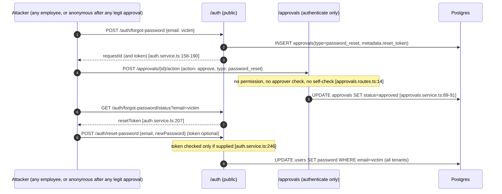
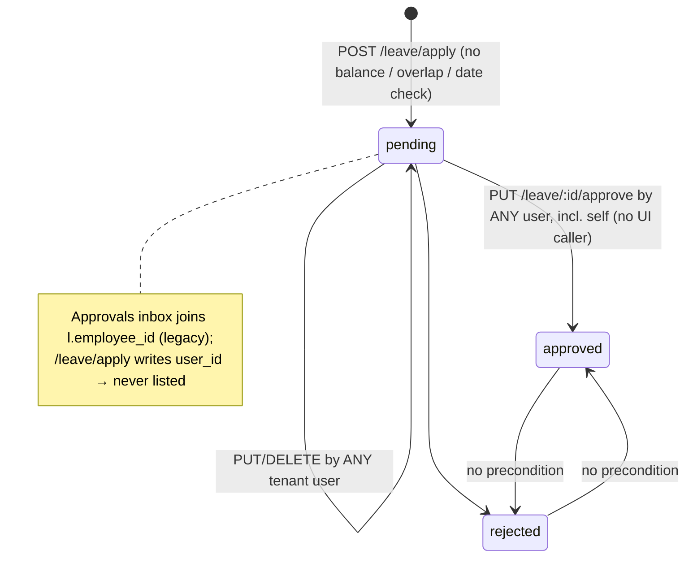
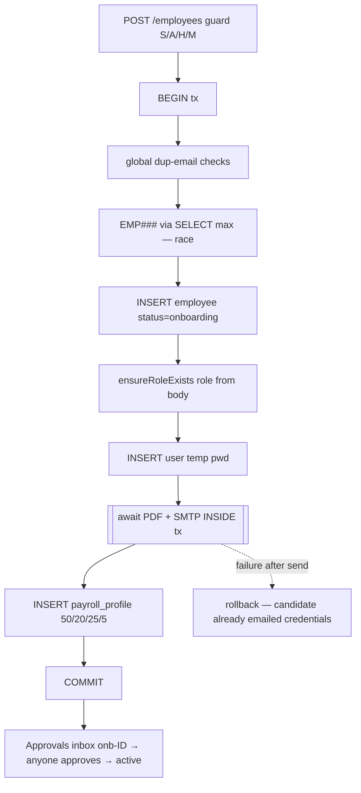
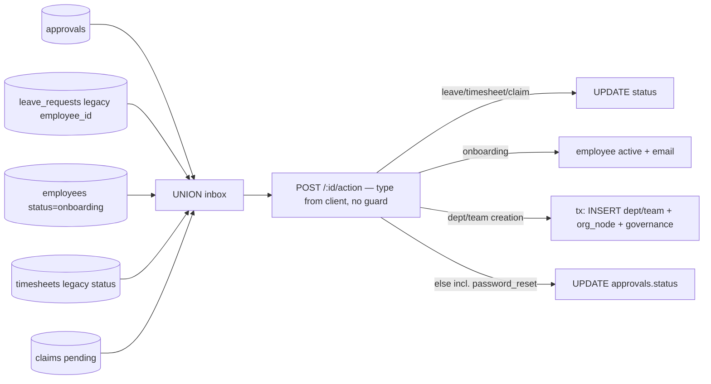
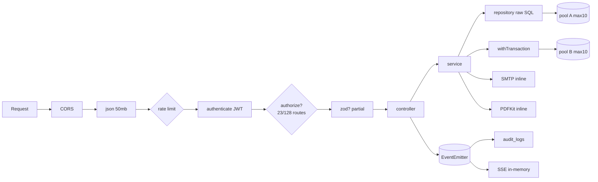
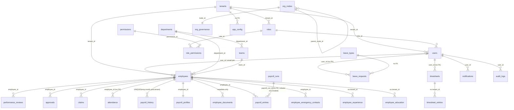
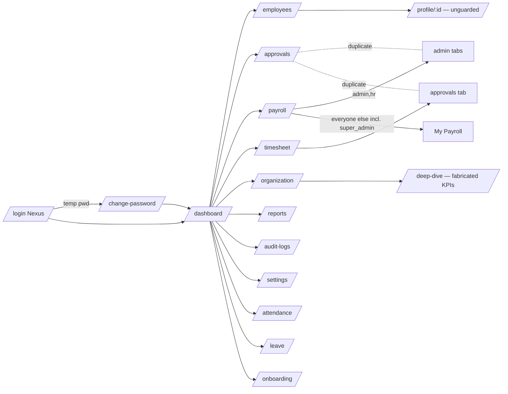
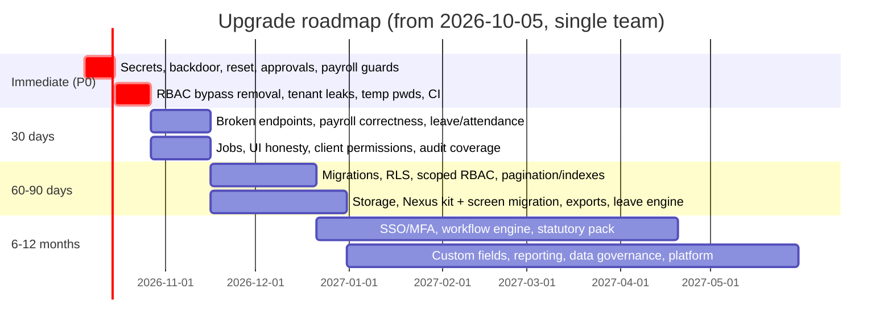

# Ozofi Nexus (EMS): Product Evolution & Upgrade Report

| | |
|---|---|
| **Repository** | `employee_management_system`, branch `feat/nexus-brand-foundation`, HEAD `06dc08f` |
| **Audit date** | 2026-10-04 |
| **Method** | Five parallel evidence tracks (A: product, B: frontend/UX, C: backend/data/workflows, D: security/perf/infra, E: quality/debt) read the source at HEAD. Raw findings with full citations are in `docs/audit/_raw/`. The synthesizer re-opened the highest-severity claims in source before including them. |
| **Commands executed** | `tsc --noEmit` (server and client: pass), server unit tests (9/9 pass), client tests (8/8 pass), `npm run lint` (fails: no ESLint config), `npm audit --omit=dev` (server 1 moderate; client 3 high, 4 moderate) |
| **Not done** | No running instance and no production database were inspected. The production schema snapshot (`server/db/baseline/0000_live_schema.sql`) is not in the repo. Anything that depends on live data is marked **[Unknown]**. |
| **Prior audit** | `docs/audit/PRODUCTION_READINESS_AUDIT.md` (2026-10-01, @`83c1e84`). Since then, `server/` changed only through the Release 0 safety net and branding. **No authorization code changed.** Every prior Critical/High finding was re-verified and is **still present** (§5.0). |

**Evidence labels.**
- **[C] Confirmed:** read in code at the cited `file:line`.
- **[I] Inferred:** deduced from cited code; the reasoning is stated.
- **[A] Assumption:** a judgement where the repo is silent; the reason is stated.
- **[U] Unknown:** not enough evidence found in the repository.

> **Spot-checks by the synthesizer.** These were re-opened at HEAD in this session:
> - `auth.service.ts:23-25`: master password.
> - `config/env.ts:9-10`: JWT default secrets.
> - `employees.repository.ts:18,116-134`: `tenant_default` fallbacks.
> - `core/security/authorize.ts:69-111`: legacy role-name mapping and `dashboard_type` bypass.
> - `db/schema.ts:450`: HR is seeded with `dashboard_type='admin'`.
> - `approvals.routes.ts:14`: action route has no permission guard.
> - `auth.service.ts:207,246`: reset token is exposed and optional.
> - `payroll.routes.ts:10-26`: authenticate only.
> - `analyticsService.ts:636-684`: profile query has no tenant predicate.
> - `PayRuns.tsx:37`: posts to the non-existent `payroll/run`.
> - `client/src/store/authStore.ts:108`: identity backdoor.
> - `client/src/services/api.ts:171-177`: errors are rejected without `.response`.
> - `server/src/index.ts:78`: boot-time seeding.
>
> All were confirmed. One line-number discrepancy between tracks was corrected: `index.ts` has 89 lines, and seeding is at `:78`.

---

## Final Deliverables Index

| # | Deliverable | Where |
|---|---|---|
| 1 | Executive Summary | §0 |
| 2 | Product Architecture Diagram | §4.1 |
| 3 | Database Analysis | §4.4 |
| 4 | Workflow Maps | §3 |
| 5 | Security Report | §5 |
| 6 | RBAC Assessment | §6 |
| 7 | UI/UX Assessment | §7 |
| 8 | Technical Debt Register | §11 |
| 9 | Enterprise Gap Analysis | §9 and §10 |
| 10 | Upgrade Roadmap | §12 |
| 11 | Production Readiness Report | §13 |
| 12 | Top 50 Recommended Improvements | §14 |

---

## 0. Executive Summary

**What it is.** Ozofi Nexus is a multi-module HRMS for **Indian SMBs**, built and branded by Ozofi. The evidence: INR/`en-IN` formatting, Indian holidays, PF/PT/TDS/ESI payroll, a default seat cap of 50, and offer letters signed "Ozofi Technologies Private Limited" [C] (`server/src/config/brand.ts:8-13`, `payroll.service.ts:216-223`, `migration_v3.ts:160-171`, `schema.ts:32`).

It covers:
- the employee master;
- onboarding with automatic offer letters;
- attendance, leave, timesheets and claims;
- a unified approvals inbox;
- a monthly payroll run;
- an org tree with owner/ruler governance;
- dashboards, audit, and tenant-level settings with RBAC.

The stack is React 18/Vite/Zustand on the client and Express/TypeScript/raw `pg` on Postgres (Supabase) on the server, deployed via Vercel (with a competing Render blueprint).

**Maturity: MVP (late MVP, not Beta).** The module breadth looks like Beta. But:
- 18 client calls hit endpoints that don't exist, including the **payroll Run button** and every payslip download.
- Newly applied leaves cannot reach the approvals inbox.
- Several screens show fabricated metrics.
- The database cannot be rebuilt from the repo.
- Authorization is largely absent server-side.

**Final readiness score: 29/100 → NOT READY** (§13).

**The five things that matter most:**
1. **Any employee can take over any account, including the super-admin.** The chain: forgot-password → self-approve via an unguarded `POST /approvals/:id/action` → the reset token is returned by an unauthenticated endpoint and is optional anyway. A hard-coded master password (`admin@company.com` / `admin123` | `Admin@123`) also still works, and boot-time seeding re-promotes that account to super_admin on every start. [C]
2. **Authorization is authentication-only on most of the API.**
   - Only 23 of 128 routes carry any permission guard.
   - Payroll (read all salaries, edit salaries, run payroll), leave/timesheet/claim/generic approvals (self-approval included), audit-log reads and performance edits are open to every logged-in user.
   - The guard that does exist lets managers into `/settings`, where they can grant themselves super_admin. HR is seeded with a `dashboard_type='admin'` that bypasses every check. [C]
3. **Not multi-tenant safe.**
   - About 40 queries include `OR tenant_id='tenant_default'|'default'|IS NULL`.
   - `/reports/profile/:id` returns any tenant's bank account, CTC, documents and emergency contacts.
   - Email, department name and employee ID are globally unique.
   - There is no tenant provisioning and no row-level security.
   - Offer letters always name Ozofi as the employer. [C]
4. **Core business workflows are broken or unsafe.**
   - Payroll has no idempotency, finalize or lock; it pays terminated employees; its statutory maths is simplified and implemented four divergent ways.
   - Leave has no balance or overlap check, and approvals can be flipped back and forth.
   - Attendance regularization auto-inserts "present" rows with no approval.
   - Deleting an employee **hard-deletes statutory payroll history**. [C]
5. **Engineering foundations are thin.** There is:
   - no CI, no lint config, and 17 unit tests (none on business logic);
   - five overlapping schema sources and no migration tool;
   - about 1,400 lines of dead duplicate server modules;
   - three DB pools per instance;
   - a UI that is role-name driven rather than permission driven;
   - a design system adopted on only the three auth screens. [C]

**What is worth keeping.**
- A clean module convention (controller/service/repository/schema) on the server.
- Strict TypeScript that passes on both sides.
- A sensible Release 0 test harness (disposable-DB guard, side-effect-free `app.ts`).
- Good Sentry PII scrubbing.
- Parameterized SQL throughout (no SQL injection found).
- A genuinely differentiated org-governance tree.
- A solid start on the Nexus design system.

**None of the Critical items needs a rewrite. They are local, surgical fixes** (§12.1). The upgrade path is: close the 12 launch blockers → make tenancy and permissions real → repair the core HR workflows → only then add enterprise breadth.

---

## Phase 1: Product Discovery

### 1.1 Product identity

| Question | Finding | Evidence |
|---|---|---|
| Name | **Ozofi Nexus**, "Workforce Management Platform". Legacy names "EMS" and "AURA" persist in code. | `server/src/config/brand.ts:8-13`; `server/package.json` ("EMS Backend API"); `initDb.ts:445` (`'AURA Default'`); `IntegrationsTab.tsx:36` (`aura_` key prefix) [C] |
| Problem solved | A single system of record for employees, plus self-service attendance, leave, timesheets and claims, a unified approvals inbox, and a monthly payroll run with Indian statutory deductions | Route mounts `server/src/app.ts:105-124` [C] |
| Target users | super_admin, admin, HR, manager, employee. Indian SMBs (≤50 seats by default) | Role enum `server/src/types/index.ts:12-18`; `schema.ts:32` `max_employees 50`; bulk cap 50 (`employees.service.ts:27`) [C]; SMB segment [I] |
| Business value today | (1) HR adds an employee → login created, offer letter PDF emailed, salary profile auto-split 50/20/25/5. (2) One inbox for leave, onboarding, timesheet, claim, dept/team and password-reset approvals. (3) One-click payroll computation (API only; the UI button is broken) | `employees.service.ts:91-160`; `approvals.repository.ts:9-123`; `payroll.service.ts:200-254` [C] |
| Vision (stated) | `docs/01-11_*.md` (Feb 2026) describe geo-fenced attendance, shift rosters, leave accrual and carry-forward, 360 feedback. **Mostly unimplemented.** `docs/nexus/*` (Oct 2026) defines the brand and design-system direction | `docs/03_attendance_and_time.md:18-36`, `docs/04_leave_and_absence.md:18-19`, `docs/05_performance_management.md:21` [C] |
| Revenue model | **No evidence of a business model in code**: no billing, subscription, plan enforcement or payment integration. `tenants.plan` and `max_employees` exist as columns but nothing enforces them | `schema.ts:23-36`; grep for stripe/razorpay/billing finds nothing [C] |
| Tenancy | Shaped for multi-tenancy (`tenants` table, `tenant_id` columns, `tenantId` in the JWT), but **operationally single-tenant**: no provisioning code ever inserts into `tenants` | `schema.ts:23-225`; `authorize.ts:33` [C] |

### 1.2 Maturity classification: **MVP (late MVP)**

| Bar | Met? | Evidence |
|---|---|---|
| Core flows wired end-to-end | **No.** Payroll run, payslips, tax summary, claims approval in Payroll, timesheet history and the holidays widget call 18 non-existent endpoints. New leaves never reach the approvals inbox | `docs/audit/tools/route_contract_baseline.txt` (unchanged at HEAD); `PayRuns.tsx:37`; `approvals.repository.ts:42-57` vs `leaves.repository.ts:10-14` [C] |
| Safe with real data | **No.** Backdoor, account takeover, open payroll API, cross-tenant PII leak | §5 [C] |
| Reproducible environment | **No.** The schema cannot be rebuilt from the repo (`server/db/baseline/README.md:3`); the snapshot file is absent | [C] |
| Honest UI | **No.** Fabricated trends and KPIs, mock announcements, "PCI-DSS / AES-256" badges, a random-hex "log" | §7.1 [C] |
| Automated quality gate | **No.** No CI, lint broken, no business-logic tests | §11 [C] |

**Justification.** This is more than an MVP prototype: 17 modules have a persistence layer, plus a design system and runbooks. But it fails the Beta bar of "feature-complete for core flows and safe to trial with real data". **[A]** This applies conventional maturity definitions to the evidence above.

---

## Phase 2: Feature Inventory

The API base is `/api/v1`. **Unless noted, every route is guarded by `authenticate` only.** The full per-module detail (endpoints, tables, permissions, workflow diagrams) is in `_raw/track-a-product-business.md` §2.1–2.16. Below is the condensed per-module view, then the required summary table.

### 2.1 Module detail (condensed)

| Module | Purpose / business value | Depends on | Key APIs | Tables | Permission enforced (actual) | Missing capabilities |
|---|---|---|---|---|---|---|
| **Auth** | Login, refresh, logout, profile, change password, admin-approved reset | approvals, audit, realtime | `POST /auth/login\|refresh\|logout\|forgot-password\|reset-password`, `GET /auth/forgot-password/status`, `GET\|PUT /auth/me*` (`auth.routes.ts:14-27`) | users, roles, role_permissions, permissions, approvals | Public / authenticate | MFA, SSO, lockout, password policy, emailed reset links |
| **Employees / Core HR** | Employee master; education, experience, emergency contacts; bulk CSV; account and offer-letter creation | auth, RBAC, payroll, email, approvals | `GET\|POST /employees`, `PUT\|DELETE /employees/:id`, sub-records, `/bulk-upload`, `/me`, `/check-email` (`employees.routes.ts:28-71`) | employees, users, roles, payroll_profiles, employee_* | Create/delete: `[admin,super_admin,hr,employees:manage]`, which managers pass (§6). Sub-record reads: none | Offboarding, custom fields, change requests, field history |
| **Onboarding** | New-hire list plus create modal | employees, approvals | Reuses `/employees?status=onboarding` | employees, approvals | UI role list only | Checklists, tasks, document collection, e-sign, pre-boarding |
| **Attendance** | Check-in/out, history, weekly hours, regularize | employees | `/attendance/today\|history\|weekly-hours\|summary/:userId`, `POST check-in\|check-out\|regularize` (`attendance.routes.ts:22-34`) | attendance | `requireSelfOrAdmin` (role names) on reads; none on writes | Geo/IP, biometric, shifts, policies, LOP link, team view |
| **Leave** | Apply, edit, cancel, balance, approve | approvals, notifications | `/leave/types\|apply\|requests\|balance`, `PUT /leave/:id/approve` (`leaves.routes.ts:20-38`) | leave_types, leave_requests | None on approve | Accrual, carry-forward, half-day, holiday/weekend-aware counting, balance validation, working approval path |
| **Timesheets** | Weekly sheet, submit, approve | attendance | `/timesheets/week\|history\|pending`, `PUT /:id/entries\|submit\|approve` | timesheets, timesheet_entries | None on writes | Project master, billable flag, reconciliation |
| **Claims** | Submit, list, change status | (payroll, not linked) | `POST /claims`, `GET /claims`, `PUT /claims/:id/status` | claims (payroll counts `reimbursement_claims`) | None | Limits, receipts, policy, payout via payroll |
| **Approvals** | Unified inbox plus action | leave, timesheets, claims, employees, org | `GET\|POST /approvals`, `POST /approvals/:id/action` | approvals + UNION of 5 sources | **None** | Multi-level chains, delegation, SLA, routing rules, comments |
| **Payroll** | Salary profiles, pay run, dashboards | employees, notifications | `GET\|PUT /payroll/employees`, `POST /payroll/process`, `/runs\|activity\|live-summary\|deadlines\|tax-summary`; `/history/:id` is a stub | payroll_profiles, payroll_runs, payroll_entries, payroll_history | **None** | Payslips, filings (ECR/24Q/Form 16), declarations, F&F, bank file, run locking, LOP |
| **Performance** | Review CRUD (API only, **no UI**) | — | `GET\|POST\|PUT\|DELETE /performance` | performance_reviews | Create: any role (§6); update: none | Cycles, OKRs, 360, calibration |
| **Documents** | Document metadata (**no file storage**) | — | `GET /documents/:employeeId`, `POST /documents`, `PUT verify`, `DELETE` | employee_documents | Read check only when role name is `employee` | Storage, e-sign, expiry alerts |
| **Organization / Governance** | Departments and teams via approval; org tree with owner/ruler inheritance | approvals | `/organization/*`, `/governance/tree\|search\|resolve\|sync`, `PUT /governance/:nodeId` | departments, teams, org_nodes, org_governance | Writes: `adminOnly` (managers pass) | Legal entities, locations, cost centres, positions |
| **Reports / Dashboard** | Role dashboards; analytics summary | AnalyticsService | `/reports/admin\|manager\|employee\|dashboard*\|departments\|team\|profile/:id\|analytics\|summary` | many (read) | **None** | Export, builder, scheduling, honest trends |
| **Notifications / Realtime** | In-app plus SMTP email; SSE status broadcasts | — | `GET /notifications`, `PUT read-all\|:id/read`, `GET /realtime/stream` | notifications | Self | Preferences (stub), push, SMS, Slack/Teams |
| **Audit** | Read audit log | event bus | `GET /audit-logs` | audit_logs | **None** | Coverage beyond 3 auth events, export (stub), retention |
| **Settings / RBAC / Users** | Roles, permissions, users, config (email, security, features, integrations, branding) | email | `/settings/permissions\|roles\|config\|test-email\|users/*` (18 endpoints) | roles, role_permissions, users, app_config | `[admin,super_admin,hr,settings:manage]`, which managers pass | **Enforcement**: MFA, lockout, feature flags, webhooks and API keys are saved but never read |
| **Workspace** | Org name and logo for the shell | app_config | `GET /workspace` | app_config | Authenticate | — |

**Client ↔ server contract gaps [C]**:
- **18 client calls with no server route:**
  - `POST payroll/run` (the server has `/process`);
  - `payroll/payslip/:id/monthly|yearly`, `payroll/documents/bulk-payslips`, `payroll/tax-statutory/summary`, `POST payroll/profiles`, `payroll/deadlines/latest`, `POST payroll/deadlines`;
  - `claims/admin`, `PUT claims/:id/approve|reject`;
  - `/approvals/pending`, `PUT /approvals/:id/:action` (in a dead component);
  - `/reports/holidays`, `GET /timesheets`.
- **Server routes with no UI caller:**
  - `PUT /leave/:id/approve`, all `/performance` routes, `POST /payroll/process`;
  - `GET /payroll/runs|deadlines|tax-summary`, `GET /auth/me`, the document read/verify/delete routes, and others.

### 2.2 Summary table

| Module | Status | Completion % | Risks | Missing Features |
|---|---|---|---|---|
| Auth | Working, **insecure** | 60 (all routes wired; reset flow and backdoor unsafe) | Master password; reset-token leak; plaintext temp passwords; non-revocable refresh | MFA, SSO, lockout, policy |
| Employees / Core HR | Working | 65 (CRUD, sub-records and bulk import wired) | Hard-deletes statutory records; unguarded cross-tenant sub-record reads; role escalation via `role` field | Offboarding, custom fields, change requests, history |
| Onboarding | Thin | 30 (status flag + offer email + approval) | Offer letter always says "Ozofi"; candidate gets credentials even if the transaction rolls back | Checklists, tasks, docs, e-sign |
| Attendance | Basic | 45 (check-in/out and history wired; `half_day`/`absent` never written) | Self-regularization without approval; dashboards read legacy columns | Geo/IP, shifts, policies, LOP |
| Leave | **Partially broken** | 40 (apply, list and balance wired; new requests cannot be approved via the UI) | Negative balances; anyone edits or deletes others' pending leave; self-approval | Accrual, carry-forward, half-day, holidays |
| Timesheets | Working, basic | 55 (history tab calls a missing endpoint) | Approved sheets editable; cross-tenant entry edits; ineffective transaction | Project master, billable |
| Claims | **Partially broken** | 35 (Payroll approval tab calls 3 missing endpoints; pending count reads the wrong table) | Claim on behalf of anyone; negative amounts; self-approval | Limits, receipts, payout |
| Approvals | Working, single-level | 50 | Anyone approves anything, including password resets → takeover | Chains, delegation, SLA, routing |
| Payroll | **UI largely broken** | 30 (calc engine exists; 9 UI calls 404) | No authorization; non-idempotent; pays exited staff; simplified statutory maths | Payslips, filings, locking, LOP, F&F |
| Performance | Backend-only stub | 15 | Employee can rewrite own rating | Cycles, OKRs, 360, UI |
| Documents | **Mock storage** | 20 | Users believe documents are stored (fake `filePath`) | Storage, e-sign, expiry |
| Organization / Governance | Working | 60 | `GET /governance/tree` writes; 4 created tables unused | Entities, locations, cost centres |
| Reports / Dashboard | Working, partly mock | 45 | Cross-tenant profile leak; fabricated trends | Export, builder, scheduling |
| Notifications / Realtime | Basic | 50 | Token in query string; role targeting misses custom roles; SSE incompatible with Vercel | Preferences, push, chat |
| Audit | Minimal | 20 | Readable by all; covers 3 events only; false sense of compliance | Entity-level audit, export, retention |
| Settings / RBAC | UI-rich, enforcement-poor | 45 | Manager → super_admin; HR bypass; SMTP password and temp passwords returned in clear | Enforced policies, SSO/MFA, API keys, webhooks |

*Completion % is evidence-weighted: endpoints present and wired, minus stubs, mock UI and broken calls. It is a relative indicator, not a measurement **[A]**.*


---

## Phase 3: Business Workflow Analysis (Workflow Maps)

The full per-workflow maps with every citation are in `_raw/track-c-backend-data.md` §3.1–3.15. This section gives the condensed analysis plus the maps for the highest-risk flows.

### 3.0 Workflow risk matrix

| Workflow | Happy path works? | Failure path | Key edge cases | Security risks | Data-integrity risks |
|---|---|---|---|---|---|
| **Authentication** | Yes: bcrypt → 15 min access + 7 day refresh JWT (`auth.service.ts:15-58`, `jwt.service.ts:5-6`) | Inactive/deleted user → 401; IP rate limit 10/15 min | Login also matches `personal_email` (`auth.repository.ts:424`); a forced password change is **not enforced server-side** | Master password; temp password compared in plaintext; refresh never checked against the stored token; JWT secret defaults | `completePasswordReset` updates every user with that email **across tenants** (`auth.repository.ts:572-576`) |
| **Password reset** | Admin-approval flow | 404 reveals that the account exists | Approvals never expire | **Account takeover** (§5, SEC-02) | — |
| **Employee create / onboarding** | Yes: transaction → user + offer letter + payroll profile (`employees.service.ts:183-306`) | Rollback after the email is sent leaves the candidate holding credentials for a non-existent account [I] | `EMP###` from `SELECT max` without a lock → PK collision under concurrency | `role` in the request body lets HR or a manager create a `super_admin` | Global email uniqueness; status is free text |
| **Employee delete** | Hard-deletes 15 child tables, including payroll history (`employees.repository.ts:331-382`) | Falls back to soft delete only on error | Child deletes are not tenant-scoped | — | **Destroys statutory records** |
| **Leave** | Apply → notify → approve (`leaves.service.ts:16-52`) | 404 / pending-only edit | No `start≤end`, overlap or balance check; calendar days include weekends and holidays | Self-approval; `approved_by` taken from the body; anyone can edit or delete others' requests | **Negative balances**; approved↔rejected flip (no precondition); new leaves are **invisible to the approvals inbox** |
| **Attendance** | Check-in/out (`attendance.service.ts:42-57`) | 400 if a session is already open | Concurrent check-ins create two open sessions; a session open past midnight can never be closed | — | **Regularize inserts "present" for any date with no approval** (`attendance.repository.ts:124-131`); dashboards read legacy columns |
| **Timesheets** | GET creates draft → entries → submit → approve | — | Week start is not normalised; no `UNIQUE(user, week)` | Self-approval; edit any sheet in any tenant | Approved sheets stay editable; ineffective transaction (`timesheets.repository.ts:25-43`); negative hours |
| **Payroll** | `POST /payroll/process` computes and stores (`payroll.service.ts:200-254`) | Rollback on error; **the run fails on a repo-built DB** (missing `payroll_run_id`) [I] | Re-run → duplicate entries; terminated employees included | **No authorization at all** | No finalize or lock; TDS a flat % of gross; four divergent formulas; no payslip endpoint |
| **Claims** | Submit → status | — | `CLM-<ms>` id collides under concurrency [I] | `employee_id` taken from the body; self-approval | Negative amounts; payroll counts a different table |
| **Approvals** | UNION inbox + `type` switch (`approvals.service.ts:25-92`) | — | `type` is supplied by the client → updates the wrong table | **Unguarded action** | No status precondition → double processing; `actioned_by`/`actioned_at` never written |
| **Notifications** | Synchronous insert | Errors swallowed | Targeting uses the legacy `users.role` string → custom roles never notified | — | Lost on failure (no outbox) |
| **Reports** | Tenant-scoped admin aggregates | Fetch error → endless skeleton (`Reports.tsx:72`) | Manager/employee/profile reports keyed by query-string ids | **Cross-tenant PII** | Fabricated "recent reports" |
| **Admin settings** | Upsert key/values (`configuration.service.ts:28-40`) | DB error text returned to the client | Table created at runtime | SMTP password stored and returned in plaintext | No key allow-list; not audited |
| **Role management** | Role CRUD and permission replace (`rbac.service.ts`) | — | Changes apply only at next login | Manager reaches it; `dashboard_type='admin'` is a global bypass | Delete-then-insert of permissions **without a transaction** (`rbac.repository.ts:89-97`) |
| **Documents** | Metadata only | — | Client invents `filePath` | Upload to any employee; owner check only for the role name `employee` | Verify writes the non-existent `updated_at` |
| **Performance** | API only | — | — | Employee can rewrite their own rating | Rating CHECK exists only in the v3 DDL |

### 3.1 Map: password-reset account takeover (Critical)



### 3.2 Map: leave (as built vs required)



### 3.3 Map: payroll run

```mermaid
sequenceDiagram
  participant UI as PayRuns.tsx
  participant API as /payroll
  participant DB
  UI->>API: POST payroll/run  → 404 (route is /process) [PayRuns.tsx:37]
  Note over API: Any authenticated user can call /process
  API->>DB: BEGIN; INSERT payroll_runs RUN-y-m-<Date.now()>
  loop every payroll_profile in tenant (incl. terminated)
    API->>DB: INSERT payroll_entries (gross, PF 12% basic, PT ₹200, TDS 5/15% gross, ESI 0.75%)
    API->>DB: UPSERT payroll_history status=paid
  end
  API->>DB: COMMIT
  Note over API,DB: re-run → duplicate entries; no draft/review/finalize/lock; no payslip API
```

### 3.4 Map: employee creation (transaction scope problem)



### 3.5 Map: unified approvals (no engine)



The remaining maps (attendance, timesheets, claims, notifications, reports, settings, role management, documents, performance, governance) are in `_raw/track-c-backend-data.md` §3.4–3.15.

---

## Phase 4: Architecture Review

### 4.1 Product architecture (as built)

```mermaid
flowchart TB
  subgraph Browser["Browser: React 18 SPA (Vite)"]
    UI[16 feature modules\n14 lazy routes]
    ST[(Zustand authStore\naccess+refresh tokens in sessionStorage)]
    AX[axios api.ts\nBearer + 401 refresh queue]
    SSE1[EventSource ?token=]
  end
  subgraph Host["Vercel (vercel.json) — or Render (render.yaml), conflicting"]
    STATIC[client/dist static]
    FN["Express app (server/src/app.ts)\n@vercel/node serverless"]
  end
  subgraph Server["Express middleware → modules"]
    MW[cors *.vercel.app · json 50mb · rate limit (in-memory) · authenticate · authorize? · zod?]
    MOD[20 modules: controller → service → repository (raw SQL)]
    BUS[(in-process EventEmitter)]
    BOOT[boot: seedPermissionsAndSuperAdmin]
  end
  subgraph Data
    PG[(Supabase Postgres\n3 pg pools/instance: 10+3+10\nno RLS)]
    CFG[(app_config incl. SMTP pass)]
  end
  SMTP[Gmail / tenant SMTP]
  SENTRY[Sentry (opt-in)]
  UI --> AX --> FN
  SSE1 --> FN
  UI --> STATIC
  FN --> MW --> MOD --> PG
  MOD --> BUS
  MOD --> SMTP
  BOOT --> PG
  FN -.-> SENTRY
  UI -.-> SENTRY
  MISSING["Missing: CI · job queue · cache · object storage · migration tool · RLS"]:::warn
  classDef warn fill:#fde68a,stroke:#b45309
```

### 4.2 Frontend

| Dimension | Finding | Evidence |
|---|---|---|
| Folder structure | `components/{layout,ui,brand}`, `modules/*` (16 features, each with `pages/` and `components/`), a single `services/api.ts`, a single `store/authStore.ts`, `hooks/`. About 27k LOC | [C] Track B §4a.1 |
| Component design | **Shared kit is barely used.** `DataTable` and `Modal` have **zero** consumers. 24 hand-rolled overlays; 4 copies of `StatCard`; two parallel "my profile" UIs; 13 dead components. God files: `Timesheets.tsx` (1,316 lines), `ProfileHeader.tsx` (952), `EmployeeTable.tsx` (917) | [C] `components/ui/index.tsx:183,249`; grep counts |
| State management | One Zustand store (identity + tokens + role helpers). **No server-state layer** (no React Query/SWR); 160 direct `api.*` calls in 58 files. Permissions are a login-time snapshot with no `/auth/me` on boot. `dashboard_type` is dropped at login (`LoginPage.tsx:58-66`) | [C] |
| Data-fetch error contract | **Broken app-wide.** The interceptor rejects `{message,code,errors}` without `.response` (`api.ts:171-177`), while 25 call sites read `err.response.data.message`. Users never see server or validation messages | [C] |
| Performance | Route-level `React.lazy` ✔. `React.memo` used 0×. 1-second root re-renders (Dashboard, Attendance). Five widgets each fetch 500 employees. Client-side filtering of paginated data. Polling without visibility pause | [C] Track B §8a |
| Accessibility | `aria-*` appears only in 8 files (all Nexus/auth). 99 `<label>` vs 4 `htmlFor`. 14 `div onClick`. The shared `Modal` has no dialog role, focus trap or Escape handling. Page titles are set on 2 pages only | [C] |
| Responsiveness | 207 breakpoint classes, but **the app shell is not mobile-capable**: the sidebar is always rendered (no drawer); the topbar has fixed widths | [C] `MainLayout.tsx:20`, `Sidebar.tsx:119`, `Topbar.tsx:133` |

### 4.3 Backend

| Dimension | Finding | Evidence |
|---|---|---|
| API structure | `/api/v1/<module>`; one router per module mounted in `app.ts:105-124`; 128 live endpoints | [C] |
| Layering | Controller → service → repository in most modules. Exceptions: reports (SQL in the controller and a static AnalyticsService), employees `/roles` (SQL in the route file), approvals service (direct `pool`) | [C] Track C §4b.4 |
| Middleware order | cors → json(50 MB) → static `/public` → health → per-mount rate limit → `authenticate` (accepts `?token=` on every route) → optional `authorize`/`requireSelfOrAdmin`/`validateRequest` → 404 → Sentry → `globalErrorHandler`. **No helmet, request ID or structured logger.** `enforceTenantIsolation` is defined but never used | [C] `app.ts`, `authorize.ts:16-17,133-153` |
| Validation | Zod on most modules, but `.passthrough()` is common. **All 18 Settings endpoints are unvalidated**, as are forgot/reset password. No date-order check on leave; negative claim amounts and hours are allowed | [C] Track C §4b.5 |
| Error handling | Central handler maps AppError, Zod and PG codes, with stack traces only in development ✔. But several services return **HTTP 200 with a raw DB error** or fall back to **cross-tenant queries** (`rbac.service.ts:41-47`, `user-assignments.service.ts:19-22`). Six different response envelopes | [C] |
| Events and jobs | An in-process EventEmitter; only 2 of 7 event types are published. **No job queue, no cron.** PDF and SMTP run inline, including inside DB transactions | [C] |
| Dead code | About 1,400 lines: unmounted `settings.routes.ts` (446 lines) and duplicate governance/performance/notifications/realtime route sets; `departments/*`; `middleware/errorHandler.ts`; `utils/pdfGenerator.ts` | [C] Track E E-09 |



### 4.4 Database Analysis

**Schema sources (five, overlapping) [C]:** `initDb.ts` (27 CREATE, about 74 ALTER, seeds, admin password reset), `db/schema.ts`, `db/migration_v3.ts`, `scripts/phase2_migrations.ts`, and `seedPermissions.ts` (runs on every boot), plus runtime DDL for `app_config`. There are **no versioned migrations, no migrations table and no down migrations.** Errors are swallowed (91 `.catch(()=>{})` calls, 80 of them in `initDb.ts`).

**Run-order defect [I, high confidence]:**
- `initDb.ts:606-609` calls `initDb().then(() => process.exit(0))` at module load.
- `scripts/db-setup.ts` imports it.
- So the process exits before `schema.ts` and `migration_v3` run.
- Reduced table shapes (departments, audit_logs, holidays) therefore win.

The repo's own runbook says the scripts cannot build production (`server/db/baseline/README.md:3`), and the snapshot meant to fix this is absent.

**Quality assessment:**

| Aspect | Finding |
|---|---|
| Relationships | FK coverage is partial. `attendance.employee_id`, `leave_requests.user_id/leave_type_id`, `timesheets.user_id`, `payroll_entries.payroll_run_id` and `app_config.tenant_id` have **no FK** [C] |
| Constraints | Missing: `UNIQUE(tenant,month,year)` on payroll_runs; `UNIQUE(user,week_start)` on timesheets; `CHECK amount>0` on claims; a partial unique index for open attendance sessions; status enums. Present: `UNIQUE(employee,month,year,tenant)` on payroll_history; rating CHECK 1..5 (v3 only) [C] |
| Global uniqueness (blocks multi-tenancy) | `users.email`, `employees.email`, `departments.name`, plus a global `EMP###` sequence [C] |
| Indexes | About 33 declared. Hot-path mismatches: login filters `LOWER(email)` on a plain `email` index; `::date` casts on attendance; `LOWER(status)`; `ILIKE '%x%'` employee search with no trigram index; the reset lookup uses `metadata->>'email'` with no expression index [C DDL; live state U] |
| Dual data models | attendance (`employee_id`/`check_in_time` vs legacy `user_id`/`check_in`), leave_requests, timesheets: **writers use the new shape and readers (inbox, dashboards) use the legacy shape** [C] |
| Drift: columns used but created by no script | `payroll_entries.payroll_run_id`, `payroll_history.name`, `employees.avatar_url`, `users.phone/address/emergency/avatar_url`, `leave_requests.approved_by/updated_at`, `employee_documents.updated_at`, plus shape-dependent `departments.*` and `audit_logs.*` [C] |
| Sensitive data | Bank account numbers and CTC in plaintext; `users.temp_password` in plaintext; avatars as base64 in rows; SMTP password in `app_config` [C] |
| Multi-tenant readiness | **Not safe.** No RLS. About 40 cross-tenant fallbacks. Several tenant tables (education, experience, timesheet_entries) have no `tenant_id`; several queries have no tenant predicate at all (Track C §4c.4) [C] |
| Unused tables | `org_roles`, `employee_roles`, `org_resources`, `org_structural_audit`, `loans`, `investment_deadlines`, `reimbursement_claims` (count only) [C] |



---

## Phase 5: Security Report

### 5.0 Findings register

| ID | Sev | Finding | Evidence | Prior audit | Fix |
|---|---|---|---|---|---|
| SEC-01 | **Critical** | Master password: `admin@company.com` accepts `admin123`/`Admin@123` whatever the hash. Boot seeding re-promotes the account to super_admin on every start; `db:setup` resets its password and undeletes it | `auth.service.ts:23-25`; `seedPermissions.ts:138-149` via `index.ts:78`; `initDb.ts:449-465` | Still present | Delete the branch; remove credential seeding from boot and migrations; force-reset the account in production; add a regression test |
| SEC-02 | **Critical** | Password-reset takeover chain (§3.1) | `auth.service.ts:158-190,207,246`; `approvals.routes.ts:14`; `approvals.service.ts:89-91`; `auth.repository.ts:572-576` | Still present (chain wider) | Single-use, expiring token delivered by email link and never returned by an API; a privileged approver endpoint; token mandatory; tenant-scoped update |
| SEC-03 | **Critical** | `POST /approvals/:id/action` has no authorization: self-approval of leave, claims, timesheets, onboarding, dept/team creation, password resets. `POST /approvals` creates arbitrary rows | `approvals.routes.ts:13-14`; `approvals.service.ts:20-92` | Still present | `approvals:act` permission plus assigned-approver check plus separation of duties; whitelist `type`; status precondition |
| SEC-04 | **Critical** | Payroll API has no authorization: read all salaries and bank details, edit salary structures, run payroll | `payroll.routes.ts:10-26` | Still present | `payroll:read`/`payroll:manage`/`payroll:run`; self-only payslips |
| SEC-05 | **Critical** | Cross-tenant PII: `/reports/profile/:employeeId` returns bank account, CTC, payroll profile, documents, emergency contacts and reviews for any id in any tenant. Manager, employee and team reports are keyed by query-string ids | `reports.routes.ts:21`; `analyticsService.ts:636-684`; `reports.controller.ts:13-40` | New | Tenant predicate on every query; permission plus scope |
| SEC-06 | **High** | Privilege escalation: (a) the legacy role-name mapping lets a **manager** pass `admin`/`hr` guards → `/settings` → `PUT /settings/users/:self/role`; (b) `dashboard_type='admin'` bypasses all checks, HR is seeded with it, and any settings user can create or edit a role with it; (c) `POST /employees {role:'super_admin'}` | `authorize.ts:69-75,93,108-111`; `schema.ts:450`; `settings/index.ts:11`; `rbac.service.ts:51-75`; `employees.service.ts:259-260` | Still present | Remove role-name expansion and the `dashboard_type` bypass; permission-only guards; "cannot grant above own privilege" rule |
| SEC-07 | **High** | Secrets in git history: `server/.env` with a Supabase pooler `DATABASE_URL` (credentials), `DIRECT_URL`, `JWT_SECRET`, `JWT_REFRESH_SECRET`. Deleted in `2c25bcf`, never purged. Rotation **[U]** | `git show 2c25bcf^:server/.env` (values redacted) | Still in history | **Rotate the DB password and JWT secrets now**; optionally `git filter-repo`; gitleaks in CI |
| SEC-08 | **High** | JWT secrets default to `ems_secret`/`ems_refresh_secret` | `config/env.ts:9-10` | Still present | Required `min(32)`, fail fast in production |
| SEC-09 | **High** | Refresh tokens are not compared to stored ones → logout and password change don't revoke; valid 7 days | `auth.service.ts:60-100` | Still present | Hashed refresh token or jti family; rotation plus reuse detection |
| SEC-10 | **High** | Temporary passwords: stored in plaintext, accepted by string compare, retrievable via `GET /settings/users[/:id/temp-password]`, generated with `Math.random`; admin-set permanent passwords are also stored in `temp_password`. Two real personal Gmail addresses are seeded with guessable passwords | `auth.service.ts:20-22`; `user-assignments.repository.ts:9,53-58`; `user-assignments.service.ts:32,60,78,85-94`; `initDb.ts:487-497` | Still present | Remove the column; `crypto.randomBytes`; set-password links; remove personal emails from the seed |
| SEC-11 | **High** | IDOR and tenant-scope gaps: education/experience/emergency-contact reads (cross-tenant); timesheet entry writes (any tenant, any status); leave edit/delete of others; `PUT /users/profile` with `id` from the body; `/employees/check-email` enumerates across tenants; documents readable by custom roles | Track C §6b.2 rows 16, 28-29, 37, 40, 45-49, 90; Track D SEC-12 | Partly prior | Ownership and scope policies (§6.4) |
| SEC-12 | **High** | `GET /employees` (open to every role) returns `annual_ctc` and `bank_account_number` (`SELECT e.*`) | `employees.routes.ts:47`; `employees.repository.ts:7-21` | New | Field-level serializer |
| SEC-13 | **High** | ~40 `OR tenant_id='tenant_default'\|'default'\|IS NULL` fallbacks; no RLS | `employees.repository.ts:18,116-204`; `rbac.repository.ts:17,63,75,83`; `approvals.repository.ts:10,134,201`; governance repos | Still present | Remove the fallbacks; migrate legacy rows; RLS |
| SEC-14 | Medium | Settings exposes secrets: `GET /settings/config` returns `smtp_pass` in clear; `POST /settings/test-email` is an open relay for settings users | `configuration.repository.ts:18-24`; `configuration.routes.ts:9` | New | Mask on read; encrypt at rest; restrict the recipient |
| SEC-15 | Medium | Rate limiting: no `trust proxy` (one shared bucket behind the proxy [I]); the auth limiter also throttles `/me` and `/refresh`; no per-account lockout; in-memory store | `app.ts:46-61` | Partly known (R0-F4) | `trust proxy`; separate login/forgot limiters per IP and per email; Redis store when multi-instance |
| SEC-16 | Medium | No security headers (no helmet, CSP, HSTS or frame-ancestors) | absent from `server/package.json`, `app.ts`, `vercel.json` | New | `helmet()` plus a Vercel headers block |
| SEC-17 | Medium | Tokens persisted in `sessionStorage` (the code comment says otherwise); `?token=` accepted on **every** route | `authStore.ts:132-142`; `authorize.ts:16-17` | New | HttpOnly SameSite refresh cookie, in-memory access token, SSE ticket |
| SEC-18 | Medium | CORS trusts any `*.vercel.app` origin with credentials | `app.ts:66-83` | New | Exact env allow-list |
| SEC-19 | Medium | Weak password policy (server minimum 6); user enumeration on forgot-password; approvals never expire | `auth.service.ts:123,144-146,220` | New | Policy from the (currently unenforced) Security settings |
| SEC-20 | Medium | HTML email injection: user-controlled names and positions interpolated unescaped into branded mail; temp passwords sent by email | `emailService.ts:264,322,545`; `offer-letter/html-document.template.ts:27,307-339` | New | Escape helper; set-password links |
| SEC-21 | Medium | Audit: fire-and-forget, failures swallowed, spoofable `X-Forwarded-For`, readable by everyone, covers 3 events, mutable table | `audit.listeners.ts`; `write.repository.ts:22-24`; `read.routes.ts:8-9`; `auth.controller.ts:21` | New | Transactional audit for sensitive actions; `audit:read`; revoke UPDATE/DELETE on the table from the app role |
| SEC-22 | Medium | Documents: client-supplied `filePath`, no storage, upload for any employee | `documents.schema.ts:3-10`; `Profile.tsx:196-210` | New | Object storage plus signed URLs plus ownership |
| SEC-23 | Medium | DB TLS without certificate verification (`rejectUnauthorized:false`); the query wrapper retries non-idempotent writes once | `config/db.ts:26,39,66-82` | New | CA pinning; retry only reads |
| SEC-24 | Low | Dependency advisories: server `qs` (moderate); client `axios`, `form-data`, `lodash` (high), `react-router*`, `follow-redirects` (moderate) | `npm audit --omit=dev` | New | `npm audit fix`; Renovate |
| SEC-25 | Low | Committed scripts that touch credentials (`server/scratch/backfill_passwords.js`, `check_passwords.js`, `update_demo_passwords.js`, `check_user.js` ×2, `scratch_check_db.js`) | `git ls-files` | Still present | Delete |
| SEC-26 | Low | 50 MB JSON body limit; base64 avatars in DB | `app.ts:86-87` | New | ~1 MB limit; object storage |
| SEC-27 | Low | Client-side `Math.random()` API keys (`aura_` prefix) and temp passwords | `IntegrationsTab.tsx:33-41`; `UsersTab.tsx:101-103` | New | Server-side CSPRNG |
| — | Info ✔ | **SQL injection: none found** (parameterized everywhere; dynamic `SET` uses whitelisted columns). **XSS (web): low** (React escaping; only a static `<style>` via `dangerouslySetInnerHTML`). **CSRF: not exploitable today** (bearer header, no cookies; becomes relevant if SEC-17 moves to cookies). **Error leakage: controlled** (stack only in development; strong Sentry scrubbing). **Zip-slip: n/a** (`adm-zip` declared but never imported) | Track D §5.4-5.9 | — | Keep as-is; add regression tests |

### 5.1 Security checklist summary

| Area | Status |
|---|---|
| Authentication | ❌ backdoor, takeover, plaintext temp passwords, no revocation, default secrets |
| Authorization / RBAC | ❌ 23/128 routes guarded; escalation paths |
| Permission enforcement | ❌ UI role-name based; API mostly authentication-only |
| API protection | ⚠️ rate limiting present but misconfigured; no headers; `?token=` everywhere |
| SQL injection | ✅ none found |
| XSS | ✅ web / ⚠️ email HTML |
| CSRF | ✅ n/a today |
| Session handling | ⚠️ sessionStorage tokens; logout doesn't revoke; the top-bar logout never calls the server (`Topbar.tsx:118`) |
| Rate limiting | ⚠️ (SEC-15) |
| Audit logging | ❌ (SEC-21) |

---

## Phase 6: RBAC Assessment (Dynamic Permission System Audit)

### 6.1 Answers to the required questions

| Question | Answer | Evidence |
|---|---|---|
| **Is the UI truly permission-driven?** | **No. It is role-name driven.** The sidebar is a static array with per-item `roles` (`Sidebar.tsx:35-111`); routes use `allowedRoles` (`App.tsx`, `ProtectedRoute.tsx:27`); `Can`, `usePermission`, `useModuleAccess` and `useRoleCheck` exist but have **zero consumers**; `hasPermission` is never called outside the store. The Settings permission matrix affects the client in exactly one place (the sidebar `hasModule` step). Feature toggles are read by nothing | [C] Track B §6a |
| **Are permissions enforced server-side?** | **Only on 23 of 128 routes**, and that guard (a) passes `super_admin` and any `dashboard_type='admin'` role unconditionally, and (b) expands role names into permission lists and passes if the user holds **any one** of them | [C] `authorize.ts:77-131` |
| **Can unauthorized users call APIs directly?** | **Yes.** Any authenticated user can run payroll, read and edit salaries, approve anything (self included), read audit logs, rewrite performance ratings, edit others' leave, edit any tenant user's name and email, and read other tenants' PII. Managers can reach all Settings endpoints and assign themselves super_admin | [C] Track C §6b.2-6b.3 |
| **Which modules are hardcoded?** | Server: employees (controller), documents, performance/reviews, approvals (inbox filter), organization (team-status), notifications (role-targeted templates), attendance/leave/timesheets (`requireSelfOrAdmin` role names), auth (backdoor), seedPermissions. Client: `authStore` (identity backdoor `name==='System Admin'` or the admin email; `dashboard_type` default), `App.tsx`, `Sidebar`, `Topbar`, `Dashboard`, `GeneratePayroll` (super_admin gets the *employee* view), `Profile`, `Timesheets`, `PermissionMatrix` | [C] |
| **Which modules need refactoring?** | All of the above, prioritised: (1) `authorize.ts` + `seedPermissions`/`schema.ts` vocabularies; (2) payroll, approvals, leave, timesheets, claims, reports, audit, performance route guards; (3) `authStore` + `LoginPage` + `ProtectedRoute` + `Sidebar`/`Topbar`; (4) component-level action gating (EmployeeTable, Organization, Payroll sections, UsersTab/RolesTab) | — |

### 6.2 Surface-by-surface status

| Surface | Current | Target |
|---|---|---|
| Sidebar | Static role lists + `hasModule` fallback; disagrees with routes | Generated from a permission-tagged route registry |
| Routes | `allowedRoles`; `/profile/:id` unguarded; `/payroll` open to everyone (dashType defaults to `employee`) | `requiredPermission` + scope |
| Components | Not gated; actions rely on server 403s that often don't exist | `<Can permission>` / `usePermission` everywhere actions mutate |
| API | Authentication only on 105/128 routes | Policy middleware on 100% of non-public routes |
| Dashboard | Widgets for all roles; each fetches 500 employees or settings config | Widgets declare required permissions; shared directory query |
| Data visibility | `SELECT e.*` returns CTC and bank data to everyone; no scope (self/team/dept/org) | Field-level serializer + scope filter |

**Permission vocabulary drift [C]:**
- Two catalogs are seeded: `schema.ts:306-360` (40 keys, `employees:view|create|update`) and `seedPermissions.ts:26-69` (27 keys, `employees:read|manage`, `organization:manage`, `claims:approve`).
- Routes mix both. Only super_admin gets the second set automatically.
- A user with no role falls back to `COALESCE(role_id, 4)`; which role that is is [U].

### 6.3 Target: enterprise-grade dynamic RBAC/ABAC for this codebase

```mermaid
flowchart LR
  REQ[Request + JWT userId, tenantId, permVersion] --> AUTHN[authenticate\n(header only; SSE uses short-lived ticket)]
  AUTHN --> TEN[tenantContext\nSET LOCAL app.tenant_id]
  TEN --> LOAD[resource loader\nRLS-filtered]
  LOAD --> PDP{Policy Decision\npermission + scope + SoD + field policy}
  PDP -->|role_permissions(scope)\ncache keyed by role version| CAT[(permission catalog\ncore/security/permissions.ts)]
  PDP -->|deny| E403[403 + audit]
  PDP -->|allow| SVC[service]
  SVC --> FLD[field serializer]
  FLD --> RES[response]
  SVC --> OUT[(audit outbox — same tx)]
  MAN[GET /auth/permissions manifest] --> CAT
  MAN --> SPA[SPA route registry → Sidebar, Routes, Topbar search, <Can/>]
```

1. **Single permission catalog.** A typed constant in `server/src/core/security/permissions.ts` (e.g. `payroll:run`, `payroll:salary.read`, `leave:approve`, `rbac:role.write`, `audit:read`). One migration reconciles the two existing vocabularies. Seeding becomes a versioned migration, not a boot hook.
2. **Scoped grants.** `role_permissions.scope ∈ {self, team, department, org}`. Scopes are resolved from data already present: `employees.reporting_manager_id`, `department_id`, `team_id`, `org_governance.owner_id`. System roles become immutable templates that tenants clone.
3. **Remove all implicit bypasses:** `ROLE_TO_PERMISSIONS`, the `dashboard_type==='admin'` pass, the client identity backdoor, and `requireSelfOrAdmin` role names. The platform super-admin becomes a flag on `users`, not a tenant-editable role.
4. **Policy middleware** `can(permission, {load, owner})`, with **separation of duties**: an approver is never the requester, and the payroll finalizer differs from the runner. "Cannot grant above own privilege" applies to role assignment and creation.
5. **Field-level policy.** For example, `annual_ctc` and `bank_account_number` require `payroll:salary.read`; personal contact data requires `employees:pii.read`. Applied in the repository return path. Writes use allow-lists, not deny-lists.
6. **Tenant enforcement in Postgres.** RLS `USING (tenant_id = current_setting('app.tenant_id'))` on every tenant table; delete every default-tenant fallback; per-tenant unique constraints.
7. **Revocation.** Permissions are resolved per request from a 60-second cache keyed by `(role_id, role_version)` instead of trusting the 15-minute JWT snapshot.
8. **UI manifest.** `GET /api/v1/auth/permissions` returns `{permissions:[{key,scope}], fields, version}`, which drives one route registry for `App.tsx`, `Sidebar`, Topbar search and `ProtectedRoute`. `/auth/me` is called on boot and after refresh.
9. **Audit and tests.** Every mutating decision and every RBAC change is written to an audit outbox. Fill `server/test/integration/authz.matrix.test.ts:31` with one row per route × role × scope, plus tenant-isolation tests.


---

## Phase 7: UI/UX Assessment

### 7.1 Global findings

| Area | Finding | Evidence |
|---|---|---|
| Navigation / IA | 13 sidebar entries in 6 sections. Label mismatches ("Hierarchy" → `/organization`, "Time Off" vs "Leave Management"). **Three approval surfaces** (`/approvals`, the Payroll → Approvals tab, the Timesheets approvals tab) plus a dead Settings tab. `/payroll` serves both the admin console and employee payslips. No breadcrumbs. Topbar search covers 8 hard-coded routes despite promising "employees, actions" | [C] `Sidebar.tsx:35-79`, `Topbar.tsx:10-24,56-69,175` |
| Deep linking | Settings tab, Payroll tab and the Dashboard org sub-section live in `useState`, so they can't be linked to | [C] |
| Dashboard usability | Role mix via `dashboard_type` (dropped at login) and `hasAnyRole('employee')` (true for everyone). Admin/HR never get personal KPIs. The org tab is a dead end for employees. 1-second whole-page re-renders | [C] `Dashboard.tsx:53-55,107,117-122,322,365` |
| Visual hierarchy | Two token systems (`nx.*` vs legacy `primary #2A2673`). 630 `font-black`, 371 hard-coded hex colours. Nexus is adopted in **10 files** (auth screens plus the sidebar brand block) | [C] |
| Forms | react-hook-form + zod in **one** screen (ApplyLeave). Server and validation errors are never shown (the error-contract defect, §4.2). 12 `alert()` and 7 `confirm()` calls; three toast mechanisms | [C] |
| Enterprise table standards | No column sorting anywhere; no bulk selection or actions; no saved views; **Export buttons have no handler** (`EmployeeTable.tsx:325`, `Approvals.tsx:73`, `Reports.tsx:126-130`) | [C] |
| Honesty of data | Fabricated: report trends (`Reports.tsx:163-190`), deep-dive KPIs (`StructuralDeepDivePage.tsx:195-197,220,353`), "Strategic Assets" docs (`EntityDetailPanel.tsx:135-139`), mock announcements, a random-hex "operational stream", **"PCI-DSS / AES-256" badges** (`GeneratePayroll.tsx:60-75`), "biometric telemetry" copy | [C] |
| Copy | Jargon: "Protocol", "telemetry", "Decommission", "Synchronizing Enterprise Hierarchy", "Protocol L3 Secure" | [C] |
| Mobile | Shell not mobile-capable (no drawer); only `AuthLayout` has a designed mobile layout | [C] |
| Accessibility | Below WCAG 2.1 AA outside the auth screens (§4.2) | [C] |
| Resilience | No per-route error boundary. Without `VITE_SENTRY_DSN` there is no boundary at all, so a render error blanks the app | [C] `main.tsx:65` |

### 7.2 Screen scores

| # | Screen | Score /10 | Principal problems | Recommended redesign |
|---|---|---|---|---|
| 1 | `/login` (Nexus) | 7.5 | Server error never shown; drops `dashboard_type` | Fix error mapping; store the full user; keep as the reference implementation |
| 2 | `/change-password` (Nexus) | 7 | Only a length ≥ 8 check; error mapping; password sent twice | Server-driven policy + strength meter |
| 3 | Forgot-password modal (Nexus) | 5 | Good dialog a11y, but **insecure token polling** every 3.5 s | Emailed one-time link |
| 4 | `/dashboard` | 5 | 1-second re-renders; mock announcements; role logic; 416 lines with one-letter names | Permission-declared widget grid; one shared directory query |
| 5 | `/employees` | 5 | Client-side filters on 16-row pages; inert Export; no sort or gating; errors swallowed | Shared server-driven Table; real export; gated actions |
| 6 | `/onboarding` | 4 | A status-filtered list, not a workflow; shows only the first 10 | Pipeline: stages, tasks, owners, due dates |
| 7 | `/organization` | 4 | Fake assets; jargon; refetches the whole tree per click | Plain Departments & Teams table + side panel |
| 8 | `/organization/deep-dive/:type/:id` | **2** | Fabricated KPIs; 4-request waterfall | Merge into the org side panel with real counts |
| 9 | `/attendance` | 5.5 | No team view; UTC date-key bug before 05:30 IST [I]; `alert()` | Split self/team; local-date helpers |
| 10 | `/leave` | 6 | Errors only logged; no skeletons; no half-day or team calendar | Keep RHF+zod; add feedback states |
| 11 | `/timesheet` | 5 | 1,316-line file; free-text projects; jargon; third approval surface | Extract the grid; project picker; unified inbox |
| 12 | `/payroll` | 4 | super_admin gets the employee view; fake compliance badges; Run is 404 and has no confirm/preview | Split My Pay / Payroll Admin; pay-run wizard (draft → review → approve → lock → publish) |
| 13 | `/approvals` | 5 | No bulk, pagination or SLA; inert export; `console.log` of the payload | Single inbox with multi-select, URL filters, age/SLA column |
| 14 | `/reports` | **3** | Fabricated trends; endless skeleton on error; inert Filter/Export | Honest KPIs with period selector; real exports |
| 15 | `/audit-logs` | 4.5 | 500-row cap then client filtering | Server-side filtered query + CSV |
| 16 | `/settings` | 4.5 | Toggles with no effect; browser-generated secrets; tabs not in the URL | Left-nav settings with URL per section; remove or wire toggles |
| 17 | `/profile[/:id]` | 5 | Any user opens any id; base64 avatars; duplicate of MySpaceProfile | One permission-scoped profile; object storage |
| 18 | `/unauthorized`, 404 | 4 | 404 sits outside the shell; jargon | Shared `ErrorState` inside the shell |

**Average across scored screens ≈ 4.8/10.** The Nexus auth screens average 6.5; the legacy app screens average 4.5.

### 7.3 UI modernization strategy (ordered)

1. **Stop showing untrue data.** Delete fabricated trends, KPIs, badges and mock widgets. These are pure deletions.
2. **Fix the API error contract** (`api.ts:171-177`) so every form surfaces server validation.
3. **Permission-driven shell.** One route registry `{path, element, permission, navSection}` feeds `App.tsx`, `Sidebar`, Topbar search and `ProtectedRoute`; `/auth/me` on boot.
4. **Responsive shell.** Off-canvas sidebar below `lg`; Nexus tokens for shell colours.
5. **Finish the Nexus kit:**
   - Table: server sort, filter and pagination, selection, bulk bar, column visibility, CSV.
   - Dialog/ConfirmDialog to replace 24 overlays and `alert`/`confirm`.
   - Combobox with debounce.
   - URL-synced Tabs, PageHeader, a single StatCard, Skeleton/Empty/Error states, a single Toast.
6. **Migrate screens by traffic and risk:** Employees → Approvals → Leave → Attendance → Timesheets → Payroll → Reports → Audit → Settings → Organization → Profile.
7. **Copy pass** into plain HR language.
8. **Accessibility gate:** `usePageTitle` everywhere, `FormField` for all inputs, a lint rule against `div onClick`, axe checks in Vitest.



---

## Phase 8: Performance & Scalability

### 8.1 Bottlenecks (evidence-ranked)

| # | Bottleneck | Evidence | Effect |
|---|---|---|---|
| P1 | **PDF + SMTP inside the DB transaction** on employee create; bulk upload loops up to 50 of these in one request | `employees.service.ts:183-306,396-412` | Pool starvation; serverless timeouts; ghost credentials on rollback |
| P2 | Three pg pools per instance (10 + 3 + 10); transactions on a different pool from reads | `config/db.ts:24-45`; `database/client.ts:16-24` | Up to 23 connections per lambda → Supabase exhaustion |
| P3 | Payroll run makes about 2 sequential queries per employee in one request | `payroll.service.ts:200-254` | 1,000 employees ≈ 2,000 round-trips |
| P4 | Admin dashboard fires about 20 parallel queries against a max-10 pool; profile fires 7 | `analyticsService.ts:~90-360,636-688` | One request can saturate the pool |
| P5 | Unpaginated lists: approvals (5-way UNION, full history), leave, claims, payroll employees, settings users, documents, performance, governance tree. No max `limit` where pagination exists | Track D §8.3 | Unbounded payloads |
| P6 | Index misses: `LOWER(email)` login, `::date` casts, `LOWER(status)`, `ILIKE '%x%'`, `metadata->>'email'` | Track D §8.4 | Sequential scans on hot paths (live state [U]) |
| P7 | Base64 avatars in rows, returned via `SELECT e.*` lists; 50 MB body limit | `Profile.tsx:275-291`; `app.ts:86-87` | Multi-MB list responses [I] |
| P8 | Client: 5 widgets × 500 employees; client-side filtering; 1-second whole-page re-renders; polling without visibility pause; no debounce in ManagerPicker; no request cache | Track B §8a | Wasted bandwidth and CPU; wrong filter results |
| P9 | Realtime: SSE clients in an in-memory array; Vercel serverless can't hold them; single-instance only | `connections.service.ts:9-35` | Realtime silently broken on Vercel [I] |
| P10 | Boot-time permission seeding (N+1 upserts) on every cold start | `seedPermissions.ts:76-135`; `index.ts:78` | Cold-start latency and DB load |
| — | **None present:** cache, job queue, object storage, search engine | `server/package.json` | — |

### 8.2 Scaling strategy

| Scale | What breaks first | Actions |
|---|---|---|
| **100 users** | Security, not load. Pool fan-out vs dashboard; SMTP in transactions; SSE on Vercel | Fix the Critical items. **Choose one host.** Render/Fly for API + SSE + long requests; Vercel for static only. One pool. Send email and PDFs after commit. Cap `limit` at 100 everywhere |
| **1,000** | Payroll round-trips, bulk-upload timeouts, login sequential scans, unpaginated inbox, avatar payloads | Set-based payroll (`INSERT … SELECT`). **pg-boss** job queue on the same Postgres for email, PDF, payroll and import. Expression indexes (`lower(email)`, partial on reset approvals), range predicates instead of `::date`. Supabase Storage for avatars and documents. Paginate every list. Transaction pooler (6543) |
| **10,000** | Single-instance CPU (bcrypt, PDF), in-memory SSE, event bus and rate limiter; live dashboard aggregates | Horizontal scale with `trust proxy`; Redis for rate limits and SSE fan-out (or Supabase Realtime / LISTEN-NOTIFY); materialized views or nightly rollups for dashboards; `pg_trgm` search; read replica for reports; structured logs, request IDs, APM; composite `(tenant_id, status, created_at)` indexes |
| **100,000** | Shared-schema tenancy without RLS; growth of audit, attendance and notifications; single-primary writes | RLS everywhere; partition `audit_logs`, `attendance` and `notifications` by month; separate worker tier; dedicated search if needed; shard or isolate large tenants; SLOs + autoscaling; per-region data residency |

---

## Phase 9: Enterprise Readiness Assessment

| Capability | What exists | Rating /10 | Justification |
|---|---|---|---|
| Multi-tenancy | `tenants` table, `tenant_id` columns, tenant in the JWT; `enforceTenantIsolation` unused; no provisioning; global unique email; ~40 fallbacks; cross-tenant reads | **3** | The shape exists; isolation is not enforced and a second tenant can't be onboarded |
| SSO | None (no SAML/OIDC/OAuth) | **0** | Absent |
| MFA | UI toggle only (`SecurityTab.tsx`), never enforced | **1** | A misleading setting |
| Audit trails | 3 auth events; readable by all; export stub; mutable | **2** | No payroll, salary, approval or RBAC coverage |
| Workflow engine | Hard-coded `if/else` on `type`; in-process bus | **2** | Not configurable |
| Custom fields | None (JSONB metadata only on dept/team/approvals) | **1** | No admin-defined employee fields |
| Approval chains | Single level; `approvals:manage_workflows` seeded but unused; `actioned_by` never written | **2** | No chains, delegation or escalation |
| Reporting engine | Fixed SQL dashboards; fabricated trends | **3** | Canned and read-only |
| Data export | Offer-letter PDF only; payslip PDF util unused; export buttons inert; audit CSV stub | **2** | No working user export |
| Data retention | Soft-delete columns exist, but employee delete is a **hard cascade** of payroll and leave history; `audit:cleanup` unimplemented; no jobs | **1** | Destroys records statute requires keeping **[A: EPF and Income-tax record-keeping norms]** |
| Compliance | No DPDP/GDPR controls (consent, DSAR, erasure, purpose); plaintext bank data and temp passwords. Payroll: no PF ceiling, flat PT, flat-% TDS, ESI tested on annual CTC; no PAN/UAN/ESIC fields; no ECR/24Q/Form 16 | **1.5** | Indicative arithmetic, not compliant payroll |

**Enterprise readiness ≈ 1.7/10** (mean of the 11 rows).

---

## Phase 10: Product Gap Analysis

Competitor columns are **[A: public product knowledge]**. They are general capability tiers, not verified against current vendor documentation. ● native/strong, ◐ partial/add-on, ○ absent.

| Capability | **Ozofi Nexus (evidence)** | Zoho People | Darwinbox | Keka | BambooHR | Workday | SAP SF |
|---|---|---|---|---|---|---|---|
| Core HR / employee master | ◐ CRUD + sub-records; no custom fields or history | ● | ● | ● | ● | ● | ● |
| ESS / MSS | ◐ self-service; manager inbox filter | ● | ● | ● | ● | ● | ● |
| Attendance (geo/biometric) | ○/◐ web check-in only | ● | ● | ● | ◐ | ● | ● |
| Shifts / rosters | ○ (docs only) | ● | ● | ● | ○ | ● | ● |
| Leave policy / accrual | ○/◐ fixed quota, no accrual | ● | ● | ● | ● | ● | ● |
| India payroll + statutory | ◐ simplified; UI run broken; no filings | ● | ● | ● | ○ | ● | ● |
| Expense / claims | ◐ no limits or receipts | ● | ● | ● | ◐ | ● | ● |
| Performance / OKR / 360 | ○ API-only single review | ● | ● | ● | ◐ | ● | ● |
| Recruitment / ATS | ○ | ● | ● | ● | ● | ● | ● |
| Onboarding / offboarding | ◐ / ○ | ● | ● | ● | ● | ● | ● |
| LMS | ○ | ◐ | ● | ◐ | ○ | ● | ● |
| Compensation planning | ○ | ◐ | ● | ◐ | ◐ | ● | ● |
| Helpdesk / cases | ○ | ● | ● | ◐ | ○ | ● | ◐ |
| Surveys / engagement | ○ | ● | ● | ● | ● | ● | ● |
| People analytics | ◐ fixed dashboards | ◐ | ● | ◐ | ◐ | ● | ● |
| Mobile app / PWA | ○ | ● | ● | ● | ● | ● | ● |
| Public API / webhooks | ○ (settings only) | ● | ● | ● | ● | ● | ● |
| Workflow builder | ○ | ● | ● | ◐ | ◐ | ● | ● |
| Custom fields | ○ | ● | ● | ● | ● | ● | ● |
| SSO / MFA | ○ | ● | ● | ● | ● | ● | ● |
| Multi-entity / multi-country | ○ | ◐ | ● | ◐ | ◐ | ● | ● |
| Org chart / governance | **● relative strength** (owner/ruler inheritance, `governance/shared/shared.service.ts:10-24`) | ● | ● | ● | ● | ● | ● |

**Positioning.** The nearest competitors for the Indian SMB segment are **Keka, Zoho People/Payroll and Darwinbox (lower tier)**. Parity there requires, in order of business impact:
1. compliant, authorized payroll with payslips and filings;
2. enforced RBAC and tenant isolation plus self-serve tenant provisioning;
3. a leave policy engine;
4. offboarding, F&F and statutory retention;
5. SSO and enforced MFA;
6. configurable multi-level workflows;
7. full audit coverage;
8. document storage and e-sign;
9. attendance policy (shifts, geo/IP, LOP);
10. ATS and OKR/360;
11. a mobile PWA;
12. a public API and webhooks.

BambooHR is not a payroll competitor in India. Workday and SuccessFactors are not realistic near-term targets.

---

## Phase 11: Technical Debt Register

Severity-ranked. The full register (30 items, with effort) is in `_raw/track-e-quality-debt.md` §11.3.

| ID | Item | Location | Severity | Fix | Effort |
|---|---|---|---|---|---|
| TD-01 | Login backdoor | `auth.service.ts:23-25` | Critical | Delete | S |
| TD-02 | Secrets in git history | `2c25bcf^:server/.env` | Critical | Rotate; purge | S/M |
| TD-03 | Plaintext temp passwords + real personal emails in seed | `auth.service.ts:20`; `initDb.ts:487-497` | Critical | Hash or remove; tokens | M |
| TD-04 | Insecure env defaults | `config/env.ts:9-10` | Critical | Fail fast | S |
| TD-05 | `tenant_default` fallbacks hard-coded in ~40 queries | employees/governance/rbac/approvals repos | Critical | Remove; migrate | M |
| TD-06 | Payroll statutory maths duplicated 4× with divergent TDS/ESI; client recomputes employer liabilities with magic numbers | `payroll.service.ts:24,118,192,217`; `TaxStatutory.tsx:49-52` | High | One pure `computePayslip()` + versioned rate tables + tests | M |
| TD-07 | Five schema sources, no migration tool, run-order defect, missing baseline snapshot | `initDb.ts`, `db/schema.ts`, `migration_v3.ts`, `phase2_migrations.ts`, `db-setup.ts` | High | Commit baseline → node-pg-migrate/Drizzle; delete legacy scripts | L |
| TD-08 | Dual data models (legacy vs new columns) in attendance, leave and timesheets | `approvals.repository.ts:42-93`; `employees.repository.ts:20`; `analyticsService.ts:395-425` | High | Backfill + drop legacy columns; one read model | M |
| TD-09 | ~1,400 lines of dead duplicate server modules | `settings.routes.ts`, governance/performance/notifications/realtime duplicates, `departments/*`, `middleware/errorHandler.ts`, `utils/pdfGenerator.ts` | High | Delete after the route-contract check | S |
| TD-10 | Three DB pools + re-export layers | `config/db.ts`; `database/client.ts`; `db.ts`; `db/connection.ts` | High | One pool module | S |
| TD-11 | Two permission vocabularies + role-name mapping | `schema.ts:306-393`; `seedPermissions.ts:26-69`; `authorize.ts:69-75` | High | Single catalog (§6.3) | M |
| TD-12 | 18 client calls to non-existent endpoints | `route_contract_baseline.txt` | High | Implement or remove; contract check in CI | M |
| TD-13 | Client error contract broken (25 call sites) | `api.ts:171-177` | High | Preserve `response` or migrate the call sites | S |
| TD-14 | UI role-name logic + identity backdoor | `authStore.ts:94-127`; Sidebar/App/Topbar/etc. | High | Permission registry | M |
| TD-15 | Unused shared UI kit; 24 hand-rolled modals; 4 StatCards; 13 dead components | `components/ui/index.tsx`; Track B §4a.2 | Medium | Nexus kit adoption | M |
| TD-16 | No client data layer (160 direct calls in 58 files) | `client/src/modules/**` | Medium | Per-module API clients + TanStack Query | L |
| TD-17 | Inconsistent layering and response envelopes (6 shapes) | reports, employees routes, approvals service | Medium | Repositories; one envelope | M |
| TD-18 | Startup side effects (seeding mutates data on boot) | `index.ts:78`; `seedPermissions.ts:138-149` | Medium | Migration step | S |
| TD-19 | Error swallowing: `uncaughtException` continues; 91 empty catches | `index.ts:53-67`; `initDb.ts` | Medium | Exit and restart; surface errors | S |
| TD-20 | Hard-coded brand strings across 3 eras (AURA/Ozofi/Nexus); Ozofi employer on every tenant's offer letter | `initDb.ts:445`; `offer-letter/pdf.generator.ts:101,208-210,231`; `email.template.ts:79-85,202` | Medium | Tenant branding via `config/brand.ts` + settings | M |
| TD-21 | Hard-coded URLs and origins (localhost ×9, `ozofi-homie.vercel.app`, ngrok hosts) | `app.ts:69-74`; `vite.config.ts:15-23`; services | Medium | Env-driven config | S |
| TD-22 | Lint broken (no ESLint config); no CI | `client/package.json`; repo root | Medium | Flat config + GitHub Actions | S |
| TD-23 | 473 `any` (201 server, 272 client); 143 `console.*` | grep | Medium | Ratchet via lint | M |
| TD-24 | Settings saved but never enforced (MFA, lockout, timeout, feature flags, webhooks, API keys) | `SecurityTab.tsx`, `FeatureControlTab.tsx`, `IntegrationsTab.tsx` | Medium | Enforce or remove | M |
| TD-25 | Committed junk: `att_ours.tsx`/`att_theirs.tsx` (merge leftovers), `check_user.js` ×2, `server/scratch/*` (15), `client/ts_*.txt`, `.vite/`, `graphify-out/` (4.1 MB), `cleanup_data.js` (SQLite era), `4D_FULLSTACK_SKILL_v2.13.md`, 3.3 MB `server/public` incl. a screenshot | `git ls-files` | Low | Delete; ignore rules | S |
| TD-26 | Dependency hygiene: unused `adm-zip`, `tailwind-merge`, `ts-node`, `nodemon`; `@types/*` in deps; zod v3 (client) vs v4 (server); ESLint 8 EOL **[A]**; Vite 5 | package.json files | Low | Prune and align | S/M |
| TD-27 | README UTF-16 and stale; `docs/01-11` from Feb 2026 | `README.md`; `docs/` | Low | Rewrite README in UTF-8 | S |
| TD-28 | `vercel.json` vs `render.yaml` conflict; Render build likely broken (TypeScript is a dev dependency under `NODE_ENV=production`; `VITE_API_URL` is a bare host) [I] | `render.yaml`; `server/package.json` | Medium | Choose one platform | S |

**Debt metrics [C]:** about 42k source lines vs about 584 test lines. Strict TypeScript passes on both sides. 0 TODO/FIXME (debt is undocumented, not absent). Since late April 2026 essentially one committer; Conventional Commits only since 2026-10-02.

---

## Phase 12: Upgrade Roadmap

**Guiding principle:** *never break existing functionality.*
- Every phase lands behind the existing route contract (`npm run check:routes`).
- Every authorization fix ships with an `authz.matrix` row proving both the denied and the allowed case.
- Schema changes go only through the new migration tool, after the live baseline is committed.

Columns:
- **P** = priority (P0 = blocker).
- **Impact** = business impact.
- **Cx** = technical complexity (L/M/H).
- **Effort** in engineer-days, single engineer **[A]**.
- **Risk** = regression risk of making the change.

### 12.1 Immediate fixes (Critical): must be completed before production

| # | Item | P | Impact | Cx | Effort | Risk |
|---|---|---|---|---|---|---|
| I-1 | **Rotate** Supabase DB password + JWT secrets; remove `JWT_*` defaults (fail fast) | P0 | Stops token forgery and DB access from leaked history | L | 0.5 | Low (all sessions invalidated; announce it) |
| I-2 | Delete the master-password branch; remove `admin@company.com` coercion from boot seeding and password reset from `initDb` | P0 | Closes a public backdoor | L | 0.5 | Low |
| I-3 | Fix password reset: token mandatory, single-use, expiring, delivered by email link; never returned by `/status` or `/forgot-password`; tenant-scoped update; no enumeration | P0 | Closes account takeover | M | 2 | Medium (UX change to the reset flow) |
| I-4 | Guard `POST /approvals/:id/action` + `POST /approvals`: permission, assigned approver, **no self-approval**, `type` whitelist, status precondition | P0 | Stops self-approval and takeover | M | 2 | Medium |
| I-5 | Guard payroll (`payroll:read/manage/run`), leave/timesheet/claim approve routes, audit read, performance update, reports (permission + scope) | P0 | Protects salary and PII | M | 3 | Medium (legitimate users may lose access; validate with the matrix) |
| I-6 | Remove `ROLE_TO_PERMISSIONS` expansion and the `dashboard_type==='admin'` bypass; replace role-name guards with explicit permissions; block granting roles above your own privilege; strip the `role` field from `POST/PUT /employees` unless `rbac:assign` | P0 | Closes manager → super_admin | M | 3 | **High** (touches every guard; needs the full matrix first) |
| I-7 | Tenant predicate on `/reports/*`, employee sub-records, timesheet entries, `check-email`; remove `tenant_default` fallbacks after migrating legacy rows | P0 | Stops cross-tenant leaks | M | 3 | Medium |
| I-8 | Remove plaintext `temp_password` (login compare, storage, `GET` endpoints); CSPRNG; mask `smtp_pass` | P0 | Credential hygiene | M | 2 | Medium |
| I-9 | Refresh-token validation + rotation; logout revokes; the top-bar logout calls the server | P0 | Real session revocation | M | 1.5 | Low |
| I-10 | Field-level filter: strip `annual_ctc`/`bank_account_number` from `GET /employees` without `payroll:salary.read` | P0 | Salary privacy | L | 1 | Low |
| I-11 | Employee delete → soft delete / offboarding status only; never cascade payroll history | P0 | Statutory retention | L | 1 | Low |
| I-12 | Fill `authz.matrix.test.ts` + commit the live schema baseline so integration tests run; GitHub Actions running typecheck, unit, integration and gitleaks | P0 | Prevents regression of I-1…I-11 | M | 3 | Low |

**Subtotal ≈ 22 engineer-days.** Also add helmet, `trust proxy`, an exact CORS allow-list and escaped email templates (≈1.5 days) in the same window.

### 12.2 Short-term enhancements (30 days): high impact

| # | Item | P | Impact | Cx | Effort | Risk |
|---|---|---|---|---|---|---|
| S-1 | **Fix the 18 broken client↔server calls**: payroll run, payslip API + PDF (reuse `utils/pdfGenerator.ts`), claims admin, timesheet history, holidays; route-contract check in CI | P1 | Core flows actually work | M | 5 | Low |
| S-2 | Payroll correctness: one `computePayslip()` with versioned rate tables (PF ceiling, state PT slabs, regime-aware TDS, ESI on monthly gross); exclude inactive employees; `UNIQUE(tenant,month,year)` run; draft → review → finalize → lock states; table-driven tests | P1 | Trustworthy payroll | H | 8 | Medium |
| S-3 | Leave: balance and overlap validation; `start≤end`; status preconditions; owner checks; write `employee_id` (or move the inbox to `user_id`) so new leaves appear in Approvals | P1 | Leave works end to end | M | 3 | Low |
| S-4 | Attendance regularization becomes an approval request; partial unique index for open sessions; local-date handling | P1 | Attendance integrity | M | 2 | Low |
| S-5 | Timesheets: owner checks, immutable after approval, a real transaction, `UNIQUE(user,week_start)` | P1 | Integrity | L | 1.5 | Low |
| S-6 | Claims: `employee_id` from the JWT, `amount>0`, status preconditions; link to payroll reimbursements | P1 | Integrity | L | 1.5 | Low |
| S-7 | Move PDF and SMTP out of transactions (send after commit); introduce **pg-boss** for email, PDF and bulk import | P1 | Reliability; no ghost credentials | M | 3 | Low |
| S-8 | Remove fabricated UI data and badges; fix the API error contract; per-route error boundaries | P1 | Trust and usability | L | 2 | Low |
| S-9 | Client permission model: store the full user, `/auth/me` on boot, a route registry driving App/Sidebar/Topbar, `<Can>` on mutating actions; remove the identity backdoor | P1 | UI matches server rules | M | 4 | Medium |
| S-10 | Audit coverage for payroll, salary edits, approvals, RBAC and user admin (transactional writes) + `audit:read` | P1 | Compliance baseline | M | 3 | Low |
| S-11 | One DB pool; health readiness (`SELECT 1`); graceful shutdown of all pools; exit on uncaught exception | P1 | Stability | L | 1 | Low |
| S-12 | Choose a hosting platform (recommended: API on Render/Fly, static on Vercel); fix the Render build; set the backup/PITR runbook values and run the restore drill | P1 | Operability | L | 2 | Medium |
| S-13 | Repo hygiene: delete dead modules and junk files; ESLint flat config; UTF-8 README with setup | P2 | Maintainability | L | 2 | Low |

### 12.3 Mid-term enhancements (60–90 days): scalability and UX

| # | Item | P | Impact | Cx | Effort | Risk |
|---|---|---|---|---|---|---|
| M-1 | **Migration tool** (node-pg-migrate/Drizzle) from the committed baseline; retire the five legacy schema scripts; backfill and drop legacy columns (dual models) | P1 | Reproducible environments | H | 8 | Medium |
| M-2 | **Postgres RLS** on every tenant table + `SET LOCAL app.tenant_id`; per-tenant unique constraints (email, dept name, employee code); tenant provisioning API | P1 | Real multi-tenancy | H | 10 | High |
| M-3 | Scoped RBAC (self/team/dept/org) + separation of duties + permission manifest + revocation cache (§6.3) | P1 | Enterprise RBAC | H | 8 | Medium |
| M-4 | Pagination with a `limit` cap on all lists; expression indexes; set-based payroll; dashboard rollups | P1 | 1k–10k user scale | M | 5 | Low |
| M-5 | Object storage (Supabase Storage) for documents and avatars, signed URLs, MIME/size validation; real document vault | P1 | Feature that currently doesn't exist | M | 4 | Low |
| M-6 | Nexus design-system completion (Table, Dialog, Combobox, Tabs, States) and migration of Employees → Approvals → Leave → Attendance → Payroll | P1 | Enterprise UX | H | 15 | Medium |
| M-7 | Responsive shell (mobile drawer) + WCAG 2.1 AA pass + axe in CI | P2 | Mobile ESS; accessibility | M | 4 | Low |
| M-8 | Single approvals inbox with bulk actions, SLA/age, URL filters; remove duplicate approval surfaces | P1 | Manager productivity | M | 4 | Low |
| M-9 | Exports: CSV/XLSX for employees, attendance, leave, payroll register, audit; payslip bulk PDF | P1 | Table-stakes reporting | M | 4 | Low |
| M-10 | Leave policy engine: accrual, carry-forward, proration, half-day, holiday/weekend-aware, per-grade policies | P1 | Competitive parity | H | 8 | Medium |
| M-11 | Offboarding workflow: exit date, last working day, F&F calculation, access revocation, experience letter | P2 | Lifecycle completeness | M | 5 | Low |
| M-12 | Observability: structured logger, request IDs, Sentry DSNs on, alert rules, SSE moved off serverless (or replaced by Supabase Realtime) | P2 | Operability | M | 3 | Low |

### 12.4 Long-term vision (6–12 months): enterprise transformation

| # | Item | P | Impact | Cx | Effort | Risk |
|---|---|---|---|---|---|---|
| L-1 | **SSO** (OIDC/SAML: Google Workspace, Azure AD) + **enforced MFA** (TOTP/WebAuthn) + password policy from settings | P1 | Enterprise sales gate | H | 15 | Medium |
| L-2 | **Configurable workflow engine**: multi-level approval chains, conditions (amount, department, grade), delegation, escalation and SLA timers on the job queue | P1 | Enterprise process fit | H | 25 | Medium |
| L-3 | **Statutory compliance pack (India)**: PAN/UAN/ESIC fields, ECR, Form 24Q/16, PT by state, LWF, gratuity, investment declarations and proofs (tables already exist), bank transfer files | P1 | Core revenue driver | H | 30 | High |
| L-4 | Custom fields + custom forms (employee, onboarding, claims) | P2 | Configurability | H | 12 | Medium |
| L-5 | Reporting engine: report builder, saved reports, scheduled email delivery, people-analytics rollups | P2 | Insight | H | 15 | Low |
| L-6 | Data governance: DPDP Act 2023 / GDPR (consent, DSAR export, erasure with legal-hold exceptions), retention policies and purge jobs, field-level encryption for bank/PII, append-only audit with hash chaining | P1 | Compliance | H | 15 | Medium |
| L-7 | Attendance 2.0: shifts and rosters, geo-fence/IP policy, biometric/device integration API, late/LOP rules feeding payroll | P2 | Parity with Keka/Darwinbox | H | 20 | Medium |
| L-8 | Talent suite: ATS (requisitions, candidates, pipeline → onboarding), performance cycles with OKR/360 and calibration | P2 | Suite breadth | H | 40 | Low |
| L-9 | Platform: public REST API with server-issued keys and scopes, outbound webhooks (event outbox), Slack/Teams delivery; mobile PWA for ESS and attendance | P2 | Ecosystem | H | 20 | Low |
| L-10 | Commercialisation: self-serve tenant signup, plan and seat enforcement (`tenants.plan`/`max_employees` already exist), billing integration, white-label branding per tenant | P1 | Revenue model (none exists today) | M | 12 | Low |
| L-11 | Scale-out: Redis, read replica, partitioning of audit/attendance/notifications, worker tier, SLOs | P2 | 10k–100k users | H | 15 | Medium |



---

## Phase 13: Production Readiness Report

### 13.1 Scorecard

| Dimension | Weight | Score /10 | Weighted | Evidence |
|---|---|---|---|---|
| Security | 25 | **1.5** | 3.75 | Four Critical exploitable chains (SEC-01…05) open at HEAD; secrets in history; 23/128 routes guarded. Credit only for parameterized SQL, error-leak control and Sentry scrubbing |
| Architecture | 15 | **4.5** | 6.75 | Clean module layering and strict TypeScript. Offset by: no tenant enforcement, three pools, in-process events, no jobs, five schema sources, dead duplicate modules, serverless-incompatible SSE |
| UX | 10 | **4.0** | 4.00 | Screen average ≈ 4.8, minus fabricated data, broken error surfacing, no mobile shell and sub-AA accessibility; Nexus auth screens are good |
| Reliability | 15 | **3.0** | 4.50 | Broken payroll run, non-idempotent runs, inbox misses new leaves, side effects inside transactions, swallowed errors, no CI, schema not reproducible, restore never drilled |
| Maintainability | 10 | **4.0** | 4.00 | Strict TS passes; module convention. But 473 `any`, no lint, 17 tests, about 1,400 dead lines, UTF-16/stale README |
| Scalability | 10 | **3.0** | 3.00 | Comfortable at about 100 users once fixed; P1–P10 break at about 1k (payroll round-trips, unpaginated lists, pool fan-out, in-memory SSE and limiter) |
| Enterprise readiness | 15 | **1.7** | 2.55 | §9: no SSO, unenforced MFA, single-level approvals, minimal audit, no custom fields, export or retention, not multi-tenant safe |
| **Total** | **100** | — | **28.55 ≈ 29/100** | Σ(score × weight ÷ 10) |

### 13.2 Classification: **NOT READY**

| Gate | Required for CONDITIONAL GO | Status |
|---|---|---|
| No open Critical security findings | 0 | **5 open** (SEC-01…05) ❌ |
| Server-side authorization on all sensitive routes, proven by tests | Matrix populated, CI green | Matrix empty; no CI ❌ |
| Tenant isolation for every query touching PII or salary | Yes | ~40 fallbacks + unscoped queries ❌ |
| Core flows work end-to-end (payroll run, payslip, leave approval) | Yes | Payroll run 404; payslips 404; new leave not approvable ❌ |
| Reproducible schema + tested restore | Yes | Snapshot missing; drill blank ❌ |
| Secrets rotated | Confirmed | [U] ❌ |

**Path to CONDITIONAL GO** (single tenant, internal pilot, trusted users): complete §12.1 I-1…I-12 plus S-1, S-3 and S-8. That is about 6 engineer-weeks [A]. The projected score is about 50–55.

**Path to PRODUCTION READY** (paying single-tenant customers): additionally complete the 30-day list and M-1, M-2, M-4 and M-5. Projected score about 65–70.

**ENTERPRISE READY** requires the long-term items L-1, L-2, L-3 and L-6 at minimum.

---

## 14. Top 50 Recommended Improvements

Ordered by priority, then impact. Phase codes refer to §12.

| # | Improvement | Phase | Evidence anchor |
|---|---|---|---|
| 1 | Rotate the DB password and JWT secrets leaked in git history | I-1 | `2c25bcf^:server/.env` |
| 2 | Remove the JWT secret defaults; fail fast without secrets | I-1 | `config/env.ts:9-10` |
| 3 | Delete the master-password login branch | I-2 | `auth.service.ts:23-25` |
| 4 | Stop boot seeding from promoting `admin@company.com` | I-2 | `seedPermissions.ts:138-149`, `index.ts:78` |
| 5 | Stop `initDb` resetting the admin password and undeleting the account | I-2 | `initDb.ts:449-465` |
| 6 | Mandatory, single-use, emailed reset token; never returned by the API | I-3 | `auth.service.ts:158-207,246` |
| 7 | Tenant-scope `completePasswordReset` | I-3 | `auth.repository.ts:572-576` |
| 8 | Authorize the approvals action: assigned approver, no self-approval, type whitelist | I-4 | `approvals.routes.ts:14` |
| 9 | Authorize every payroll route | I-5 | `payroll.routes.ts:10-26` |
| 10 | Authorize leave, timesheet and claim approvals with SoD | I-5 | `leaves.routes.ts:36`, `timesheets`, `claims` |
| 11 | Restrict `/audit-logs` to `audit:read` | I-5 | `read.routes.ts:8-9` |
| 12 | Remove the `ROLE_TO_PERMISSIONS` expansion | I-6 | `authorize.ts:69-111` |
| 13 | Remove the `dashboard_type='admin'` global bypass (HR is seeded with it) | I-6 | `authorize.ts:93`, `schema.ts:450` |
| 14 | Prevent assigning or creating roles above the actor's privilege; strip `role` from employee create/update | I-6 | `user-assignments.service.ts:98-103`, `employees.service.ts:259` |
| 15 | Tenant filter on all `/reports/*`, especially `/reports/profile/:id` | I-7 | `analyticsService.ts:636-684` |
| 16 | Remove the ~40 `tenant_default`/`default`/NULL fallbacks | I-7 | `employees.repository.ts:18-204` etc. |
| 17 | Remove plaintext temp passwords and their read endpoints; use a CSPRNG | I-8 | `auth.service.ts:20`, `user-assignments.*` |
| 18 | Mask and encrypt the SMTP password in settings | I-8 | `configuration.repository.ts:18-24` |
| 19 | Validate and rotate refresh tokens; make logout revoke | I-9 | `auth.service.ts:60-100` |
| 20 | Field-level filtering of salary and bank data in employee lists | I-10 | `employees.repository.ts:7-21` |
| 21 | Replace the employee hard delete with soft delete / offboarding | I-11 | `employees.repository.ts:331-382` |
| 22 | Populate the authz matrix; commit the schema baseline; CI with gitleaks | I-12 | `authz.matrix.test.ts:31` |
| 23 | Add helmet, `trust proxy`, an exact CORS allow-list, escaped email HTML | I-x | `app.ts:46-87`, `emailService.ts` |
| 24 | Fix the 18 broken client→server calls (payroll run, payslips, claims admin…) | S-1 | `route_contract_baseline.txt` |
| 25 | One tested `computePayslip()` with statutory rate tables | S-2 | `payroll.service.ts:24,118,192,217` |
| 26 | Idempotent pay runs with finalize/lock; exclude exited employees | S-2 | `payroll.service.ts:201`, `payroll.repository.ts:66-69` |
| 27 | Leave balance, overlap and date validation plus status preconditions | S-3 | `leaves.service.ts:16-32` |
| 28 | Make new leaves and timesheets visible in the approvals inbox | S-3 | `approvals.repository.ts:42-93` |
| 29 | Attendance regularization as an approval request | S-4 | `attendance.repository.ts:124-131` |
| 30 | Lock approved timesheets; real transaction | S-5 | `timesheets.repository.ts:25-43` |
| 31 | Claims: employee from the JWT, positive amounts, payroll linkage | S-6 | `claims.schema.ts:3-8` |
| 32 | Move PDF and SMTP out of DB transactions; pg-boss job queue | S-7 | `employees.service.ts:266-288` |
| 33 | Remove fabricated metrics, mock widgets and fake compliance badges | S-8 | `Reports.tsx:163-190`, `GeneratePayroll.tsx:60-75` |
| 34 | Fix the client API error contract so validation messages show | S-8 | `api.ts:171-177` |
| 35 | Permission-driven client: route registry, `<Can>`, `/auth/me`; remove the identity backdoor | S-9 | `authStore.ts:94-127` |
| 36 | Audit payroll, salary, approval and RBAC actions transactionally | S-10 | `auth.controller.ts:15,72,91` (only coverage) |
| 37 | Consolidate to one DB pool; readiness health check; graceful shutdown | S-11 | `config/db.ts`, `database/client.ts` |
| 38 | Choose one hosting platform; fix the Render build; run the restore drill | S-12 | `vercel.json`, `render.yaml`, `backup-restore.md` |
| 39 | Delete dead modules and junk files; ESLint config; UTF-8 README | S-13 | Track E E-09, E-21, E-26 |
| 40 | Adopt a migration tool from the baseline; retire the five schema scripts; drop the dual models | M-1 | `db-setup.ts`, `initDb.ts:606-609` |
| 41 | Postgres RLS + per-tenant uniqueness + tenant provisioning | M-2 | `initDb.ts:11,71,149` |
| 42 | Scoped RBAC with SoD and a permission manifest | M-3 | §6.3 |
| 43 | Paginate all lists; cap `limit`; expression indexes; set-based payroll | M-4 | Track D §8.3–8.4 |
| 44 | Object storage for documents and avatars | M-5 | `Profile.tsx:196-210,275-291` |
| 45 | Complete the Nexus kit and migrate the top screens; one approvals inbox with bulk actions | M-6/M-8 | Track B §7.4 |
| 46 | Mobile-capable shell + WCAG 2.1 AA | M-7 | `MainLayout.tsx:20` |
| 47 | CSV/XLSX/PDF exports including payroll register and payslips | M-9 | inert export buttons |
| 48 | Leave policy engine and offboarding/F&F | M-10/M-11 | `leaves.repository.ts:69-84` |
| 49 | SSO + enforced MFA; configurable multi-level workflow engine | L-1/L-2 | §9 |
| 50 | India statutory compliance pack + DPDP data governance + self-serve tenancy and billing | L-3/L-6/L-10 | §9, §1.1 |

---

## 15. Unknowns a human can resolve quickly

| Unknown | Why it matters | How to resolve |
|---|---|---|
| Were the DB password and JWT secrets from git history rotated? | If not, the database is exposed | Check the Supabase password change date and deployment env history |
| Which host is live: Vercel or Render? | Determines SSE viability, timeouts and the fix list | Check the DNS of the production domain (`ozofi-homie.vercel.app` is in CORS) |
| What does the production schema look like? | Drift, missing columns, and whether the payroll run even works | Run `server/db/baseline/diagnostics.sql` (read-only) and commit `0000_live_schema.sql` |
| Does `admin@company.com` exist and is it active in production? | Exploitability of SEC-01 today | `SELECT is_active FROM users WHERE email='admin@company.com'` |
| Which role has id 4? | Default role for users with no `role_id` | `SELECT id,name,tenant_id FROM roles WHERE id=4` |
| Are Sentry DSNs set in production? Is PITR enabled on Supabase? | Observability and recovery | Check the dashboards; fill the runbook tables |
| How many real tenants and users exist? | Urgency of multi-tenant fixes | `SELECT tenant_id, count(*) FROM users GROUP BY 1` |

---

## 16. Documentation gaps

- **Missing:**
  - an accurate UTF-8 README with local setup;
  - API reference (no OpenAPI);
  - an architecture decision log;
  - a permission catalog document;
  - a data dictionary (blocked by the missing baseline);
  - a security policy / threat model;
  - a release and rollback process;
  - a QA test plan;
  - a statutory-rule specification for payroll.
- **Current and useful:** `docs/audit/*`, `docs/runbooks/*` (templates not yet filled), `docs/nexus/*`.
- **Stale:** `docs/01–11_*.md` (Feb 2026 requirements) and `README.md`.

---

## Appendix: Source material

| File | Contents |
|---|---|
| `docs/audit/_raw/track-a-product-business.md` | Product identity, full module inventory with per-module Mermaid, enterprise matrix, competitor matrix, 29 business rules |
| `docs/audit/_raw/track-b-frontend-ux.md` | Frontend architecture, every route and guard, hard-coded role list, screen-by-screen UX table, frontend performance |
| `docs/audit/_raw/track-c-backend-data.md` | Backend architecture, schema reconstruction and drift, the 128-row endpoint permission matrix, target RBAC, 15 workflow maps |
| `docs/audit/_raw/track-d-security-perf-infra.md` | 27-item security register, performance and pagination inventory, scaling plan, deployment/infra analysis |
| `docs/audit/_raw/track-e-quality-debt.md` | 30-item debt register, test inventory and command results, third-party dependencies, maintainability |
