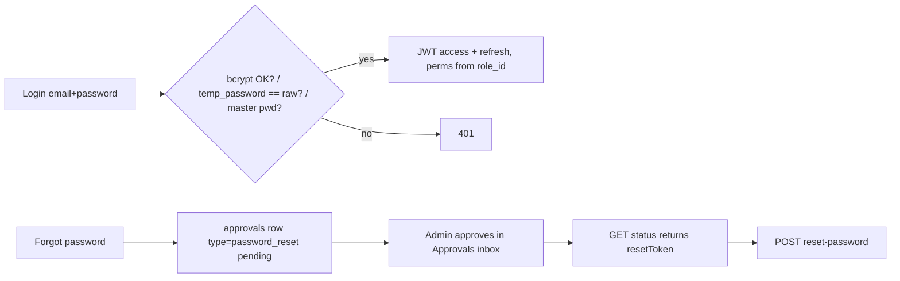
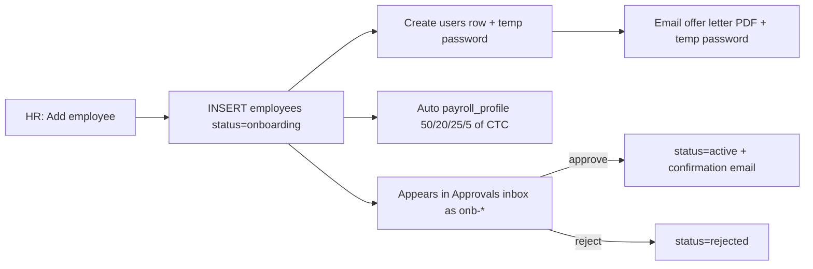
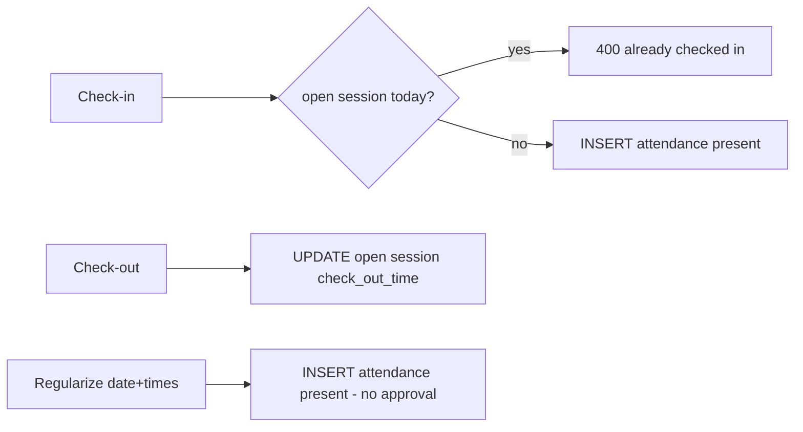
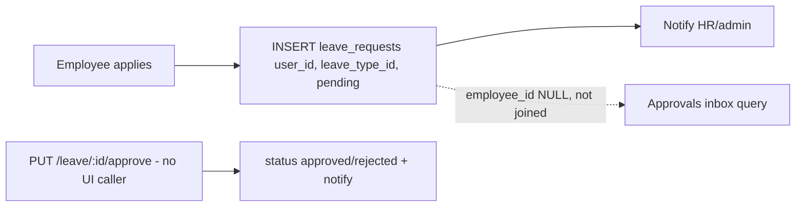
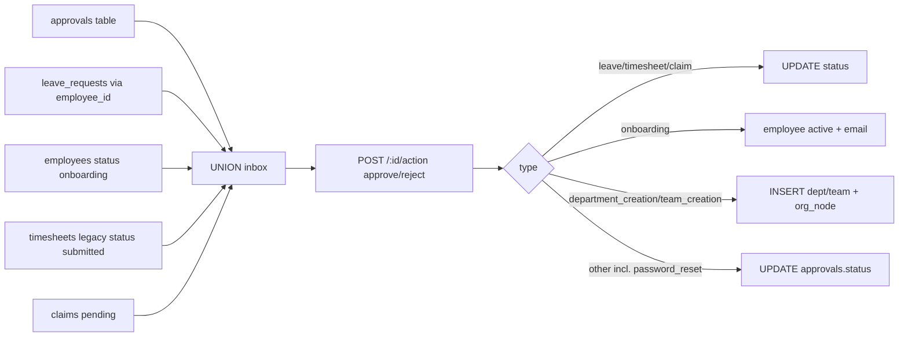
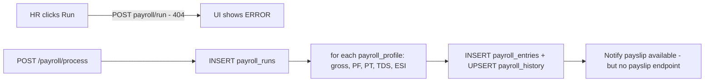

# Track A: Product, Features, Enterprise Gap

Target: `06dc08f` (branch `feat/nexus-brand-foundation`). Audit date: 2026-10-04. Read-only: no source files were modified.

Evidence labels:
- **[Confirmed]**: read in the cited file and line.
- **[Inferred]**: deduced from several confirmed facts, with the evidence stated.
- **[Assumption]**: a judgement call; the reason is given.
- **[Unknown]**: "Not enough evidence found in repository".

Line numbers refer to each file on its own, not to concatenated output.

Prior docs used only as leads: `docs/audit/PRODUCTION_READINESS_AUDIT.md`, `docs/nexus/NEXUS_AUDIT_AND_PLAN.md` (both at `83c1e84`), and `docs/audit/tools/route_contract_baseline.txt`. Each prior finding cited below was re-checked at HEAD.

---

## Phase 1. Product Discovery

### 1.1 Identity

| Aspect | Finding | Evidence |
|---|---|---|
| Product name | **Ozofi Nexus** ("Nexus"), tagline "Workforce Management Platform", made by **Ozofi** | `server/src/config/brand.ts:8-13`; `client/src/config/brand.ts` (BRAND, `description`: "workforce management platform for people, attendance, leave, payroll and approvals") [Confirmed] |
| Legacy names still in code | "EMS" (`server/package.json` description "EMS Backend API"; `app.ts:2`); "AURA" (`initDb.ts:445` tenant name `'AURA Default'`; `IntegrationsTab.tsx:36` API key prefix `aura_`, demo passwords `AURA_*_2026` at `initDb.ts:488-489`) | [Confirmed] |
| Problem solved | A single system of record for employee master data, plus self-service attendance, leave, timesheets, claims, a unified approvals inbox, and a monthly payroll run with Indian statutory deductions | Route mounts `server/src/app.ts:105-124` [Confirmed] |
| Positioning (as stated) | The README pitches a "robust, full-stack" EMS covering a dashboard, directory, attendance, leave, payroll, timesheets, reports, onboarding and JWT RBAC (`README.md`). The `docs/0x_*.md` files describe a much larger vision: geo-fencing, shift rosters, leave accrual and carry-forward, 360 feedback (`docs/03_attendance_and_time.md:18-36`, `docs/04_leave_and_absence.md:18-19`, `docs/05_performance_management.md:21`) | [Confirmed]. Most of that vision is **not implemented** (see Phase 10) |

### 1.2 Target users (from RBAC and seed code)

- **Role enum:** `super_admin`, `admin`, `hr`, `manager`, `employee` (`server/src/types/index.ts:12-18`) [Confirmed].
- **Seeded system roles:** `admin`, `hr`, `manager`, `employee`, with permission maps in `server/src/db/schema.ts:363-393`.
  - `super_admin` is added on every startup by `server/src/scripts/seedPermissions.ts:110-115` [Confirmed].
  - HR is seeded with `dashboard_type='admin'` (`schema.ts:450`). `authorize()` passes every `dashboard_type=admin` user unconditionally (`core/security/authorize.ts:93`), so **HR gets full admin-equivalent API access** [Confirmed].
- **Personas by UI route gating** (`client/src/App.tsx:59-129`, `components/layout/Sidebar.tsx:39-76`) [Confirmed]:
  - **Employee (ESS):** dashboard, profile, attendance, leave, timesheets, and "My Payroll".
  - **Manager (MSS):** adds Employees and Approvals.
  - **HR:** adds Onboarding, Hierarchy, Reports and full Payroll.
  - **Admin / super_admin:** adds Audit Log and Settings.
- **Target segment:** Indian SMBs. The evidence: seeded `max_employees 50` default (`schema.ts:32`), INR and `en-IN` formatting, Indian holidays, Indian statutory payroll (see 1.4), and a bulk-upload cap of 50 rows (`employees.service.ts:27`) [Inferred].

### 1.3 Business value delivered today

- **Employee master with onboarding.** Creating an employee also creates a login, emails an offer letter (PDF + HTML) with a temp password, and auto-creates a salary profile split 50/20/25/5 (`employees.service.ts:91-160`) [Confirmed].
- **Unified approvals inbox** across leave, onboarding, timesheet, claim, department/team creation and password reset (`approvals.repository.ts:9-123`, `approvals.service.ts:25-92`) [Confirmed].
- **One-click monthly payroll run** computing PF/PT/TDS/ESI per profile (`payroll.service.ts:200-254`) [Confirmed]. The UI button calls a non-existent endpoint (§2, Payroll).

### 1.4 India statutory signals

- **Payroll:**
  - `payroll_entries` has columns `pf_employee`, `esi_employee`, `professional_tax`, `tds` (`initDb.ts:29-41`).
  - Calculation is in `payroll.service.ts:216-223`.
  - `tax_regime` defaults to `'New'` (`payroll.service.ts:59`).
  - Compliance calendar: "PF Contribution Due" on the 15th and "Professional Tax Filing" on the 20th (`payroll.service.ts:161-180`) [Confirmed].
- **Offer letter:** amounts in INR; footer reads "Ozofi Technologies Private Limited • Bengaluru & Chennai" (`services/offer-letter/email.template.ts:202`) [Confirmed].
- **Holidays:** 2026 Indian holidays seeded (Republic Day, Holi, Diwali…) (`db/migration_v3.ts:160-171`) [Confirmed].
- **Nationality:** defaults to `'Indian'` (`migration_v3.ts:46`) [Confirmed].
- **Missing statutory identifiers:** there are no PAN, UAN, ESIC number or Aadhaar fields anywhere in schema scripts or modules. The only match for those terms is Sentry's PII scrub regex (`server/src/instrument.ts:18`) [Confirmed].

### 1.5 Tenancy

- **Schema is multi-tenant-shaped:** a `tenants` table (`schema.ts:23-36`), `tenant_id` on most tables (`schema.ts:91-225`), tenant-scoped `roles` (`schema.ts:58-67`), and `tenantId` in the JWT (`authorize.ts:33`) [Confirmed].
- **Operationally it is single-tenant:**
  - No module ever inserts into `tenants`, so there is no provisioning API [Confirmed by grep].
  - `users.email` is globally `UNIQUE` (`initDb.ts:71`) and login is by email alone (`auth.service.ts:15-16`), so one email cannot belong to two tenants [Confirmed].
  - `departments.name` is globally `UNIQUE` in the first-run script (`initDb.ts:149`) [Confirmed].
  - Employee IDs `EMP###` come from one global sequence (`employees.service.ts:80-89`) [Confirmed].
  - 37 literal `'tenant_default'` / `'default'` occurrences remain in `modules`, `services` and `core` (grep count). This matches the prior audit's H5 count, so it is **unchanged** [Confirmed].
  - The approvals queries accept `tenant_id IS NULL OR ''` (`approvals.repository.ts:10, 134, 164, 201`) [Confirmed].
- **Offer letters and emails always brand the employer as Ozofi**, whatever the tenant: "Welcome to Ozofi", IP owned by "Ozofi", signed "For Ozofi Technologies Private Limited" (`offer-letter/pdf.generator.ts:101, 208-210, 231`; `email.template.ts:79-85`; `emailService.ts:57, 213`). A second customer organisation would issue offer letters in Ozofi's name. [Confirmed]

### 1.6 Maturity classification: **MVP (late MVP, not yet Beta)**

| Criterion | Evidence |
|---|---|
| Core flows partly unwired | **18 client calls hit endpoints that do not exist** (`docs/audit/tools/route_contract_baseline.txt`, re-verified in §2). They include the payroll run button (`PayRuns.tsx:37` → `POST payroll/run`, while the server has `POST /payroll/process` at `payroll.routes.ts:26`), payslips, tax summary, and claims approval in Payroll |
| Placeholder or stub services | `PerformanceGoalsService.getGoals` returns `[]`; `PerformanceAnalyticsService` returns `{}`; `AuditExportService.exportToCSV` is a placeholder; `NotificationPreferencesService` is hard-coded; `/payroll/history/:id` returns `{payroll_history: []}` (`payroll.routes.ts:16-18`) |
| Mock UI | Announcements (`AnnouncementsWidget.tsx:5-19`), Assets (`profile/components/Assets.tsx:5-7`), Document Vault (`profile/components/Documents.tsx:5-20`), fake "OperationalStream" log (`payroll/components/OperationalStream.tsx:15-16`), hard-coded "recent reports" (`reports.controller.ts:121-125`), dead "Export PDF" and "Filter" buttons (`Reports.tsx:126-131`) |
| Security blockers still open at HEAD | Master password `admin123` / `Admin@123` for `admin@company.com` (`auth.service.ts:23-25`); payroll API has no authorization guard (`payroll.routes.ts:10-26`); plaintext temp passwords (`auth.service.ts:20`) |
| Schema not reproducible | Code writes `payroll_entries.payroll_run_id` (`payroll.repository.ts:81`) and `leave_requests.approved_by` / `updated_at` (`leaves.repository.ts:39`), but no repo script creates those columns. The repo acknowledges this in `server/db/baseline/README.md` ("the repository's schema scripts do not describe production") |
| Tests | 6 test files in total across client and server (`find … -name "*.test.ts*"`) |

**Justification.** The breadth of modules looks like Beta. But broken primary actions (running payroll, payslips), the authorization gaps, stubs, mock widgets and schema drift fail the Beta bar of "feature-complete for core flows and safe to trial with real data". [Assumption] This is based on conventional maturity definitions applied to the evidence above.

---

## Phase 2. Feature Inventory

**API base:** `/api/v1` (`client/src/services/api.ts:37-54`; `server/src/app.ts:105-124`).

**Auth model:**
- `authenticate` validates the JWT on almost every router.
- `authorize([...])` accepts role names or `module:action` strings (`authorize.ts:77-131`).
- `requireSelfOrAdmin` checks `?userId` / `:userId` against the role (`authorize.ts:179-212`).
- **Unless noted, an endpoint is guarded by `authenticate` only.**

**Dead server route files** (not imported anywhere; confirmed by grep):
- `modules/settings/settings.routes.ts`
- `modules/governance/governance.routes.ts`
- `modules/notifications/notifications.routes.ts`
- `modules/performance/performance.routes.ts`
- `modules/realtime/realtime.routes.ts`
- `modules/departments/departments.routes.ts` (the departments module is never mounted in `app.ts`)

The live routers are the `index.ts` compositions. [Confirmed]

### 2.1 Auth (server `auth`, client `auth`)

- **Purpose:** login, refresh, logout, profile, preferences, availability status, change password, and an admin-approved password reset.
- **Endpoints** (`auth.routes.ts:14-27`):
  - `GET /auth/repair-identity` is a disabled stub (`auth.controller.ts:124-126`).
  - `POST /auth/login`, `POST /auth/refresh`.
  - `POST /auth/forgot-password`, `GET /auth/forgot-password/status`, `POST /auth/reset-password`.
  - `POST /auth/logout`.
  - `GET|PUT /auth/me`, `PUT /auth/me/preferences`, `PUT /auth/status`, `PUT /auth/me/password`.
- **Client usage:**
  - Login: `LoginPage.tsx:56`, `hooks/index.ts:78`. Logout: `hooks/index.ts:86`.
  - Password: `ChangePasswordPage.tsx:33`; `ForgotPasswordModal.tsx:63, 112, 139, 179`.
  - Other: preferences `SettingsTab.tsx:21`, status `Dashboard.tsx:88`.
  - `GET /auth/me` is unused by the client [Confirmed].
- **Tables:** `users`, `roles`, `role_permissions`, `permissions`, `approvals` (reset requests use `type='password_reset'`, `auth.repository.ts:137-138`).
- **Dependencies:** approvals (reset approval), audit (login, logout and profile-update events, `auth.controller.ts:15, 72, 91`), realtime (status broadcast, `auth.controller.ts:109`).
- **Rules and risks [Confirmed]:**
  - Temp password is compared in plaintext (`auth.service.ts:20`).
  - Master-password backdoor (`auth.service.ts:23-25`). This is prior S1, **still open**.
  - The status endpoint returns `resetToken` without authentication (`auth.service.ts:207`), and the token is optional on reset (`auth.service.ts:246`). This is prior S2, **still open**.
  - Refresh does not compare against the stored token (`auth.service.ts:60-95`). This is prior H2, **still open**.
- **Missing:** MFA, SSO, lockout, password policy enforcement, email-delivered reset links.

### 2.2 Employees (server `employees`, client `employees`, `profile`, `onboarding`)

- **Purpose:** employee master data; sub-records for education, experience and emergency contacts; bulk CSV upload; account creation and offer letter.
- **Endpoints** (`employees.routes.ts:28-71`):
  - `GET /employees/check-email`, `GET /employees/roles`, `GET /employees/me`.
  - `GET /employees` (authorize includes `'employee'`, so effectively any user, line 47).
  - `POST /employees` (`admin|super_admin|hr|employees:manage`, line 50).
  - `GET|PUT /:id/education`, `GET|PUT /:id/experience`, `GET|POST /:id/emergency-contacts`. Reads have **no owner or tenant check** (`employees.controller.ts:62-65, 79-82, 96-99`); prior H6 is still open. Writes check ownership (`employees.controller.ts:67-74`).
  - `PUT /:id` (owner or HR/admin; restricted fields stripped for owners, `employees.controller.ts:41-60`).
  - `POST /bulk-upload` and `DELETE /:id` (manage).
- **Client usage:**
  - `EmployeeTable.tsx:98, 169, 216, 252`.
  - `AddEmployeeModal.tsx:224, 256, 301, 575`; `BulkUploadModal.tsx:102`.
  - `Onboarding.tsx:54, 104, 106`.
  - `Profile.tsx:71, 85, 101-103, 161, 184, 278, 307`.
  - Many dashboard widgets call `GET /employees` (`BirthdayWidget.tsx:14`, `NewHiresWidget.tsx:14`, etc.).
- **Tables:** `employees`, `users`, `roles`, `payroll_profiles`, `employee_education`, `employee_experience`, `employee_emergency_contacts`.
- **Dependencies:** auth (user creation), settings/RBAC (`ensureRoleExists`), payroll (profile auto-create), notifications, email/offer letter, approvals (onboarding).
- **Permissions:** see the endpoint list above. HR passes all `authorize` checks through the `dashboard_type` bypass (`schema.ts:450` + `authorize.ts:93`).
- **Delete is a hard delete of statutory records.** `DELETE /employees/:id` deletes the employee's `payroll_entries`, `payroll_history`, `leave_requests`, `claims`, `timesheets`, `performance_reviews` and documents (`employees.repository.ts:331-382`). Child deletes are not tenant-scoped (lines 337-351). It falls back to a soft delete only on error (lines 374-378). [Confirmed]
- **Missing:**
  - Offboarding / exit workflow. The `exit_date`, `exit_reason` and `last_working_day` columns exist (`migration_v3.ts:58-61`) but nothing in the services writes them.
  - Custom fields, document storage, employee self-service change requests, org-chart-driven reporting lines.
  - A probation confirmation job. Confirmation is only a one-off migration backfill (`migration_v3.ts:238-254`).

### 2.3 Onboarding (client `onboarding`; server uses employees and approvals)

- **Purpose:** a candidate list filtered by `status=onboarding|active`, and a create/edit modal.
- **Client:** `Onboarding.tsx:54-56, 104-106` calls `GET /employees?status=onboarding`, `GET /users`, `GET /reports/departments`, and `POST`/`PUT /employees`.
- **Server:** no dedicated module. "Onboarding" is just an employee status plus an approval (`approvals.repository.ts:61-74`, `approvals.service.ts:31-60`).
- **Missing:** checklists, tasks, document collection, e-signature, pre-boarding portal, background verification. The client copy "New hire checklists" (`FeatureControlTab.tsx:19`) has no backing feature [Confirmed].

### 2.4 Attendance (server `attendance`, client `attendance`)

- **Endpoints** (`attendance.routes.ts:22-34`):
  - `GET /attendance/today|history|weekly-hours` and `GET /summary/:userId` (all `requireSelfOrAdmin`).
  - `POST /check-in|check-out|regularize`.
- **Client:**
  - `Attendance.tsx:170, 285, 303, 308, 314`; `Dashboard.tsx:97, 126, 135`.
  - Profile `AttendanceTab.tsx:124-125`; `Timesheets.tsx:226`.
- **Tables:** `attendance`, `employees`, `users`.
- **Rules [Confirmed]:**
  - Multiple sessions per day are allowed. A new check-in is blocked only if a session is still open (`attendance.service.ts:46-47`).
  - Every check-in is stored as `status='present'` (`attendance.repository.ts:49-57`).
  - Overtime counts hours beyond 9 per session, display only (`attendance.repository.ts:76`).
  - **Regularization inserts a 'present' row immediately, with no approval** (`attendance.repository.ts:124-131`); the `reason` is accepted but discarded (`attendance.schema.ts:10-15`).
  - `half_day` and `absent` are shown in the UI (`AttendanceCalendar.tsx:17,30`, `AttendanceSummary.tsx:25`), but no server path ever writes those statuses, so those counts are always 0 [Inferred from all insert paths].
- **Missing:** geo-fencing, IP restriction, biometric or device integration, shifts and rosters, late-mark policy, absence auto-marking, holiday and weekly-off calendar, attendance-to-payroll (LOP) link.

### 2.5 Leave (server `leaves`, client `leave`)

- **Endpoints** (`leaves.routes.ts:20-38`):
  - `GET /leave/types`, `POST /leave/apply`, `GET /leave` and `GET /leave/requests`.
  - `PUT|DELETE /leave/requests/:id` and `PUT|DELETE /leave/:id`.
  - `GET /leave/balance` (`requireSelfOrAdmin`).
  - `PUT /leave/:id/approve`, which has **no permission guard**.
- **Client:** `ApplyLeave.tsx:39, 45, 54, 85, 97, 103`. **No client calls `PUT /leave/:id/approve`** (grep) [Confirmed].
- **Tables:** `leave_types`, `leave_requests`, `users`.
- **Rules [Confirmed]:**
  - Balance = `annual_quota` − approved calendar days (`end − start + 1`) in the start year (`leaves.repository.ts:69-84`). There is no accrual, carry-forward, proration, weekend or holiday exclusion, or half-day.
  - **Apply does not check the balance or overlapping requests** (`leaves.service.ts:16-32`, `leaves.repository.ts:9-15`).
  - Leave types are not tenant-filtered (`leaves.repository.ts:5`).
  - `GET /leave/requests` returns every request in the tenant to any user unless `userId` is passed (`leaves.repository.ts:18-35`).
  - Edit and delete are allowed only while `pending`, but there is **no ownership check** (`leaves.repository.ts:46-67`).
  - `approved_by` can come from the request body (`leaves.controller.ts:31`).
- **Inconsistent balance logic:** the profile view counts approved *requests*, not days (`analyticsService.ts:679-680`), while `/leave/balance` counts days (`leaves.repository.ts:72`) [Confirmed].
- **Broken approval path [Inferred]:**
  - `/leave/apply` inserts `user_id` and `leave_type_id` only (`leaves.repository.ts:10-14`).
  - The Approvals inbox selects leaves with `JOIN employees e ON l.employee_id = e.id` and reads `l.type` (`approvals.repository.ts:42-57`).
  - So newly applied leaves have a NULL `employee_id` and **never appear in the Approvals inbox**, and the leave UI has no approve action. New leave requests have no reachable approval path in the UI.

### 2.6 Timesheets (server `timesheets`, client `timesheet`)

- **Endpoints** (`timesheets.routes.ts:21-29`):
  - `GET /timesheets/week|history` (`requireSelfOrAdmin`) and `GET /pending`.
  - `PUT /:id/entries`, `PUT /:id/submit`, `PUT /:id/approve`. None of these has a permission guard.
- **Client:** `Timesheets.tsx:163, 209, 226, 287, 289, 1261`.
- **Missing endpoint:** `GET /timesheets` (`Timesheets.tsx:195`, history tab) does not exist; the server has `/history` [Confirmed].
- **Tables:** `timesheets`, `timesheet_entries`, `users`.
- **Rules:**
  - The weekly sheet is auto-created as `draft`. Submit is allowed from `draft|rejected` (`timesheets.repository.ts:45-52`).
  - Approve sets any status, with no state check (`timesheets.repository.ts:54-61`).
  - Projects are free text. The client injects "Protocol Verification (Attendance)" and "Core Operations / Engineering" rows (`Timesheets.tsx:231, 253-259`).
  - `saveTimesheetEntries` runs inside `withTransaction` but uses `pool` directly in the repository, so it is not actually transactional and has no tenant check (`timesheets.service.ts:28-44`, `timesheets.repository.ts:25-35`) [Confirmed].
- **Missing:** project/client master, billable flags, attendance reconciliation, approval routing to the actual manager.

### 2.7 Claims / Expenses (server `claims`, client inside `payroll`)

- **Endpoints** (`claims.routes.ts:12-15`): `POST /claims`, `GET /claims/employee/:employeeId`, `GET /claims`, `PUT /claims/:id/status`. None has a permission guard.
- **Client:**
  - `EmployeePayroll.tsx:71, 115` uses existing endpoints.
  - `payroll/sections/Approvals.tsx` uses **missing** endpoints: `GET claims/admin` (line 28), `PUT claims/:id/approve` (line 43), `PUT claims/:id/reject` (line 52).
  - Claims can still be approved through the unified Approvals inbox (`approvals.service.ts:63-64`).
- **Tables:** `claims`. The payroll "pending approvals" count reads a **different** table, `reimbursement_claims` (`payroll.repository.ts:61-64`), so the count never reflects real claims [Confirmed].
- **Rules:**
  - `employee_id` comes from the request body, so a user can file a claim for anyone (`claims.schema.ts:3-8`).
  - No category limits, receipts or attachments, policy checks, or payroll reimbursement linkage.

### 2.8 Approvals (server `approvals`, client `approvals`)

- **Endpoints** (`approvals.routes.ts:12-14`): `GET /approvals?status=`, `POST /approvals`, `POST /approvals/:id/action`. None has a permission guard.
- **Client:**
  - `Approvals.tsx:35, 53`.
  - `settings/components/ApprovalsTab.tsx:33, 49` calls missing endpoints (`GET /approvals/pending`, `PUT /approvals/:id/:action`). The component is **not mounted** in `Settings.tsx` (its imports are lines 4-12), so it is dead code [Confirmed].
- **Tables:** `approvals`, `leave_requests`, `employees`, `timesheets`, `claims`, `departments`, `teams`, `org_nodes`, `org_governance`.
- **Rules:**
  - Single step, with `approve` or `reject` only.
  - Managers and employees see only items where `employees.manager_id` or `requested_by` equals their employee ID (`approvals.repository.ts:13-16`). Everyone else sees all.
  - An `action` from any authenticated user is executed, including self-approval.
  - Department and team creation is executed on approve (`approvals.service.ts:65-88`).
- **Missing:** multi-level chains, delegation, SLA and escalation, configurable routing, comments.

### 2.9 Payroll (server `payroll`, client `payroll`)

- **Endpoints** (`payroll.routes.ts:12-26`). **None has a permission guard**: any authenticated employee can list every salary, edit salary profiles and run payroll.
  - `GET /payroll/employees`, `PUT /payroll/employees/:id`.
  - `GET /history/:employeeId` is a **stub** returning `[]`.
  - `GET /runs|activity|pending-approvals|live-summary|deadlines|tax-summary`.
  - `POST /process`.
- **Client calls with no server route [Confirmed]:**
  - `POST payroll/run` (`PayRuns.tsx:37`; the server has `/process`).
  - `GET payroll/tax-statutory/summary` (`TaxStatutory.tsx:32`; the server has `/tax-summary` with different keys).
  - `GET payroll/documents/bulk-payslips` (`DocumentsPayslips.tsx:53`).
  - `GET payroll/payslip/:id/monthly|yearly` (`DocumentsPayslips.tsx:76, 101`; `EmployeePayroll.tsx:92`).
  - `POST payroll/profiles` (`CreateProfileModal.tsx:22`).
  - `GET payroll/deadlines/latest` and `POST payroll/deadlines` (`payroll/sections/Approvals.tsx:29, 61`).
- **Server endpoints the client never calls:** `GET /payroll/runs`, `GET /payroll/deadlines`, `GET /payroll/tax-summary`, `POST /payroll/process` [Confirmed].
- **Unwired PDF code:** `utils/pdfGenerator.ts` (`generatePayslipPDF`, `getPayslipPDFBuffer`) exists but no route uses it [Confirmed].
- **Tables:** `payroll_profiles`, `payroll_runs`, `payroll_entries`, `payroll_history`, `employees`, `reimbursement_claims`.
- **Client-invented statutory figures [Confirmed]:** `TaxStatutory.tsx:48-51` computes employer PF, employer ESI, gratuity and bonus reserves in the browser with ad-hoc multipliers. There is no server basis.
- **Missing:**
  - Attendance and LOP integration, arrears, reimbursements in pay, loans (a `loans` table exists at `initDb.ts:83-89` but is unused).
  - Investment declarations (`investment_deadlines` at `initDb.ts:77-81` is unused).
  - Payslip delivery, bank file, ECR/Form 24Q/Form 16, F&F settlement, pay-run lock and approval, rerun protection (a new run ID every time, `payroll.service.ts:201`).

### 2.10 Performance (server `performance`; **no client module**)

- **Endpoints** (`performance/reviews/reviews.routes.ts:13-16`):
  - `GET /performance` and `PUT /performance/:id`: no permission guard.
  - `POST` (manager/hr/admin) and `DELETE` (admin).
- **Client:** no calls (grep). Reviews appear only read-only in the profile payload (`analyticsService.ts` `getEmployeeProfile`) [Confirmed].
- **Table:** `performance_reviews` (`migration_v3.ts:116-131`). Single rating 1–5, free-text goals.
- **Stubs:** `goals.service.ts` returns `[]`; `analytics.service.ts` returns `{}`; `ratings.service.ts` is just an average [Confirmed].
- **Missing:** review cycles, OKR/KPI goals, 360 feedback, calibration, 1:1s, PIPs. Any user can `PUT` any review in the tenant.

### 2.11 Documents (server `documents`; client inside `profile`)

- **Endpoints** (`documents.routes.ts:13-16`):
  - `GET /documents/:employeeId` (owner check only when the role is `employee`, `documents.service.ts:13-17`).
  - `POST /documents`.
  - `PUT /:id/verify` and `DELETE /:id` (HR/admin).
- **Client:** `Profile.tsx:200` posts **metadata only**, with a fabricated `filePath: uploads/<name>` and a browser `URL.createObjectURL` preview (`Profile.tsx:196-210`). There is no upload storage (no multer, S3 or Supabase storage; grep) [Confirmed].
- **Additional mock:** `profile/components/Documents.tsx` keeps files in local React state only [Confirmed].
- **Table:** `employee_documents` (`migration_v3.ts:68-81`).
- **Missing:** actual file storage, e-sign, letter templates, expiry alerts (`expires_at` exists but is unused).

### 2.12 Organization and Governance (server `organization`, `governance`; client `organization`)

- **Organization endpoints** (`organization.routes.ts:13-23`):
  - `GET /organization/team-status|departments|teams`.
  - `POST|PUT|DELETE /departments(/:id)` and `/teams(/:id)`, guarded by `adminOnly = authorize(['admin','super_admin','organization:manage','employees:manage'])` (line 11).
  - `POST` creates an **approval request**, not a department (`organization.service.ts:14-52`).
- **Governance endpoints** (`governance/index.ts:8-10` composes org-tree, sync and shared):
  - `GET /governance/tree|search|resolve/:nodeId`.
  - `POST /governance/sync` and `PUT /governance/:nodeId` (`admin|hr|super_admin`).
- **Client:** `useOrganizationData.ts:41-43, 91`, `useOrganizationForm.ts:87, 90, 111`, `OrganizationTree.tsx:261, 280`, `StructuralDeepDivePage.tsx:52-71`, `TeamStatusWidget.tsx:21`.
- **Tables:** `departments`, `teams`, `org_nodes`, `org_governance`, `approvals`. The tables `org_roles`, `employee_roles`, `org_resources` and `org_structural_audit` are created (`initDb.ts:207-250`) but have no service usage beyond a delete in `employees.repository.ts:341` [Confirmed].
- **Rules:** owner and ruler per node, with inheritance up the tree unless `is_inheritance_blocked` (`governance/shared/shared.service.ts:10-24`).
- **Missing:** legal entities, locations, cost centres as first-class objects (they exist only as free-text metadata in `useOrganizationForm.ts:62-71`), positions and headcount planning.

### 2.13 Reports / Dashboard (server `reports` + `services/analyticsService.ts`; client `dashboard`, `reports`)

- **Endpoints** (`reports.routes.ts:10-23`): `GET /reports/admin|manager|employee|dashboard|dashboard/manager|dashboard/employee|departments|team|profile/:employeeId|analytics|summary`. **None has a role guard.**
- **Cross-tenant data leak [Confirmed]:**
  - `/reports/profile/:employeeId` returns name, CTC, bank account, compensation, documents, reviews and emergency contacts for **any employee ID, with no tenant filter** (`reports.controller.ts:34-40`; `analyticsService.ts:660` `WHERE e.id = $1`).
  - `/reports/dashboard/manager` and `/employee` take `userId` from the query string (`reports.controller.ts:13-25`).
- **Client:**
  - `Dashboard.tsx:107-109`, `Reports.tsx:62`, `MySpaceProfile.tsx:52, 76`, `Profile.tsx:100, 165, 207`, `DeptTreeWidget.tsx:179`, `Onboarding.tsx:56`.
  - **Missing endpoint:** `GET /reports/holidays` (`OrgCalendarWidget.tsx:16`).
- **Mock or hard-coded:**
  - `recentReports` (`reports.controller.ts:121-125`).
  - Announcements widget (`AnnouncementsWidget.tsx:6-19`).
  - "Export PDF" and "Filter" buttons with no handler (`Reports.tsx:126-131`).
- **Rule:** "late arrival" means check-in at 10:00 or later (`analyticsService.ts:670`).
- **Missing:** report builder, scheduling, CSV/Excel/PDF export, saved filters, people analytics.

### 2.14 Notifications and Realtime (server `notifications`, `realtime`; client `Topbar`, `EmployeeTable`)

- **Notification endpoints** (`notifications/core/core.routes.ts:10-12`): `GET /notifications`, `PUT /read-all`, `PUT /:id/read`. The last is unused by the client.
- **Realtime endpoint:** `GET /realtime/stream` (SSE, token in the query string, `connections.routes.ts:7`; client `EmployeeTable.tsx:120-126`).
- **Triggers:** leave applied, approved or rejected; payroll processed; employee created; timesheet submitted or approved; role updated; account created (`notifications/index.ts:18-26`). Realtime carries only availability-status broadcasts (`auth.controller.ts:109`; `realtime.listeners.ts:7-9`) [Confirmed].
- **Preferences stub:** `NotificationPreferencesService` is hard-coded (`preferences.service.ts`) [Confirmed].
- **Channels:** in-app plus inline SMTP email (`services/emailService.ts:131`). No SMS, push, Slack or Teams delivery. The Slack and Teams webhook fields in Settings are stored only (`IntegrationsTab.tsx:159-165`) [Confirmed].

### 2.15 Audit (server `audit`, client `audit`)

- **Endpoint:** `GET /audit-logs` (`audit/read/read.routes.ts:9`). **Authenticate only**: any employee can read the tenant's audit trail. The UI restricts the page to admins (`App.tsx:118-123`) but the API does not.
- **Client:** `AuditLogPage.tsx:27`.
- **What is audited:** only login, logout and profile update publish `AUDIT_LOG_REQUESTED` (`auth.controller.ts:15, 72, 91`). The only `INSERT INTO audit_logs` is `audit/write/write.repository.ts:7`. Salary edits, payroll runs, approvals, role changes and deletions are **not audited** [Confirmed].
- **Export stub:** `AuditExportService` (`audit/export/export.service.ts`) [Confirmed].

### 2.16 Settings / RBAC / Users (server `settings`, `users`, `workspace`; client `settings`)

- **Settings endpoints** (`settings/index.ts:9-15` with `authorize(['admin','super_admin','hr','settings:manage'])` at line 11):
  - RBAC: `GET /settings/permissions`, `GET|POST /roles`, `PUT|DELETE /roles/:id`, `PUT /roles/:id/permissions` (`rbac.routes.ts:7-12`).
  - Config: `GET|PUT /config`, `POST /test-email` (`configuration.routes.ts:7-9`).
  - Users: `GET|POST /users`, `POST /users/:id/send-welcome|reset-password`, `GET /users/:id/temp-password`, `PUT /users/:id/password|role|status`, `DELETE /users/:id` (`user-assignments.routes.ts:7-15`).
- **Users module:** `GET /users`, `PUT /users/profile`. The profile `id` is taken from the request body, so any user can edit any user in the tenant (`users.controller.ts:7-11`) [Confirmed].
- **Workspace:** `GET /workspace` (`workspace.routes.ts:12`) returns the org name and logo (`workspace.service.ts:16-21`).
- **Client:** `Settings.tsx:55-58`, `RolesTab.tsx:55-104`, `UsersTab.tsx:46-325`, the General, Email, Security, Features, Branding, Integrations and Policies tabs (`PUT /settings/config`), and `useWorkspace.ts:22`.
- **Config is stored, never enforced [Confirmed by grep of server for `mfa|max_login_attempts|session_timeout|webhook|slack|api_key|sso`]:**
  - Security tab: MFA toggle, password length, lockout, inactivity timeout.
  - Feature flags: `module_*` and `feat_*` keys, which are never read anywhere in the client (grep).
  - Integrations: API key generated client-side with `Math.random` (`IntegrationsTab.tsx:33-41`), webhooks, Slack, Teams.
- **Employee dashboard 403 [Inferred]:** `PoliciesWidget.tsx:32` (employee dashboard) calls `GET /settings/config`, which is restricted to admin/HR/`settings:manage`.
- **Two conflicting permission vocabularies are seeded:** `employees:view/create/update` (`schema.ts:306-360`) vs `employees:read/manage` (`seedPermissions.ts:26-69`). Routes check the latter (`employees.routes.ts:47-71`).

### 2.17 Summary table

| Module | Status | Completion % | Risks | Missing Features |
|---|---|---|---|---|
| Auth | Working, insecure | 60% (all routes wired; reset flow and backdoor unsafe; no MFA/SSO) | Master password, token leak via status endpoint, plaintext temp passwords | MFA, SSO, lockout, policy enforcement |
| Employees / Core HR | Working | 65% (CRUD and sub-records wired; bulk import; hard delete; no custom fields) | Hard-deletes statutory records; unguarded sub-record reads; cross-tenant child delete | Offboarding, custom fields, change requests, history/versioning |
| Onboarding | Thin | 30% (status flag + offer email + approval; no checklist UI or backend) | Offer letter always says "Ozofi" | Checklists, tasks, document collection, e-sign, pre-boarding |
| Attendance | Basic | 45% (check-in/out/history wired; regularize unapproved; half_day/absent never set) | Self-regularization without approval inflates presence | Geo/IP, biometric, shifts, policies, LOP link |
| Leave | Partially broken | 40% (apply/list/balance wired; no balance check; approve not reachable from UI for new requests) | Leaves cannot be approved via UI; any user can edit or delete others' pending leave | Accrual, carry-forward, half-day, holidays/weekends, policies by grade |
| Timesheets | Working, basic | 55% (week/submit/approve wired; history tab calls missing endpoint) | Unguarded approve; non-transactional save | Project master, billable, reconciliation |
| Claims | Partially broken | 35% (submit/list wired; Payroll approval tab calls 3 missing endpoints; pending count reads wrong table) | Claim on behalf of anyone; unguarded status change | Limits, receipts, policy, payout in payroll |
| Approvals | Working, single-level | 50% (inbox + action wired; Settings tab dead; leaves/timesheets from new flows not joined) | Anyone can approve anything, including own requests and password resets | Multi-level chains, delegation, SLA, routing rules |
| Payroll | **UI largely broken** | 30% (calc engine exists; run, payslip, tax and deadline UI call 9 missing endpoints; history stub) | No authorization on salary data or payroll run; simplified statutory math; no LOP | Payslips, statutory filings, declarations, F&F, bank files, run locking |
| Performance | Backend-only stub | 15% (review CRUD API; no client; goals/analytics stubs) | Any user can edit any review | Cycles, OKRs, 360, calibration |
| Documents | Mock storage | 20% (metadata API only; client fakes file path) | Users believe documents are stored | File storage, e-sign, expiry alerts, letter generation |
| Organization / Governance | Working | 60% (dept/team via approval; org tree, owner/ruler inheritance) | Several created tables unused | Entities, locations, cost centres, positions |
| Reports / Dashboard | Working, partly mock | 45% (dashboards from live SQL; announcements and recent reports hard-coded; export buttons dead; holidays endpoint missing) | Cross-tenant profile leak (`/reports/profile/:id`) | Export, builder, scheduling, people analytics |
| Notifications / Realtime | Basic | 50% (in-app + email for main events; prefs stub; SSE for status only) | Token in query string | Preferences, push, SMS, chat integrations |
| Audit | Minimal | 20% (3 auth events only; export stub; API readable by all) | False sense of compliance | Entity-level audit of HR/payroll changes, export, retention |
| Settings / RBAC | UI-rich, enforcement-poor | 45% (roles, permissions, users, config wired; security/feature/integration settings not enforced) | HR has admin bypass; two permission vocabularies | Enforced policies, SSO/MFA config, API keys, webhooks |

**Client calls to non-existent endpoints (18):**
- `/approvals/pending`, `PUT /approvals/:id/:action`.
- `/claims/admin`, `PUT /claims/:id/approve|reject`.
- `/payroll/deadlines/latest`, `POST /payroll/deadlines`, `/payroll/documents/bulk-payslips`, `/payroll/payslip/:id/monthly` (×2), `/payroll/payslip/:id/yearly`, `/payroll/tax-statutory/summary`, `POST /payroll/profiles`, `POST /payroll/run`.
- `/reports/holidays`, `GET /timesheets`.
- Plus the 2 dynamic organization calls that resolve to existing routes.

This is identical to `route_contract_baseline.txt`, so **unchanged since Release 0** [Confirmed].

**Server endpoints with no UI caller:**
- `GET /auth/me`, `PUT /leave/:id/approve`.
- All `/performance` routes.
- `GET /documents/:employeeId`, `PUT /documents/:id/verify`, `DELETE /documents/:id`.
- `GET /payroll/runs|deadlines|tax-summary`, `POST /payroll/process`.
- `GET /reports/analytics|team|admin|manager|employee`.
- `PUT /notifications/:id/read`, `GET /governance/search`, `POST /approvals`.

[Confirmed by cross-referencing the client grep against the route files.]

---

## Phase 9. Enterprise Readiness Assessment

| Capability | What exists (evidence) | Rating /10 | Justification |
|---|---|---|---|
| Multi-tenancy | `tenants` table and `tenant_id` columns (`schema.ts:23-225`); JWT carries `tenantId` (`authorize.ts:33`); `enforceTenantIsolation` is defined (`authorize.ts:133-153`) but used by no route (grep). No tenant provisioning; global unique email (`initDb.ts:71`); 37 default-tenant fallbacks; cross-tenant read at `analyticsService.ts:660` | 3 | The shape exists, but isolation is not enforced and a second tenant cannot be onboarded |
| SSO | None. No SAML, OIDC or OAuth code (grep) | 0 | Not present |
| MFA | UI toggle `mfa_enabled` only (`SecurityTab.tsx`, `Toggle('MFA Enforcement'…)`); nothing enforces it on the server (grep) | 1 | The cosmetic setting is misleading |
| Audit trails | `audit_logs` table (`schema.ts:234-246`); only login, logout and profile update are logged (`auth.controller.ts:15, 72, 91`); API readable by any user (`read.routes.ts:8-9`); export stub | 2 | No coverage of payroll, salary, approvals or RBAC changes |
| Workflow engine | None. Hard-coded `if/else` on `type` (`approvals.service.ts:29-91`); in-process event bus with 7 event types (`core/events/eventTypes.ts:1-9`) | 2 | No configurable workflows |
| Custom fields | None. Free-form `metadata JSONB` only on departments, teams and approvals (`initDb.ts:152, 164`; `schema.ts:183`) | 1 | No admin-defined fields on employees |
| Approval chains (multi-level?) | **Single level only**: one `actioned_by` per approval (`schema.ts:185-186`), and actions jump straight to a final status (`approvals.service.ts:27`). The `approvals:manage_workflows` permission is seeded (`schema.ts:321`) but nothing uses it | 2 | No chains, delegation or escalation |
| Reporting engine | Fixed SQL dashboards (`analyticsService.ts:70-360`); no builder; hard-coded "recent reports" | 3 | Read-only canned dashboards |
| Data export (CSV/PDF/Excel?) | CSV **import** only (`BulkUploadModal.tsx:26-102`); offer-letter PDF via PDFKit (`offer-letter/pdf.generator.ts`); payslip PDF util unused (`utils/pdfGenerator.ts`); Reports "Export PDF" button has no handler (`Reports.tsx:129-131`); audit CSV export stub. No Excel | 2 | No working user-facing export |
| Data retention | Soft-delete columns exist (`schema.ts:97, 112, 199`), but employee delete is a hard delete cascading payroll and leave history (`employees.repository.ts:331-382`); leave delete is hard (`leaves.repository.ts:61-67`); `audit:cleanup` permission seeded (`schema.ts:354`) with no implementation; no retention jobs (no scheduler; prior audit confirms "no queue/cron") | 1 | Destroys records that statute requires keeping (EPF and Income-tax record keeping) [Assumption: Indian statutory retention norms] |
| Compliance: GDPR / DPDP | No consent capture, data-subject export, erasure workflow or purpose tagging (grep). Positive: Sentry scrubs PII keys (`instrument.ts:18`). Bank account stored in plaintext (`employees.bank_account_number` at `initDb.ts:308`; `payroll_profiles.bank_account` at `initDb.ts:20`). Plaintext `temp_password` (`initDb.ts:290, 495`) | 1 | No DPDP Act 2023 or GDPR controls |
| Compliance: statutory payroll (India) | PF 12% of basic, PT ₹200 flat, TDS 5%/15% bands, ESI 0.75% (`payroll.service.ts:216-223`); deadline calendar (`payroll.service.ts:161-180`). Missing: PF wage ceiling, employer contributions server-side, state PT slabs, real TDS slabs and regime logic, LWF, gratuity, Form 16/24Q/ECR, PAN/UAN fields | 2 | Indicative arithmetic, not compliant payroll (see Business Rules) |

**Weighted overall: about 1.7/10.** [Assumption] This is the unweighted mean of the 11 rows above.

---

## Phase 10. Product Gap Analysis

The competitor columns are **[Assumption: public product knowledge]**: general, well-known capability tiers, not verified against current vendor documentation. Legend: ● strong or native, ◐ partial or add-on, ○ absent. "This product" cites code.

| Capability | This product (evidence) | Zoho People | Darwinbox | Keka | BambooHR | Workday | SAP SF |
|---|---|---|---|---|---|---|---|
| Core HR / employee master | ◐ CRUD, education, experience, emergency contacts (`employees.routes.ts`); no custom fields or history | ● | ● | ● | ● | ● | ● |
| ESS / MSS | ◐ profile, attendance, leave, timesheet self-service; manager inbox filter (`approvals.repository.ts:13-16`) | ● | ● | ● | ● | ● | ● |
| Attendance with geo / biometric | ○/◐ web check-in only (`attendance.repository.ts:49-57`); no geo, IP or biometric | ● | ● | ● | ◐ | ● | ● |
| Shifts / rosters | ○ none (docs only: `docs/03_attendance_and_time.md:21-24`) | ● | ● | ● | ○ | ● | ● |
| Leave policies / accrual | ○/◐ fixed annual quota, calendar days, no accrual or carry-forward (`leaves.repository.ts:69-84`) | ● | ● | ● | ● | ● | ● |
| Payroll + statutory (India) | ◐ simplified PF/PT/TDS/ESI calc; UI run broken (`PayRuns.tsx:37`); no filings | ● (Zoho Payroll) | ● | ● | ○ (US-centric) | ● | ● |
| Expense / claims | ◐ submit and approve, no limits or receipts (`claims.*`) | ● (Zoho Expense) | ● | ● | ◐ | ● | ● |
| Performance / OKR / 360 | ○ API-only single review, no UI; goals stub (`performance/goals/goals.service.ts`) | ● | ● | ● | ◐ | ● | ● |
| Recruitment / ATS | ○ none (no candidate or requisition tables; "Onboarding" is an employee status) | ● (Zoho Recruit) | ● | ● | ● | ● | ● |
| Onboarding / offboarding | ◐ onboarding = offer email + approval (`employees.service.ts:113-146`); ○ offboarding (delete only) | ● | ● | ● | ● | ● | ● |
| LMS | ○ none | ◐ | ● | ◐ | ○ | ● | ● |
| Compensation planning | ○ none (static salary profile) | ◐ | ● | ◐ | ◐ | ● | ● |
| Helpdesk / case management | ○ none | ● | ● | ◐ | ○ | ● | ◐ |
| Surveys / engagement | ○ none | ● | ● | ● | ● | ● | ● |
| Analytics / people analytics | ◐ fixed dashboards (`analyticsService.ts`); no export | ◐ | ● | ◐ | ◐ | ● | ● |
| Mobile app | ○ none (web SPA only; no native or PWA manifest found in the client `modules`) | ● | ● | ● | ● | ● | ● |
| Integrations / API / webhooks | ○ settings fields only, not implemented (`IntegrationsTab.tsx:33-41`); email SMTP only | ● | ● | ● | ● | ● | ● |
| Workflow builder | ○ hard-coded approvals (`approvals.service.ts:29-91`) | ● | ● | ◐ | ◐ | ● | ● |
| Custom fields | ○ none | ● | ● | ● | ● | ● | ● |
| SSO / MFA | ○ (MFA toggle not enforced) | ● | ● | ● | ● | ● | ● |
| Multi-entity / multi-country | ○ single tenant, India-only math, no legal-entity model | ◐ | ● | ◐ | ◐ | ● | ● |
| Org chart / governance | ● (relative strength) org tree with owner/ruler inheritance (`governance/shared/shared.service.ts:10-24`) | ● | ● | ● | ● | ● | ● |

**Top missing enterprise capabilities, ranked by business impact** [Assumption]. The ranking weighs revenue-blocking, compliance and data-loss risk for the Indian SMB segment identified in 1.2:

1. **Working, authorized, compliant payroll.** The UI is wired to 9 missing endpoints and the API has no authorization; payslips, LOP, PF ceiling, state PT and real TDS are missing. Payroll is the main reason Indian SMBs buy Keka or Darwinbox.
2. **Enforced RBAC and tenant isolation, plus tenant provisioning.** These are prerequisites to selling to a second customer (§1.5).
3. **Leave policy engine:** accrual, carry-forward, holiday and weekend-aware counting, half-day, balance validation, and a working approval path (§2.5).
4. **Statutory-grade data retention and offboarding:** soft delete, an exit workflow, F&F (`employees.repository.ts:331-382`).
5. **SSO and enforced MFA.**
6. **Configurable multi-level approval workflows.**
7. **Audit trail coverage of HR and payroll changes**, with export.
8. **Document storage and e-sign** (documents are currently faked).
9. **Attendance policy:** shifts, geo/IP, regularization approval, late marks, plus the LOP link to payroll.
10. **Recruitment/ATS and performance (OKR/360)** for suite parity.
11. **Mobile app / PWA** for attendance and ESS.
12. **Integrations:** a public API, webhooks, and Slack/Teams delivery.

---

## Business Rules

| # | Rule (plain language) | Enforced in | Notes |
|---|---|---|---|
| BR-1 | Leave balance per type = annual quota − approved calendar days, inclusive, for leaves starting in the selected year | `leaves.repository.ts:69-84` (`getLeaveBalance`) | No accrual, carry-forward or proration. Weekends and holidays are counted |
| BR-2 | The profile view's leave balance counts approved **requests**, not days | `analyticsService.ts:679-683` | Contradicts BR-1 [Confirmed] |
| BR-3 | Default leave types: Casual 12, Sick 10, Earned 15 (default tenant) | `schema.ts:559-565` | Staging seeds its own (`scripts/staging/seed.ts:83`) |
| BR-4 | A leave application is accepted with no balance, overlap or date-order validation | `leaves.schema.ts:7-12`, `leaves.service.ts:16-32` | Only type and dates are required |
| BR-5 | Only pending leaves can be edited or deleted. There is no owner check | `leaves.repository.ts:46-67` | |
| BR-6 | Leave approve/reject accepts only `approved` / `rejected`, and the applicant is notified | `leaves.schema.ts:21-24`, `leaves.service.ts:38-52` | No permission check on the route (`leaves.routes.ts:36`) |
| BR-7 | Attendance: one open session at a time per day, unlimited sessions per day | `attendance.service.ts:42-57` | |
| BR-8 | Every check-in and regularization is recorded as `present`. Regularization takes effect immediately, without approval | `attendance.repository.ts:49-57, 124-131` | |
| BR-9 | Overtime = session hours beyond 9 (display only) | `attendance.repository.ts:76` | Not paid in payroll |
| BR-10 | Late arrival = check-in at hour ≥ 10 (profile analytics) | `analyticsService.ts:670` | Hard-coded, not a policy |
| BR-11 | Probation end = join date + 90 days; employees past probation are auto-confirmed (one-off migration backfill only) | `migration_v3.ts:238-254` | Not an ongoing job |
| BR-12 | New employee salary split: Basic 50%, HRA 20%, Allowances 25%, Bonus 5% of monthly CTC (CTC ÷ 12) | `employees.service.ts:149-158` | |
| BR-13 | Gross = basic + HRA + allowances + bonus + overtime | `payroll.service.ts:216` | |
| BR-14 | PF (employee) = 12% of basic, **no ₹15,000 wage ceiling** | `payroll.service.ts:217` (also lines 24, 118, 192) | Employer PF computed only in the client (`TaxStatutory.tsx:48`) |
| BR-15 | Professional Tax = ₹200/month if annual CTC > ₹1,80,000, else 0. No state slabs | `payroll.service.ts:218` | |
| BR-16 | TDS = 15% of gross if CTC > ₹10L; 5% if CTC > ₹5L; else 0. Tax regime is ignored | `payroll.service.ts:219` (live summary at 120). The tax summary uses 15% of **basic** (line 194), which is inconsistent | Not Income-tax-Act slab-based [Confirmed] |
| BR-17 | ESI (employee) = 0.75% of gross if annual CTC < ₹2,52,000 | `payroll.service.ts:220` | Tax summary reports ESI as 0 (`payroll.service.ts:188, 197`). The ESI test should be on monthly gross ≤ ₹21,000 [Assumption: ESIC norms] |
| BR-18 | Net = gross − (PF + PT + TDS + ESI); each run inserts a new `payroll_runs` row and upserts `payroll_history` per employee, month, year and tenant | `payroll.service.ts:200-254`; `payroll.repository.ts:87-99` | Re-running a month creates duplicate `payroll_entries` (new run ID each time, line 201) |
| BR-19 | Compliance deadlines: PF on the 15th, PT on the 20th, "IT Return Sync" on the last day of the current month | `payroll.service.ts:138-180` | |
| BR-20 | Approval routing: managers and employees see items where they are the employee's `manager_id` or the requester; admin and HR see all. Single-step approve/reject | `approvals.repository.ts:13-16`; `approvals.service.ts:25-92` | No permission check on actions (`approvals.routes.ts:14`) |
| BR-21 | Approving onboarding sets the employee `active` and emails a confirmation; rejecting sets `rejected` | `approvals.service.ts:31-60` | |
| BR-22 | Department and team creation require approval. On approve, the dept/team, org node and governance owner are created atomically | `organization.service.ts:14-52`; `approvals.repository.ts:140-181` | Dept code is auto-generated from the name + random 3 digits (`approvals.repository.ts:169`) |
| BR-23 | Password reset requires admin approval of a `password_reset` approval | `auth.service.ts:141-256`; `auth.repository.ts:137-138` | Token returned by an unauthenticated status endpoint (line 207) |
| BR-24 | Claims: amount, category and description; status `pending` → `approved` / `rejected`. **No claim limits** | `claims.schema.ts:3-11`; `claims.repository.ts:4-28` | No receipts and no payroll linkage |
| BR-25 | Timesheet lifecycle: draft → submitted (from draft or rejected) → any status on approve; total = sum of 7 day columns | `timesheets.repository.ts:45-61`; `timesheets.service.ts:28-44` | |
| BR-26 | Offer letter: issued automatically on employee creation, valid 7 days; 3-month probation (or internship); 30-day notice; CTC or monthly stipend for interns; employer always "Ozofi" | `employees.service.ts:124-146`; `offer-letter/pdf.generator.ts:40-47, 205-210, 231`; `offer-letter/utils.ts:89-101` | Default notice is 30 days (`migration_v3.ts:57`) |
| BR-27 | New login accounts get a random 10-character temp password, emailed with the offer letter | `employees.service.ts:113-118` | `Math.random` based |
| BR-28 | Bulk upload is capped at 50 rows. Duplicate emails in the batch or the DB are skipped | `employees.service.ts:27, 311-414` | The client still says "up to 500 rows" (`BulkUploadModal.tsx:352`) |
| BR-29 | Employee delete hard-deletes all HR and payroll history; on failure it soft-deletes with status `terminated` | `employees.repository.ts:331-382` | |

---

## Changes vs prior audit (`83c1e84`) re-verified at HEAD

All of the following were verified in source at HEAD.

**Still open:**
- S1 master password (`auth.service.ts:23-25`).
- S2 reset-token exposure (`auth.service.ts:207, 246`; `approvals.routes.ts:14` unguarded).
- H1 plaintext temp passwords (`auth.service.ts:20`).
- H2 refresh not checked against the DB (`auth.service.ts:60-95`).
- H4 `initDb` resets the admin password (`initDb.ts:449-466`).
- H5 37 default-tenant fallbacks.
- H6 unguarded sub-record reads (`employees.controller.ts:62-99`).
- The 18 unmatched client calls (`route_contract_baseline.txt`).

**New since then:**
- `GET /api/v1/workspace` and the Ozofi Nexus branding config (`config/brand.ts`, `workspace.*`).

**Not previously highlighted (found in this track):**
- Leaves applied through `/leave/apply` cannot reach the Approvals inbox (§2.5).
- The payroll pending-claims count reads the wrong table (§2.7).
- Employee delete destroys payroll history (BR-29).
- `/reports/profile/:id` has no tenant filter (§2.13).
- Offer letters are hard-coded to the Ozofi employer (§1.5).

---

## Files reviewed

**Root and deploy:** `README.md`, `render.yaml`.

**Docs:**
- `docs/audit/AUDIT_PROGRESS.md`, `docs/audit/PRODUCTION_READINESS_AUDIT.md` (headings and §6 table)
- `docs/audit/tools/route_contract_baseline.txt`
- `docs/nexus/NEXUS_AUDIT_AND_PLAN.md` (headings and §A–B)
- `docs/03_attendance_and_time.md`, `docs/04_leave_and_absence.md`, `docs/05_performance_management.md`, `docs/10_technical_handover_guide.md` (grep excerpts)

**Server core, config, DB and scripts:**
- `server/package.json`
- `server/src/app.ts`, `server/src/index.ts`, `server/src/initDb.ts`, `server/src/instrument.ts` (grep)
- `server/src/config/brand.ts`, `server/src/config/env.ts` (grep)
- `server/src/db/schema.ts`, `server/src/db/migration_v3.ts`
- `server/src/scripts/phase2_migrations.ts`, `server/src/scripts/seedPermissions.ts` (lines 1-120)
- `server/scripts/db-setup.ts`, `server/scripts/staging/seed.ts` (grep)
- `server/db/baseline/README.md`, `server/db/baseline/diagnostics.sql` (lines 90-140)
- `server/src/core/security/authorize.ts`, `server/src/core/security/jwt.service.ts` (grep)
- `server/src/core/events/eventTypes.ts`, `server/src/types/index.ts` (grep)

**Server modules:**
- **Auth:** `auth/auth.routes.ts`, `auth/auth.service.ts`, `auth/auth.controller.ts` (excerpts), `auth/auth.repository.ts` (grep)
- **Employees:** `employees/employees.routes.ts`, `employees/employees.service.ts` (excerpts), `employees/employees.controller.ts` (lines 40-120), `employees/employees.repository.ts` (lines 328-385 + grep), `employees/employees.submodels.ts` (grep)
- **Attendance:** `attendance/attendance.routes.ts`, `attendance/attendance.service.ts`, `attendance/attendance.repository.ts`, `attendance/attendance.schema.ts`, `attendance/attendance.controller.ts` (grep)
- **Leaves:** `leaves/leaves.routes.ts`, `leaves/leaves.service.ts`, `leaves/leaves.repository.ts`, `leaves/leaves.controller.ts`, `leaves/leaves.schema.ts`
- **Timesheets:** `timesheets/timesheets.routes.ts`, `timesheets/timesheets.service.ts`, `timesheets/timesheets.repository.ts`
- **Payroll:** `payroll/payroll.routes.ts`, `payroll/payroll.service.ts`, `payroll/payroll.repository.ts`, `payroll/payroll.schema.ts`
- **Claims:** `claims/claims.routes.ts`, `claims/claims.service.ts`, `claims/claims.repository.ts`, `claims/claims.schema.ts`, `claims/claims.controller.ts`
- **Approvals:** `approvals/approvals.routes.ts`, `approvals/approvals.service.ts`, `approvals/approvals.repository.ts`, `approvals/approvals.schema.ts`
- **Performance:** `performance/index.ts`, `performance/performance.routes.ts`, `performance/reviews/reviews.routes.ts`, `performance/reviews/reviews.service.ts`, `performance/reviews/reviews.repository.ts`, `performance/goals/goals.service.ts`, `performance/ratings/ratings.service.ts`, `performance/analytics/analytics.service.ts`
- **Documents:** `documents/documents.routes.ts`, `documents/documents.service.ts`, `documents/documents.schema.ts`, `documents/documents.repository.ts` (grep)
- **Organization:** `organization/organization.routes.ts`, `organization/organization.service.ts`, `organization/organization.repository.ts` (grep)
- **Governance:** `governance/index.ts`, `governance/governance.routes.ts`, `governance/org-tree/org-tree.routes.ts`, `governance/sync/sync.routes.ts`, `governance/shared/shared.routes.ts`; `org-tree.service.ts`, `shared.service.ts`, `sync.repository.ts` (grep)
- **Notifications:** `notifications/index.ts`, `notifications/core/core.routes.ts`, `notifications/notifications.routes.ts`, `notifications/channels/channels.service.ts`, `notifications/preferences/preferences.service.ts`, `notifications/templates/templates.service.ts` (grep)
- **Realtime:** `realtime/index.ts`, `realtime/realtime.routes.ts`, `realtime/connections/connections.routes.ts`, `realtime/realtime.listeners.ts` (grep)
- **Reports:** `reports/reports.routes.ts`, `reports/reports.controller.ts`
- **Audit:** `audit/index.ts`, `audit/audit.listeners.ts`, `audit/read/read.routes.ts`, `audit/read/read.repository.ts`, `audit/read/read.controller.ts`, `audit/export/export.service.ts`, `audit/write/write.repository.ts` (grep)
- **Settings:** `settings/index.ts`, `settings/settings.routes.ts` (route grep), `settings/rbac/rbac.routes.ts`, `settings/configuration/configuration.routes.ts`, `settings/configuration/configuration.repository.ts`, `settings/configuration/configuration.service.ts`, `settings/user-assignments/user-assignments.routes.ts`, `user-assignments.controller.ts` and `user-assignments.repository.ts` (grep)
- **Users and workspace:** `users/users.routes.ts`, `users/users.controller.ts`, `users/users.repository.ts`, `workspace/workspace.routes.ts`, `workspace/workspace.service.ts`, `workspace/workspace.repository.ts`
- **Departments:** `departments/departments.routes.ts`

**Server services and utils:**
- `server/src/services/analyticsService.ts` (lines 636-699 + grep), `server/src/services/emailService.ts` (grep)
- `server/src/services/offer-letter/types.ts`, `server/src/services/offer-letter/utils.ts`; `pdf.generator.ts`, `email.template.ts`, `html-document.template.ts` (grep)
- `server/src/utils/pdfGenerator.ts` (grep)

**Client:**
- **Core:** `client/src/App.tsx` (grep), `client/src/config/brand.ts`, `client/src/services/api.ts` (lines 1-60), `client/src/hooks/useWorkspace.ts` (grep), `client/src/components/layout/Sidebar.tsx` (grep)
- **All `client/src/**/*.ts(x)` files:** grep for API calls, mock/TODO markers, `Math.random`, feature flags and exports
- **Settings:** `settings/components/SecurityTab.tsx` (excerpts), `IntegrationsTab.tsx` (excerpts), `FeatureControlTab.tsx` (lines 1-60), `ApprovalsTab.tsx` (lines 25-60); `settings/pages/Settings.tsx` (grep)
- **Payroll:** `payroll/sections/TaxStatutory.tsx` (lines 25-60 + grep), `PayRuns.tsx` (lines 25-50), `payroll/sections/Approvals.tsx` (lines 20-70), `DocumentsPayslips.tsx` (grep), `EmployeePayroll.tsx` (grep); `payroll/pages/GeneratePayroll.tsx` (grep); `payroll/components/OperationalStream.tsx` (grep)
- **Profile:** `profile/components/Assets.tsx`, `profile/components/Documents.tsx`, `profile/pages/Profile.tsx` (lines 190-215)
- **Dashboard:** `dashboard/components/widgets/AnnouncementsWidget.tsx` (lines 1-20)
- **Reports:** `reports/pages/Reports.tsx` (lines 120-135); `reports/components/*` (heuristic grep)
- **Other modules:** `onboarding/pages/Onboarding.tsx` (grep), `leave/components/LeaveForm.tsx` (grep), `timesheet/pages/Timesheets.tsx` (lines 190-200 + grep), `attendance/components/*` (grep), `organization/hooks/useOrganizationForm.ts` (lines 60-115), `modules/public/pages/LandingPage.tsx` (grep)
