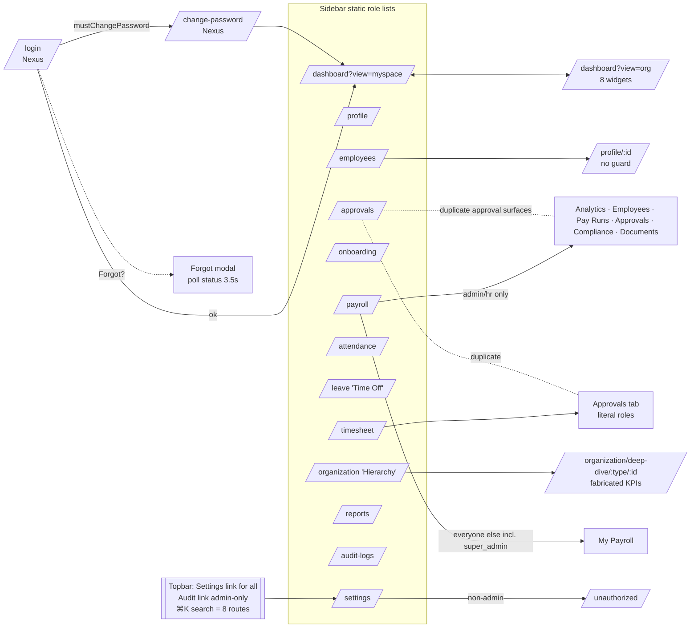

# Track B — Frontend Architecture, Client Permissions, UI/UX, Frontend Performance

Scope: `client/` at HEAD `06dc08f` (branch `feat/nexus-brand-foundation`). Every claim is cited to a file and line read at HEAD. Labels: **[Confirmed]** = read in code; **[Inferred]** = deduced from code read, with the evidence given; **[Assumption]** = stated reason; **[Unknown]** = not enough evidence found in repository.

Line-number convention: numbers are the line numbers inside the cited file.

---

## Phase 4a. Frontend Architecture

### 4a.1 Folder structure and size

| Area | Contents | Evidence |
|---|---|---|
| Entry | `main.tsx` (BrowserRouter, optional Sentry), `App.tsx` (all routes, inline 403/404 pages) | [Confirmed] `main.tsx:1-67`, `App.tsx:47-178` |
| `components/` | `layout/` (MainLayout, Sidebar, Topbar), `ui/` (index.tsx kit + `form.tsx` + `Alert.tsx`), `brand/NexusLogo.tsx` | [Confirmed] file listing |
| `config/` | `brand.ts` only (product name, `pageTitle()`, `copyright()`) | [Confirmed] `config/brand.ts:12-29` |
| `hooks/` | `index.ts` (useApi, useAuth, usePermission, useModuleAccess, useRoleCheck, usePagination, useDebounce, toast bus), `useWorkspace.ts`, `usePageTitle.ts` | [Confirmed] `hooks/index.ts:1-220` |
| `modules/*` | 16 feature folders (approvals, attendance, audit, auth, dashboard, employees, leave, onboarding, organization, payroll, profile, public, reports, settings, timesheet) each with `pages/` and `components/` | [Confirmed] file listing |
| `services/` | `api.ts` only — single axios instance | [Confirmed] `services/api.ts:56-63` |
| `store/` | `authStore.ts` only — the only Zustand store | [Confirmed] |
| `utils/` | `formatters.ts`, `cleanup_data.js` (stray JS file in a TS app) | [Confirmed] listing |
| Size | ~27.0k LOC in `.ts/.tsx`. Largest: `Timesheets.tsx` 1,316; `ProfileHeader.tsx` 952; `EmployeeTable.tsx` 917; `AddEmployeeModal.tsx` 762; `Profile.tsx` 650 | [Confirmed] `wc -l` |

Repository hygiene inside `client/`: `ts_check.txt`, `ts_check2.txt`, `ts_errors*.txt` are committed scratch files; `dist/` is present and dated 2026-10-01 21:08, i.e. older than the three Nexus commits (stale build artifact) [Confirmed: `ls client`, `ls -la dist`]. `vite.config.ts:15-23` hard-codes two ngrok hostnames and sets `hmr: false` for everyone [Confirmed].

### 4a.2 Component design and reusability

- **Shared UI kit exists but is barely adopted.** `components/ui/index.tsx` exports `Button, Badge, Card, Modal, DataTable, LoadingSpinner, EmptyState, ToastContainer, toast` plus `FormField/TextInput/PasswordInput` (`form.tsx:34,71,100`) and `Alert` (`Alert.tsx:23`) [Confirmed]. Only 14 files import from `components/ui`; outside the auth screens the imports are just `toast` (8 files) and `LoadingSpinner` (3 files) [Confirmed: grep of import statements]. `Button` is used only in `LoginPage.tsx:172`, `ChangePasswordPage.tsx:84,87`, `ForgotPasswordModal.tsx:290-386`. `DataTable` (`ui/index.tsx:249`, supports server-side sort and pagination props at `:236-252`) has **zero** consumers; `Modal` (`ui/index.tsx:183`) has zero consumers [Confirmed: grep `<DataTable`, `<Modal`].
- **Duplicated primitives** [Confirmed]: `StatCard` defined 4× (`approvals/components/ApprovalStats.tsx:12`, `dashboard/components/StatCard.tsx:16`, `payroll/components/StatCard.tsx:13`, `profile/components/AttendanceTab.tsx:91`) plus `reports/components/ReportStatCard.tsx:14`; `EmptyState` 2× (`ui/index.tsx:371`, `profile/components/ProfileWidgets.tsx:33`); `Card` 2× (`ui/index.tsx:139`, `profile/components/OverviewTab.tsx:34`); `PersonalTab` 2× (`dashboard/components/widgets/PersonalTab.tsx:27`, `employees/components/modals/AddEmployeeModal.tsx:201`); `AttendanceTab` 2× (`dashboard/components/widgets/AttendanceTab.tsx:38`, `profile/components/AttendanceTab.tsx:107`). Avatar colour maps copy-pasted (`Topbar.tsx:27-34`, `Dashboard.tsx:31-32`, `EmployeeTable.tsx:33-35`, widget `COLORS` arrays).
- **Two parallel "my profile" UIs**: `/profile` (`profile/pages/Profile.tsx`, loads via `/employees/me` at `:71`) and the dashboard "My Space" profile (`dashboard/components/MySpaceProfile.tsx`, loads by e-mail search `/employees?search=<email>&limit=1` at `:49`) [Confirmed].
- **Hand-rolled modals**: 24 module files contain `fixed inset-0` overlays and 24 use `createPortal` [Confirmed: grep counts]; only `ForgotPasswordModal.tsx:86-91,217-218` implements `role="dialog"`, `aria-modal`, focus move and Escape.
- **Dead code** (not imported anywhere) [Confirmed: grep for imports]: `auth/components/Can.tsx`, `dashboard/components/charts/DonutChart.tsx`, `charts/MiniBarChart.tsx`, `dashboard/components/SectionHeader.tsx`, `dashboard/components/StatCard.tsx`, `dashboard/components/StatsCard.tsx`, `onboarding/components/OnboardingModal.tsx`, `organization/components/StructuralDeepDive.tsx`, `payroll/components/StatCard.tsx`, `profile/components/{Assets,Documents,PersonalInfo,ProfessionalDetails}.tsx`, `public/pages/LandingPage.tsx` (no route), `settings/components/ApprovalsTab.tsx` (not in `Settings.tsx:20-30` TABS). Hooks `useApi`, `useAuth`, `usePermission`, `useModuleAccess`, `useRoleCheck`, `usePagination`, `useDebounce` (`hooks/index.ts:32-179`) have no consumers [Confirmed: grep].

### 4a.3 State management (Zustand)

Only one store: `store/authStore.ts` [Confirmed].

| Field | Purpose | Evidence |
|---|---|---|
| `user` (`id, employee_id, tenant_id, name, email, role, permissions[], dashboard_type, avatar_url, availability_status, …`) | Identity + permission list | `authStore.ts:17-32` |
| `accessToken`, `refreshToken` | JWTs | `authStore.ts:36-37` |
| `isAuthenticated`, `mustChangePassword` | Routing flags | `authStore.ts:38-39` |
| helpers `hasPermission`, `hasAnyRole`, `hasModule` | Client authorization | `authStore.ts:90-130` |

- **Persistence / token storage**: `persist` with `createJSONStorage(() => sessionStorage)` and `partialize` that **includes `accessToken` and `refreshToken`** (`authStore.ts:132-142`). The comment on `:135` says "Don't persist tokens in storage for security" — the code does the opposite [Confirmed]. Tokens are therefore readable by any injected script (XSS-exposed) and survive reloads within the tab.
- **`dashboard_type` is never populated client-side.** The server login response includes `dashboard_type` and `availability_status` (`server/src/modules/auth/auth.controller.ts:38-39`) but `LoginPage.tsx:58-66` builds the stored user without them; nothing else sets it (only `updateUser({availability_status})` in `Dashboard.tsx:89` and `updateUser({avatar_url})` in `Profile.tsx:291,318`) [Confirmed]. Also acknowledged in `docs/nexus/CHANGELOG.md` "Remaining risks" #2.
- **Permissions are a login-time snapshot.** There is no `GET /auth/me` on app load or after refresh (only `PUT /auth/me*` calls exist — `ChangePasswordPage.tsx:33`, `SettingsTab.tsx:21`) [Confirmed: grep]. Role/permission edits in Settings do not reach a signed-in user until re-login [Inferred from the above].
- **Avatar stored as base64 in the persisted user**: `Profile.tsx:275-291` compresses the image to base64, PUTs it into `employees.avatar_url`, and copies it into the store → sessionStorage [Confirmed].
- Other local persistence: `localStorage.sidebar_collapsed` (`Sidebar.tsx:86-94`), `localStorage.usr_status` (`Dashboard.tsx:67,85`) [Confirmed].
- No server-state library (React Query/SWR). Each page keeps its own `useState` copies; the only cross-component cache is the module-level promise in `useWorkspace.ts:12-27` [Confirmed].

### 4a.4 Data fetching (`services/api.ts`)

- Base URL: `VITE_API_URL` → `http://<localhost>:4000/api/v1` on localhost → relative `/api/v1` elsewhere (`api.ts:37-54`); `withCredentials: true`, 30 s timeout (`:56-63`) [Confirmed].
- Request interceptor attaches `Authorization: Bearer <accessToken>` from the store (`api.ts:86-97`) [Confirmed].
- Response interceptor: on 401 (non-auth endpoint) queues concurrent requests, POSTs `/auth/refresh` with the refresh token in the body **and** the expired access token in a header (`api.ts:110-160`), and on failure calls `logout()` and hard-reloads `window.location.href='/login'` (`:161-164`) [Confirmed]. `isExpired` (`:113`) is computed and never used; its expression `… || !originalRequest._retry` is always true inside that branch [Confirmed].
- **Error-shape defect (high impact)**: every non-refresh failure is rejected as a plain `{message, code, errors}` object (`api.ts:171-177`), i.e. **without `.response`**. Yet 25 call sites in 13 files read `err.response?.data?.message|error` [Confirmed: grep], e.g. `LoginPage.tsx:78-80`, `ChangePasswordPage.tsx:38`, `Onboarding.tsx:114-121`, `Approvals.tsx:40`, `Attendance.tsx:175`, `Profile.tsx:297`, `Dashboard.tsx:111,129,137`. Server messages and field-level validation errors are therefore never shown; users get generic fallbacks ("Transaction failed", "Submission failed"). [Inferred: the unit test mocks `api` (`LoginPage.test.tsx:8,49`) so it does not exercise the interceptor.]
- **SSE bypasses the API config**: `EmployeeTable.tsx:117-152` opens `EventSource(\`${VITE_API_URL || 'http://localhost:4000/api/v1'}/realtime/stream?token=${accessToken}\`)`. In a production build without `VITE_API_URL` this points at `localhost` (unlike `api.ts:50`, which falls back to `/api/v1`), and the access token travels in the query string [Confirmed]. No reconnect: `onerror` closes the stream permanently (`:144-147`).
- **Logout does not revoke server session**: Topbar `handleLogout` only clears the store (`Topbar.tsx:118`); `useAuth().logout` (which POSTs `/auth/logout`, `hooks/index.ts:84-91`) is unused [Confirmed].
- Inconsistent URL style: payroll sections call relative paths without leading slash (`'payroll/live-summary'`, `'claims/admin'`) — works with axios baseURL joining but differs from the rest (`PayRuns.tsx:28`, `payroll/sections/Approvals.tsx:28`) [Confirmed].
- Clients pass `userId` as a query/body parameter for "my" data (`Dashboard.tsx:97,108-109,126,135`, `ApplyLeave.tsx:45,54,104`, `Attendance.tsx:285,303`, `Timesheets.tsx:163,195`) [Confirmed]. Whether the server trusts it is out of this track's scope [Unknown — see backend track].

### 4a.5 Performance architecture

- **Route-level code splitting: yes.** All 14 authenticated pages are `React.lazy` (`App.tsx:12-27`) with `Suspense` fallbacks (`App.tsx:39-43`, `MainLayout.tsx:26-28`) [Confirmed]. `LoginPage` is eager (`App.tsx:6`).
- Memoization: `React.memo` used **0** times; `useMemo` 18; `useCallback` 14 across modules/components [Confirmed: grep counts]. Root-level 1-second timers re-render whole pages (see Phase 8a).
- Large lists: no virtualization; lists capped at 500/1000 rows and rendered in full (see Phase 8a).
- Dependencies (`client/package.json`): react, react-router-dom, zustand, axios, lucide-react (named imports), `lodash` (only `lodash/debounce`, `EmployeeTable.tsx:11`), react-hook-form + zod (only ApplyLeave), `@sentry/react` statically imported in `main.tsx:4` even when DSN is unset. No chart library — charts are hand-built SVG/CSS [Confirmed]. Stale `dist/` shows main chunk 288 KB, CSS 112 KB, Dashboard chunk 113 KB (pre-HEAD build, indicative only) [Confirmed: `ls -la dist/assets`].
- Fonts: one Google Fonts request for three families at all weights (`index.css:1`) [Confirmed].

### 4a.6 Accessibility (whole app)

| Metric (client/src) | Value | Evidence |
|---|---|---|
| `aria-*` attributes | 34, in only 8 files — all Nexus/auth/ui files | [Confirmed] grep; files: NexusLogo, Alert, form, form.test, ui/index, AuthLayout, ForgotPasswordModal, LoginPage |
| `role="…"` | 4 (form.tsx, ForgotPasswordModal) | [Confirmed] |
| `<label` vs `htmlFor` | 99 vs 4 → labels not associated with inputs outside `FormField` | [Confirmed] |
| `<div onClick>` (not keyboard reachable) | 14 | [Confirmed] grep |
| `font-black` | 630 occurrences | [Confirmed] |
| Hard-coded hex colours in TSX | 371 | [Confirmed] |
| `alert()`/`confirm()` | 12 `alert` + 7 `confirm` | [Confirmed] e.g. `Approvals.tsx:58`, `UsersTab.tsx:73` |

Shared `Modal` (`ui/index.tsx:183-220`) has no `role="dialog"`, no Escape handler and no focus management [Confirmed: grep of that range]. Sidebar collapse buttons are icon-only without `aria-label` (`Sidebar.tsx:130-135,145-150`) [Confirmed]. Topbar icon buttons (Help, Bell) have no accessible name (`Topbar.tsx:226-240`) and Help has no handler [Confirmed]. `usePageTitle` is used only on Login and Change-password (`LoginPage.tsx:25`, `ChangePasswordPage.tsx:10`); every other page keeps the default title [Confirmed: grep].

### 4a.7 Responsiveness

- 207 breakpoint-prefixed classes across modules/components [Confirmed: grep], so many grids collapse.
- **App shell is not mobile-capable**: `MainLayout.tsx:20` is `grid-cols-[auto_1fr]` with the Sidebar always rendered at 240 px or 68 px (`Sidebar.tsx:119`); there is no drawer, hamburger or breakpoint hiding it [Confirmed]. Topbar reserves a fixed `w-[220px]` left block (`Topbar.tsx:133`) plus a centred search with `max-w-[500px]` [Confirmed]. On a 375 px phone ~68–240 px is consumed by the sidebar [Inferred].
- Only the Nexus `AuthLayout` has a designed mobile layout (`AuthLayout.tsx:25,27,67,74`) [Confirmed].
- Tables: 12 `<table>` elements; 17 `overflow-x-auto` wrappers in modules [Confirmed: grep] — not all tables are wrapped [Inferred from counts; not verified one by one].

### 4a.8 Architecture diagram

```mermaid
flowchart TB
  subgraph Browser
    main[main.tsx\nBrowserRouter + optional Sentry.ErrorBoundary] --> App[App.tsx\nRoutes + inline 403/404]
    App --> Login[LoginPage eager]
    App --> CP[ChangePasswordPage lazy]
    App --> ML[MainLayout\nSidebar + Topbar + Outlet]
    ML --> PR{ProtectedRoute\nallowedRoles -> hasAnyRole}
    PR --> Pages[14 lazy pages\nmodules/*/pages]
    Pages --> Local[(per-page useState\nno shared cache)]
    subgraph Store[Zustand authStore persisted to sessionStorage]
      U[user + permissions snapshot\n(dashboard_type missing)]
      T[accessToken + refreshToken]
      H[hasAnyRole / hasModule / hasPermission]
    end
    ML -.reads.-> H
    PR -.reads.-> H
    API[services/api.ts axios\nBearer + 401 refresh queue\nrejects {message} w/o .response]
    Pages --> API
    API -.reads/writes.-> T
    SSE[EventSource ?token= in EmployeeTable\nown base URL]:::warn
    Poll[setInterval polls:\nTopbar notifications 60s\nTeamStatusWidget 30s\nForgotPassword 3.5s]:::warn
    UIKit[components/ui\nNexus: Button FormField Alert\nlegacy: DataTable Modal Card (unused)]
    Pages -. mostly bypass .-> UIKit
  end
  API --> Server[(Express API /api/v1)]
  SSE --> Server
  Poll --> API
  classDef warn fill:#fde68a,stroke:#b45309;
```

---

## Phase 6a. Client-side Permission System

### 6a.1 How the sidebar is built

**Static config filtered by role names first, permissions second.** `Sidebar.tsx:35-79` is a hard-coded `sidebarSections` array; each item carries `roles: string[]` and a `module` [Confirmed]. `isAuthorized` (`Sidebar.tsx:100-111`):
1. `roles.length===0` → visible (Dashboard only).
2. `!hasAnyRole(...item.roles)` → hidden.
3. `hasAnyRole('admin','super_admin')` → visible.
4. module in hard-coded `coreModules` (`dashboard, attendance, leave, timesheet, payroll, profile`) → visible.
5. else `hasModule(module)` → any permission prefixed `<module>:`.

Nothing is fetched from the server to build navigation [Confirmed]. Sidebar and routes disagree: e.g. an `hr` user without an `approvals:*` permission has Approvals hidden by step 5 but `/approvals` still allows `hr` (`App.tsx:104`) [Inferred from both code paths].

### 6a.2 Route guards — every route in `App.tsx`

`ProtectedRoute` (`modules/auth/components/ProtectedRoute.tsx:10-32`) checks `isAuthenticated`, forces `/change-password` when `mustChangePassword`, then `allowedRoles && !hasAnyRole(...allowedRoles)` → `/unauthorized`. It never checks permissions [Confirmed].

| Route | Line | Guard | Effective audience given `hasAnyRole` semantics (6a.4) |
|---|---|---|---|
| `/` | 52 | none (RootRedirect) | all |
| `/login` | 53 | none | public |
| `/change-password` | 54-56 | `ProtectedRoute` (auth only) | authenticated with temp password |
| `/dashboard` | 59-63 | auth only | all |
| `/onboarding` | 64-68 | roles `admin, hr, super_admin` | admin/hr/super_admin + users named "System Admin" / `admin@company.com` |
| `/employees` | 69-73 | roles `admin, hr, manager, super_admin` | + any user whose role literal is `manager` |
| `/reports` | 74-78 | `admin, hr, super_admin` | as onboarding |
| `/profile` | 81-83 | auth only | all |
| `/profile/:id` | 84-86 | auth only | **all — any user can open any profile id client-side** |
| `/attendance` | 87-89 | auth only | all |
| `/leave` | 90-92 | auth only | all |
| `/timesheet` | 93-95 | auth only | all |
| `/payroll` | 96-100 | `admin, hr, employee, super_admin` | **every user** (dashType defaults to `employee`, see 6a.4) |
| `/approvals` | 103-107 | `admin, hr, manager, super_admin` | |
| `/organization` | 108-112 | `admin, hr, super_admin` | |
| `/organization/deep-dive/:type/:id` | 113-117 | `admin, hr, super_admin` | |
| `/audit-logs` | 118-124 | `admin, super_admin` | |
| `/settings` | 126-130 | `admin, super_admin` | |
| `/unauthorized` | 132-150 | none (inside MainLayout) | all |
| `*` | 153-171 | none | all |

### 6a.3 Component-level gating

- `Can` component (`auth/components/Can.tsx:11-25`) exists — checks literal `user.role !== role` and `permissions.includes(perform)` — but is **imported nowhere** [Confirmed].
- `usePermission`, `useModuleAccess`, `useRoleCheck` (`hooks/index.ts:116-129`) — **no consumers** [Confirmed].
- `hasPermission` is called nowhere outside the store [Confirmed: grep].
- Consequently action buttons are not gated. Example: `EmployeeTable.tsx` renders Export (`:325`), Bulk Upload (`:328`), Add (`:332`), Edit (`:555,654`), Delete (`:560,655`) for every user who reaches `/employees`, including managers; the file has no role/permission check [Confirmed: grep shows none]. Authorization is left entirely to server 403s [Inferred].

### 6a.4 What `hasAnyRole` actually does (`authStore.ts:98-117`)

1. Literal match of lower-cased `user.role` [Confirmed `:105`].
2. **Identity backdoor**: `user.name === 'System Admin'` or `email === 'admin@company.com'` passes any check that includes `'admin'` (`:107-109`) [Confirmed]. Any account renamed "System Admin" gets admin UI.
3. `dashboard_type` mapping (`:112-114`), where `dashType = user.dashboard_type || 'employee'` (`:102`). Because `dashboard_type` is never stored (4a.3), **every user satisfies any role list containing `'employee'`**, and the admin/manager mappings via dashboard_type are dead [Inferred from `LoginPage.tsx:58-66` + `:102,114`].

`hasPermission` and `hasModule` short-circuit to `true` for `super_admin|admin|administrator` or `dashboard_type==='admin'` (`authStore.ts:94,123`) and `hasModule` treats six modules as always-on for everyone (`:126-127`) [Confirmed].

### 6a.5 Dashboard widget visibility

`Dashboard.tsx:53-55` computes `isAdminOrHR`, `isManager`, `isEmployee` from `dashboard_type` OR `hasAnyRole(...)`. Data source chosen at `:107-109` (`/reports/dashboard` vs `/reports/dashboard/manager` vs `/reports/dashboard/employee`); org overview at `:363-371` [Confirmed]. Because `isEmployee` uses `hasAnyRole('employee')`, it is `true` for everyone [Inferred, 6a.4]; the `!isManager && !isAdminOrHR` guards at `:365` are what keep it correct. Admin/HR users never load `empData`, so the personal KPI block `:322-324` never renders for them [Confirmed]. The org-section widgets (`:390-400`: announcements, policies, employee tree, dept tree, directory, birthdays, new hires, calendar) are shown to **all** roles with no gating; each fetches `/employees?limit=500` or `/settings/config` [Confirmed `BirthdayWidget.tsx:14`, `PoliciesWidget.tsx:32`, etc.]. Whether employees are allowed those endpoints server-side [Unknown].

### 6a.6 Data visibility

Client-side "own profile" decision: `Profile.tsx:92` sets `own = user.employee_id === tid || role==='admin' || role==='hr'`; `super_admin` and `manager` are excluded, and an admin viewing someone else is treated as "own" (edit UI) [Confirmed]. `GeneratePayroll.tsx:30` `isAdmin = role==='admin' || role==='hr'` — **`super_admin` gets the employee "My Payroll" view** and no admin payroll tabs [Confirmed]. `Timesheets.tsx:126` `isManager` = admin/hr/manager/super_admin literal roles; custom roles never see the approvals tab [Confirmed].

### 6a.7 Hard-coded role checks (complete list from grep at HEAD)

| File:line | Check |
|---|---|
| `store/authStore.ts:15` | `UserRole = 'super_admin'|'admin'|'hr'|'manager'|'employee'` |
| `store/authStore.ts:94` | `role === 'super_admin' || 'admin' || 'administrator' || dashboard_type==='admin'` (hasPermission bypass) |
| `store/authStore.ts:102` | default `dashType = 'employee'` |
| `store/authStore.ts:108-109` | `user.name === 'System Admin'` / `email === 'admin@company.com'` |
| `store/authStore.ts:112-114` | admin/manager/employee role ↔ dashboard_type mapping |
| `store/authStore.ts:123` | admin bypass in `hasModule` |
| `store/authStore.ts:126` | hard-coded always-on module list |
| `App.tsx:65,70,75,97,104,109,114,119,127` | `allowedRoles` arrays |
| `components/layout/Sidebar.tsx:39-76` | per-item `roles` arrays |
| `components/layout/Sidebar.tsx:103` | `hasAnyRole('admin','super_admin')` |
| `components/layout/Sidebar.tsx:106` | duplicated core-module list |
| `components/layout/Topbar.tsx:342` | `role==='admin'||'super_admin'||dashboard_type==='admin'` (Audit Logs menu item) |
| `components/layout/Topbar.tsx:338-341` | Settings menu item shown to **everyone** (route then 403s) |
| `modules/auth/components/Can.tsx:17` | `user.role !== role` (unused) |
| `modules/dashboard/pages/Dashboard.tsx:53-55` | `dashboard_type`/`hasAnyRole('admin','super_admin','hr')`, `('manager')`, `('employee')` |
| `modules/dashboard/pages/Dashboard.tsx:33` | `ROLE_LABEL` map of five roles |
| `modules/payroll/pages/GeneratePayroll.tsx:30` | `role==='admin'||role==='hr'` |
| `modules/profile/pages/Profile.tsx:92` | `role==='admin'||role==='hr'` |
| `modules/timesheet/pages/Timesheets.tsx:126` | `role` in admin/hr/manager/super_admin |
| `modules/settings/components/PermissionMatrix.tsx:90` | dashboard types `['employee','manager','admin']` |
| `modules/employees/...EmployeeTable.tsx:157,162,174,206,223`; `AddEmployeeModal.tsx:631,671`; `EditEmployeeModal.tsx:148,188`; `Onboarding.tsx:37`; `UsersTab.tsx:26,118` | default role `'employee'` in forms (data default, lower risk) |
| `modules/employees/components/EmployeeTable.tsx:286`, `dashboard/components/widgets/EmployeeTreeWidget.tsx:137` | missing manager rendered as literal "System Admin" |
| `modules/auth/pages/LoginPage.tsx:14-20` | DEV-only demo accounts incl. `admin@company.com / Admin@123` (guarded by `import.meta.env.DEV`) |

### 6a.8 Verdict and refactor list

The UI is **role-name driven, not permission driven** [Confirmed]. The Settings permission matrix (`PermissionMatrix.tsx`, `RolesTab.tsx:55-60`) edits server permissions that the client only consults in one place (`hasModule` step of the sidebar). A custom role granted `employees:read` cannot open `/employees` because the route requires `admin|hr|manager|super_admin` [Inferred from `App.tsx:70` + `hasAnyRole`]. Feature/module toggles saved in Settings → Features (`FeatureControlTab.tsx:33-41`, keys `module_*`, `feat_*`) are read by **no** client code (grep count 0) [Confirmed].

Needs refactoring (priority order):
1. `store/authStore.ts` — remove identity backdoor and dashboard_type default; store `dashboard_type`; expose a single `can(permission)`; refresh `user/permissions` from `/auth/me` on boot and after refresh.
2. `LoginPage.tsx:58-66` — store the full server user object.
3. `ProtectedRoute.tsx` + `App.tsx` — `requiredPermission` instead of `allowedRoles`.
4. `Sidebar.tsx` / `Topbar.tsx` — derive nav and quick-search from one permission-tagged route registry (Topbar search `:56-65` currently lists Employees/Reports to everyone).
5. `Dashboard.tsx`, `GeneratePayroll.tsx`, `Timesheets.tsx`, `Profile.tsx` — replace literal role checks with permissions/capabilities.
6. `EmployeeTable.tsx`, `OrganizationPage.tsx`, payroll sections, `UsersTab.tsx`, `RolesTab.tsx` — gate mutating buttons with `Can`/`usePermission`.
7. Wire Feature toggles into the registry or remove the tab.

---

## Phase 7. UI/UX Audit

### 7.1 Global findings

- **Navigation / IA** [Confirmed]: 13 sidebar entries in 6 sections (`Sidebar.tsx:35-79`); "Hierarchy" label routes to `/organization`; "Time Off" label vs "Leave Management" topbar title (`Topbar.tsx:15`); three approval surfaces — `/approvals`, Payroll → Approvals tab (`GeneratePayroll.tsx:36`), and an orphaned Settings `ApprovalsTab.tsx` (dead); `/payroll` serves both admin console and employee payslips (`GeneratePayroll.tsx:30-45`). Topbar page label is a static map that falls back to "Workspace" for `/profile/:id` and deep-dive routes (`Topbar.tsx:10-24,53`). Topbar search is route-only (8 hard-coded entries, emoji icons, no people/record search despite placeholder "Search pages, employees, actions…") (`Topbar.tsx:56-69,175`). No breadcrumbs anywhere [Confirmed: grep "breadcrumb" none].
- **Settings and Dashboard views are not deep-linkable**: Settings tab is `useState` (`Settings.tsx:39`); Dashboard `view` is in the URL (`Topbar.tsx:125-126`) but org sub-section is `useState` (`Dashboard.tsx:69`); Payroll tabs `useState` (`GeneratePayroll.tsx:45`) [Confirmed].
- **Forms**: react-hook-form + zod used only by `ApplyLeave.tsx:3-5,14-36` [Confirmed: grep `useForm` = 1 file]. Nexus `FormField` used only on auth screens. Error surfacing broken app-wide by the API error-shape defect (4a.4).
- **Feedback**: three toast mechanisms — global `toast` (`ui/index.tsx:27`), Settings' private toast (`Settings.tsx:45-50,76-82`), and `alert()` (12 sites) [Confirmed].
- **Enterprise table standards** [Confirmed]: no column sorting anywhere in modules (grep `sortBy|onSort` = 0 outside unused DataTable); no bulk selection/actions (only an inert checkbox at `CandidateTable.tsx:94`); no saved views; no CSV/PDF export implemented — Export buttons have no `onClick` (`EmployeeTable.tsx:325`, `Approvals.tsx:73`, `Reports.tsx:126-130`).
- **Fabricated / hard-coded data in UI** [Confirmed at HEAD]:
  - `reports/pages/Reports.tsx:163,172,181,190` hard-coded trends `+4.2% / +1.5% / -0.8% / +2.1%` beside real values.
  - `reports/components/OrganizationReport.tsx:65` "+18% MoM"; `DiversityMetricsCard.tsx:30` "improved by 12%"; `PayrollReport.tsx:32` "+2.4% from last month".
  - `organization/pages/StructuralDeepDivePage.tsx:195-197` trend `+12%`, "Unit Efficiency 94.2%", "Compliance Index Level 4"; `:220` "Status: Operational"; `:353` "Resource 92.1%".
  - `organization/components/EntityDetailPanel.tsx:135-139` three fake "Strategic Assets" documents.
  - `dashboard/components/widgets/AnnouncementsWidget.tsx:5-19` `MOCK_ANNOUNCEMENTS`.
  - `payroll/components/OperationalStream.tsx:15-16` `Math.random()` hex "log" lines.
  - `payroll/pages/GeneratePayroll.tsx:60-75` "Live", "PCI-DSS", "AES-256" badges (unsubstantiated compliance claims).
  - `settings/components/UsersTab.tsx:387` "Protocol L3 Secure"; `timesheet/pages/Timesheets.tsx:231-237` "biometric check-in/out telemetry".
  - `Dashboard.tsx:379` "The database may still be initializing" on empty data.
- **Security-relevant UI** [Confirmed]: `IntegrationsTab.tsx:33-40` generates the tenant API key in the browser with `Math.random()` and legacy prefix `aura_`; `UsersTab.tsx:101-103` generates temp passwords with `Math.random()`; `ForgotPasswordModal.tsx:58-77` polls `/auth/forgot-password/status?email=` unauthenticated every 3.5 s and receives `resetToken` in the response (`:66-68`) — anyone who knows an approved user's e-mail can obtain the token [Inferred; flag for security track].
- **Nexus adoption**: `nx-*` tokens appear in only 10 files: `NexusLogo, Sidebar (brand block only, :138-144), Alert, form, ui/index, index.css, AuthLayout, ForgotPasswordModal, ChangePasswordPage, LoginPage` [Confirmed: grep]. Everything else is legacy (raw slate/indigo, `font-black`, hex). Sidebar itself still uses a hard-coded gradient `#0D1117→#0F172A` and `bg-indigo-600` active state (`Sidebar.tsx:121-125,221`), not Nexus blue `#2F5BEA` (`config/brand.ts:19`). Two token systems coexist (`tailwind.config.js:10-30` `nx.*` vs `:31-47` legacy `primary #2A2673`, `sidebar`, `text.*`).
- **Error resilience**: Sentry `ErrorBoundary` only when `VITE_SENTRY_DSN` is set (`main.tsx:65`); otherwise a render error blanks the app [Confirmed]. No per-route error boundary.

### 7.2 Screen-by-screen

Score is a UX/enterprise-readiness score out of 10 based on the evidence listed.

| # | Route / screen | Purpose | Main components | APIs | Styling | Score | Problems (evidence) | Recommended redesign |
|---|---|---|---|---|---|---|---|---|
| 1 | `/login` — `auth/pages/LoginPage.tsx` | Sign in | `AuthLayout`, `FormField`, `TextInput`, `PasswordInput`, `Button`, `Alert`, `ForgotPasswordModal` | `POST /auth/login` (:56) | **Nexus** | 7.5 | Server error message never shown (`:78-80` reads `err.response`, see 4a.4); drops `dashboard_type`/`availability_status` (`:58-66`); no remember-me; DEV account panel correctly DEV-gated (`:14-20,94`) | Fix error mapping; store full user; keep as reference implementation |
| 2 | `/change-password` — `ChangePasswordPage.tsx` | Replace temporary password | Nexus form primitives | `PUT /auth/me/password` (:33) | **Nexus** | 7 | Only `length<8` check (`:26`) — no strength meter/policy; error mapping defect (`:38`); sends password twice in body (`newPassword` and `password`) | Show policy from server, strength feedback |
| 3 | Forgot-password modal — `ForgotPasswordModal.tsx` | Admin-approved reset | Nexus primitives; proper dialog a11y (`:86-91,217-218`) | `POST /auth/forgot-password`, `GET …/status` (polled), `POST /auth/reset-password` | **Nexus** | 5 | Insecure token-by-email polling (`:58-77`); 3.5 s poll without visibility pause | Replace with e-mailed one-time link; keep dialog pattern |
| 4 | `/dashboard` — `dashboard/pages/Dashboard.tsx` | My Space + Org views | profile card, check-in, `TeamStatusWidget`, `EmployeeDashboard`/`AdminDashboard`/`ManagerDashboard`, `MySpaceProfile`, 8 org widgets via `OrgSubNav` | `/reports/dashboard[/manager|/employee]`, `/attendance/today`, `/attendance/check-in|out`, `PUT /auth/status`, `/organization/team-status` (30 s poll), widgets `/employees?limit=500` ×5, `/reports/holidays`, `/settings/config`, `/reports/departments` | Legacy | 5 | Root re-renders every second (`:117-122`, `LiveClock :46`); admin users never get personal KPIs (`:107,322`); "Org" tab for employees shows a dead-end message (`:365-370`); mock announcements; inline `<style>` keyframes (`:408-412`); 416-LOC component with one-letter names (`c`, `ini`, `g`, `cur`, `SK`) | Role-agnostic widget grid driven by permissions; move timers into leaf components; one people-directory query shared by widgets |
| 5 | `/employees` — `employees/components/EmployeeTable.tsx` | Directory + CRUD | card/table/tree views, `AddEmployeeModal` (762 LOC), `EditEmployeeModal`, `BulkUploadModal`, `ManagerPicker`, delete & "reach-out" modals | `GET /employees` (page,limit 16 / 1000 in tree), `POST/PUT/DELETE /employees`, SSE `/realtime/stream` | Legacy | 5 | Status/department filters applied client-side to the current 16-row page (`:262-266`) though server supports `status`/`departmentId` (`server/.../employees.controller.ts:9`); department dropdown built from current page only (`:267`); "active/onboarding" counts from page (`:268-269`); pagination renders only pages 1-5 (`:675`); errors swallowed (`:102` `catch{}`); Export button inert (`:325`); call/text/mail buttons are "Coming soon" toasts (`:241-245`); no sort; no permission gating | Server-side filters/sort/pagination via a shared Table; real export; gate actions; split file |
| 6 | `/onboarding` — `onboarding/pages/Onboarding.tsx` | New-hire list | `CandidateTable`, reuses `AddEmployeeModal`, `BulkUploadModal` | `GET /employees?status=onboarding` (no limit → server default 10), `GET /users`, `GET /reports/departments`, `POST/PUT /employees` | Legacy | 4 | Not a workflow (no checklist/tasks/documents) — it is an employee list filtered by status; only first 10 candidates (no `limit`/page, `:54`; server default `limit=10`); "Activated" count filters `status==='active'` from a list fetched with `status=onboarding` (`:186,226`) → 0 [Inferred]; error messages lost (`:114-121`) | Real onboarding pipeline (stages, tasks, owner, due dates) |
| 7 | `/organization` — `organization/pages/OrganizationPage.tsx` | Departments/teams/governance tree | `OrganizationHeader`, `DepartmentCard`, `DepartmentGridCard`, `OrganizationTree`, `EntityModal` (multi-step), `EntityDetailPanel`, `DecommissionModal` | `/organization/departments`, `/organization/teams`, `/users`, `/governance/tree` (re-fetched per click, `:44`), `/governance/resolve/:id`, `/governance/sync` | Legacy | 4 | Fake "Strategic Assets" (`EntityDetailPanel.tsx:135-139`); jargon ("Decommission", "Synchronizing Enterprise Hierarchy…" `:64`); no error state; client search only | Plain "Departments & Teams" page with table + side panel; archive instead of decommission |
| 8 | `/organization/deep-dive/:type/:id` — `StructuralDeepDivePage.tsx` | Department/team detail | KPI tiles, member list, policies | `/organization/departments` or `/teams` (all, then `.find`), `/employees?department_id=` (default limit 10), `/settings/config` — sequential (`:52-73`) | Legacy | 2 | Fabricated KPIs (`:195-197,220,353`); members truncated to server default page [Inferred]; 4-request waterfall | Merge into the organization side panel with real counts only |
| 9 | `/attendance` — `attendance/pages/Attendance.tsx` | Personal check-in, history, calendar, regularization | `AttendanceHero`, `AttendanceSummary`, `AttendanceCalendar`, `AttendanceHistory`, `WeeklyChart`, `RegularizePanel` | `/attendance/today`, `/history`, `/summary/:userId`, `/weekly-hours`, `POST /attendance/regularize` | Legacy (`card-premium`) | 5.5 | Personal only — managers have no team attendance view; history fetched twice on mount (`:328-329`); date keys via `toISOString()` (UTC) e.g. `:30,32` — off-by-one before 05:30 IST [Inferred]; `alert()` errors (`:175,386`); 1 s root ticker (`:331-338`) | Split self-service vs team view; local-date helpers (Timesheets already has `toLocalDateStr`, `Timesheets.tsx:20-25`) |
| 10 | `/leave` — `leave/pages/ApplyLeave.tsx` | Apply/edit/cancel leave, balances | `LeaveBalances`, `LeaveForm`, `LeaveRequests` | `/leave/types`, `/leave/requests`, `/leave/balance`, `POST /leave/apply`, `PUT/DELETE /leave/requests/:id` | Legacy | 6 | Only screen using RHF+zod (`:14-36`) ✔; submit/cancel errors only `console.error` (`:88-90,119-121`) — user sees nothing; no loading/empty state for lists; `window.confirm` (`:83`); no half-day, no team calendar | Keep schema; add error toasts and skeletons; manager view lives in Approvals |
| 11 | `/timesheet` — `timesheet/pages/Timesheets.tsx` (1,316 LOC) | Weekly timesheet, history, approvals | inline grid, history table, approvals table | `/timesheets/week`, `/timesheets`, `/timesheets/pending`, `/attendance/weekly-hours`, `PUT /timesheets/:id/entries|submit|approve` | Legacy | 5 | Free-text projects (no project master) (`:231,253`); jargon "Protocol Verification", "telemetry", "executive approval" (`:231-237,293`); literal-role `isManager` (`:126`); errors swallowed in history/pending (`:197-199,211-213`); third approval surface | Extract grid component; project picker; move approvals into unified inbox |
| 12 | `/payroll` — `payroll/pages/GeneratePayroll.tsx` + 7 sections | Admin payroll console / employee payslips | `FinancialAnalysis` (+`AllocationIndex`, `OperationalStream`, `FiscalIntegrityMatrix`), `EmployeePayrollManagement`, `PayRuns`, `Approvals` (claims), `TaxStatutory`, `DocumentsPayslips`, `EmployeePayroll` | `payroll/employees`, `payroll/activity`, `payroll/pending-approvals`, `payroll/live-summary`, `POST payroll/run`, `claims/*`, `payroll/deadlines*`, `payroll/tax-statutory/summary`, `payroll/documents/bulk-payslips`, `payroll/history/:empId`, `POST /payroll/profiles`, `PUT /payroll/employees/:id` | Legacy | 4 | `super_admin` sees employee view (`:30`); fake compliance badges (`:60-75`); random "operational stream" (`OperationalStream.tsx:15-16`); `Run` posts immediately with no preview/confirm/lock (`PayRuns.tsx:34-44`); `alert()` errors (`payroll/sections/Approvals.tsx:45,54,64`, `EmployeePayroll.tsx:104,125`); full employee list filtered client-side (`DocumentsPayslips.tsx:41-44,199`) | Separate "My Pay" from "Payroll admin"; pay-run wizard (draft → review → approve → lock → publish) |
| 13 | `/approvals` — `approvals/pages/Approvals.tsx` | Unified approvals inbox | `ApprovalStats`, `ApprovalNav`, `ApprovalSidebar`, `ApprovalCard` (585 LOC), `ApprovalTeamCard` | `GET /approvals?status=`, `POST /approvals/:id/action` | Legacy (lighter: `text-2xl font-bold`) | 5 | No bulk approve/reject; no pagination; history count shows 0 on pending tab (`:81-82`); `console.log` of payload (`:36`); `alert()` on failure (`:58`); Export Logs inert (`:73`); team icon guessed from name substring (`ApprovalTeamCard.tsx:16`) | Make this the single inbox (leave, timesheets, claims, regularization) with multi-select, filters in URL, SLA/age column |
| 14 | `/reports` — `reports/pages/Reports.tsx` | Analytics | `ReportStatCard`, `AttendanceTrendChart`, `DepartmentBreakdownCard`, `DiversityMetricsCard`, `WorkforceComposition`, `RecentReportsList`, `OrganizationReport`, `PayrollReport`, `AttendanceReport` | `GET /reports/summary` | Legacy | 3 | Fabricated trends (7.1); on fetch error the skeleton shows forever (`:72` `loading || !data`, error only logged `:64-65`); Filter and Export PDF buttons inert (`:126-130`); no date range | Honest KPIs with period selector, real exports, error state |
| 15 | `/audit-logs` — `audit/pages/AuditLogPage.tsx` | Audit trail | table, filters, detail portal | `GET /audit-logs?limit=500` | Legacy | 4.5 | Hard cap 500 then client filter/paginate (`:27,41-57`) — older events invisible; no date-range filter; errors only logged (`:30`) | Server-side filtered/paginated query with date range and actor filter; CSV export |
| 16 | `/settings` — `settings/pages/Settings.tsx` + 9 tabs | Tenant admin | `GeneralTab`, `BrandingTab`, `RolesTab`+`PermissionMatrix`, `UsersTab` (503 LOC), `EmailTab`, `SecurityTab`, `IntegrationsTab`, `PoliciesTab`, `FeatureControlTab` | `/settings/roles|permissions|users|config`, role/user CRUD, `/settings/test-email` | Legacy | 4.5 | Feature/module toggles have no client effect (grep 0); browser-generated API keys/passwords (7.1); tab not in URL (`:39`); private toast (`:45-50`); emoji module labels (`PermissionMatrix.tsx:24-41`); placeholder `admin@company.com` (`GeneralTab.tsx:79`) | Left-nav settings with URL per section; remove or wire toggles; server-generated secrets |
| 17 | `/profile`, `/profile/:id` — `profile/pages/Profile.tsx` (650) + `ProfileHeader` (952) + tabs | Employee profile | `ProfileHeader`, `ProfileTabs`, `OverviewTab` (555), `EducationTab`, `ExperienceTab`, `AttendanceTab`, `SettingsTab` | `/employees/me`, `/reports/profile/:id`, `/employees/:id/education|experience|emergency-contacts`, `PUT /employees/:id`, `POST /documents` | Legacy | 5 | Any user can navigate to `/profile/:id` (route has no guard, `App.tsx:84`); "own" logic role-literal (`:92`); avatar stored as base64 in DB and session (`:275-291`); reach-out buttons are "coming soon" (`ProfileHeader.tsx:140`); duplicate of dashboard MySpaceProfile | One profile page with permission-scoped sections; upload avatars to file storage |
| 18 | `/unauthorized`, `*` (404) — inline in `App.tsx:132-171` | Error pages | inline JSX | — | Legacy | 4 | `text-6xl font-black`, uppercase tracking; "secure module" jargon; 404 is outside the layout so users lose navigation | Shared `ErrorState` component in the shell |
| 19 | `public/pages/LandingPage.tsx` | Marketing page | — | — | Legacy | n/a | Not routed — dead code | Delete or route intentionally |

### 7.3 Screen-flow diagram



### 7.4 UI modernization strategy (ordered)

1. **Stop showing untrue data** — remove fabricated trends/KPIs/badges/mock announcements listed in 7.1 (pure deletions; matches `docs/nexus/DESIGN_SYSTEM.md` §7).
2. **Fix the API error contract** — make the interceptor reject with an object that preserves `response` (or migrate the 25 call sites to `err.message/err.errors`), so every form can show server validation.
3. **Permission-driven shell** — one route registry `{path, element, permission, navSection}` feeding `App.tsx`, `Sidebar`, Topbar search and `ProtectedRoute`; store full user incl. `dashboard_type`; `/auth/me` on boot.
4. **Responsive shell** — sidebar becomes an off-canvas drawer below `lg`; Topbar collapses search into an icon; Nexus tokens for shell colours.
5. **Finish the Nexus kit** (as planned in DESIGN_SYSTEM.md §5 "Pending"): Table (server sort/filter/paginate, row selection, bulk bar, column visibility, CSV), Dialog/ConfirmDialog (replace 24 hand-rolled overlays and `alert/confirm`), Select/Combobox (debounced, replaces ManagerPicker), Tabs synced to URL, PageHeader, StatCard (one), Skeleton/EmptyState/ErrorState, Toast (one).
6. **Migrate screens by traffic and risk**: Employees → Approvals (single inbox with bulk actions) → Leave → Attendance (add team view) → Timesheets → Payroll (split My Pay / Admin; pay-run wizard) → Reports (period selector, honest KPIs, export) → Audit (server query) → Settings (URL sections, remove dead toggles) → Organization (merge deep dive) → Profile (merge MySpaceProfile).
7. **Copy pass** — plain HR language (remove "Protocol", "telemetry", "Decommission", "Orchestration Engine").
8. **Accessibility gate** — every page title via `usePageTitle`; `FormField` for all inputs; lint rule for `div onClick`; axe check in Vitest.

---

## Phase 8a. Frontend Performance

| # | Bottleneck | Evidence | Impact |
|---|---|---|---|
| 1 | **Five dashboard widgets each download up to 500 employees** and filter/aggregate in the browser, with no shared cache | `BirthdayWidget.tsx:14`, `NewHiresWidget.tsx:14`, `DeptDirectoryWidget.tsx:16`, `EmployeeTreeWidget.tsx:119`, `DeptTreeWidget.tsx:180` (all `limit: 500`) [Confirmed] | Repeated large payloads when switching org sections; silent truncation above 500 employees [Inferred] |
| 2 | Employee payloads likely carry base64 avatars | avatars written as base64 into `employees.avatar_url` (`Profile.tsx:275-278`) and rendered from list items (`EmployeeTable.tsx:57-58`) [Confirmed write/read]; size per list response [Inferred] | 500-row lists can become multi-MB |
| 3 | EmployeeTable: tree view fetches `limit=1000`; filters client-side on paginated data; double fetch on mount | `EmployeeTable.tsx:97` (1000), `:262-266` (client filter), `:105` and `:108-114` both call `fetchEmp` on mount [Confirmed] | Wrong results + extra request |
| 4 | Audit log: one 500-row fetch, then client search/filter/paginate | `AuditLogPage.tsx:27,41-57` [Confirmed] | Cap hides history; whole list re-filtered per keystroke |
| 5 | Payroll sections each fetch the full `payroll/employees` list; FinancialAnalysis fires 4 requests on every tab visit (tabs unmount on switch) | `FinancialAnalysis.tsx:37-40`, `EmployeePayrollManagement.tsx:57`, `DocumentsPayslips.tsx:41`; tab rendering `GeneratePayroll.tsx:103-109` [Confirmed] | Redundant refetch per tab change |
| 6 | Organization: full `/governance/tree` re-fetched on every department/team click; deep-dive fetches all departments/teams to `.find` one, as a sequential waterfall of 4 calls | `OrganizationPage.tsx:44-55`; `StructuralDeepDivePage.tsx:52-73` [Confirmed] | Latency stacks per click |
| 7 | `/users` fetched unpaginated in two places | `Onboarding.tsx:55`, `useOrganizationData.ts:43` [Confirmed]; whether server paginates `/users` [Unknown] | |
| 8 | Root-level 1-second timers re-render entire pages (no `React.memo` anywhere) | `Dashboard.tsx:117-122` (`setElapsed` every 1 s in the page root), `Dashboard.tsx:46` `LiveClock`; `Attendance.tsx:331-338`; React.memo count 0 [Confirmed] | Whole dashboard incl. `MySpaceProfile`, widgets re-render 1×/s while clocked in |
| 9 | Polling without visibility/backoff | Topbar notifications every 60 s (`Topbar.tsx:71-84`); `TeamStatusWidget.tsx:30` every 30 s; ForgotPassword status every 3.5 s (`ForgotPasswordModal.tsx:61-77`) [Confirmed] | Background tabs keep polling |
| 10 | Realtime: SSE opened only by EmployeeTable, per mount, token in URL, no reconnect, wrong prod URL fallback | `EmployeeTable.tsx:117-152` [Confirmed] | Realtime silently dead after first error or in prod builds without `VITE_API_URL` |
| 11 | Missing debounce / race guards | `ManagerPicker.tsx:65` fetches on every keystroke with no debounce and no stale-response guard; only `EmployeeTable.tsx:104` debounces (400 ms); `AddEmployeeModal.tsx:223,255,334` hand-rolled `setTimeout` debounces [Confirmed] | Request bursts; out-of-order results can overwrite newer ones [Inferred] |
| 12 | Duplicate fetches | Attendance history on mount twice (`Attendance.tsx:328-329`); Profile & MySpaceProfile both load `/reports/profile/:id` via different lookups (`Profile.tsx:71,100`; `MySpaceProfile.tsx:49,52`) [Confirmed] | |
| 13 | No request cache/dedup layer | No React Query/SWR in `package.json`; only `useWorkspace.ts:12-27` memoizes [Confirmed] | Every navigation refetches |
| 14 | Asset weight | Google Fonts: Outfit + Inter + JetBrains Mono, all weights (`index.css:1`); Sentry SDK statically imported (`main.tsx:4`); stale dist main chunk 288 KB / CSS 112 KB [Confirmed] | Slower first paint |
| 15 | Hard reload on refresh failure | `api.ts:163` `window.location.href = '/login'` [Confirmed] | Loses in-progress form state |

---

## Files reviewed

Opened and read (fully or the cited ranges):
- `client/package.json`, `client/index.html`, `client/vite.config.ts`, `client/tailwind.config.js`, `client/src/index.css` (lines 1-12 + grep for `--nx-`)
- `client/src/App.tsx`, `client/src/main.tsx`, `client/src/store/authStore.ts`, `client/src/services/api.ts`
- `client/src/components/layout/Sidebar.tsx`, `MainLayout.tsx`, `Topbar.tsx`
- `client/src/components/ui/index.tsx` (lines 1-30, 180-300 + export grep), `form.tsx` / `Alert.tsx` (export grep)
- `client/src/hooks/index.ts`, `hooks/useWorkspace.ts`, `hooks/usePageTitle.ts`, `client/src/config/brand.ts`
- `client/src/modules/auth/components/ProtectedRoute.tsx`, `Can.tsx`, `ForgotPasswordModal.tsx` (50-80 + grep), `AuthLayout.tsx` (grep)
- `client/src/modules/auth/pages/LoginPage.tsx`, `ChangePasswordPage.tsx` (1-60)
- `client/src/modules/dashboard/pages/Dashboard.tsx`; `dashboard/components/AdminDashboard.tsx` (100-125); `MySpaceProfile.tsx` (40-60); `widgets/AnnouncementsWidget.tsx` (1-25); `widgets/TeamStatusWidget.tsx` (20-40)
- `client/src/modules/employees/components/EmployeeTable.tsx` (1-160, 240-330 + grep of rest); `modals/ManagerPicker.tsx` (25-45)
- `client/src/modules/attendance/pages/Attendance.tsx` (1-60, 150-200, 270-360)
- `client/src/modules/leave/pages/ApplyLeave.tsx` (1-130)
- `client/src/modules/approvals/pages/Approvals.tsx` (1-194)
- `client/src/modules/payroll/pages/GeneratePayroll.tsx`; `payroll/sections/PayRuns.tsx` (20-60)
- `client/src/modules/audit/pages/AuditLogPage.tsx` (1-90)
- `client/src/modules/reports/pages/Reports.tsx` (20-200)
- `client/src/modules/settings/pages/Settings.tsx` (1-120); `settings/components/PermissionMatrix.tsx` (1-90); `FeatureControlTab.tsx` (20-45); `IntegrationsTab.tsx` (30-40); `UsersTab.tsx` (98-106)
- `client/src/modules/timesheet/pages/Timesheets.tsx` (1-30, 115-300 + grep)
- `client/src/modules/onboarding/pages/Onboarding.tsx` (1-19 imports, 25-130)
- `client/src/modules/organization/pages/OrganizationPage.tsx` (1-120); `StructuralDeepDivePage.tsx` (45-80); `components/EntityDetailPanel.tsx` (125-150)
- `client/src/modules/profile/pages/Profile.tsx` (30-120, 270-320)
- `docs/nexus/NEXUS_AUDIT_AND_PLAN.md` (§C, lines 89-145), `docs/nexus/DESIGN_SYSTEM.md` (§4-7), `docs/nexus/CHANGELOG.md` (remaining risks)
- Cross-check only: `server/src/modules/auth/auth.controller.ts` (25-50), `server/src/modules/employees/employees.controller.ts` (1-25), grep of `server/dist` and `server/src/modules/auth` for `dashboard_type`

Inspected by targeted grep only (line-cited above): `approvals/components/ApprovalStats.tsx`, `ApprovalTeamCard.tsx`; `dashboard/components/StatCard.tsx`, `ManagerDashboard.tsx`, `EmployeeDashboard.tsx`, `widgets/{BirthdayWidget,NewHiresWidget,DeptDirectoryWidget,DeptTreeWidget,EmployeeTreeWidget,OrgCalendarWidget,PoliciesWidget,AttendanceTab,PersonalTab}.tsx`; `employees/components/modals/{AddEmployeeModal,EditEmployeeModal,BulkUploadModal}.tsx`; `leave/components/LeaveRequests.tsx`, `LeaveForm.tsx`; `onboarding/components/CandidateTable.tsx`; `organization/components/{StructuralDeepDive,EntityModal,OrganizationTree}.tsx`, `hooks/useOrganizationData.ts`, `useOrganizationForm.ts`; `payroll/components/{OperationalStream,StatCard,FiscalIntegrityMatrix}.tsx`, `payroll/sections/{Approvals,DocumentsPayslips,EmployeePayroll,EmployeePayrollManagement,FinancialAnalysis,TaxStatutory}.tsx`; `profile/components/{OverviewTab,ProfileHeader,ProfileWidgets,AttendanceTab,EducationTab,ExperienceTab,PersonalInfo,Documents,SettingsTab}.tsx`; `reports/components/{OrganizationReport,DiversityMetricsCard,PayrollReport,ReportStatCard,AttendanceReport}.tsx`; `settings/components/{GeneralTab,RolesTab,PoliciesTab}.tsx`; `public/pages/LandingPage.tsx`; `auth/pages/LoginPage.test.tsx`; `client/dist/` (listing only).
