# Track C — Backend, Data, Permissions, Workflows

Scope: `server/` at HEAD `06dc08f` (branch `feat/nexus-brand-foundation`). Static reading only, no database connection. `npx tsc --noEmit -p server` exits 0.

Legend: **[Confirmed]** read in code (path:line). **[Inferred]** deduced from the cited code. **[Assumption]** stated with the reason. **[Unknown]** not enough evidence found in the repository.

Prior-audit check: `git log 83c1e84..HEAD -- server` shows only `3c09687` (Release 0 safety net: app/index split, Sentry, workspace module, test harness) and `78326c4` (branding). `git diff --stat 83c1e84 HEAD -- server/src` touches no route guard, no `authorize.ts`, no auth service and no repository other than workspace. So every authorization finding in `PRODUCTION_READINESS_AUDIT.md` §4 / §6 was re-checked below against current code, and **each one is still present** (details inline). The authorization test matrix exists but is empty: `server/test/integration/authz.matrix.test.ts:31-33` (`MATRIX: AuthzRow[] = []`).

---

## Phase 4b. Backend Architecture

### 4b.1 Runtime and entry points
- `server/src/index.ts`: imports `./instrument` first (Sentry, `index.ts:2`), registers domain event listeners (`index.ts:18,21`), calls `app.listen` unless `VERCEL` is set (`index.ts:17-32`), then runs `seedPermissionsAndSuperAdmin()` on every boot (`index.ts:78`). It also swallows `uncaughtException` for socket errors and only logs other uncaught exceptions without exiting (`index.ts:53-68`) [Confirmed]. Schema migration on boot is disabled (`index.ts:75`).
- `server/src/app.ts` builds the Express app with no side effects (`app.ts:1-7`).
- There are two `pg` pools for application queries, plus a third for migrations [Confirmed]:
  - `config/db.ts:24-32` `pool` (max 10) and `config/db.ts:37-45` `directPool` (max 3). Both use `ssl.rejectUnauthorized=false` for non-local hosts.
  - `database/client.ts:16-24` is a second `pool` (max 10) used only by `database/transaction.ts:1-16` (`withTransaction`).
  - Effect: up to 23 connections per instance. Repositories that call `pool.query` from `config/db` *inside* a `withTransaction` callback do not take part in the transaction (see timesheets, 4b.4).

### 4b.2 Middleware stack (in order) [Confirmed, `app.ts`]
1. `cors` with an allow-list, plus **any origin ending in `.vercel.app`**, with `credentials: true` (`app.ts:66-83`).
2. `express.json({limit:'50mb'})` and `urlencoded` with the same 50 MB limit (`app.ts:86-87`).
3. `express.static('/public')` (`app.ts:90`).
4. `GET /api/v1/health`, with no rate limit (`app.ts:94-101`).
5. Per-mount rate limiters: `authLimiter` (10 requests per 15 min per IP) on `/api/v1/auth` (`app.ts:46-52,106`), and `apiLimiter` (300/min) on every other mount (`app.ts:55-61,109-126`). The limiter is in-memory, so it does not share counts across instances [Inferred].
6. Router-level `authenticate` (`core/security/authorize.ts:5-55`). It accepts a Bearer token **or `?token=` in the query string** (`authorize.ts:16-17`).
7. Optional route-level `authorize([...])`, `requireSelfOrAdmin`, `validateRequest(zod)`.
8. `notFoundHandler`, then the Sentry error handler if initialised, then `globalErrorHandler` (`app.ts:135-139`).

There is no `helmet`, no request ID and no structured logger (`console.*` everywhere) [Confirmed, absent from `app.ts`]. `enforceTenantIsolation` is exported (`authorize.ts:133-153`), but `grep` finds no route that uses it [Confirmed].

### 4b.3 Route registration
`app.ts:20-38` imports one router per module. Several modules contain **duplicate, unmounted route and controller files** (dead code) [Confirmed by import graph]:
- `modules/settings/settings.routes.ts` (446 lines, a monolith duplicate of rbac, config and users). Not imported; `app.ts:34` imports `./modules/settings` (`index.ts`).
- `modules/governance/governance.routes.ts` and `governance.controller/service/repository.ts`. Mounted instead: `governance/index.ts` → org-tree, sync and shared.
- `modules/performance/performance.routes.ts` and controller/service/repository. Mounted instead: `performance/index.ts` → `reviews/`.
- `modules/notifications/notifications.routes.ts` and controller/service/repository. Mounted instead: `notifications/index.ts` → `core/`.
- `modules/realtime/realtime.routes.ts` and `realtime.controller.ts`. Mounted instead: `realtime/index.ts` → `connections/`.
- `modules/departments/*`. Never mounted.
- `middleware/errorHandler.ts` duplicates `core/errors/*` and is not imported. `core/response/ApiResponse.ts` has 0 call sites (`grep ApiResponse.success|error` returns 0). `utils/pdfGenerator.ts` (payslip PDF) has no caller. Stubs: `performance/{goals,ratings,analytics}`, `notifications/preferences`, `realtime/presence`, `audit/export`, `governance/{departments,teams}`.

### 4b.4 Layering (controller → service → repository)
| Module | Layering | Deviations [Confirmed] |
|---|---|---|
| auth | C/S/R | none material |
| attendance, leaves, claims, documents, users, organization, approvals, payroll, timesheets | C/S/R | approvals service queries `pool` directly (`approvals.service.ts:36-39`) |
| employees | C/S/R plus submodels | `/roles` handler writes SQL inside the route file (`employees.routes.ts:31-41`); service uses `pool` directly (`employees.service.ts:622-642`) |
| reports | **C → AnalyticsService (static, raw SQL)** | `reports.controller.ts:45-50,72-85` runs SQL in the controller |
| settings (rbac, config, user-assignments), governance, performance/reviews, notifications/core, audit | C/S/R | config repo creates a table at runtime (`configuration.repository.ts:4-16`) |
| workspace | route → service → repo | no controller |
| payroll `/history/:employeeId` | inline stub returning `[]` | `payroll.routes.ts:16-18` |

Transactions: `withTransaction` is used by employees create/update/save-sub-records, payroll process, approvals dept/team creation, and timesheets `saveTimesheetEntries`. In **timesheets the repository ignores the client** (`timesheets.repository.ts:25-43` uses `pool.query`), so the "transaction" in `timesheets.service.ts:28-44` is ineffective [Confirmed].

### 4b.5 Validation (zod) coverage per module [Confirmed]
| Module | Validated | Not validated |
|---|---|---|
| auth | login, refresh, PUT /me, prefs, status, password (`auth.routes.ts:16-27`) | forgot-password, forgot-password/status, reset-password (`auth.routes.ts:18-20`) |
| users | PUT /profile | — |
| attendance | check-in/out (`z.object({}).passthrough()`), regularize (passthrough) (`attendance.schema.ts:6-15`) | date/time formats are free strings |
| leave | apply, update, approve | no `start<=end`, no date format (`leaves.schema.ts:7-24`) |
| timesheets | entries, approve | submit; hours are unbounded strings or numbers |
| employees | create/update (`.passthrough()`), bulk (`z.array(z.any())`) | education, experience, emergency-contacts (`employees.routes.ts:53-62`) |
| payroll | profile (passthrough), process (month/year any string or number) | — |
| claims | submit, status | amount may be negative (`z.coerce.number()`) |
| approvals | create, action (`type` any string) | — |
| documents | upload, verify | — |
| organization, governance, performance | create/update | — |
| **settings (all 18 endpoints)** | none | roles, permissions, users, passwords, config (`rbac.routes.ts`, `user-assignments.routes.ts`, `configuration.routes.ts`) |
| reports, audit, notifications | query params parsed ad hoc | — |

### 4b.6 Error handling and response envelope
- `asyncHandler` forwards rejections to `globalErrorHandler` (`core/errors/asyncHandler.ts`). The handler maps `AppError`, `ZodError` and PG `23505`/`23503`/`23502` to 4xx, and adds `stack` when `NODE_ENV==='development'` (`core/errors/errorHandler.ts:5-68`) [Confirmed]. A `23505` message echoes the conflicting key and value back to the client (`errorHandler.ts:28-32`).
- Several services catch errors and **return HTTP 200 with a `warning` that contains the raw DB error message**, or fall back to an unscoped query, e.g. `rbac.service.ts:41-47` falls back to `SELECT id, name FROM roles LIMIT 100` across all tenants (`rbac.repository.ts:24-27`), and `user-assignments.service.ts:19-22` falls back to `SELECT id,name,email,role FROM users LIMIT 100` across all tenants (`user-assignments.repository.ts:21-24`) [Confirmed].
- Envelope is inconsistent [Confirmed]: `{success,data}` (settings, organization), `{success, items}` (users, documents), bare `{items,total}` (leaves, timesheets, attendance history), bare arrays (payroll runs, claims), bare objects (reports), and `{success, accessToken, token, ...}` (login).

### 4b.7 Event bus, realtime, jobs
- Event bus: a single in-process `EventEmitter` (`core/events/eventBus.ts:3-10`). Seven event types are declared (`eventTypes.ts:1-9`), but only `AUDIT_LOG_REQUESTED` (login, logout, profile update: `auth.controller.ts:15,72,91`) and `REALTIME_BROADCAST_REQUESTED` (status change: `auth.controller.ts:109`) are published [Confirmed by grep]. The notification listener only logs (`notifications.listeners.ts:6-12`). Nothing is durable (no outbox) and there is no retry; events are lost on crash [Inferred].
- Notifications are written synchronously by direct calls to `NotificationService.*` (templates in `notifications/templates/templates.service.ts`), targeted by **legacy `users.role` string** (`channels.repository.ts:23-27`). Users with custom role names never receive role-targeted notifications [Inferred].
- Realtime: Server-Sent Events. The client list is kept in a static in-process array (`realtime/connections/connections.service.ts:9-31`), and broadcast is filtered by tenant (`events.service.ts:10-14`). Single-instance only. On Vercel (`index.ts:17-19`) long-lived SSE is not viable [Inferred]. The JWT is passed in the query string for SSE (`authorize.ts:16-17`) and can end up in access logs [Inferred].
- Background or scheduled jobs: **none**. `grep` for cron, queue, bull and setInterval finds only the SSE keep-alive (`connections.service.ts:21`) [Confirmed]. Emails and offer-letter PDFs are produced inline in the request; in employee creation this happens **inside the open DB transaction** (`employees.service.ts:184,266-288`) [Confirmed].

### 4b.8 Backend architecture diagram
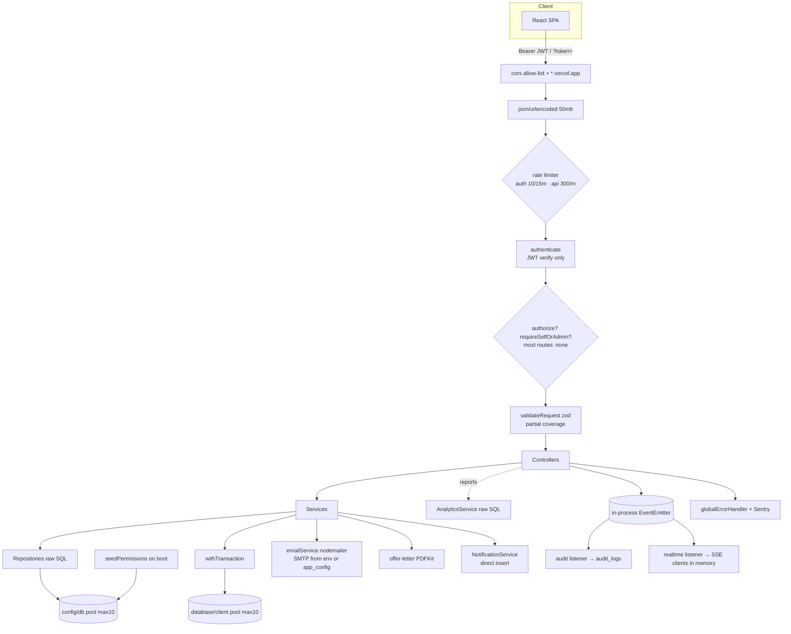

### 4b.9 API dependency diagram (module → shared tables/services)
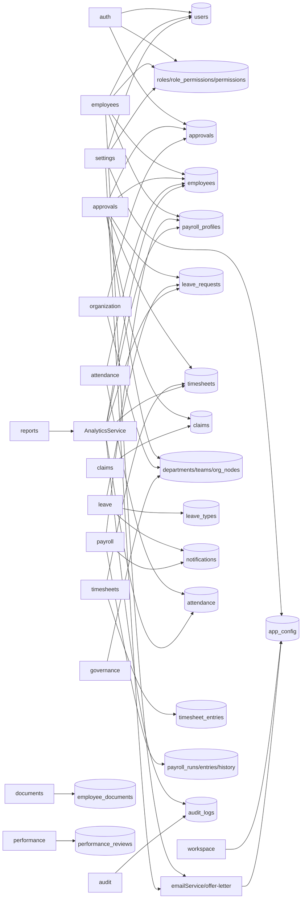

---

## Phase 4c. Database

### 4c.1 Schema sources and how they run
| Source | Role | Executed by |
|---|---|---|
| `src/initDb.ts` | Base `CREATE TABLE IF NOT EXISTS` for 22 tables, plus about 60 `ALTER ... ADD COLUMN`, seeds, and admin password reset | `npm run db:setup` (`package.json:12`) and `scripts/db-setup.ts:13` |
| `src/db/schema.ts` | tenants, permissions, roles, role_permissions, audit_logs, notifications, approvals; ALTERs adding `tenant_id`; indexes; role and permission seed | `scripts/db-setup.ts:16` |
| `src/db/migration_v3.ts` | departments (v3 shape), employee lifecycle columns, employee_documents, emergency contacts, holidays, performance_reviews | `scripts/db-setup.ts:19` |
| `src/scripts/phase2_migrations.ts` | payroll_history `status`, `UNIQUE(employee_id,month,year,tenant_id)` | manual `npx tsx` (`phase2_migrations.ts:280-281`) |
| `src/scripts/seedPermissions.ts` | second permission vocabulary, super_admin role, forces admin@company.com → super_admin | **every server boot** (`index.ts:78`) |
| runtime DDL | `app_config` | `configuration.repository.ts:4-16` on first config save |
| `db/baseline/` | runbook, `diagnostics.sql`, `loadSnapshot.ts`; **`0000_live_schema.sql` is absent** | — |

Migration strategy [Confirmed]: there are no versioned migrations, no migrations table and no down migrations. Scripts are "idempotent by `IF NOT EXISTS`" and **suppress errors** (`.catch(() => {})` throughout `initDb.ts:275-372`; `schema.ts:419-421,432`; `migration_v3.ts:182-187` only warns). The repository's own runbook states that the scripts cannot build production and that code writes columns no script creates (`db/baseline/README.md:3`).

**Run-order defect [Inferred, high confidence]:** `initDb.ts:606-609` calls `initDb().then(() => process.exit(0))` at module load. `scripts/db-setup.ts:2` imports that module, so the first `initDb()` to finish exits the process **before `initializeDatabase()` (schema.ts) and `runMigrationV3()` run**. Even if they did run, `initDb` creates `departments`, `audit_logs` and `holidays` first in reduced shapes, and the richer `CREATE TABLE IF NOT EXISTS` in schema.ts and v3 then become no-ops.

### 4c.2 Reconstructed tables (union of repo scripts)
Notation: PK, FK→, U = unique, T = has tenant_id (and how it gets it).

| Table | Key columns | Constraints / indexes | Tenant |
|---|---|---|---|
| tenants | id TEXT PK, name, slug, domain, status, plan, max_employees, metadata | initDb: `domain UNIQUE` (`initDb.ts:58-65`); schema.ts: `slug UNIQUE NOT NULL` (`schema.ts:23-36`), skipped if initDb ran first | — |
| users | id SERIAL, tenant_id→tenants, name, **email UNIQUE (global)**, password, role TEXT, role_id, is_active, availability_status, last_login, refresh_token, temp_password (**plaintext**), is_password_temp, deleted_at, preferences | `initDb.ts:67-75,283-291,423-432`; `schema.ts:91-100`; idx tenant/email/role (`schema.ts:269-271`) | T (default `'tenant_default'`) |
| roles | id, tenant_id NOT NULL→tenants, name, description, dashboard_type, is_system | `UNIQUE(tenant_id,name)` (`schema.ts:58-67`) | T |
| permissions | id, module, action, description | `UNIQUE(module,action)` (`schema.ts:47-53`) | **global** |
| role_permissions | role_id→roles, permission_id→permissions | PK(role_id, permission_id) | via role |
| employees | id TEXT PK (`EMP###`), name, **email UNIQUE (global)**, department TEXT, department_id→departments, team_id→teams, position, status, user_id, manager_id TEXT, reporting_manager_id INT→users (v3), personal_email, lifecycle columns (probation/exit…), internship_*, annual_ctc, tax_regime, bank_account_number, deleted_at | `initDb.ts:5-12,294-324`; `migration_v3.ts:40-63`; idx tenant/department/status/user (`schema.ts:273-276`) | T |
| employee_education / employee_experience | id, employee_id→employees CASCADE | `schema.ts:123-144` | **none** |
| employee_emergency_contacts | id, tenant_id, employee_id→employees CASCADE, name, relationship, phone… | `migration_v3.ts:86-97` | T |
| employee_documents | id, tenant_id, employee_id, document_type, document_name, file_path, file_size, uploaded_by, verified, verified_by, expires_at | `migration_v3.ts:68-81` (**no `updated_at`**) | T |
| departments (initDb shape) | id, **name UNIQUE (global)**, description, manager_id, metadata, tenant_id DEFAULT 'tenant_default' | `initDb.ts:147-155` | T |
| departments (v3 shape, only if created first) | id, tenant_id NOT NULL, name, **code NOT NULL**, head_user_id, parent_id, is_active | `UNIQUE(tenant_id,code)` (`migration_v3.ts:23-34`) | T |
| teams | id, name, department_id→departments CASCADE, parent_team_id→teams, manager_id, metadata, tenant_id | `UNIQUE(name,department_id,tenant_id)` (`initDb.ts:157-168`) | T |
| org_nodes | id, entity_type, entity_id, parent_node_id→org_nodes, name, category, hierarchical_path, tenant_id **DEFAULT 'default'** | `initDb.ts:183-193` | T (inconsistent default) |
| org_governance | node_id PK→org_nodes, creator_id/owner_id/ruler_id→users, is_inheritance_blocked, tenant_id DEFAULT 'default' | `initDb.ts:196-204` | T |
| org_roles, employee_roles, org_resources, org_structural_audit | — | `initDb.ts:207-250` | **none**; no runtime code uses them except a delete in `employees.repository.ts:341` |
| attendance | id, employee_id TEXT NOT NULL, check_in_time, check_out_time, status, date; legacy user_id, check_in, check_out; tenant_id | `initDb.ts:91-98,327-330`; idx `(user_id, check_in)` (`schema.ts:279`) indexes the **legacy** columns | T |
| leave_types | id, name, annual_quota, tenant_id | `initDb.ts:109-113`; `schema.ts:172` | T (not filtered in reads) |
| leave_requests | id, legacy employee_id/type; new user_id, leave_type_id; start/end, reason, status, tenant_id, deleted_at | `initDb.ts:115-124,333-336` | T |
| timesheets | id, legacy employee_id/project/hours/date; new user_id, week_start, week_end, total_hours, approved_by, remarks, status | `initDb.ts:126-134,339-346` | T |
| timesheet_entries | id, timesheet_id→timesheets CASCADE, project_name, mon..sun_hours | `initDb.ts:350-364` | **none** |
| payroll_profiles | employee_id PK→employees, name, department, role, annual_ctc, bank_account, tax_regime, basic, hra, allowances, bonus, overtime, department_id, team_id, tenant_id | `initDb.ts:14-27,367-371` | T |
| payroll_runs | id TEXT PK, month, year, processed_at, tenant_id | `initDb.ts:43-48` — **no UNIQUE(tenant, month, year)** | T |
| payroll_entries | id, employee_id, month, year, gross…net, total_deductions, tenant_id | `initDb.ts:29-41` | T |
| payroll_history | id, employee_id, month, year, gross_salary, deductions, net_salary, paid_at, tenant_id, status | `UNIQUE(employee_id,month,year,tenant_id)` (`phase2_migrations.ts:355-371`) | T |
| claims | id TEXT PK (`CLM-<ms>`), employee_id, amount, category, description, status, tenant_id | `initDb.ts:99-107` (no CHECK amount>0) | T |
| reimbursement_claims | id, employee_id, amount… | `initDb.ts:170-178` (only counted by `payroll.repository.ts:62`) | T |
| loans, investment_deadlines | — | `initDb.ts:77-89` (unused except delete) | none |
| approvals | id TEXT PK, employee_id→employees, type, status, metadata JSONB, requested_by, actioned_by, actioned_at, tenant_id | `initDb.ts:50-56`; `schema.ts:177-193`; idx (status, tenant_id) | T |
| performance_reviews | id, tenant_id, employee_id, reviewer_id→users, review_period, rating NUMERIC(2,1) **CHECK 1..5**, …, status | `migration_v3.ts:116-131` | T |
| holidays | initDb: id, name, date, type (**no tenant_id**) (`initDb.ts:395-403`); v3: tenant_id, `UNIQUE(tenant_id,date,name)` (`migration_v3.ts:102-111`) | — | depends on run order |
| audit_logs | initDb: id, user_id, action, entity_type, entity_id, created_at (**no tenant_id**) (`initDb.ts:375-384`); schema.ts: + tenant_id NOT NULL, old/new_values, ip, user_agent (`schema.ts:234-246`) | idx (`schema.ts:291-294`) | depends on run order |
| notifications | id, tenant_id NOT NULL, user_id NOT NULL→users CASCADE, title, message, type, is_read, link | `schema.ts:252-262` | T |
| app_config | id, tenant_id, category, key, value, `UNIQUE(tenant_id,category,key)` | runtime (`configuration.repository.ts:4-16`) | T |

### 4c.3 Drift: columns used by code but created by no repo script [Confirmed absent from all five sources by grep; the live DB may differ → see Unknown]
| Column referenced | Where referenced |
|---|---|
| `payroll_entries.payroll_run_id` | `payroll.repository.ts:80-83` (payroll run insert) |
| `payroll_history.name` | `payroll.repository.ts:93` |
| `employees.avatar_url`, `education_history`, `experience_history` | `employees.repository.ts:9,75,231,277`; `auth.repository.ts:508` |
| `users.phone`, `address`, `emergency`, `avatar_url` | `auth.repository.ts:461,494-503`; `users.repository.ts:6-14` |
| `leave_requests.approved_by`, `updated_at` | `leaves.repository.ts:39,53` |
| `employee_documents.updated_at` | `documents.repository.ts:34` (document verify) |
| `departments.code`, `head_user_id`, `is_active` (absent if initDb shape wins) | `approvals.repository.ts:172`; `departments.controller.ts:11-14`; `analyticsService.ts:280` |
| `departments.manager_id` (absent if v3 shape wins) | `organization.repository.ts:30`; `sync.repository.ts:27` |
| `audit_logs.tenant_id` etc. (absent if initDb shape wins) | `read.repository.ts:10`; `write.repository.ts:7-9` (failures swallowed at `write.repository.ts:22-24`) |

Dual-model drift inside live tables [Confirmed]:
- **attendance**: the module writes `employee_id + check_in_time` (`attendance.repository.ts:52-56`), while `employees.findMany` joins on `a.user_id` and `a.check_in` (`employees.repository.ts:20`) and the manager dashboard uses `a.user_id`/`a.check_in` (`analyticsService.ts:395,420-425`). So `is_checked_in` and manager late-arrival data ignore check-ins made through the current API [Inferred].
- **leave_requests / timesheets / claims**: the approvals inbox reads legacy `l.employee_id, l.type` and `t.employee_id, t.project, t.hours, t.date` with an inner `JOIN employees` (`approvals.repository.ts:42-93`). The leave and timesheet modules write `user_id` (`leaves.repository.ts:11`, `timesheets.repository.ts:18`). **Leaves and timesheets created through the current API never appear in the Approvals inbox** [Inferred].
- Permission vocabulary drift: `schema.ts:306-360` seeds `employees:view|create|update|…`; `seedPermissions.ts:26-69` seeds `employees:read|manage`, `organization:manage`, `claims:approve`…; `authorize.ts:69-75` maps to the schema.ts vocabulary; routes mix both (`employees.routes.ts:47-71`, `organization.routes.ts:11`). Only `super_admin` automatically receives the seedPermissions vocabulary (`seedPermissions.ts:129-136`).

### 4c.4 Multi-tenant readiness
- Tenant id comes from the JWT (`authorize.ts:33`). There is no PostgreSQL RLS: `grep` for `ROW LEVEL SECURITY|CREATE POLICY|set_config` returns nothing [Confirmed].
- Global uniqueness blocks real multi-tenancy [Confirmed]: `users.email UNIQUE` (`initDb.ts:71`), `employees.email UNIQUE` (`initDb.ts:11`), `departments.name UNIQUE` (`initDb.ts:149`), and employee IDs are generated from a **global** max (`employees.service.ts:223-231`). The duplicate-email checks are not tenant-scoped (`employees.service.ts:186-200`).
- There are **42 query sites** with the cross-tenant fallbacks `OR tenant_id='tenant_default'|'default'|IS NULL` [Confirmed by grep count]. Examples: `rbac.repository.ts:17,63,75,83` (any tenant can edit or delete roles owned by `tenant_default`); `employees.repository.ts:118,124,134,176,197,204` (updates can hit `tenant_default` rows); `approvals.repository.ts:10,134,201`; governance `org-tree.repository.ts:9-18`, `sync.repository.ts:11`.
- Queries with **no tenant predicate** on tenant data [Confirmed]: `leaves.repository.ts:5` (leave types), `:71-81` (balance joins all tenants' leave types); `employees.repository.ts:209-217,249-256,283-289` (education, experience, emergency contacts by employee_id only); `analyticsService.ts:613-630,636-684` (team list, employee profile incl. payroll_profiles, documents, emergency contacts, reviews); `analyticsService.ts:364-466,468-...` (manager and employee dashboards keyed by user id only); `timesheets.repository.ts:25-43` (entries and total by timesheet id); `approvals.service.ts:36-39`; `employees.repository.ts:337-354` (delete of child rows by employee_id only).
- Verdict: **not multi-tenant safe**. Tenant scoping is by convention, is applied inconsistently, and is deliberately bypassed for `tenant_default` [Confirmed].

### 4c.5 ER diagram (from actual table definitions)
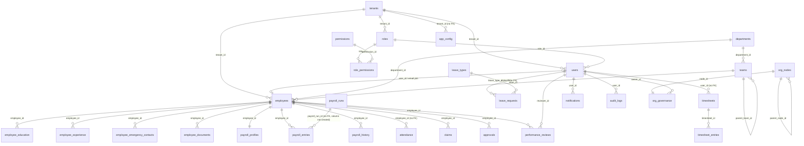

---

## Phase 6b. API Permission Matrix

### 6b.1 How permissions are defined, mapped and checked
- **Catalogs** [Confirmed]: two catalogs. `schema.ts:306-360` has 40 keys (`module:action`), and `seedPermissions.ts:26-69` has 27 keys that partly overlap. Seeded role → permission mapping: `schema.ts:363-393` (admin = all; hr; manager; employee). Custom roles created implicitly by `ensureRoleExists` receive `{attendance,leave,timesheet,profile}:view` (`employees.repository.ts:151-167`).
- **Token**: login loads `role_permissions` for `user.role_id` into the JWT (`auth.service.ts:28-43`). The role name is taken from the `roles` row (`auth.repository.ts:434`). A user with no role gets `COALESCE(u.role_id, 4)`, i.e. **role id 4** (`auth.repository.ts:419,423`) [Confirmed]. Which role has id 4 is [Unknown] (it depends on insert order).
- Permissions are frozen in the 15-minute access token. There is no revocation on role change [Inferred from `jwt.service.ts:5`].
- **Check** (`authorize.ts:77-131`) [Confirmed]:
  1. `role === 'super_admin'` → pass (`:89`).
  2. `dashboard_type === 'admin'` → **pass everything** (`:93`). Seed sets `hr` to `dashboard_type='admin'` (`schema.ts:450`), and **any custom role can be created or edited with `dashboard_type:'admin'`** (`rbac.service.ts:51-56,71-75`).
  3. A `module:action` entry → exact match in the JWT.
  4. A legacy role-name entry → passes if the user has **any one** of the mapped permissions (`ROLE_TO_PERMISSIONS`, `:69-75,108-111`). `admin` → {settings:manage, employees:view, …, reports:view}; `hr` → {employees:view, leave:approve, attendance:manage…}; `manager` → {…, attendance:view}; `employee` → {attendance:view, …}.
  5. Otherwise an exact role-name match.
- `requireSelfOrAdmin` checks role **names** `super_admin|admin|hr|manager` (`authorize.ts:159-164,204`).
- Hard-coded role names in business code [Confirmed]: `employees.controller.ts:47,71,88,105`; `documents.service.ts:13`; `reviews.service.ts:27`; `approvals.repository.ts:13`; `organization.repository.ts:83`; `templates.service.ts:6,37,43,52,61` (notification targeting); `seedPermissions.ts:139-147`; `employees.service.ts:385`.

**Effective access of seeded roles** (S=super_admin, A=admin [dash admin], H=hr [dash admin], M=manager, E=employee, C=implicit custom role). Derived from the rules above with `schema.ts:363-393`:
- Guard containing `admin` or `hr` (settings, employees create/delete, documents verify/delete, governance write, organization write) → **S A H M pass** (M holds `employees:view`, `leave:approve`, `reports:view`, `attendance:manage`); E and C fail.
- Guard containing `manager` or `employee` (performance create, employees list) → **all roles including E and C pass** (`attendance:view` is in the manager map, and E and C hold it).

### 6b.2 Full endpoint matrix (all mounted routes)
Base path `/api/v1`. "auth" = `authenticate`. "Guard" = role/permission middleware as written (effective roles in brackets). "Tenant" = whether the SQL filters by JWT tenant.

| # | Method | Path | Auth | Guard (effective) | Tenant | Notes |
|---|---|---|---|---|---|---|
| 1 | GET | /health | none | — | n/a | `app.ts:94` |
| 2 | GET | / | none | — | n/a | `app.ts:129` |
| 3 | GET | /auth/repair-identity | none | — | n/a | stub (`auth.controller.ts:124`) |
| 4 | POST | /auth/login | none | — | user's own | **Backdoor**: admin@company.com accepts `admin123`/`Admin@123` regardless of hash (`auth.service.ts:23-25`); plaintext temp_password accepted (`:20-22`) |
| 5 | POST | /auth/refresh | none | — | — | refresh JWT verified, but **not compared to stored `refresh_token`** (`auth.service.ts:60-96`) → logout does not revoke |
| 6 | POST | /auth/forgot-password | none | — | — | creates `password_reset` approval; 404 discloses whether the account exists (`auth.service.ts:143-146`); returns `requestId` |
| 7 | GET | /auth/forgot-password/status | none | — | — | **returns `resetToken` once approved, to anyone who knows the email** (`auth.service.ts:207`) |
| 8 | POST | /auth/reset-password | none | — | — | token **optional**; checked only if supplied (`auth.service.ts:246`) |
| 9 | POST | /auth/logout | auth | — | — | clears stored refresh token (unused by refresh) |
| 10 | GET | /auth/me | auth | — | self | |
| 11 | PUT | /auth/me | auth | — | self | |
| 12 | PUT | /auth/me/preferences | auth | — | self | |
| 13 | PUT | /auth/status | auth | — | self | SSE broadcast |
| 14 | PUT | /auth/me/password | auth | — | self | no current password needed if `is_password_temp` (`auth.service.ts:130-135`) |
| 15 | GET | /users | auth | none | yes | lists tenant users and roles |
| 16 | PUT | /users/profile | auth | none | yes | **IDOR: `id` from body; changes any tenant user's name/email** (`users.controller.ts:9-10`, `users.repository.ts:4-17`) |
| 17 | GET | /attendance/today | auth | requireSelfOrAdmin (name-based) | yes | |
| 18 | GET | /attendance/history | auth | requireSelfOrAdmin | yes | M sees any employee, not just team |
| 19 | GET | /attendance/weekly-hours | auth | requireSelfOrAdmin | yes | |
| 20 | GET | /attendance/summary/:userId | auth | requireSelfOrAdmin | yes | |
| 21 | POST | /attendance/check-in | auth | none | yes | self from JWT |
| 22 | POST | /attendance/check-out | auth | none | yes | |
| 23 | POST | /attendance/regularize | auth | none | yes | **inserts a 'present' row directly, no approval, any past/future date** (`attendance.repository.ts:124-131`) |
| 24 | GET | /leave/types | auth | none | **no** | `leaves.repository.ts:5` |
| 25 | POST | /leave/apply | auth | none | yes | no balance, overlap or date check |
| 26 | GET | /leave | auth | none | yes | **all tenant leave requests; `?userId=` any** (`leaves.repository.ts:18-35`) |
| 27 | GET | /leave/requests | auth | none | yes | alias of 26 |
| 28 | DELETE | /leave/requests/:id | auth | none | yes | deletes **anyone's** pending leave |
| 29 | PUT | /leave/requests/:id | auth | none | yes | edits anyone's pending leave |
| 30 | GET | /leave/balance | auth | requireSelfOrAdmin | partial | balance query leaks across tenants' leave types |
| 31 | PUT | /leave/:id/approve | auth | **none** | yes | **any user approves any leave incl. own; `approved_by` from body** (`leaves.controller.ts:27-33`) |
| 32 | PUT | /leave/:id | auth | none | yes | as 29 |
| 33 | DELETE | /leave/:id | auth | none | yes | as 28 |
| 34 | GET | /timesheets/week | auth | requireSelfOrAdmin | yes | **GET creates a timesheet row** (`timesheets.service.ts:20-23`) |
| 35 | GET | /timesheets/history | auth | requireSelfOrAdmin | yes | |
| 36 | GET | /timesheets/pending | auth | none | yes | all tenant submissions |
| 37 | PUT | /timesheets/:id/entries | auth | none | **no** | **edit any timesheet in any tenant and in any status** (`timesheets.repository.ts:25-43`) |
| 38 | PUT | /timesheets/:id/submit | auth | none | yes | no ownership check |
| 39 | PUT | /timesheets/:id/approve | auth | **none** | yes | self-approval; `approved_by` from body |
| 40 | GET | /employees/check-email | auth | none | **no** | enumerates employees across tenants (`employees.repository.ts:311-321`) |
| 41 | GET | /employees/roles | auth | none | partial | inline SQL |
| 42 | GET | /employees/me | auth | none | yes | |
| 43 | GET | /employees | auth | `[admin,super_admin,hr,manager,employee,employees:read,employees:manage]` (all) | yes | |
| 44 | POST | /employees | auth | `[admin,super_admin,hr,employees:manage]` (S A H **M**) | partial | **`role` from body, e.g. `super_admin`, creates a user with that role; temporary password emailed to the attacker-chosen address** (`employees.service.ts:259-260,266-288`) |
| 45 | GET | /employees/:id/education | auth | none | **no** | |
| 46 | PUT | /employees/:id/education | auth | inline name check | no | |
| 47 | GET | /employees/:id/experience | auth | none | **no** | |
| 48 | PUT | /employees/:id/experience | auth | inline | no | |
| 49 | GET | /employees/:id/emergency-contacts | auth | none | **no** | cross-tenant PII |
| 50 | POST | /employees/:id/emergency-contacts | auth | inline | partial | |
| 51 | PUT | /employees/:id | auth | inline: role name in [admin,super_admin,hr] else own only | partial | self-edit can still change `email`, `reporting_manager_id`, `bank_account_number`, `exit_date`, `team_id` (`employees.controller.ts:54`); admin path can set `role` (`employees.service.ts:342-345`) |
| 52 | POST | /employees/bulk-upload | auth | as 44 (S A H M) | partial | 50-row cap |
| 53 | DELETE | /employees/:id | auth | as 44 (S A H M) | partial | **hard delete** of 15 child tables with no tenant filter (`employees.repository.ts:337-351`) |
| 54 | GET | /payroll/employees | auth | **none** | yes | **all salaries and bank accounts to any user** |
| 55 | PUT | /payroll/employees/:id | auth | **none** | yes | **any user edits any salary structure** |
| 56 | GET | /payroll/history/:employeeId | auth | none | — | stub `[]` |
| 57 | GET | /payroll/runs | auth | none | yes | |
| 58 | GET | /payroll/activity | auth | none | yes | |
| 59 | GET | /payroll/pending-approvals | auth | none | yes | |
| 60 | GET | /payroll/live-summary | auth | none | yes | |
| 61 | GET | /payroll/deadlines | auth | none | n/a | |
| 62 | GET | /payroll/tax-summary | auth | none | yes | |
| 63 | POST | /payroll/process | auth | **none** | yes | **any user runs payroll, repeatable** |
| 64 | GET | /reports/admin | auth | none | yes | org salary, attrition, audit activity |
| 65 | GET | /reports/manager | auth | none | **no** | `?userId=` any |
| 66 | GET | /reports/employee | auth | none | **no** | `?userId=` any |
| 67-69 | GET | /reports/dashboard, /dashboard/manager, /dashboard/employee | auth | none | as 64-66 | aliases |
| 70 | GET | /reports/departments | auth | none | yes | alias of summary |
| 71 | GET | /reports/team | auth | none | **no** | `?managerId=` any |
| 72 | GET | /reports/profile/:employeeId | auth | none | **no** | **any employee in any tenant: payroll profile, documents, emergency contacts, reviews** (`analyticsService.ts:636-684`) |
| 73 | GET | /reports/analytics | auth | none | yes | |
| 74 | GET | /reports/summary | auth | none | yes | |
| 75 | POST | /claims | auth | none | yes | `employee_id` from body: file claims as anyone; negative amounts accepted |
| 76 | GET | /claims/employee/:employeeId | auth | none | yes | any employee's claims |
| 77 | GET | /claims | auth | none | yes | all claims |
| 78 | PUT | /claims/:id/status | auth | **none** | yes | self-approval |
| 79 | GET | /approvals | auth | none (filter only for role names manager/employee) | partial | custom roles see the whole inbox |
| 80 | POST | /approvals | auth | none | yes | arbitrary type/status |
| 81 | POST | /approvals/:id/action | auth | **none** | partial | **approve any request, incl. `password_reset` → account takeover**; dept/team creation; onboarding activation |
| 82 | GET | /audit-logs | auth | **none** | yes | every user reads all tenant audit logs incl. IP/UA |
| 83 | GET | /notifications | auth | none | self | |
| 84 | PUT | /notifications/read-all | auth | none | self | |
| 85 | PUT | /notifications/:id/read | auth | none | self | |
| 86 | GET | /performance | auth | none | yes | all reviews; `?employeeId=` any |
| 87 | POST | /performance | auth | `[manager,hr,admin,super_admin]` (**all incl. E, C**) | yes | |
| 88 | PUT | /performance/:id | auth | **none** | yes | **employee can rewrite own rating/status** |
| 89 | DELETE | /performance/:id | auth | `[admin,super_admin]` (S A H M at guard) + service role-name check (A, S only) | yes | |
| 90 | GET | /documents/:employeeId | auth | service check only if role name == `employee` | yes | custom roles and managers read anyone's documents |
| 91 | POST | /documents | auth | none | yes | upload to any employee |
| 92 | PUT | /documents/:id/verify | auth | `[hr,admin,super_admin]` (S A H M) | yes | `updated_at` column missing (4c.3) |
| 93 | DELETE | /documents/:id | auth | as 92 | yes | |
| 94-96 | GET | /settings/permissions, /settings/roles | auth | settings guard `[admin,super_admin,hr,settings:manage]` (**S A H M**) | n/a / partial | |
| 97 | POST | /settings/roles | auth | settings | yes | can set `dashboard_type:'admin'` → full bypass |
| 98 | PUT | /settings/roles/:id | auth | settings | **cross-tenant** (`tenant_default`) | can flip any role, incl. system roles, to `dashboard_type:'admin'` |
| 99 | DELETE | /settings/roles/:id | auth | settings | cross-tenant | user-count check not tenant-scoped |
| 100 | PUT | /settings/roles/:id/permissions | auth | settings | cross-tenant | **replace permissions of any role, incl. system roles** |
| 101 | GET | /settings/config | auth | settings | partial | **returns `smtp_pass` in clear** (`configuration.repository.ts:18-24`, consumed at `emailService.ts:62-84`) |
| 102 | PUT | /settings/config | auth | settings | yes | arbitrary categories and keys |
| 103 | POST | /settings/test-email | auth | settings | n/a | sends mail to any address (relay) |
| 104 | GET | /settings/users | auth | settings | partial | **returns every user's plaintext `temp_password`** (`user-assignments.repository.ts:9`) |
| 105 | POST | /settings/users | auth | settings | yes | any role or `role_id` |
| 106 | POST | /settings/users/:id/send-welcome | auth | settings | yes | can set the password |
| 107 | POST | /settings/users/:id/reset-password | auth | settings | yes | returns the new password |
| 108 | GET | /settings/users/:id/temp-password | auth | settings | yes | plaintext |
| 109 | PUT | /settings/users/:id/password | auth | settings | yes | stores the password in plaintext `temp_password` too (`user-assignments.service.ts:94`) |
| 110 | PUT | /settings/users/:id/role | auth | settings | partial | **manager → assign self `super_admin`**; `role_id` not validated against tenant |
| 111 | PUT | /settings/users/:id/status | auth | settings | yes | deactivate admins |
| 112 | DELETE | /settings/users/:id | auth | settings | yes | soft delete |
| 113 | GET | /organization/team-status | auth | none | yes | role-name check `organization.repository.ts:83` |
| 114 | GET | /organization/departments | auth | none | yes | |
| 115 | POST | /organization/departments | auth | `[admin,super_admin,organization:manage,employees:manage]` (S A H M) | yes | creates an approval only |
| 116-117 | PUT/DELETE | /organization/departments/:id | auth | as 115 | yes | direct, no approval |
| 118 | GET | /organization/teams | auth | none | yes | |
| 119-121 | POST/PUT/DELETE | /organization/teams[/:id] | auth | as 115 | yes | |
| 122 | GET | /governance/tree | auth | none | partial | **GET triggers sync writes** (`org-tree.service.ts:17-26`) |
| 123 | GET | /governance/search | auth | none | partial | |
| 124 | PUT | /governance/:nodeId | auth | `[admin,hr,super_admin]` (S A H M) | **no** | upsert by node_id without a tenant check (`org-tree.repository.ts:28-38`) |
| 125 | POST | /governance/sync | auth | as 124 | partial | |
| 126 | GET | /governance/resolve/:nodeId | auth | none | partial | |
| 127 | GET | /realtime/stream | auth (query token) | none | yes | in-memory SSE |
| 128 | GET | /workspace | auth | none | yes | name and logo only |

### 6b.3 Answers
- **Are permissions enforced server-side?** Only on 23 of 128 routes, and through a guard that grants role-name entries to anyone holding *one* related permission [Confirmed, 6b.1-6b.2]. Every payroll, leave, timesheet, claim, approval, audit, reports and performance-update route checks authentication only.
- **Can an authenticated low-privilege user call sensitive APIs directly?** Yes [Confirmed]:
  - Payroll run: `POST /payroll/process` (#63).
  - Salary read: #54 and #72 (the latter cross-tenant).
  - Salary write: #55.
  - Leave, timesheet, claim and generic approvals, including **self-approval**: #31, #39, #78, #81.
  - Audit read: #82.
  - RBAC edits and user/role assignment: #97-#112 for managers, via the legacy mapping. This is the prior S4, **still present**: `settings/index.ts:11` + `authorize.ts:69-75,108-111` + manager's `employees:view` in `schema.ts:376-384`.
  - Super-admin creation by HR or manager via `POST /employees {role:'super_admin', email: attacker-controlled}` (#44).
  - **Account takeover of any user by any employee:** `POST /auth/forgot-password` (victim email) → `POST /approvals/std-<requestId>/action {action:'approve', type:'password_reset'}` (falls into the generic branch, `approvals.service.ts:89-91`) → `POST /auth/reset-password` without a token (`auth.service.ts:246`). Prior S2, **still present**.
- **Modules hard-coded on role names:** employees (controller), documents, performance/reviews, approvals (inbox filter), organization (team-status), notifications (role-targeted templates), attendance, leave and timesheets (`requireSelfOrAdmin`), auth (`admin@company.com` backdoor), seedPermissions [Confirmed, 6b.1].
- Other prior leads re-verified: default JWT secrets `ems_secret` / `ems_refresh_secret` (`config/env.ts:9-10`), **still present**. The admin password is reset to `admin123` on every `db:setup` (`initDb.ts:450-466`), and two named demo accounts are seeded with plaintext temp passwords in source (`initDb.ts:487-498`), **still present**. `admin@company.com` is forced to super_admin on every boot (`seedPermissions.ts:139-147`), **still present**.

### 6b.4 Target enterprise RBAC/ABAC for this codebase
Design principles: permissions are the only gate. Role names never appear in code. Every check carries a **scope** resolved from data the repos already hold (`employees.reporting_manager_id`, `department_id`, `team_id`, `org_governance.owner_id`).

1. **Permission catalog (single source)**: `server/src/core/security/permissions.ts` exports a typed constant, e.g. `PAYROLL_RUN='payroll:run'`, `PAYROLL_SALARY_READ='payroll:salary.read'`, `LEAVE_APPROVE='leave:approve'`, `RBAC_ROLE_WRITE='rbac:role.write'`, `AUDIT_READ='audit:read'`. One migration reconciles both existing vocabularies (`schema.ts:306-360`, `seedPermissions.ts:26-69`) into it and deletes the unused keys. Seeding is a versioned migration, not a boot hook.
2. **Role → permission + scope**: add `role_permissions.scope ENUM('self','team','department','org')` (default `'self'`), and add `tenant_id` to `permissions` only if tenant-custom permissions are needed. System roles are immutable templates; tenants clone them. Remove the `dashboard_type='admin'` bypass and `ROLE_TO_PERMISSIONS`; keep a single platform `super_admin` flag on `users`, not on a tenant-editable role.
3. **Policy middleware**: `can(permission, { resource: loader, ownerField })`. The route loads the target row (tenant-filtered), then a policy decides:
   - `self` → `resource.user_id === actor.userId`
   - `team` → `resource.employee.reporting_manager_id === actor.userId`
   - `department` → same `department_id`
   - `org` → same tenant
   - plus **separation of duties**: approve actions reject `resource.user_id === actor.userId` (no self-approval), and payroll `finalize` requires a different actor than `run`.
   Permissions are re-read from the DB (or a 60 s cache keyed by `role_id` and a role version) instead of being trusted from a 15-minute JWT, so revocation takes effect.
4. **Field-level**: a per-resource field policy map, e.g. `employee: { annual_ctc: 'payroll:salary.read', bank_account_number: 'payroll:salary.read', personal_email: 'employees:pii.read' }`, applied by a serializer in the repository return path (`employees.repository.ts:findMany/findById`, `analyticsService.getEmployeeProfile`). Writes use an allow-list per permission, replacing the deny-list in `employees.controller.ts:54`.
5. **Tenant enforcement**: a request-scoped DB client that runs `SET LOCAL app.tenant_id = $1`, plus Postgres RLS policies `USING (tenant_id = current_setting('app.tenant_id'))` on every tenant table. Delete all `OR tenant_id='tenant_default'` fallbacks.
6. **UI permission manifest**: `GET /api/v1/auth/permissions` returns `{ permissions: [{key, scope}], fields: {...}, version }`. The SPA hides or disables controls from it; the server remains the authority.
7. **Audit**: every `can()` decision on a mutating route and every RBAC change emits an `audit_logs` row (actor, permission, scope, resource, before/after) through a transactional outbox table rather than the in-process bus.
8. **Tests**: populate `authz.matrix.test.ts:31` with one row per route in 6b.2.

```mermaid
flowchart LR
  REQ[Request + JWT userId,tenantId] --> AUTHN[authenticate]
  AUTHN --> TEN[tenantContext\nSET LOCAL app.tenant_id]
  TEN --> LOAD[resource loader\nRLS-filtered]
  LOAD --> PDP{Policy decision\npermission + scope + SoD}
  PDP -->|role_permissions(scope) cache| CAT[(permissions catalog)]
  PDP -->|deny| E403[403 + audit]
  PDP -->|allow| SVC[service]
  SVC --> FLD[field policy serializer]
  FLD --> RES[response]
  SVC --> OUTBOX[(audit outbox)]
  MAN[GET /auth/permissions manifest] --> CAT
```

---

## Phase 3. Business Workflow Analysis

### 3.1 Authentication
- Happy path: `POST /auth/login` → bcrypt compare → permissions from `role_permissions` → 15-minute access JWT plus 7-day refresh JWT; the refresh JWT is stored on `users.refresh_token` (`auth.service.ts:15-58`, `jwt.service.ts:5-6`). `mustChangePassword` is returned (`auth.controller.ts:30`). Forced change is **not enforced** server-side: every API works with a temp-password session [Inferred, no middleware checks `is_password_temp`].
- Failure paths: inactive or deleted user → 401 (`auth.repository.ts:425`); no tenant → 401 (`auth.service.ts:34`); rate limit 10 per 15 min per IP (`app.ts:46-52`).
- Edge cases: login also matches **`personal_email`** (`auth.repository.ts:424`). Refresh rejects inactive or deleted users (`findUserById` filters `is_active`, `auth.repository.ts:447`), but **does not compare the stored token**, so stolen refresh tokens stay valid for 7 days after logout (`auth.service.ts:60-96`) [Confirmed].
- Forgot/reset is an admin-approval flow, not an email-token flow: request → `approvals(type='password_reset')` → admin approves → the user polls `/forgot-password/status`, which returns the reset token → `/reset-password` (`auth.service.ts:141-257`). Security risks [Confirmed]: any authenticated user can approve (#81); the token is disclosed by an unauthenticated GET; the token is optional on reset; account enumeration via 404; `completePasswordReset` updates **all users with that email across tenants** (`auth.repository.ts:572-576`).
- Set password or first login: `PUT /auth/me/password` without the current password when `is_password_temp` (`auth.service.ts:130-135`).
- Backdoors and secrets: `auth.service.ts:23-25`; plaintext `temp_password` accepted for login (`:20-22`); default JWT secrets (`env.ts:9-10`).
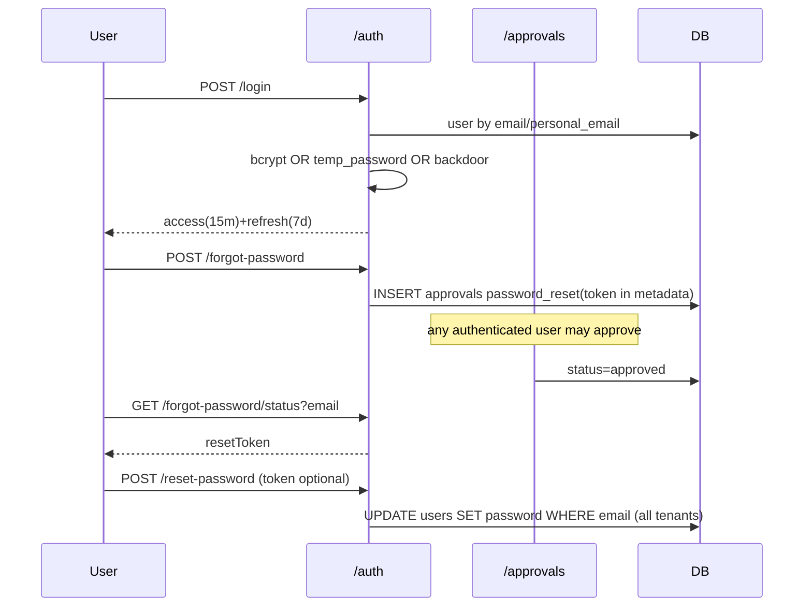

### 3.2 Employee management (create, update, deactivate, onboarding, offer letter)
- Happy path: `POST /employees` → transaction: duplicate checks (global) → next `EMP###` → insert employee (status `onboarding`) → `ensureRoleExists(role)` (creates the role if unknown) → insert user with hashed temp password → **await offer-letter PDF and welcome email inside the transaction** → insert payroll profile (50/20/25/5 split of CTC) → notification (`employees.service.ts:183-306`).
- Onboarding approval: the employee appears in the approvals inbox as `onb-<id>`; approve sets `status='active'` and emails (`approvals.service.ts:31-60`). Anyone can approve (#81).
- Failure path: if the payroll-profile insert fails after the email is sent, the transaction rolls back but the **candidate already received credentials for a non-existent account** [Inferred from order, lines 266-300].
- Data integrity [Confirmed/Inferred]:
  - ID generation by `SELECT max` without a lock means concurrent creates collide on the PK (`:223-231`).
  - Global email uniqueness.
  - The bulk upload pre-validation uses `findMany` search, then inserts row by row in separate transactions (`:538-553`).
  - Deactivation does not exist as a state transition: `DELETE /employees/:id` hard-deletes 15 child tables, **including payroll history and entries**, falling back to a soft delete only on error (`employees.repository.ts:331-382`). That destroys statutory payroll records.
  - Status may be set to any string by admin/HR via PUT (no enum, `employees.schema.ts:44`).
- Security: role escalation via the `role` field (#44, #51); self-edit can change login email and reporting manager (`employees.controller.ts:54`).
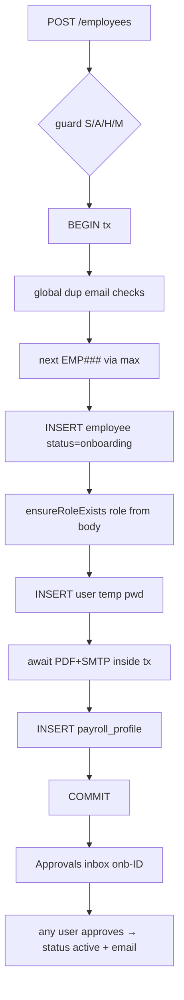

### 3.3 Leave
- Happy path: `POST /leave/apply` (user from JWT) → insert pending → notify users whose legacy `role` is admin/hr/manager (`leaves.service.ts:16-32`). Approve: `PUT /leave/:id/approve {action}` → update status → notify (`leaves.service.ts:38-52`).
- Failure path: an unknown id returns 404; edit or delete only while `status='pending'` (`leaves.repository.ts:54,63`).
- Edge cases and integrity [Confirmed]:
  - No `start<=end` check, no overlap check, no balance check, so **negative balances are possible** (the `available` column simply goes negative, `leaves.repository.ts:73`).
  - Days are calendar days including weekends and holidays (`:72`).
  - No half days, no carry-forward; the `leave_balances` view promised in `migration_v3.ts:12` does not exist.
  - Approve has **no status precondition**, so it can flip rejected ↔ approved repeatedly (double approval) (`leaves.repository.ts:37-44`).
  - Self-approval and spoofed `approved_by` (`leaves.controller.ts:29-31`).
  - Edit and delete of other users' requests.
  - The approvals-inbox path updates the same table without `approved_by` (`approvals.repository.ts:183-185`), and does not see API-created leaves at all (4c.3).
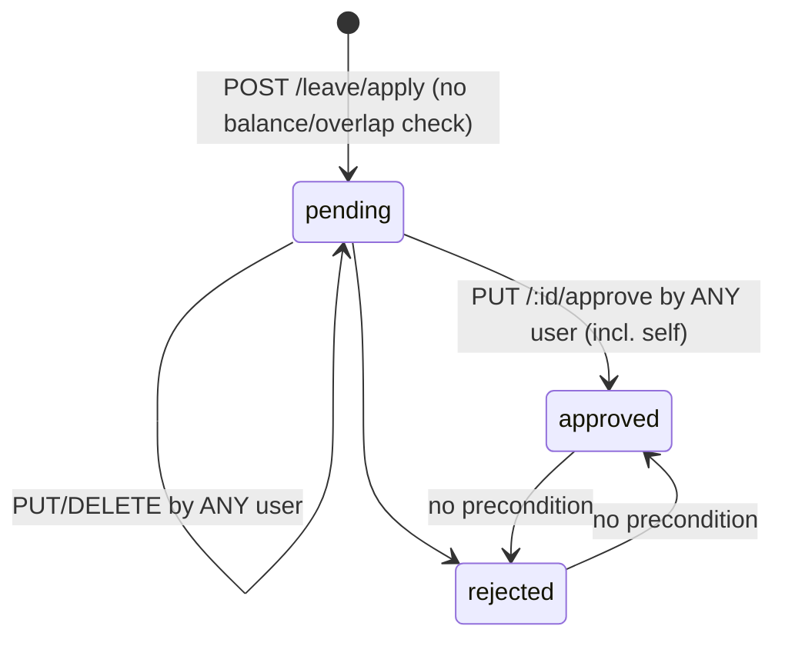

### 3.4 Attendance (check-in/out, regularization)
- Happy path: check-in resolves the employee by email or `user_id`, rejects if an open session exists today, and inserts (`attendance.service.ts:42-57`); check-out closes today's open session (`attendance.repository.ts:59-69`).
- Edge cases: multiple sessions per day are allowed by design. The open-session check is not atomic and there is no partial unique index, so **concurrent check-ins create two open sessions** [Inferred]. A session left open past midnight can never be checked out (`date = CURRENT_DATE`, `:64`). Server timezone defines "today" [Inferred]. No geo/IP capture despite `ip_address` in types.
- Regularization is **not a request**: it directly inserts a 'present' row for any date, without approval or a duplicate check (`attendance.repository.ts:124-131`). The `reason` is validated but discarded.
- Reporting drift: attendance-based dashboards read legacy columns (4c.3).
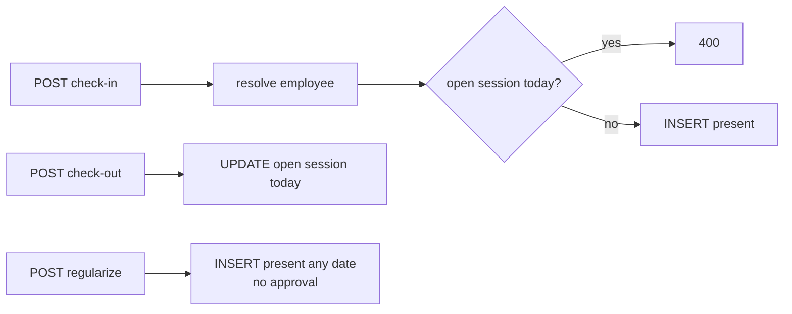

### 3.5 Timesheets
- Happy path: `GET /week?weekStart` gets or creates a draft → `PUT /:id/entries` replaces entries and recomputes the total → `PUT /:id/submit` (draft or rejected → submitted) → `PUT /:id/approve` (`timesheets.service.ts`).
- Integrity [Confirmed]:
  - Entries can be edited on **any timesheet id, any tenant, any status**, including approved ones.
  - The "transaction" there is ineffective (4b.4).
  - Hours are unbounded and may be negative (`parseFloat`, `timesheets.service.ts:34-36`).
  - No `UNIQUE(user_id, week_start)`, so GET races create duplicates.
  - `weekStart` is not normalised to a Monday.
  - Submit and approve check no ownership; approve has no status precondition; self-approval is possible.
  - `onTimesheetSubmitted`/`onTimesheetApproved` templates exist but are never called (grep) [Confirmed].
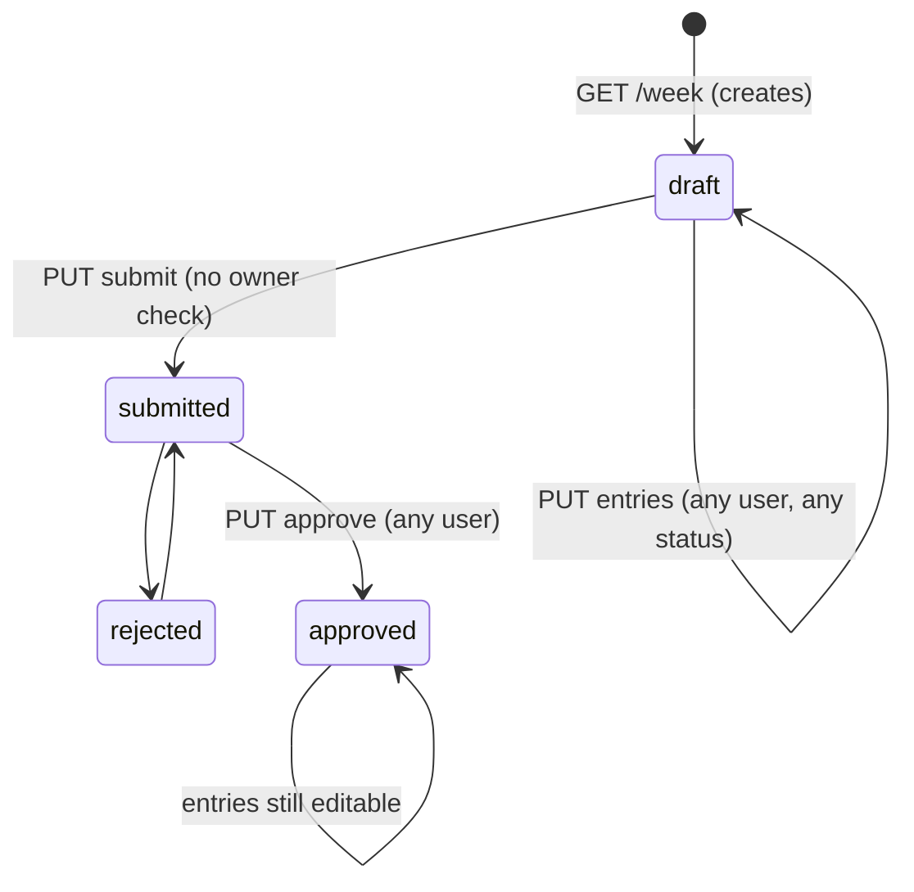

### 3.6 Payroll (run, payslip, statutory)
- Happy path: `POST /payroll/process {month,year}` → transaction: insert `payroll_runs` → for every `payroll_profiles` row of the tenant compute gross = basic+hra+allowances+bonus+overtime; PF 12% of basic; PT ₹200 if CTC>1.8L; TDS 15% of gross if CTC>10L, 5% if >5L; ESI 0.75% if CTC<2.52L → insert entry → upsert history 'paid' → notify (`payroll.service.ts:200-254`).
- Failure path: any insert error rolls back the run (`database/transaction.ts`). Note `payroll_run_id` and `payroll_history.name` are not created by any script (4c.3), so the run fails on a DB built from the repo [Inferred].
- Integrity and compliance [Confirmed]:
  - **No idempotency**: the run id includes `Date.now()`, and `payroll_runs` has no `UNIQUE(tenant,month,year)`. Re-running duplicates `payroll_entries` and silently overwrites history.
  - No draft → review → finalize → lock states, although the catalog has `payroll:run/adjust/finalize` (`schema.ts:334-336`).
  - Includes profiles of **terminated or soft-deleted employees** (no join to `employees.status`, `payroll.repository.ts:66-69`).
  - No proration for joiners, leavers, LOP or attendance.
  - TDS is a flat percentage of monthly gross, not slab or regime based; `tax_regime` is stored but unused; the ESI threshold is compared against annual CTC.
  - `getTaxSummary` uses a different formula (TDS on basic) from the run (`:183-198` vs `:219`).
  - Rounding: only PF and ESI are rounded.
  - **Payslip**: there is no endpoint. `/payroll/history/:employeeId` returns `[]` (`payroll.routes.ts:16-18`); `utils/pdfGenerator.ts` is unused. The "Payslip Available" notification goes to legacy role names `employee` and `manager` (`templates.service.ts:37`).
  - No authorization (#54-#63).
```mermaid
sequenceDiagram
  participant Any as Any authenticated user
  participant P as /payroll/process
  participant DB
  Any->>P: {month,year}
  P->>DB: BEGIN; INSERT payroll_runs RUN-y-m-<ms>
  loop every payroll_profile (incl. exited)
    P->>DB: INSERT payroll_entries
    P->>DB: UPSERT payroll_history status=paid
  end
  P->>DB: COMMIT
  P->>DB: notifications by legacy role
  Note over P: re-run = duplicate entries, no finalize/lock, no payslip API
```

### 3.7 Claims
- Happy path: `POST /claims` → pending → `PUT /:id/status {approved|rejected}` (`claims.service.ts`).
- Risks [Confirmed]: `employee_id` is taken from the body, so a user can submit claims for others (`claims.schema.ts:4`); negative or zero amounts; no receipt or attachment field; self-approval; the status can flip repeatedly; no link to payroll reimbursement (payroll counts a **different** table, `reimbursement_claims`, `payroll.repository.ts:62`). The id `CLM-<ms>` collides under concurrency (PK violation → 409) [Inferred].
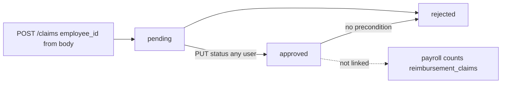

### 3.8 Approvals engine
- There is no engine: a UNION view across `approvals`, legacy `leave_requests`, `employees(status onboarding)`, legacy `timesheets` and `claims` (`approvals.repository.ts:9-123`), plus a `type`-switch on action (`approvals.service.ts:25-92`).
- There is no routing, no levels, no delegation, no SLA/escalation, no comments and no `actioned_by`/`actioned_at` writes (the columns exist in `schema.ts:185-186` but are never set) [Confirmed].
- Scoping applies only to role names `manager`/`employee`; it compares `employees.manager_id` (a TEXT column rarely set) instead of `reporting_manager_id` (`:13-15,34`).
- The `type` comes from the client, so a mismatched `type` updates the wrong table with a stripped id (`approvals.service.ts:26`).
- Department and team creation approval runs in a transaction; other branches do not; there is no status precondition, so double processing is possible.
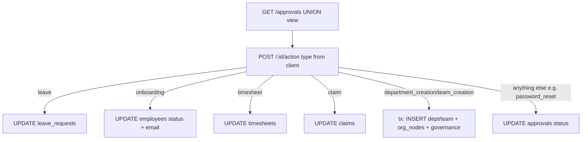

### 3.9 Notifications
- In-app only, written synchronously and non-blocking (errors swallowed, `channels.repository.ts:18-20`). Targeting uses legacy `users.role` (`:23-27`), so custom-role users miss them. Email delivery is separate (`emailService.ts`). Preferences are a stub (`preferences.service.ts:1-5`).
- No real-time push of notifications (SSE only broadcasts status updates). No unread-count endpoint beyond list meta.
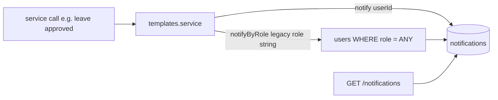

### 3.10 Reports
- Admin dashboard and summary are tenant-scoped aggregate SQL (`analyticsService.ts:70-...`). Manager, employee, team and profile are keyed only by ids from the query or path, with **no tenant filter and no authorization** (#64-#74). `recentReports` is hard-coded fake data (`reports.controller.ts:121-125`). There is no export despite `reports:export` and `audit:export` permissions (the export service is a stub, `audit/export/export.service.ts:1-6`).
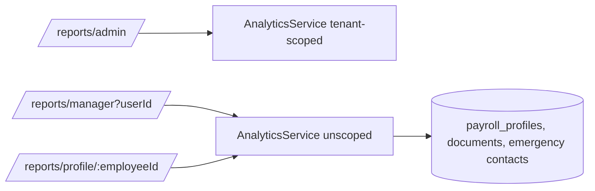

### 3.11 Admin settings (configuration)
- `PUT /settings/config {category, settings}` upserts key/values; the table is created on first save (`configuration.service.ts:28-40`). The SMTP password is stored in plaintext in `app_config` and returned by GET (#101). There is no validation or allow-list of keys, and changes are not audited.
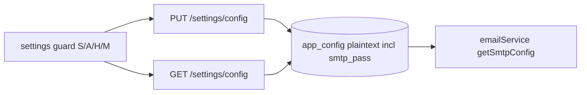

### 3.12 Role management
- Create, edit and delete roles and replace their permissions (`rbac.service.ts`). Risks [Confirmed]:
  - No `is_system` protection on permission replacement (`:85-98`).
  - Roles from `tenant_default` are editable by every tenant (`rbac.repository.ts:63,83`).
  - `updateRolePermissions` deletes and then re-inserts **without a transaction** (`:89-97`), so a mid-way failure leaves the role with no permissions.
  - Delete counts users across tenants (`:70`).
  - User role assignment accepts any `role_id` (`user-assignments.repository.ts:62-66`).
  - Changes take effect only at the next login or refresh (JWT).
  - Nothing is audited.
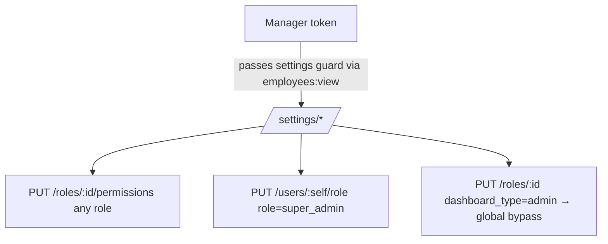

### 3.13 Documents
- Metadata only: `file_path` is a client string; there is no upload, storage, AV scan or signed URLs (`documents.repository.ts:17-27`). The verify path writes the non-existent `updated_at` (4c.3). Read access is restricted only for role name `employee`, and the restriction compares `employees.user_id` (often NULL) [Confirmed, `documents.service.ts:12-19`].
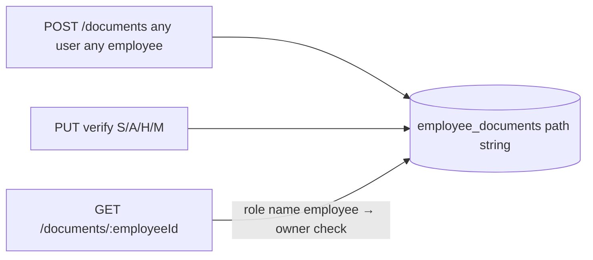

### 3.14 Performance
- Create (any role, #87), update (no guard, so the employee can change their own rating or status, #88), delete (admin by name). No cycles, goals or ratings modules (stubs). Rating CHECK 1..5 exists only in the v3 DDL (`migration_v3.ts:122`).
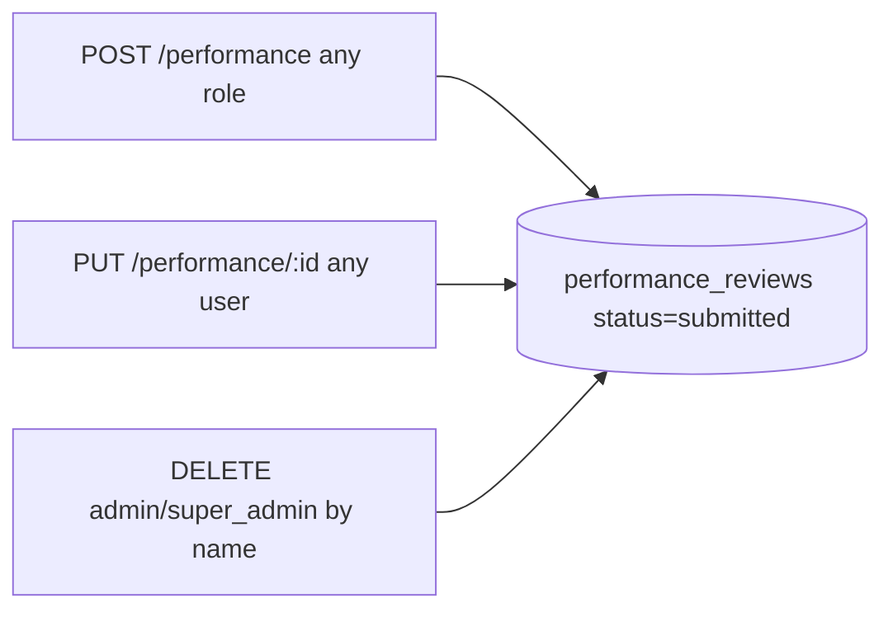

### 3.15 Organization and governance
- Department and team create → approval → approve (anyone) → transaction inserts the entity, the `org_nodes` node and governance (`approvals.repository.ts:140-181`). Update and delete bypass the approval (`organization.repository.ts:28-69`); delete of a department cascades to teams (`initDb.ts:160`) and leaves `org_nodes` orphaned [Inferred: no FK from org_nodes.entity_id].
- `GET /governance/tree` performs writes (auto-sync). The governance upsert is keyed on `node_id` only, without tenant validation (`org-tree.repository.ts:28-38`).
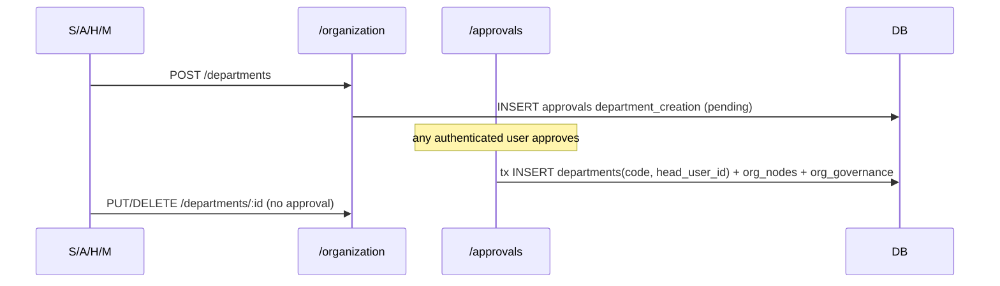

---

## [Unknown] items
- Live production schema: `server/db/baseline/0000_live_schema.sql` is not in the repository, so whether the drift columns in 4c.3 exist in production cannot be determined. Not enough evidence found in repository.
- Which role has `id = 4` (the default for users without `role_id`, `auth.repository.ts:419`). Not enough evidence found in repository.
- Whether production roles hold the schema.ts vocabulary (which makes manager → settings escalation work) or a hand-edited set. Not enough evidence found in repository.

## Files reviewed
server/src/index.ts; server/src/app.ts; server/src/instrument.ts (partial); server/src/config/db.ts; server/src/config/env.ts; server/src/database/client.ts; server/src/database/transaction.ts; server/src/db.ts; server/src/db/connection.ts; server/src/db/schema.ts; server/src/db/migration_v3.ts; server/src/initDb.ts; server/src/scripts/phase2_migrations.ts; server/src/scripts/seedPermissions.ts; server/src/scripts/legacy_cleanup.ts; server/src/types/index.ts; server/src/middleware/authMiddleware.ts; server/src/middleware/errorHandler.ts; server/src/core/errors/{AppError,asyncHandler,errorHandler}.ts; server/src/core/events/{eventBus,eventContracts,eventPublisher,eventTypes,registry}.ts; server/src/core/response/ApiResponse.ts; server/src/core/security/{authorize,jwt.service,password.service}.ts; server/src/core/validation/validateRequest.ts; all `*.routes.ts` and `index.ts` under server/src/modules (approvals, attendance, audit, audit/read, auth, claims, departments, documents, employees, governance, governance/{org-tree,sync,shared}, leaves, notifications, notifications/core, organization, payroll, performance, performance/reviews, realtime, realtime/connections, reports, settings, settings/{rbac,configuration,user-assignments}, timesheets, users, workspace); controllers/services/repositories/schemas of approvals, attendance, auth, claims, documents, employees (incl. employees.submodels.ts keys), leaves, organization, payroll, timesheets, users, departments.controller, governance/{org-tree,sync,shared} and governance.schema, performance/reviews and performance.schema, settings/{rbac,user-assignments,configuration}, notifications/{core,channels,templates,preferences} and notifications.listeners, realtime/{connections,events,presence} and realtime.listeners, audit/{audit.listeners,read/*,write/*,export}, workspace/*, reports.controller; server/src/services/{analyticsService (query scan), emailService (partial), notificationService, auditService, realtimeService, userService, offerLetterService}; server/src/services/offer-letter/{index, pdf.generator (imports), html-document.template (interpolation scan)}; server/src/utils/pdfGenerator.ts (exports); server/scripts/db-setup.ts; server/package.json (scripts); server/db/baseline/{README.md, loadSnapshot.ts, diagnostics.sql (grep)}; server/test/integration/authz.matrix.test.ts; docs/audit/PRODUCTION_READINESS_AUDIT.md (headings and leads only).
