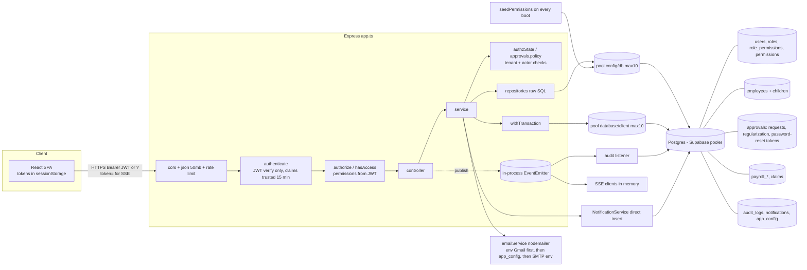

# Database Analysis (v2, delta on 2026-10-04 audit)

Repo: `D:\AI_dev\Google_Antigravity\employee_management_system`
Baseline: `docs/audit/_raw/track-c-backend-data.md` (HEAD `06dc08f`). Current: HEAD `42aaace` (17 commits, HF-1..HF-10 and follow-ups) plus uncommitted changes.
Method: static analysis only. No database connection was made. `server/.env` holds a live-looking remote DB credential (existence only; the value is not reproduced or used).

Evidence labels: **Confirmed** (read in code, file:line) / **Inferred** (follows from code read, not executed) / **Assumption** / **Unknown**.

---

## 0. Headline

1. **The schema source of truth is still missing.** `server/db/baseline/0000_live_schema.sql` does not exist (only `README.md`, `diagnostics.sql`, `loadSnapshot.ts`). `snapshotExists()` is false, so integration tests are skipped or blocked (`server/test/setup/integration.global.ts:25-33`). **Confirmed.** Everything below is reconstructed from repo DDL scripts; the live database may differ (**Unknown**).
2. **No schema or migration file changed in the security hotfix series** except: 4 new permission keys (`roles:assign`, `roles:manage`, `permissions:grant`, `users:manage`) in `server/src/db/schema.ts:361-364`, and removal of credential seeding in `server/src/initDb.ts`. HF-3 (password reset) deliberately reused the existing `approvals` table (new status values `issued`, `completed`, `superseded`; JSONB `metadata.token_hash/expires_at/user_id/email`) instead of adding a table. **Confirmed** (`git diff 06dc08f HEAD -- server/src/initDb.ts server/src/db/schema.ts`).
3. **Tenant isolation at the SQL level is much better in the HF-touched modules, but not complete.** Mounted code still has about 41 `tenant_default` / `'default'` / `tenant_id IS NULL` fallback predicates (baseline: 42 sites). Many of them are intentional shared-template reads added by HF-10 (`authzState.repository.ts:6,27`), but writes in `employees.repository.ts:125,135,144,151,165,172` and approvals (`approvals.repository.ts:30,208,225`) still match default-tenant rows. **Confirmed.**
4. **One cross-tenant destructive path remains (new/unfixed): `EmployeesRepository.delete()` deletes 15 child tables by `employee_id` with no tenant predicate before it checks the employee's tenant, then commits even when the final tenant-scoped delete removes 0 rows.** See NEW-DB-1.

---

## 1. Schema sources and how they run

| Source | What it defines | Run by | Changed since baseline |
|---|---|---|---|
| `server/src/initDb.ts` | 22 base `CREATE TABLE IF NOT EXISTS` + ~60 `ALTER ... ADD COLUMN`; `timesheet_entries`, `audit_logs`, `holidays` created inline; default tenant; admin seed | `npm run db:setup` (`package.json` `db:setup` = `tsx src/initDb.ts`) and `scripts/db-setup.ts:13` | Yes: admin password reset removed; demo-account password seeding removed (`initDb.ts:449-466`) |
| `server/src/db/schema.ts` | tenants (richer shape), permissions, roles, role_permissions, approvals, audit_logs, notifications, employee_education/experience; tenant_id ALTERs; indexes; permission/role seed; admin seed if `users` empty | `scripts/db-setup.ts:16` only | Yes: +4 permissions |
| `server/src/db/migration_v3.ts` | departments (v3 shape), employee lifecycle columns, employee_documents, employee_emergency_contacts, holidays, performance_reviews, 9 indexes | `scripts/db-setup.ts:19` only | No |
| `server/src/scripts/phase2_migrations.ts` | `payroll_history` UNIQUE swap, status column | manual `npx tsx` | No |
| `server/src/scripts/seedPermissions.ts` | permissions upsert, super_admin role, **HF-10 grant of 4 permissions to every role holding `settings:manage`** | **every server boot** (`index.ts:219`) | Yes (HF-1, HF-10) |
| runtime DDL | `app_config` created on first config save (`configuration.repository.ts:4-16`) | request time | No |
| `server/db/baseline/0000_live_schema.sql` | intended single source of truth | not run, **file absent** | No |

Migration mechanics (all **Confirmed**):
- No migration tool, no `schema_migrations` table, no down migrations. Idempotency is by `IF NOT EXISTS`, with errors swallowed (`.catch(() => {})` throughout `initDb.ts:275-372`; `schema.ts:419-421,432`; `migration_v3.ts` warns only).
- **Run-order defect remains.** `initDb.ts:606-609` calls `initDb().then(() => process.exit(0))` at module load. `scripts/db-setup.ts:2` imports that module, so the process can exit before `initializeDatabase()` and `runMigrationV3()` run. `db:migrate` and `db:seed` are therefore not reliable, and `db:setup` (= `initDb.ts` alone) never runs schema.ts or v3. **Inferred, high confidence.**
- Boot-time data mutation: `seedPermissionsAndSuperAdmin()` runs on every cold start and writes `permissions`, `roles`, `role_permissions` (`seedPermissions.ts:77-158`). It no longer touches `users` (HF-1). Concurrent cold starts have no advisory lock; the inserts are `ON CONFLICT DO NOTHING/UPDATE`, so it is safe but wasteful. **Confirmed.**
- New behaviour (HF-10): step 6 (`seedPermissions.ts:148-156`) grants `roles:assign`, `roles:manage`, `permissions:grant`, `users:manage` to every role that holds `settings:manage`, on every boot. Revoking one of these from such a role is silently undone at the next restart. **Confirmed.** Governance consequence for the RBAC export (OW-4).

---

## 2. Table inventory (union of repo scripts: 37 tables)

Notation: PK / FK→ / U = unique / T = tenant column (how). "Shape conflict" = more than one script defines the table differently, and the winner depends on run order.

### 2.1 Identity, tenancy, RBAC

| Table | Key columns | Constraints / FKs | Tenant | Notes |
|---|---|---|---|---|
| tenants | id TEXT PK, name, slug, domain, status, plan, max_employees, metadata | initDb: `domain UNIQUE`; schema.ts: `slug UNIQUE NOT NULL` (skipped if initDb ran first) | — | **Shape conflict** (`initDb.ts:58-65` vs `schema.ts:23-36`) |
| users | id SERIAL PK, tenant_id→tenants CASCADE, name, **email UNIQUE NOT NULL (global)**, password, role TEXT, role_id, is_active, availability_status, last_login, **refresh_token**, **temp_password (plaintext)**, is_password_temp, deleted_at, preferences JSONB, (phone, address, emergency, avatar_url: used by code, created by no script) | `initDb.ts:67-75,283-291,423-432`; `schema.ts:91-100` (role_id→roles only if schema.ts ran) | T (default `'tenant_default'`) | soft delete via `deleted_at` |
| roles | id, tenant_id NOT NULL→tenants CASCADE, name, description, dashboard_type, is_system | `UNIQUE(tenant_id,name)` | T | `dashboard_type='admin'` is a full permission bypass in `authorize.ts:151` |
| permissions | id, module, action, description | `UNIQUE(module,action)` | **global** | two vocabularies (below) |
| role_permissions | role_id→roles CASCADE, permission_id→permissions CASCADE | PK(role_id, permission_id) | via role | no index on `permission_id` alone |

Permission vocabularies (still two, **Confirmed**): `schema.ts:306-364` (`employees:view|create|update`, `payroll:view|run|view_own`, `audit:view`, `approvals:approve`, ...) and `seedPermissions.ts:27-75` (`employees:read|manage`, `organization:manage`, `claims:approve`, `payroll:read`, `audit:read`, ...). Current route guards mix both: `payroll:view` / `audit:view` / `approvals:approve` (schema.ts vocab) and `claims:approve` / `organization:manage` / `employees:manage` (seed vocab). Only the `super_admin` role receives the seed vocabulary automatically (`seedPermissions.ts:133-143`), and the seeded `hr` role has `dashboard_type='admin'` (`schema.ts:455`), which bypasses every check. **Inferred consequence:** several guards work for HR only because of the dashboard bypass, not because HR holds the key. This is the dependency HF-9A (remove bypass) is blocked on.

### 2.2 HR core

| Table | Key columns | Constraints / FKs | Tenant | Notes |
|---|---|---|---|---|
| employees | id TEXT PK (`EMP###`), name, **email UNIQUE (global)**, personal_email, department TEXT, department_id→departments, team_id→teams, position, status (free text), user_id INT, manager_id TEXT, reporting_manager_id INT, lifecycle cols, annual_ctc, bank_account_number, tax_regime, deleted_at | `initDb.ts:5-12,294-324`; `schema.ts:105-120`; `migration_v3.ts:40-63` | T | `user_id` and `reporting_manager_id` are plain INT in `initDb.ts` (ADD COLUMN IF NOT EXISTS), so the `REFERENCES users(id)` in schema.ts / v3 is a no-op whichever script ran first. `avatar_url`, `education_history`, `experience_history` are used by code (`employees.repository.ts`) and created by **no** repo script (only `scratch/add_avatar_col.ts`). |
| employee_education / employee_experience | id, employee_id→employees CASCADE | `schema.ts:123-144` | **none** | no index on `employee_id`; duplicate of the JSONB `*_history` columns |
| employee_emergency_contacts | id, tenant_id→tenants, employee_id→employees CASCADE | `migration_v3.ts:86-97`; idx on employee_id | T | |
| employee_documents | id, tenant_id→tenants, employee_id→employees CASCADE, file_path (string only), verified, verified_by→users | `migration_v3.ts:68-81` | T | **no `updated_at`**, but `documents.repository.ts` writes it on verify (drift) |
| performance_reviews | id, tenant_id, employee_id→employees CASCADE, reviewer_id→users, rating NUMERIC(2,1) **CHECK 1..5**, status | `migration_v3.ts:116-131` | T | only table with a CHECK |
| holidays | initDb: id,name,date,type (**no tenant_id**); v3: tenant_id NOT NULL + `UNIQUE(tenant_id,date,name)` | `initDb.ts:395-403` vs `migration_v3.ts:102-111` | depends on order | **Shape conflict** |

### 2.3 Organisation

| Table | Key columns | Constraints / FKs | Tenant | Notes |
|---|---|---|---|---|
| departments | initDb shape: id, **name UNIQUE (global)**, manager_id INT, metadata, tenant_id DEFAULT 'tenant_default'. v3 shape: tenant_id NOT NULL→tenants, name, **code NOT NULL**, head_user_id→users, parent_id→departments, `UNIQUE(tenant_id,code)` | `initDb.ts:147-155` vs `migration_v3.ts:23-34` | T | **Shape conflict.** Code writes `code`, `head_user_id` (`approvals.repository.ts:executeDepartmentCreation`), so the v3 shape is required; with the initDb shape, department approval fails. |
| teams | id, name, department_id→departments CASCADE, parent_team_id→teams CASCADE, manager_id, metadata, tenant_id | `UNIQUE(name,department_id,tenant_id)` (`initDb.ts:157-168`) | T | no index on `department_id` |
| org_nodes | id, entity_type, **entity_id INT (no FK)**, parent_node_id→org_nodes CASCADE, name, category, hierarchical_path, **tenant_id DEFAULT 'default'** | `initDb.ts:183-193` | T (inconsistent default) | see NEW-DB-2 |
| org_governance | node_id PK→org_nodes CASCADE, creator/owner/ruler→users, **tenant_id DEFAULT 'default'** | `initDb.ts:196-204` | T | |
| org_roles, employee_roles, org_resources, org_structural_audit | node/role/employee FKs | `initDb.ts:207-250` | **none** | unused by app code except a delete in `employees.repository.ts:330`; candidates for removal |

### 2.4 Time, leave, attendance

| Table | Key columns | Constraints / FKs | Tenant | Notes |
|---|---|---|---|---|
| attendance | id; **legacy** user_id INT, check_in, check_out; **current** employee_id TEXT NOT NULL (no FK), check_in_time, check_out_time, status, date | `initDb.ts:91-98,327-330` | T | dual model; index `idx_attendance_user_date(user_id, check_in)` covers only the legacy columns |
| leave_types | id, name, annual_quota | `initDb.ts:109-113` | T (reads not filtered: `leaves.repository.ts:5,71-81`) | catalogue is shared across tenants |
| leave_requests | id; legacy employee_id→employees, type; current user_id (no FK), leave_type_id (no FK); start/end, reason, status, deleted_at | `initDb.ts:115-124,333-336` | T | `approved_by`, `updated_at` written by code (`leaves.repository.ts`, `approvals.repository.ts:setDecision`), created by no repo script. `deleted_at` exists but code hard-deletes. |
| timesheets | id; legacy employee_id→employees, project, hours, date; current user_id (no FK), week_start/end, total_hours, approved_by, remarks, status | `initDb.ts:126-134,339-346` | T | no `UNIQUE(user_id, week_start)` |
| timesheet_entries | id, timesheet_id→timesheets CASCADE, project_name, mon..sun_hours | `initDb.ts:350-364` | **none** (now enforced through `EXISTS (timesheets ... tenant)` in the repository, `timesheets.repository.ts:25-37`) | no index on `timesheet_id` |

### 2.5 Payroll and money

| Table | Key columns | Constraints / FKs | Tenant | Notes |
|---|---|---|---|---|
| payroll_profiles | employee_id PK→employees, name, annual_ctc, bank_account, basic_salary, hra, ..., department_id→departments, team_id→teams | `initDb.ts:14-27,367-371` | T | duplicates `employees.annual_ctc` / `bank_account_number` (two sources for pay) |
| payroll_runs | id TEXT PK, month, year, processed_at | **no UNIQUE(tenant,month,year)** | T | re-run duplicates entries |
| payroll_entries | id, employee_id→employees, month, year, gross..net, total_deductions | | T | `payroll_run_id` written by `payroll.repository.ts:80-83`, **created by no script** |
| payroll_history | id, employee_id→employees, month, year, net_salary, status | `UNIQUE(employee_id,month,year,tenant_id)` (`phase2_migrations.ts`) | T | `name` written by code, created by no script |
| claims | id TEXT PK (`CLM-<ms>`), employee_id→employees, amount NUMERIC, category, status | no CHECK(amount>0) | T | PK is time-based: collides under concurrency |
| reimbursement_claims | id, employee_id→employees, amount | | T | second claims table; payroll counts this one (`payroll.repository.ts:62`), the UI writes `claims` |
| loans, investment_deadlines | | `initDb.ts:77-89` | none | unused |

### 2.6 Cross-cutting

| Table | Key columns | Constraints / FKs | Tenant | Notes |
|---|---|---|---|---|
| approvals | id TEXT PK, employee_id→employees (initDb: nullable; schema.ts: NOT NULL ON DELETE CASCADE), type, status, metadata JSONB, requested_by, actioned_by, actioned_at, tenant_id→tenants | idx `(status, tenant_id)` | T | **Overloaded.** Holds generic requests, department/team creation, self-service requests (`REQ-<uuid>`), attendance regularization, **and password-reset tokens (HF-3)**. `actioned_by/at` are still never written. No index on `type` or on `metadata->>'token_hash'`. |
| notifications | id, tenant_id NOT NULL→tenants CASCADE, user_id NOT NULL→users CASCADE, is_read, link | idx `(user_id,is_read)`, `(tenant_id)` | T | |
| audit_logs | initDb: id,user_id→users,action,entity_type,entity_id,created_at (**no tenant_id**); schema.ts: + tenant_id NOT NULL, old/new_values TEXT, ip, ua | 4 indexes (schema.ts shape only) | depends on order | **Shape conflict**; write failures swallowed (`write.repository.ts:22-24`) |
| app_config | id, tenant_id, category, key, value, `UNIQUE(tenant_id,category,key)` | created at runtime | T (no FK) | holds SMTP and integration secrets in plaintext (masked on read since HF-7, still plaintext at rest) |

---

## 3. Relationships (Mermaid ER, current state)

Dashed notes mean "relationship exists in code but has no FK". Cardinalities follow the code, not guesses.

```mermaid
erDiagram
  tenants ||--o{ users : "tenant_id FK"
  tenants ||--o{ roles : "tenant_id FK"
  roles ||--o{ role_permissions : "FK cascade"
  permissions ||--o{ role_permissions : "FK cascade"
  roles |o--o{ users : "role_id (FK only if schema.ts ran)"
  tenants ||--o{ employees : "tenant_id (FK only if schema.ts ran)"
  users |o--o| employees : "user_id (no FK) or email join"
  departments ||--o{ employees : "department_id FK"
  teams ||--o{ employees : "team_id FK"
  departments ||--o{ teams : "FK cascade"
  teams ||--o{ teams : "parent_team_id FK cascade"
  employees ||--o{ employee_education : "FK cascade"
  employees ||--o{ employee_experience : "FK cascade"
  employees ||--o{ employee_emergency_contacts : "FK cascade"
  employees ||--o{ employee_documents : "FK cascade"
  employees ||--o{ performance_reviews : "FK cascade"
  users ||--o{ performance_reviews : "reviewer_id FK"
  employees ||--|| payroll_profiles : "PK=FK"
  employees ||--o{ payroll_entries : "FK no cascade"
  employees ||--o{ payroll_history : "FK no cascade"
  payroll_runs ||--o{ payroll_entries : "payroll_run_id (column not created by any script, no FK)"
  employees ||--o{ claims : "FK no cascade"
  employees ||--o{ reimbursement_claims : "FK no cascade"
  employees ||--o{ approvals : "FK (cascade only in schema.ts shape)"
  employees ||--o{ attendance : "employee_id (no FK)"
  users ||--o{ leave_requests : "user_id (no FK)"
  leave_types ||--o{ leave_requests : "leave_type_id (no FK)"
  users ||--o{ timesheets : "user_id (no FK)"
  timesheets ||--o{ timesheet_entries : "FK cascade"
  users ||--o{ notifications : "FK cascade"
  users ||--o{ audit_logs : "user_id FK no cascade"
  org_nodes ||--o{ org_nodes : "parent_node_id FK cascade"
  org_nodes ||--|| org_governance : "node_id PK=FK"
  departments ||..o| org_nodes : "entity_id (no FK)"
  teams ||..o| org_nodes : "entity_id (no FK)"
  users ||--o{ org_governance : "creator/owner/ruler FK"
  tenants ||..o{ app_config : "tenant_id (no FK)"
```

FK coverage summary (**Confirmed from DDL**): about 45 declared FKs, but every operational tenant column outside `users`, `roles`, `notifications`, `audit_logs`(schema.ts shape) is a plain TEXT or an FK that only exists if `schema.ts` ran. Employee deletion has no cascade on 8 child tables (payroll, claims, loans...), which is why `EmployeesRepository.delete()` clears 15 tables by hand.

---

## 4. Indexes and constraints

### 4.1 Existing (35 explicit indexes)
`schema.ts:269-299`: users(tenant_id), users(email), users(role), employees(tenant_id|department|status|user_id), attendance(tenant_id), attendance(user_id, check_in), leave_requests(tenant_id|user_id|status), timesheets(tenant_id|user_id), payroll_entries(tenant_id|employee_id), audit_logs(tenant_id|user_id|(entity_type,entity_id)|created_at DESC), notifications(user_id,is_read)(tenant_id), roles(tenant_id), approvals(status,tenant_id). `migration_v3.ts:136-144`: departments(tenant_id), employees(department_id), employees(reporting_manager_id), employees(tenant_id,status), employee_documents(employee_id), emergency(employee_id), holidays(tenant_id,date), performance_reviews(employee_id), attendance(check_in). Plus implicit PK/UNIQUE indexes. **Confirmed.** These exist only in the repo; whether they exist live is **Unknown**.

### 4.2 Missing or ineffective (ranked)

| # | Gap | Evidence | Why it matters |
|---|---|---|---|
| I1 | **`approvals(type, (metadata->>'token_hash'))`** (partial, `type='password_reset'`) and `(metadata->>'user_id')` | HF-3 lookups `auth.repository.ts` (`findPasswordResetByTokenHash`, `hasRecentPasswordReset`, `consumePasswordReset` supersede) | New hot unauthenticated path does a scan of `approvals` per request. Also an abuse amplifier (public endpoint, scan cost grows with all approvals). |
| I2 | `lower(users.email)`, `lower(employees.email)`, `lower(employees.personal_email)` expression indexes | login `auth.repository.ts:10-12`, reset `:174-176`, `identity.ts:227` | Case-insensitive predicates cannot use the plain email indexes. Login and reset are sequential scans. Baseline finding unchanged. |
| I3 | `attendance(employee_id, check_in_time)` | current module uses `employee_id`/`check_in_time` (`attendance.repository.ts`, `approvals.repository.ts:applyAttendanceRegularization`); existing index is on legacy `user_id, check_in` | Attendance reads for the live data model are unindexed. |
| I4 | `timesheets UNIQUE(user_id, week_start)` | `timesheets.service.ts:15-29` get-or-create | Race creates duplicate weekly timesheets. Integrity, not only speed. |
| I5 | `payroll_runs UNIQUE(tenant_id, month, year)` | `payroll.service.ts:200-254` | Duplicate run duplicates `payroll_entries`. |
| I6 | FK columns with no index: `teams.department_id`, `org_nodes.parent_node_id`, `org_nodes(entity_type, entity_id, tenant_id)`, `employee_education.employee_id`, `employee_experience.employee_id`, `timesheet_entries.timesheet_id`, `claims.employee_id`, `approvals.employee_id`, `leave_requests(tenant_id, user_id, status)` composite, `employees.manager_id` (TEXT) | grep of DDL | Cascading deletes and joins scan. |
| I7 | `claims(tenant_id, status)`, `approvals(tenant_id, status, type)` composites | approvals inbox UNION (`approvals.repository.ts:49-140`) | Inbox is a 5-way UNION filtered after the union; each branch scans its table. |
| I8 | `::date` casts and `LOWER(status)` predicates | `employees.repository.ts:20`, `approvals.repository.ts:65-139` | Defeat even existing indexes. |
| I9 | `pg_trgm` GIN for `ILIKE '%term%'` on employees (name, email, department) | `employees.repository.ts:28-32` | Search is a scan; fine below ~1,000 rows. |

### 4.3 Constraints that should exist and do not

| Constraint | Table | Risk |
|---|---|---|
| CHECK status IN (...) | employees, leave_requests, timesheets, claims, approvals | Free text: typos and casing bugs (`LOWER(status)` everywhere). `employees.schema.ts` accepts any string. |
| CHECK end_date >= start_date; days > 0 | leave_requests | Negative leave possible (`leaves.repository.ts:72` `end - start + 1`). |
| CHECK amount > 0 | claims, reimbursement_claims | Negative claims accepted at the schema level (route schema was tightened in `claims.schema.ts`, DB was not). |
| CHECK hours BETWEEN 0 AND 24 | timesheet_entries | unbounded and negative hours (`parseFloat(h) || 0`) |
| NOT NULL tenant_id + FK→tenants | every tenant table except users/roles/notifications/audit_logs | rows with NULL or `'tenant_default'` tenant exist by design |
| UNIQUE(tenant_id, email) instead of global UNIQUE(email) | users, employees | global uniqueness blocks real multi-tenancy; HF-6 hid the existence side-channel (`EMAIL_NOT_AVAILABLE`) but did not change the constraint |
| UNIQUE partial index on open attendance session | attendance | concurrent check-ins create two open sessions (**Inferred**) |
| `users.temp_password` removal | users | plaintext credential at rest (see Security audit SEC-10) |

---

## 5. Soft delete, hard delete, retention

| Table | Soft delete column | What the code actually does |
|---|---|---|
| users | `deleted_at`, `is_active` | soft (`user-assignments.repository.ts:deleteUser`); login and refresh filter both (`auth.repository.ts:13,35`) |
| employees | `deleted_at` | **hard delete** of employee plus 15 child tables including `payroll_history` and `payroll_entries` (`employees.repository.ts:323-380`); soft delete only as an error fallback (`:384-390`) |
| leave_requests | `deleted_at` (unused) | hard `DELETE` (`leaves.repository.ts:53-60`) |
| employee_documents | none | hard delete |
| performance_reviews | none | hard delete |
| roles, role_permissions | none | hard delete; permission replacement is delete + insert **without a transaction** (`rbac.service.ts:117-125`, still open after HF-10) |
| departments / teams | `is_active` (v3 shape only) | hard delete with cascade to teams; `org_nodes` left orphaned (no FK from `org_nodes.entity_id`) |
| approvals (incl. password-reset records) | none | never deleted; reset records grow without a retention job |
| audit_logs | none | never deleted; no partitioning or retention |

Verdict: soft delete is applied to identities only. Statutory payroll data can be destroyed by one API call (`DELETE /employees/:id`, which a manager can reach, see Security audit SEC-06). **Confirmed.**

---

## 6. Audit logging in the data layer

- Table: `audit_logs` (shape depends on run order, see 2.6). Written by an in-process event listener (`audit.listeners.ts`), insert errors swallowed (`write.repository.ts:22-24`). **Confirmed.**
- **Coverage improved but remains narrow.** Events are now published for login/logout/profile update (`auth.controller.ts:15,72,91`) and **every approval decision** (`approvals.audit.ts`, used by approvals, leaves, claims, timesheets controllers). **Not audited:** role/permission changes, user creation/status/password changes, salary edits, payroll runs, config changes, password reset requests/consumption, employee create/update/delete, document actions. **Confirmed by grep of `AUDIT_LOG_REQUESTED`.**
- Integrity: no append-only protection, `x-forwarded-for` taken raw for IP (`write.service.ts:15`, `auth.controller.ts:20`), event published after the response path rather than inside the business transaction, so it can be lost on crash/serverless freeze. **Confirmed / Inferred.**
- Read: `GET /audit-logs` now requires `audit:view` (`read.routes.ts:11`), tenant-filtered (`read.repository.ts:10`), `limit` still unbounded.

---

## 7. Data flow

Two flows changed materially since baseline:

**Password reset (HF-3):** `POST /auth/forgot-password` → `findUserForPasswordReset` (join users+employees on email, same tenant) → 60 s cooldown check → insert `approvals(type='password_reset', status='issued', metadata{token_hash, expires_at, user_id, email})` → async email with `#reset_token=` URL fragment → `POST /auth/reset-password` → `consumePasswordReset` single transaction (flip `issued→completed` with expiry check, update `users.password`, null `temp_password`/`refresh_token`, supersede other issued tokens). **Confirmed** (`auth.service.ts:163-230`, `auth.repository.ts:255-300`).

**Approval decision (HF-4/5):** route gate `ANY_APPROVER_PERMISSIONS` → per-kind permission → `withTransaction` → `lockApproval` (`SELECT ... WHERE id AND tenant_id FOR UPDATE`) → self-approval check → status precondition → apply side effect inside the same transaction → audit event. **Confirmed** (`approvals.service.ts:124-220`).

---

## 8. Status of baseline data findings

| Baseline finding (track-c) | Status | Evidence |
|---|---|---|
| Live schema snapshot absent (4c.1, Unknown) | **OPEN** | `ls server/db/baseline`: no `0000_live_schema.sql` |
| No migration tool / versioning / down migrations | **OPEN** | unchanged scripts |
| `initDb` exits before schema.ts and v3 run | **OPEN** | `initDb.ts:606-609` |
| Admin password reset to `admin123` on every `db:setup`, demo accounts seeded with plaintext temp passwords (SEC-11) | **FIXED** in `initDb.ts` (HF-1). **PARTIAL overall:** `schema.ts:539-556` still seeds `admin@company.com`/`admin123` when `users` is empty | `git diff` + file read |
| Seed forces `admin@company.com` to super_admin on every boot | **FIXED** | `seedPermissions.ts:9-11` comment, no user write |
| Drift: columns used but created by no script (payroll_run_id, payroll_history.name, employees.avatar_url / *_history, users.phone/address/emergency/avatar_url, leave_requests.approved_by/updated_at, employee_documents.updated_at) | **OPEN** | grep of all 5 DDL sources; new code even works around it with `to_jsonb(u)->>'phone'` (`auth.repository.ts:59-62`) |
| Duplicate/competing definitions (tenants, departments, audit_logs, holidays, approvals) | **OPEN** | see 2.x |
| Dual model attendance / leave / timesheets (legacy vs current columns), approvals inbox reads legacy columns | **OPEN** | `approvals.repository.ts:69-139` still joins `leave_requests.employee_id`, `timesheets.employee_id/project/hours` |
| 42 cross-tenant fallback predicates | **PARTIAL** (about 41 remain; reads and the role/user fallbacks fixed in HF-6/6B) | grep; see 0.3 |
| Queries with no tenant predicate (education/experience/contacts, timesheet entries, team list, reports by id, approvals service, child-row delete) | **PARTIAL.** Fixed: education/experience/contacts (`employees.controller.ts:66-125`), timesheet entries (`timesheets.repository.ts:25-37`), reports (`reports.access.ts`), approvals (`lockApproval`). **Still open: `employees.repository.ts:323-345` child deletes, `UPDATE employees SET manager_id` without tenant (`:360`), `leave_types` reads** | file reads |
| No RLS | **OPEN** | grep `ROW LEVEL SECURITY|CREATE POLICY` returns nothing |
| Global UNIQUE email/department name | **OPEN** | DDL |
| Payroll: no unique run, includes terminated, no idempotency | **OPEN** | DDL, `payroll.service.ts` |
| Hard delete of statutory payroll on employee delete | **OPEN** | `employees.repository.ts:335-339` |
| Leave approve flips status without precondition; double approval | **FIXED** (single path with `PENDING_STATUSES` and row lock) | `approvals.service.ts:173-175` |
| Timesheet entries editable in any status/tenant; ineffective transaction | **PARTIAL.** Status and ownership fixed; repository still uses `pool.query` inside `withTransaction` (client ignored), so the "transaction" is still not atomic | `timesheets.service.ts:38-52`, `timesheets.repository.ts:25-45` |
| Approvals: `actioned_by/at` never written | **OPEN** (decision recorded only for leave/timesheet `approved_by`) | `approvals.repository.ts:setDecision` |
| Regularization inserted directly | **FIXED** (request then approve; manager-routed) | `approvals.repository.ts:applyAttendanceRegularization` |
| Role permission replace without transaction | **OPEN** (authorization now checked first, but delete then per-row insert still runs on separate pool queries; a mid-way failure leaves the role with no permissions) | `rbac.service.ts:117-125`, `rbac.repository.ts:125` |

---

## 9. New findings (not in the baseline)

### NEW-DB-1 (High): cross-tenant child-row deletion in `EmployeesRepository.delete()`
`server/src/modules/employees/employees.repository.ts:323-345` runs 15 `DELETE FROM <child> WHERE employee_id = $1` statements with **no tenant predicate**, before the tenant check. Line 360 `UPDATE employees SET manager_id = $2 WHERE manager_id = $1` is also unscoped. The final `DELETE FROM employees WHERE id = $1 AND tenant_id = $2` (line 378) can match 0 rows when the id belongs to another tenant, yet the transaction still commits (`:393` area; `rowCount` is only read after `COMMIT`). Employee ids are sequential and global (`EMP001...`, `employees.service.ts:96-103`), so they are guessable. Route guard `authorize(['admin','super_admin','hr','employees:manage'])` (`employees.routes.ts:71`) is satisfied by a manager through the legacy mapping (see SECURITY_AUDIT SEC-06). **Confirmed by code read; not executed.** Impact: a manager or HR user of tenant A can delete payroll history, claims, leave, documents and reviews of tenant B employees (and of their own tenant, irrecoverably). Fix: check `employees WHERE id AND tenant_id` first (and fail with 404), then scope every child delete by `employee_id IN (SELECT id FROM employees WHERE tenant_id=$)`, replace hard delete with soft delete + retention for payroll.

### NEW-DB-2 (Medium): department/team approval writes org graph rows without tenant
`approvals.repository.ts:executeDepartmentCreation` and `executeTeamCreation` insert `org_nodes` and `org_governance` without `tenant_id`, so they get the column default `'default'` (`initDb.ts:190,200`). Parent lookup is `SELECT id FROM org_nodes WHERE entity_type AND entity_id` with no tenant. Governance reads accept `tenant_id = 'default'` for every tenant (`org-tree.repository.ts:9-18`, `shared.repository.ts:9-21`, `sync.repository.ts:11-44`). **Confirmed.** Effect: org-chart nodes created by any tenant after approval are visible to all tenants, and `entity_id` collisions between tenants can attach a team to another tenant's department node. Fix: pass tenant on insert, add FK/UNIQUE `(tenant_id, entity_type, entity_id)`, remove the `'default'` read fallback.

### NEW-DB-3 (Medium): `approvals` is now a security-sensitive, unindexed, overloaded table
Password-reset token hashes live in the same table as general requests (`approvals.repository` / `auth.repository.ts:255-300`). Consequences: (a) no index (I1); (b) the inbox query (`approvals.repository.ts:30,65`) selects `status IN ('approved','rejected','completed')` for history without a type filter, so consumed reset records (`status='completed'`, metadata includes email, user_id and the used token hash) appear in the history list of every role that is not named exactly `manager`/`employee` (**Inferred** from the query and role-name filter). Impact is information disclosure of emails and ids; hashes of used tokens are not replayable. (c) Retention: no cleanup of expired `issued` records. Fix: a dedicated `password_reset_tokens` table (tenant_id, user_id, token_hash UNIQUE, expires_at, used_at) with an index and a purge job; exclude `type='password_reset'` from the inbox.

### NEW-DB-4 (Medium): `users.temp_password` is still plaintext at rest and still a login credential
`auth.service.ts:38-40` accepts `temp_password` by plain string compare. `user-assignments.repository.ts:createUser/updatePassword` and `user-assignments.service.ts:97` still store plaintext, including the **admin-chosen permanent password** (`updatePassword(id, tenantId, hashed, password, true)`), and `createUser` returns `temp_password` in the API response (`RETURNING ... temp_password`). The retrieval endpoint and the list column were removed (HF-7), the schema column and storage were not. **Confirmed.**

### NEW-DB-5 (Low): refresh token column is written but never read for validation
`users.refresh_token` is set on login/refresh/logout and cleared on password reset (`auth.repository.ts:99,281-282`) but `AuthService.refresh()` never compares it (`auth.service.ts:75-111`). The HF-3 revocation intent therefore has no effect. **Confirmed.** (Same finding as SEC-09, listed here because the schema carries a dead column.)

### NEW-DB-6 (Low): self-service workflow metadata is free-form JSONB with no constraint
`createSelfServiceRequest` stores allow-listed fields (`approvals.policy.ts:77-81`, values trimmed to 500 chars), but `requested_role_id` is a string in JSONB with no FK to `roles`. Existence and tenant are re-checked at approve time (`approvals.repository.ts:applySelfServiceChange` uses `tenant_id = $2`), so the risk is stale data, not escalation. **Confirmed.**

### NEW-DB-7 (Low): IDs generated in application code
`EMP###` via `max` scan (`employees.service.ts:96-103`, global across tenants), `CLM-<Date.now()>`, `STR-<Date.now()>` (department/team requests, `organization.service.ts`), `RUN-...-<ms>` for payroll. Collisions surface as PK violations (409). Newer paths use UUIDs (`APP-`, `REQ-`, `PR-`). Fix: sequences or UUIDs everywhere.

---

## 10. Schema health report

### 10.1 Integrity risks (ranked)

| # | Risk | Severity | Status vs baseline |
|---|---|---|---|
| H1 | No authoritative schema; repo scripts disagree with each other and (per the repo's own runbook) with production | High | OPEN |
| H2 | Cross-tenant child delete (NEW-DB-1) | High | NEW |
| H3 | Hard delete destroys payroll/claims/leave of an employee | High | OPEN |
| H4 | Tenant column is nullable TEXT with default `'tenant_default'` and 41 read/write fallbacks; no RLS | High | PARTIAL |
| H5 | Global UNIQUE on `users.email`, `employees.email`, `departments.name`; employee id from a global max | Medium | OPEN |
| H6 | Payroll run not idempotent, no lock/finalize state, includes terminated profiles | Medium | OPEN |
| H7 | Two sources of salary truth (`employees.annual_ctc`, `payroll_profiles.annual_ctc`) and two claims tables | Medium | OPEN |
| H8 | Dual column models (legacy vs current) in attendance, leave, timesheets; inbox reads legacy | Medium | OPEN |
| H9 | `timesheets` has no `UNIQUE(user_id, week_start)`; transaction ineffective | Medium | PARTIAL |
| H10 | Status columns are free text (case-insensitive compares everywhere) | Low | OPEN |
| H11 | Plaintext credentials at rest (`temp_password`, SMTP/API keys in `app_config`) | Medium | PARTIAL (no longer returned by the API) |

### 10.2 Orphan risks

| Relationship without FK or without cascade | Orphan produced |
|---|---|
| `org_nodes.entity_id` → departments/teams | node remains after department/team delete (delete of department cascades to teams only) |
| `attendance.employee_id`, `leave_requests.user_id/leave_type_id`, `timesheets.user_id`, `employees.user_id`, `employees.reporting_manager_id`, `employees.manager_id` (TEXT), `users.role_id` (if initDb first) | rows pointing to deleted users/employees/roles |
| `payroll_entries.payroll_run_id` (column possibly absent) | entries not linkable to a run |
| `app_config.tenant_id`, most `tenant_id` columns | rows for a removed tenant |
| `approvals` of type password_reset with `metadata.user_id` | records referencing deactivated users |
| employee hard delete without cascade on payroll/claims/loans tables | handled by manual deletes (see NEW-DB-1) |

### 10.3 Duplicate tables and definitions
- Same name, different shape: `tenants`, `departments`, `audit_logs`, `holidays`, `approvals` (see 2.x).
- Same concept, two tables: `claims` / `reimbursement_claims`; `payroll_entries` / `payroll_history`; `employee_education`+`employee_experience` / JSONB `employees.education_history|experience_history`; `roles`+`role_permissions` / `org_roles`+`employee_roles`; `departments`+`teams` / `org_nodes` shadow graph; `performance_reviews` / (stub modules `goals`, `ratings`).
- Unused: `loans`, `investment_deadlines`, `org_roles`, `employee_roles`, `org_resources`, `org_structural_audit`, `reimbursement_claims` (read only by a count), `payroll_history` stub endpoint.

### 10.4 Migration issues
1. No versioning; three overlapping scripts plus a boot-time seeder; errors swallowed.
2. Run-order defect (`initDb` exits first) and order-dependent table shapes.
3. Schema drift (8 column groups used by code, created by no script).
4. Snapshot (`0000_live_schema.sql`) absent, so CI cannot build a faithful DB; integration tests skipped (`authz.matrix.test.ts` `MATRIX` is still empty; the HF test suites are unit tests with mocked data access).
5. Boot-time seeder mutates `role_permissions` (HF-10 auto-grant), not a migration.
6. Runtime DDL for `app_config`.
7. Staging scripts exist (`server/scripts/staging`) but depend on the missing snapshot.
8. CI (`.github/workflows/ci.yml`, HF-8): typecheck, unit tests, route contract, gitleaks on new commits. No migration check, no DB service container.

### 10.5 Recommended order (data layer only)
1. Owner produces `0000_live_schema.sql` (runbook in `server/db/baseline/README.md`), commit, wire the integration job to a Postgres service container.
2. Adopt a migration tool starting from that snapshot; delete `initDb.ts` schema section, `schema.ts` DDL and `migration_v3.ts`; move seeding out of boot.
3. Fix NEW-DB-1 immediately (small, local code change).
4. Add: `password_reset_tokens` table, the unique constraints in 4.3, the indexes in 4.2 (I1-I5 first), CHECKs, soft delete for employees with payroll retention.
5. Make `tenant_id` NOT NULL + FK everywhere, backfill, remove `'tenant_default'`/`'default'` fallbacks, then RLS.

---

## Files opened (this analysis)

Docs: `docs/audit/_raw/track-c-backend-data.md`, `docs/audit/_raw/track-d-security-perf-infra.md`, `docs/audit/v2/README.md`, `server/db/baseline/README.md`.
Schema/migrations: `server/src/initDb.ts` (1-445, 446-500, 590-610), `server/src/db/schema.ts` (18-265, 366-398, 395-560), `server/src/db/migration_v3.ts` (1-230), `server/src/scripts/phase2_migrations.ts` (grep), `server/src/scripts/legacy_cleanup.ts` (grep), `server/src/scripts/seedPermissions.ts` (full), `server/scripts/db-setup.ts`, `server/db/baseline/loadSnapshot.ts`, `server/test/setup/integration.global.ts`, `server/test/integration/authz.matrix.test.ts` (28-50).
Code: `server/src/modules/auth/{auth.service,auth.repository,auth.controller,auth.routes,auth.schema}.ts`, `modules/approvals/{approvals.policy,approvals.service,approvals.repository,approvals.audit}.ts`, `modules/employees/{employees.controller,employees.repository,employees.service,employees.routes,profile.visibility}.ts`, `modules/leaves/*`, `modules/claims/*`, `modules/timesheets/*`, `modules/documents/*`, `modules/users/*`, `modules/audit/read/*`, `modules/audit/write/write.repository.ts`, `modules/settings/user-assignments/*`, `modules/settings/configuration/*`, `modules/payroll/payroll.controller.ts` and `payroll.repository.ts` (grep), `modules/reports/reports.access.ts`, `core/security/authzState*.ts`, all `*.routes.ts` (grep enumeration).
Git: `git log 06dc08f..HEAD`, `git diff 06dc08f HEAD -- server/src/initDb.ts server/src/db/schema.ts`, `git status`.
Not opened: `.env` values (never printed). No database connection was made.
