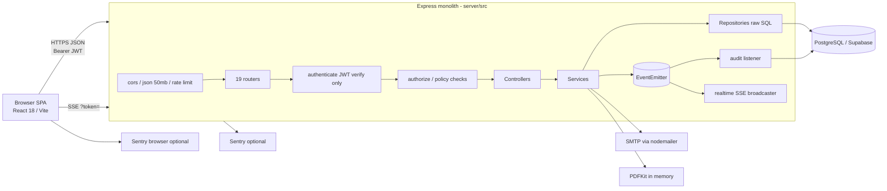
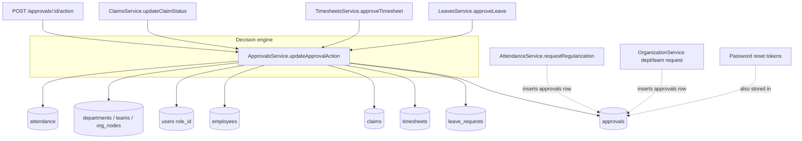
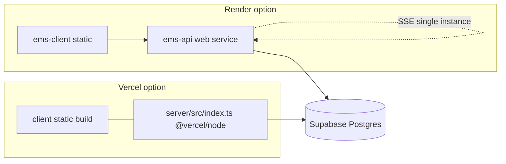
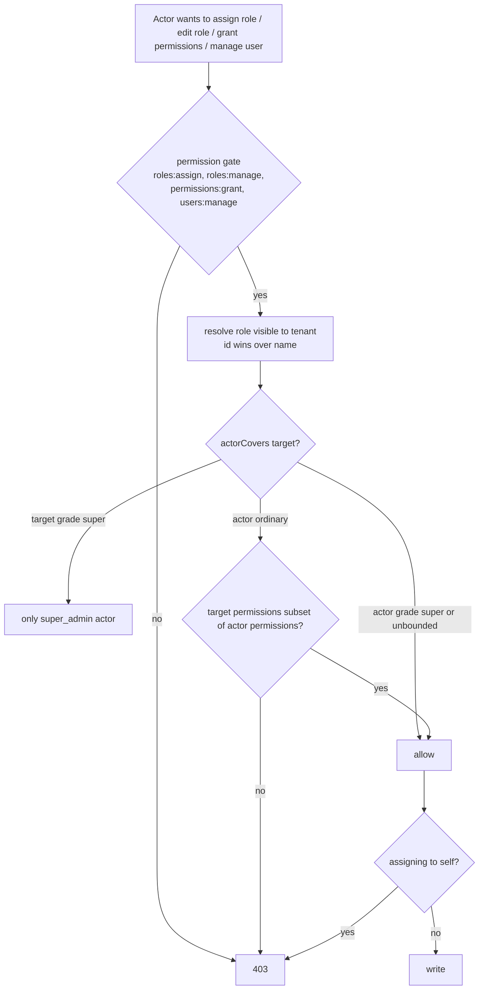

# System Architecture Report (v2 delta)

Repository: `employee_management_system` (product name in code: "Ozofi Nexus"). Branch `feat/profile-visibility-by-viewer`, HEAD `42aaace` plus uncommitted work.
Baseline: `docs/audit/_raw/track-*.md` and `PRODUCT_EVOLUTION_UPGRADE_REPORT.md` @ `06dc08f` (2026-10-04). Since then: 17 commits (HF-1 .. HF-10 hotfix series, role-membership UI, search, approvals filtering, profile visibility) and 24 modified plus new files in the working tree (approvals, leave, payroll, employees UI; `NewRequestModal.tsx`).
Method: static reading only. No database, no server start, no network. Baseline claims were re-checked against current code; nothing is copied without a re-read.

Evidence legend
- **Confirmed**: read in code, cited `file:line` (paths relative to repo root; `S/` = `server/src/`, `C/` = `client/src/`).
- **Inferred**: deduced from cited code or from a schema script that may differ from production.
- **Assumption**: stated with the reason.
- **Unknown**: "Not enough evidence found in repository."

No secret values were printed. `.env` files exist locally but only variable names were inspected (`server/.env.example`, `file.sample`).

---

## 1. Delta since the baseline (what changed, what did not)

| Area | Change since `06dc08f` | Evidence |
|---|---|---|
| Auth | Master-password backdoor removed; JWT secrets mandatory (min 32 chars, must differ); reset flow is now an emailed single-use 30-minute token stored hashed | `S/config/env.ts:11-28` (Confirmed); `S/modules/auth/auth.service.ts:163-230` (Confirmed); test `server/test/unit/auth.backdoor.test.ts` exists |
| Approvals | One central decision path for leave, timesheet, claim, onboarding and std approvals: tenant-scoped row lock, permission by type, no self-approval, pending-only, audit event | `S/modules/approvals/approvals.service.ts:124-220`, `approvals.policy.ts` (Confirmed) |
| AuthZ state | New "authorization-state policy": an actor can only grant what the actor holds; reserved role names; no self role change; tenant-visible roles only | `S/core/security/authzState.ts:54-106` (Confirmed) |
| Tenant | Cross-tenant reads/writes bound in reports, claims, documents, employees sub-records, settings fallbacks | `S/modules/reports/reports.access.ts`, `S/modules/settings/*/..repository.ts` (Confirmed) |
| Secrets | `smtp_pass`, `api_key`, webhooks masked on read, write-only | `S/modules/settings/configuration/configuration.secrets.ts:1-26` (Confirmed) |
| Session | Browser re-syncs role/dashboard/permissions from `GET /auth/me`, then renews the token | `C/services/sessionSync.ts`, `C/hooks/useSessionSync.ts`, mounted in `C/components/layout/MainLayout.tsx:20` (Confirmed) |
| UI | Approvals shows only categories the role can act on; search offers only openable pages; profile shows work card vs personal vs pay by viewer | `C/utils/searchAccess.ts`, `S/modules/employees/profile.visibility.ts` (Confirmed) |
| CI | New `.github/workflows/ci.yml`: server typecheck+unit, client tsc+vitest, route-contract diff, gitleaks | `.github/workflows/ci.yml` (Confirmed) |
| Working tree (uncommitted) | Approvals: self-service requests (`role_change`, `promotion`, `team_change`), manager routing, `is_mine`/`can_act` flags, `NewRequestModal.tsx`; employees delete hands reports to the deleted person's manager; payroll/leave UI rework | `git status`; `S/modules/approvals/approvals.service.ts:25-117`; `S/modules/employees/employees.repository.ts:339-376` (Confirmed) |

Still present at HEAD (re-verified, details in section 8): `PUT /users/profile` takes the target id from the body; employee delete is not tenant-checked before child rows are deleted; refresh tokens are never compared or revoked; role-name checks survive in many controllers; `org_nodes` rows from approvals get tenant `'default'`; the approvals inbox reads legacy columns; 18 client calls have no server route.

---

## 2. Repository discovery

| Concern | Finding | Evidence |
|---|---|---|
| Frontends | One SPA: React 18 + Vite 5 + TypeScript + Tailwind 3 + Zustand + axios + react-router 6 + react-hook-form/zod. No SSR. A public `LandingPage.tsx` exists but is not routed (see section 4). | `client/package.json`; `C/App.tsx:47-178` (Confirmed) |
| Backend services | One Express 4 + TypeScript monolith, modular (routes, controller, service, repository per module). `app.ts` builds the app, `index.ts` listens. | `S/app.ts`, `S/index.ts` (Confirmed) |
| APIs | REST under `/api/v1/*`, 19 mounts, about 126 routes (route-contract script reports 126 backend routes). JSON only. No OpenAPI, no versioning policy beyond the `v1` prefix. | `S/app.ts:106-126`; `python docs/audit/tools/route_contract_check.py` output (Confirmed) |
| Database | PostgreSQL via `pg`, raw SQL, no ORM, no migration framework. Hosted on Supabase per env example. Three schema scripts (`initDb.ts`, `db/schema.ts`, `db/migration_v3.ts`) run by `npm run db:migrate`/`db:setup`; automatic migrations at boot are disabled. | `S/index.ts:75`; `server/scripts/db-setup.ts`; `server/.env.example` (Confirmed). Production schema: Unknown ("Not enough evidence found in repository"); `server/db/baseline/README.md` describes a snapshot process that has not produced `0000_live_schema.sql`. |
| Pools | `config/db.ts` `pool` (max 10) and `directPool` (max 3); `database/client.ts` second `pool` (max 10) used only by `withTransaction`. Up to 23 connections per instance. TLS `rejectUnauthorized:false` for non-local hosts. | `S/config/db.ts:24-45`, `S/database/client.ts:16-24` (Confirmed) |
| Workers / cron | None. No cron, queue or job runner. The only timer is the SSE keep-alive. Emails and PDFs are produced inline in requests. | grep of `setInterval|cron|queue` in `server/src` finds only `S/modules/realtime/connections/connections.service.ts:21` (Confirmed) |
| WebSockets / SSE | Server-Sent Events at `GET /api/v1/realtime/stream`, in-process client list, tenant-filtered broadcast of availability changes. Token passed in `?token=`. No WebSocket. | `S/modules/realtime/connections/connections.service.ts:9-31`, `events.service.ts`, `S/core/security/authorize.ts:16-17`, `C/modules/employees/components/EmployeeTable.tsx:126` (Confirmed) |
| In-process events | One `EventEmitter`. Seven event names declared, only two published: `AUDIT_LOG_REQUESTED` and `REALTIME_BROADCAST_REQUESTED`. Notification listener only logs. | `S/core/events/eventTypes.ts`, `registry.ts`; publish sites: `S/modules/auth/auth.controller.ts:15,72,91,110`, `S/modules/approvals/approvals.audit.ts:12` (Confirmed) |
| Third-party integrations | SMTP via nodemailer (Gmail env, per-tenant `app_config`, or `SMTP_*` env); Sentry (server and client, opt-in by DSN); Supabase Postgres. `SUPABASE_URL/ANON/SERVICE_ROLE` variables are listed in env example but no `@supabase/*` package is a dependency. Slack/Teams webhook and `api_key` settings are stored but no code sends to them. | `S/services/emailService.ts:46-98`; `S/instrument.ts`; `C/main.tsx`; `server/package.json`; `S/modules/settings/configuration/configuration.secrets.ts` (Confirmed). Webhook senders: grep finds none in `server/src` (Confirmed absence; use in production Unknown). |
| Auth providers | Local email+password only, JWT access (15 min) and refresh (7 days) signed HS256 with two secrets. No SSO/OIDC/SAML/MFA. | `S/core/security/jwt.service.ts:5-24`; `S/modules/auth/auth.service.ts:33-72` (Confirmed). Absence of SSO/MFA: Confirmed by grep. |
| File storage | No object storage. `employee_documents.file_path` is a client-supplied string; avatars are base64 data URLs compressed in the browser and stored in DB text columns; offer-letter PDFs are generated in memory and attached to email; `server/public/` serves static brand PDFs/images. | `S/modules/documents/documents.repository.ts:17-27`; `C/modules/profile/pages/Profile.tsx:278`; `S/app.ts:90` (Confirmed). JSON body limit is 50 MB (`S/app.ts:86`). |
| AI / LLM | None. No SDK, key or call. | grep for `openai|anthropic|gemini|llm` in `server/src`, `client/src`: no matches (Confirmed). |
| Deployment | Two options coexist. (a) `render.yaml`: Node web service `ems-api` (`rootDir: server`, `npm install && npm run build`, `npm start`) plus static site `ems-client` with `VITE_API_URL` from `fromService property: host`, rewrite `/*` to `/index.html`. (b) `vercel.json`: `@vercel/static-build` for the client and `@vercel/node` for `server/src/index.ts`, `/api/*` routed to it. | `render.yaml`, `vercel.json` (Confirmed). Which one is live: Unknown. |
| CI/CD | GitHub Actions `ci.yml` on PR and push to `main`, `release-*/**`: server typecheck + unit, client tsc + vitest, route-contract diff against baseline, gitleaks on new commits. No deploy job, no lint job, no integration-test job, no dependency audit. Deploys are presumably platform git hooks. | `.github/workflows/ci.yml` (Confirmed). Deploy trigger: Unknown. |
| Tests | Server: 15 unit files (vitest, inert env), 2 integration files gated on `TEST_DATABASE_URL`; authorization matrix is empty (`MATRIX = []`). Client: 12 `.test.tsx` files. No E2E. | `server/vitest.config.ts`; `server/test/integration/authz.matrix.test.ts:32-34`; `client/vitest.config.ts` (Confirmed) |
| Observability | Sentry (opt-in), `console.*` logging, `/api/v1/health` (static `ok`, no DB probe). No request ids, no metrics. | `S/app.ts:94-101` (Confirmed) |

### 2.1 Technology and dependency notes (Confirmed from manifests)
- Server runtime deps: express 4, pg, zod 4, jsonwebtoken, bcryptjs, nodemailer 10, pdfkit, adm-zip, express-rate-limit 8, @sentry/node 11, cors, dotenv. No `helmet`, no `compression`, no logger.
- Client: zod 3 (server uses zod 4: two majors in one repo), lodash, lucide-react, no data-fetching library (raw axios in components), no form library use outside a few modals (react-hook-form is a dependency).
- `package-lock.json` is listed in `.gitignore` but both lockfiles are tracked (`git ls-files`), and CI uses `npm ci`. Works, but the ignore rule is misleading.
- `client/vite.config.ts` sets `hmr:false` and ngrok `allowedHosts` unconditionally (dev convenience committed to the shared config).

---

## 3. Folder and module purpose map

### 3.1 Repository root
| Path | Purpose | Status |
|---|---|---|
| `client/` | React SPA | Live |
| `server/` | Express API, schema scripts, tests, staging scripts | Live |
| `docs/` | Product docs `01..11_*.md`, `nexus/` (design system), `runbooks/`, `audit/` | Docs |
| `docs/audit/` | Baseline audit, completion plan, `tools/route_contract_check.py` (used by CI), v2 outputs | Docs/CI input |
| `render.yaml`, `vercel.json` | Two deployment descriptors | Live config, overlapping |
| `.github/workflows/ci.yml` | CI | Live |
| `att_ours.tsx`, `att_theirs.tsx` | Merge-conflict leftovers of the Attendance page, tracked | Dead (Confirmed tracked via `git ls-files`) |
| `check_user.js` (root and `server/`), `server/scratch_check_db.js`, `server/scratch/*` (15 files) | Ad hoc DB probe scripts; `check_user.js` loads `server/.env` and queries `users` | Dead/dev-only, tracked |
| `client/ts_check*.txt`, `ts_errors*.txt` | Captured `tsc` output | Dead, tracked |
| `.vite/deps_temp_*/package.json` | Vite cache fragment, tracked despite `.vite/` in `.gitignore` | Dead |
| `qc` (19-byte file), `file.sample`, `4D_FULLSTACK_SKILL_v2.13.md`, `skills-lock.json`, `.agents/`, `graphify-out/` | Tooling/agent artefacts, unrelated to runtime | Not runtime |
| `README.md` | UTF-16 encoded, renders as spaced characters in many tools | Defect (Confirmed by file read) |

### 3.2 Server `server/src`
| Path | Purpose |
|---|---|
| `index.ts` | Process entry: Sentry first, register events, `listen` (not on Vercel), DB ping, `seedPermissionsAndSuperAdmin()` on every boot, signal and error handlers |
| `app.ts` | Express app: CORS, body parsers, static `/public`, health, rate limiters, 19 router mounts, error handlers |
| `instrument.ts` | Sentry init with privacy scrubbing |
| `config/` | `env.ts` (zod env validation), `db.ts` (pools, `query`), `brand.ts` |
| `core/security/` | `authorize.ts` (authenticate, authorize, hasAccess, requireSelfOrAdmin), `authzState*.ts` (grant policy), `identity.ts` (user to employee id), `jwt.service.ts`, `password.service.ts` |
| `core/errors/` | `AppError`, `asyncHandler`, `errorHandler` (maps AppError, Zod, PG 23505/23503/23502) |
| `core/events/` | In-process bus, publisher, registry |
| `core/validation/validateRequest.ts` | Zod middleware (body/query/params) |
| `database/` | `client.ts` (second pool), `transaction.ts` (`withTransaction`) |
| `db/` | `connection.ts` (re-exports pool; `migrationQuery`), `schema.ts` (RBAC, tenants, audit, notifications, permission catalogue A), `migration_v3.ts` |
| `initDb.ts` | Base tables and ALTERs, demo seed |
| `scripts/` | `seedPermissions.ts` (boot-time catalogue B + super admin), `phase2_migrations.ts`, `legacy_cleanup.ts` |
| `modules/auth` | Login, refresh, logout, me, status, password change, forgot/reset |
| `modules/users` | `GET /users` (list), `PUT /users/profile` |
| `modules/employees` | Directory CRUD, bulk upload, education/experience/emergency contacts, profile visibility, submodel field extractors |
| `modules/attendance` | Check in/out, history, weekly hours, summary, regularization request |
| `modules/leaves` | Types, apply, list, edit, delete, balance, approve |
| `modules/timesheets` | Week sheet, entries, submit, approve, pending, history |
| `modules/approvals` | Unified inbox (UNION over five sources), decision engine, self-service requests |
| `modules/claims` | Expense claims submit, list, decide |
| `modules/payroll` | Payroll employees, salary profile, summary, tax summary, process run |
| `modules/organization` | Departments and teams CRUD, team status; create becomes an approval request |
| `modules/governance` | Org tree graph (`org_nodes`, `org_governance`), sync, ownership resolve |
| `modules/settings` | `rbac/` (roles, permissions, members), `user-assignments/` (accounts), `configuration/` (app_config) |
| `modules/notifications` | In-app notifications (read), templates, role fan-out |
| `modules/audit` | Audit read API and write service |
| `modules/realtime` | SSE connections and broadcast |
| `modules/reports` | Dashboards, analytics, employee profile report |
| `modules/documents` | Employee document records |
| `modules/performance` | Review CRUD |
| `modules/workspace` | Organisation name and logo for the UI |
| `services/` | Legacy facades (`auditService`, `notificationService`, `realtimeService` re-export modules), `analyticsService` (large SQL aggregator), `emailService`, `offer-letter/*` |
| `server/test`, `server/scripts/staging`, `server/db/baseline` | Tests, staging rebuild/smoke guard, schema-snapshot runbook |

### 3.3 Client `client/src`
| Path | Purpose |
|---|---|
| `App.tsx` | Route table, lazy loading, role guards |
| `store/authStore.ts` | Zustand store persisted in `sessionStorage`: user, tokens, role helpers |
| `services/api.ts`, `services/sessionSync.ts` | Axios instance with refresh queue; role/permission re-sync |
| `components/layout`, `components/ui`, `components/brand` | Shell (Sidebar, Topbar, MainLayout), design-system primitives |
| `hooks/` | `useSessionSync`, `useWorkspace`, `usePageTitle`, `index.ts` (toast, plus unused hooks) |
| `utils/searchAccess.ts`, `availability.ts`, `formatters.ts` | Global search page list, availability labels |
| `modules/<feature>/` | `approvals, attendance, audit, auth, dashboard, employees, leave, onboarding, organization, payroll, profile, public, reports, settings, timesheet` |

---

## 4. Dead, duplicate, unused and deprecated code

Method: for every `server/src` and `client/src` file, a search for an import of its module name; any file with zero importers (other than itself, tests and entry points) is listed. Results re-run on current code.

### 4.1 Server (Confirmed unless noted)
| Item | Evidence | Note |
|---|---|---|
| `S/modules/settings/settings.routes.ts` (446 lines) | Not imported; mount is `S/modules/settings/index.ts`; the file still contains the legacy, unsafe monolith (plaintext `temp_password` reads at lines 192, 308) | Delete; a future import would resurrect pre-HF code |
| `S/modules/governance/governance.routes.ts`, `.controller.ts`, `.service.ts`, `.repository.ts`, `.schema.ts` | Only imported by each other; live path is `governance/index.ts` to org-tree, sync, shared | Duplicate |
| `S/modules/performance/performance.routes.ts`, `.controller/.service/.repository/.schema.ts` | Live path is `performance/index.ts` to `reviews/` | Duplicate |
| `S/modules/notifications/notifications.routes.ts`, `.controller/.service/.repository.ts` | Live path `notifications/index.ts` to `core/` | Duplicate |
| `S/modules/realtime/realtime.routes.ts`, `.controller.ts` | Live path `realtime/index.ts` to `connections/` | Duplicate |
| `S/modules/departments/*` | `departments.routes.ts` never mounted in `app.ts`; the client uses `/organization/departments` | Dead |
| `S/middleware/authMiddleware.ts` | `@deprecated`, re-export shim, no importer | Deprecated |
| `S/middleware/errorHandler.ts` | Zero importers; `core/errors/errorHandler.ts` is used | Dead |
| `S/core/response/ApiResponse.ts` and `S/types/index.ts:324 ApiResponse` | `ApiResponse` class has no call sites except `employees.controller.ts` import; response envelopes remain inconsistent | Mostly unused |
| `S/services/userService.ts` | Zero importers | Dead |
| Stubs: `performance/{goals,ratings,analytics}.service.ts`, `notifications/preferences/preferences.service.ts`, `realtime/presence/presence.service.ts`, `audit/export/export.service.ts`, `governance/{departments,teams}.service.ts` | 1 to 6 lines each, no importers | Empty placeholders |
| `S/scripts/legacy_cleanup.ts`, `S/scripts/phase2_migrations.ts` | Reached only by npm script (`migrate:cleanup`) or never | One-off scripts |
| `S/db.ts` | One-line re-export of the pools; no importer found by grep (everything imports `config/db`; audit/notifications import `db/connection.ts`) | Likely dead (Inferred); three import paths for one pool |
| `S/utils/pdfGenerator.ts` | No caller (payslip PDF never wired) | Dead; payslip feature missing |
| `S/modules/payroll/payroll.routes.ts:19-21` | `GET /payroll/history/:employeeId` returns a constant `[]` | Stub, but it is gated by `payroll:view_own` with no ownership check, so it would leak once implemented unguarded |
| `S/modules/auth/auth.controller.ts:125` `repairIdentity` | `GET /auth/repair-identity` returns a static string; route is public | Remove |
| `S/modules/employees/employees.repository.ts:64` `countTotalEmployees` | Unscoped `SELECT COUNT(*) FROM employees`; verify callers (none found in grep of service) | Likely dead (Inferred) |
| Unused-but-exported `enforceTenantIsolation` | No route uses it (`grep` outside `authorize.ts`/`authMiddleware.ts` finds none) | Dead; its check only reads `body.tenant_id` anyway |
| Three duplicated schema definitions | `initDb.ts`, `db/schema.ts`, `db/migration_v3.ts` plus runtime `CREATE TABLE app_config` in `configuration.repository.ts` | Schema drift source |

### 4.2 Client (Confirmed)
| Item | Note |
|---|---|
| `C/modules/auth/components/Can.tsx` | No importer; permission component unused |
| `C/modules/dashboard/components/charts/{DonutChart,MiniBarChart}.tsx`, `SectionHeader.tsx`, `StatCard.tsx`, `StatsCard.tsx` | No importers (three stat-card variants, plus `payroll/components/StatCard.tsx`) |
| `C/modules/employees/components/modals/index.ts` | Barrel with no importer (components imported directly) |
| `C/modules/onboarding/components/OnboardingModal.tsx` | No importer |
| `C/modules/organization/components/StructuralDeepDive.tsx` | No importer (page `StructuralDeepDivePage.tsx` is routed) |
| `C/modules/profile/components/{Assets,Documents,PersonalInfo,ProfessionalDetails}.tsx` | No importers. `PersonalInfo.tsx:46` is the only caller of `PUT /users/profile` and it is dead, but the endpoint is live and unguarded |
| `C/modules/public/pages/LandingPage.tsx` | Not routed |
| `C/modules/settings/components/ApprovalsTab.tsx` | No importer; calls `GET /approvals/pending` and `PUT /approvals/:id/:action`, neither exists |
| `C/hooks/index.ts` `useApi, useAuth, usePermission, useModuleAccess, useRoleCheck, usePagination, useDebounce` | Only `addToastListener/showToast` are imported (`C/components/ui/index.tsx:22`) |
| `C/utils/cleanup_data.js` | Stray script |

### 4.3 Client calls with no server route (route-contract tool, Confirmed)
`GET /approvals/pending`, `GET /claims/admin`, `GET /payroll/deadlines/latest`, `POST /payroll/deadlines`, `GET /payroll/documents/bulk-payslips`, `GET /payroll/payslip/:id/monthly|yearly`, `GET /payroll/tax-statutory/summary`, `GET /reports/holidays`, `GET /timesheets`, `POST /payroll/profiles`, `POST /payroll/run` (server route is `/payroll/process`), `PUT /claims/:id/approve|reject` (server is `PUT /claims/:id/status`), `PUT /approvals/:id/:action`, plus the generic `${endpoint}/${id}` calls in `useOrganizationForm.ts`. Count: 18 unmatched (CI baseline pins this number).
Consequence (Confirmed): the "Run payroll" button (`C/modules/payroll/sections/PayRuns.tsx:37`), claims approval screen (`C/modules/payroll/sections/Approvals.tsx`), payslip downloads, tax and holiday widgets cannot work against this server.

### 4.4 Deprecated or temporary compatibility (Confirmed)
- Role-name to permission map `ROLE_TO_PERMISSIONS` and the `dashboard_type='admin'` bypass: documented as TEMPORARY until HF-9A/9B (`S/core/security/authorize.ts:69-76,94-131`).
- Two permission catalogues with different vocabularies: `S/db/schema.ts:306-360` (`payroll:view`, `audit:view`, `approvals:approve`...) and `S/scripts/seedPermissions.ts:27-75` (`payroll:read`, `audit:read`, `approvals:manage`...). Routes use catalogue A names. A role built only from catalogue B grants nothing on those routes. Seeded on every boot, so both exist in `permissions`.
- Legacy columns: `leave_requests.employee_id/type`, `timesheets.employee_id/project/hours/date`, `attendance.user_id/check_in/check_out` versus new writers (section 8, ARC-09).

---

## 5. High-level architecture

### 5.1 System context


### 5.2 Layering and cross-module coupling

`approvals` is a multi-purpose table: workflow rows, org-structure requests, attendance regularizations, self-service requests and password-reset tokens (`S/modules/auth/auth.repository.ts:196-236`). Any query over `approvals` must filter `type`, and employee delete wipes it by `employee_id` (`S/modules/employees/employees.repository.ts:334`).

### 5.3 Deployment topology

Findings tied to deployment:
- CORS allows only `localhost:5173/3000`, `ozofi-homie.vercel.app` and any `*.vercel.app` (`S/app.ts:68-74`). A Render static site on `*.onrender.com` is rejected (Confirmed from code). Render `property: host` returns a bare hostname with no scheme and no `/api/v1` (Inferred from Render's documented behaviour; not verifiable in repo), so `VITE_API_URL` would not be a usable base URL.
- SSE client uses `VITE_API_URL || 'http://localhost:4000/api/v1'` (`C/modules/employees/components/EmployeeTable.tsx:122-123`), unlike `api.ts` which falls back to `/api/v1`; on Vercel without `VITE_API_URL` the stream goes to localhost (Confirmed).
- On Vercel the server runs as functions: in-memory SSE list and in-memory rate limiter do not hold across invocations (Inferred).
- `index.ts` runs `seedPermissionsAndSuperAdmin()` at every cold start and swallows failure, serving traffic regardless (`S/index.ts:70-85`, Confirmed).

---

## 6. Authentication, authorization and event flows

### 6.1 Login and session lifecycle
```mermaid
sequenceDiagram
  participant B as Browser (LoginPage)
  participant A as auth.routes (authLimiter 10/15m)
  participant S as AuthService
  participant D as Postgres
  B->>A: POST /auth/login {email,password}
  A->>S: validate zod, trim
  S->>D: users LEFT JOIN employees, roles WHERE active AND not deleted
  S->>S: bcrypt.compare OR (temp_password === input)
  S->>D: role_permissions for role_id
  S->>S: sign access (15m) with role, dashboard_type, permissions; refresh (7d)
  S->>D: UPDATE users SET refresh_token, last_login
  A-->>B: tokens + user (permissions)
  Note over B: authStore persists to sessionStorage
  B->>A: any API call, Bearer access
  A-->>B: 401 -> axios interceptor POST /auth/refresh -> retry
  B->>A: GET /auth/me on app open and tab focus (sessionSync)
  A-->>B: fresh role, dashboard, permissions; if changed -> POST /auth/refresh
```
Facts (Confirmed): `S/modules/auth/auth.service.ts:33-72` (login), `:75-115` (refresh; looks up the user by token's `userId` and re-reads role and permissions, but never compares the presented token with `users.refresh_token`), `:118-122` (`getProfile` fresh from DB), `S/modules/auth/auth.repository.ts:4-28` (login matches work email **or the employee's personal email**).

### 6.2 Authorization decision order (`hasAccess`, `S/core/security/authorize.ts:94-131`)
1. `role === 'super_admin'` passes everything.
2. `dashboard_type === 'admin'` passes everything (owner-level bypass).
3. A required string containing `:` passes only if it is literally in the JWT `permissions[]`.
4. A legacy role-name string (`admin|hr|manager|employee|super_admin`) is expanded to a permission list (`ROLE_TO_PERMISSIONS`, lines 69-76); holding **any one** of the listed permissions passes. Example: `authorize(['admin'])` passes for anyone holding `employees:view` or `reports:view`.
5. Otherwise an exact role-name match.

Consequences (Confirmed): the router-level guard on all settings routes is `authorize(['admin','super_admin','hr','settings:manage'])` (`S/modules/settings/index.ts:11`). Because `admin` expands to include `employees:view`, `reports:view` and `payroll:manage`, a manager with `employees:view` clears the router gate; the finer per-route guards (`roles:manage`, `users:manage`...) then decide, but read routes without a finer guard (`GET /settings/roles`, `/permissions`, `/users`, `/config`) are reachable (see `S/modules/settings/rbac/rbac.routes.ts:8-9`, `user-assignments.routes.ts:8`, `configuration.routes.ts:7`). Config read is masked for secrets.

Authorization is evaluated from the **token's** claims, not the database, for every request. A role change or deactivation takes effect when the access token expires (at most 15 minutes) or when the browser syncs and refreshes (Confirmed by `authenticate` at `authorize.ts:5-55` which never touches the DB).

### 6.3 Authorization-state policy (grant control)

Source: `S/core/security/authzState.ts:54-106` (Confirmed). Residual: "unbounded" actors (`dashboard_type=admin`) are not limited; reserved name list contains only `super_admin`. `updateEmployee` enforces the same policy for role and login-email changes (`S/modules/employees/employees.service.ts:203-217`).

### 6.4 Approval decision engine (single path)
`POST /approvals/:id/action` and the legacy direct routes (`PUT /leave/:id/approve`, `PUT /timesheets/:id/approve`, `PUT /claims/:id/status`) all call `ApprovalsService.updateApprovalAction` (`S/modules/approvals/approvals.service.ts:124-220`). Steps in order: parse prefixed id (`std-|leave-|onb-|ts-|claim-`), type agreement, permission by type (`approvals.policy.ts:38-56`), open transaction, `SELECT ... FOR UPDATE` in the actor's tenant, manager routing for manager-routed types, own-request refusal, pending-status check (409), apply effect, commit, then optional email. Audit event is published by controllers (`approvals.audit.ts`).
Gap (Confirmed): the inbox path writes no notification to the applicant; only `LeavesService.approveLeave` (`leaves.service.ts:58-67`) notifies. Deciding a leave in the Approvals page therefore does not notify the employee.

### 6.5 Event flows
| Event | Producer | Consumer | Durable? | Evidence |
|---|---|---|---|---|
| `AUDIT_LOG_REQUESTED` | login, logout, `PUT /auth/me`, approval decisions | `audit.listeners.ts` writes `audit_logs` (errors swallowed) | No | `S/modules/audit/audit.listeners.ts`; `write.repository.ts` try/catch |
| `REALTIME_BROADCAST_REQUESTED` | `PUT /auth/status` | SSE `STATUS_UPDATE` to same-tenant clients | No | `S/modules/realtime/realtime.listeners.ts` |
| `NOTIFICATION_CREATED`, `USER_*`, `PERFORMANCE_REVIEW_CREATED`, `GOVERNANCE_SYNC_COMPLETED` | none | logger only (notification) | n/a | grep of `EventPublisher.publish` (Confirmed) |
| Notifications | Direct calls `NotificationService.on*` from services, inserted synchronously and not awaited in several places | In-app list; targeted by **legacy `users.role` string** | Yes (DB row) | `S/modules/notifications/channels/channels.repository.ts:23-27` |
Audit coverage (Confirmed): only the four event sources above write audit rows. Employee create/update/delete, role and permission changes, payroll runs, settings changes, document actions and bulk upload leave no audit record. `AuditAction` enum declares `PAYROLL_RUN`, `LEAVE_APPROVE` and others that are never used.

---

## 7. Per-component analysis

Format: purpose / responsibilities / dependencies / inputs / outputs / risks / bottlenecks. Evidence in brackets.

### 7.1 `core/security` (authenticate, authorize, authzState, identity)
- **Purpose**: identity, permission gate, grant policy.
- **Dependencies**: `jsonwebtoken`, `config/env`, `pg` pool (authzState.repository, identity).
- **Inputs**: `Authorization: Bearer` or `?token=` (`authorize.ts:16-17`). **Outputs**: `req.user {userId,email,tenantId,role,dashboard_type,permissions}`.
- **Risks**: token in query string is accepted for every route, not only SSE (Confirmed); claims trusted until expiry; no `is_active` re-check; bypass identities; `requireSelfOrAdmin` lets any `manager` read any tenant user's attendance, leave balance and timesheets (`authorize.ts:187-200,207-238`, Confirmed) because it only checks role name, no team scope.
- **Bottlenecks**: none (no DB on hot path), which is also why revocation is slow.

### 7.2 `auth`
- **Responsibilities**: credential check, token issue, refresh, logout, profile read, status, password change, reset by emailed token.
- **Dependencies**: users, roles, role_permissions, employees, approvals (reset tokens), `emailService`.
- **Risks**: `temp_password` stored plaintext and accepted at login (`auth.service.ts:38-40`); `refresh` ignores stored token (so `logout` and password reset do not invalidate refresh tokens: `auth.repository.ts` clears `refresh_token` but `refresh()` never reads it); the UI logout (`C/components/layout/Topbar.tsx:123`) only clears the store and never calls `POST /auth/logout`; personal-email login alias; `updateProfile` in `auth.repository.ts:104-121` updates `users` by id without tenant predicate (id comes from token, so low risk); reset email is fire-and-forget (accepted trade-off, `auth.service.ts:177-186`); login rate limit is per IP (10/15 min) and shared by `/refresh`, `/me`, `/status`, `/logout`, since the limiter is mounted on the whole `/auth` router (`S/app.ts:106`), so an office NAT can lock out session sync (Inferred from mount).
- **Bottlenecks**: bcrypt cost 10 on event loop thread pool; negligible.

### 7.3 `employees`
- **Responsibilities**: directory list, create with login account and offer letter email, update (profile, account, payroll mirror), delete, bulk upload (max 50), sub-records, my profile.
- **Dependencies**: employees, users, roles, payroll_profiles, education/experience/emergency tables, `authzState`, `emailService`, `NotificationService`, `AnalyticsService.getEmployeeProfile`.
- **Inputs**: list filters (`search,status,department_id,team_id,page,limit`), create form (zod `.passthrough()`), bulk array.
- **Outputs**: `{items,totalItems,totalPages}`; list rows are `SELECT e.*` joined with department, manager, role, availability (`employees.repository.ts:7-22`).
- **Risks (Confirmed)**:
  1. `deleteEmployee` is not tenant-checked: child-table deletes at `employees.repository.ts:326-340` use only `employee_id`, and the transaction commits even when the final tenant-scoped delete removes zero rows (`:378-390`). Employee ids are global sequential `EMP###` (`employees.service.ts:96-104`, not tenant-scoped). A tenant administrator can erase another tenant's education, documents, payroll, claims, approvals and loans for a guessed id. Service entry `employees.service.ts:593-595` has no `assertEmployeeInTenant` (other sub-record methods at `:553-588` do).
  2. `employees.controller.ts:50` calls `isEmployeeOwner(targetId, user.email, user.userId)` but the signature is `(employeeId, tenantId, email?, userId?)` (`employees.service.ts:543`). The values shift by one, so the own-profile check never matches and non-HR users get 403 when editing their own profile via `PUT /employees/:id` (used by `Profile.tsx:161`, `MySpaceProfile.tsx:75`). TypeScript does not catch it because `user` is `any`. The `isHrOrAdmin` shortcut uses the role name (`employees.controller.ts:48`), so a custom role with `employees:update` cannot edit anyone.
  3. `GET /employees` returns `e.*` to any authenticated user (route list includes `'employee'`, `employees.routes.ts:47`, which expands to permissions every role holds). Personal columns the profile endpoint withholds (`profile.visibility.ts:44-48`: date of birth, address, personal email, bank, CTC) are therefore exposed by the list. The exact column set of production `employees` is Unknown, but baseline SEC-12 and the PERSONAL_FIELDS list indicate they exist (Inferred). Dashboard widgets call `/employees?limit=500` for every role (`C/modules/dashboard/components/widgets/BirthdayWidget.tsx:14` and three more).
  4. Account creation e-mails the temporary password and offer-letter PDF **inside the open DB transaction** (`employees.service.ts:140-162`); the email send is `await`ed with a `.catch`, so a slow SMTP holds a connection.
  5. Next employee id uses `SELECT ... ORDER BY ... LIMIT 1` then insert: race produces duplicate-key failure under concurrency (Inferred).
  6. Hard delete removes payroll history and approval trail; a failure silently falls back to soft delete and still reports success (`:384-392`).
- **Bottlenecks**: unindexed `ILIKE '%term%'` search on four columns; `LEFT JOIN attendance a ON u.id = a.user_id AND a.check_in::date = CURRENT_DATE` uses the legacy columns, so `is_checked_in` is always false for new attendance rows and the cast prevents index use (`employees.repository.ts:21`); the widgets pull 500 rows per page load.

### 7.4 `attendance`
- **Responsibilities**: check-in/out sessions, history, weekly hours, monthly summary, regularization request (pending approval).
- **Inputs**: `userId` in query for managers; body userId ignored on writes. **Outputs**: bare JSON.
- **Dependencies**: `attendance` (new columns `employee_id, check_in_time, check_out_time`), `approvals` for regularization, `ApprovalsService.applyAttendanceRegularization` on approve.
- **Risks**: no overlap check on regularization (inserts a second row for a date that already has sessions: `approvals.repository.ts:306-320`); no half-day/late rules in code (summary uses a fixed 9-hour overtime threshold, `attendance.repository.ts:76`); cross-user reads by role name (7.1). Dual model: dashboards read `COALESCE(check_in, check_in_time)` (`analyticsService.ts:148,236`).
- **Bottlenecks**: summary and history scan by month with `EXTRACT(...)`, which cannot use an index on `check_in_time`.

### 7.5 `leaves`
- **Responsibilities**: types, apply, list, edit and delete own pending, balance, approve.
- **Risks (Confirmed)**: apply has no `start<=end`, overlap, quota or balance check (`leaves.repository.ts:9-16`, `leaves.schema.ts:7-12`); balance counts calendar days including weekends and holidays (`leaves.repository.ts:72`); leave types are global, not per tenant (`:5`); new leaves write `user_id` only while the inbox reads `l.employee_id` (`approvals.repository.ts:82`), so new leaves do not appear in Approvals (Inferred: depends on whether production rows carry `employee_id`; baseline S-3 documents the same drift); applicant notification only on the direct route; applied notification is addressed by legacy role name.
- **Bottlenecks**: none notable.

### 7.6 `timesheets`
- **Risks**: `saveTimesheetEntries` wraps work in `withTransaction` but the repository ignores the client and uses the global pool (`timesheets.repository.ts:25-43` vs `timesheets.service.ts:38-52`), so clear plus insert is not atomic (Confirmed); manager/others can read any user's timesheet via `requireSelfOrAdmin`; `GET /timesheets/pending` returns all tenant submissions to anyone with `timesheet:approve` with no team scope; the inbox reads legacy `t.project, t.hours, t.date` (Inferred drift); the client calls `GET /timesheets` (no such route) and sends an ignored `approved_by` (`C/modules/timesheet/pages/Timesheets.tsx:195,1261`).

### 7.7 `approvals`
- **Responsibilities**: unified inbox (UNION over `approvals`, `leave_requests`, `employees` in onboarding, `timesheets`, `claims`), tagging with `is_mine` and `can_act`, decision engine, self-service requests (role change, promotion, team change), org-structure execution on approve.
- **Risks (Confirmed)**:
  1. Inbox scoping is by role-name string: only `manager` and `employee` get the "mine or my reports" filter (`approvals.repository.ts:33-42`). Any other role name (custom roles like `team_lead`, or `hr`) sees every row of the tenant, including claims amounts and leave reasons.
  2. The tenant predicate is applied only on the outer query and includes `OR ap.tenant_id IS NULL OR ap.tenant_id = ''` (`:30`), so rows without a tenant are visible to every tenant.
  3. `executeTeamCreation` and `executeDepartmentCreation` insert `org_nodes` without `tenant_id` (`approvals.repository.ts:188,220`); the column default is `'default'` (`S/initDb.ts:191,202`), and org-tree reads include `'default'` rows for every tenant (`org-tree.repository.ts:9-14`). Approved departments and teams become visible to all tenants (Inferred from default and read predicates).
  4. Manager routing relies on `reporting_manager_id`/`manager_id` links; `isRegularizationApprover` falls back to role name `admin|super_admin` when the requester has no manager (`approvals.service.ts:57-60`).
  5. `role_change` approval escalates by role name: only `admin`/`super_admin` actors may approve and only `super_admin` may grant `admin`/`super_admin` (`approvals.service.ts:66-77`). It does not use `assertMayAssignRole`, so it bypasses the HF-10 covers-the-permissions rule for custom roles (Confirmed by reading both).
  6. Password-reset tokens live in the same table and are excluded from the inbox only by status (`issued`), not by type (`standardStatus` list excludes `issued`; Confirmed `approvals.repository.ts:45`).
- **Bottlenecks**: a five-way UNION with unindexed text prefix concatenation and no pagination; runs on every page open and every tab switch (the page calls it twice for "My requests", `C/modules/approvals/pages/Approvals.tsx:39-40`).

### 7.8 `claims`
- Submit is self-only (`claims.service.ts:17-23`, id `CLM-${Date.now()}`, collision possible within a millisecond); amount validated positive and capped (`claims.schema.ts:5-6`). Decision via central engine. List-all requires `claims:approve`. Two tables hold claims (`claims`, `reimbursement_claims`); payroll "pending approvals" counts `reimbursement_claims` (`payroll.repository.ts:62`) while the engine decides `claims` (Confirmed), so the payroll counter and the approvals are on different tables. No payout link from an approved claim to payroll.

### 7.9 `payroll`
- **Responsibilities**: list profiles, edit salary structure, live and tax summaries, process a run.
- **Inputs**: month/year any string or number. **Outputs**: run id and entries.
- **Risks (Confirmed)**: no duplicate-run guard; run id uses `Date.now()` (`payroll.service.ts:201`); `payroll_history` upsert hides re-runs but `payroll_entries` rows duplicate; salary edit overwrites bank account with the literal `'Not Linked'` and basic/hra/allowances with `0` when the field is omitted (`:54-59`); tax rules are hard-coded constants (flat PF 12 percent of basic, PT 200 above 180000, ESI under 252000, TDS 5 or 15 percent bands: `:116-121,217-220`), not a statutory engine; the payroll freeze policy is stated in the completion plan; client "run" calls a non-existent route; no payslip, no bank file, no lock after processing.
- **Bottlenecks**: per-employee sequential inserts in one transaction (two queries per employee).

### 7.10 `organization` and `governance`
- Departments/teams CRUD; **create** produces an approval request even for admins (`organization.controller.ts:13-18` responds 202), applied on approve; update/delete are immediate and tenant-scoped; `deleteDepartment` is a hard delete with no member check (`organization.repository.ts:36-38`).
- Governance tree builds from `org_nodes` and auto-syncs from departments and teams when empty. Reads include `tenant_default` and `default` tenant rows for every caller (`org-tree.repository.ts:9-24`, `sync.repository.ts:11-48`, Confirmed): a deliberate legacy compatibility that is also a cross-tenant sharing path.
- `/governance/resolve/:nodeId` and `/governance/search` accept any authenticated user.

### 7.11 `settings` (rbac, user-assignments, configuration)
- RBAC: role list, members, candidates, create/update/delete roles, replace permission set; every mutation passes through `authzState`. Role list/permissions list have no finer guard than the router gate.
- Accounts: create, welcome mail, reset password (returns the temp password in the JSON body: `user-assignments.controller.ts:25-26`), set password, role, status, delete. Plaintext `temp_password` still written, including the **manually chosen password** (`updatePassword` stores the admin-typed password in `temp_password`, `user-assignments.service.ts:97`), by `updatePassword(... tempPass ...)` (`user-assignments.service.ts:68,87,97`; `user-assignments.repository.ts:39-56`).
- Configuration: `app_config` table created at runtime (`configuration.repository.ts:4-16`), categories general, email, branding, features, integrations, security, policies. SMTP password stored in clear in the DB (masked on read). A read failure returns `200` with `warning: err.message` (`configuration.service.ts:23-26`).
- Risk: `getUsers` joins `users` on `e.email = u.email AND (tenant match OR u.tenant_id IS NULL)` and selects `e.tenant_id IS NULL` rows (`user-assignments.repository.ts:10-14`), which exposes tenantless rows to all tenants (Inferred from predicate).

### 7.12 `reports` and `analyticsService`
- `analyticsService.ts` (about 700 lines) holds all aggregates as raw SQL wrapped in `safeQuery` fallbacks that return zero rows on error (`analyticsService.ts:73`), so a broken query shows empty dashboards rather than an error (Confirmed).
- `GET /reports/summary` returns a hard-coded `recentReports` list of fake files with sizes (`reports.controller.ts:128-132`) shown by the Reports page (Confirmed).
- Manager, team and profile reports allow own id, or any tenant user to holders of `employees:view` (`reports.access.ts:23-38`), no team scoping.
- Bottleneck: admin dashboard issues many sequential queries per load, uncached.

### 7.13 `notifications`, `audit`, `realtime`, `documents`, `performance`, `users`, `workspace`
- **Notifications**: insert is non-blocking and failure-swallowing (`channels.repository.ts:4-21`); recipients chosen by `users.role = ANY(roles)` string, so custom roles never receive "New leave request" or "Payslip" notices; the Topbar reads `res.data.unreadCount` but the API returns `meta.unreadCount` (`C/components/layout/Topbar.tsx:82` vs `S/modules/notifications/core/core.controller.ts:19-26`), so the unread badge is always zero (Confirmed). Polling every 60 seconds.
- **Audit**: read API requires `audit:view`, tenant-scoped, filterable; `COUNT(*)` ignores filters (`read.repository.ts` total always tenant total, Confirmed) so pagination counts are wrong when filtering. The client loads `limit=500` and filters in the browser (`C/modules/audit/pages/AuditLogPage.tsx:27`).
- **Realtime**: SSE, single process, no auth refresh for long streams, no `Last-Event-ID`. Broadcast reaches every client in the tenant (availability of anyone), not just those allowed to see the person.
- **Documents**: upload takes an arbitrary `employeeId` from the body for any authenticated user (no ownership or tenant check on the employee: `documents.repository.ts:17-27`, controller passes body through); read is restricted only when the role name equals `employee` (`documents.service.ts:13`), so managers and custom roles read anyone's documents within the tenant; verify/delete require role names `hr|admin|super_admin`. Document bytes are never stored, only a path string.
- **Performance**: review CRUD; `PUT /performance/:id` has no ownership guard (baseline HF-11). No client page uses it (no `api` call to `/performance` found in client grep: Confirmed absence).
- **Users**: `PUT /users/profile` reads `id` from the **request body** and updates that user's name and e-mail within the tenant (`users.controller.ts:11`, `users.repository.ts:4-17`); there is no check that `id` is the caller. Since the reset e-mail goes to `users.email` this is an account-takeover path for any user in the tenant, including admins (Confirmed code; exploitation chain Inferred). `GET /users` lists all tenant users to anyone.
- **Workspace**: narrow, safe read of org name and logo.

### 7.14 `emailService` and offer letters
- SMTP selection order: environment Gmail account first (global, overrides per-tenant settings), then tenant `app_config`, then `SMTP_*` (`emailService.ts:46-98`). In a multi-tenant deployment a configured environment Gmail account sends every tenant's mail; per-tenant email settings are ignored (Confirmed).
- Mail send failures return `false`; most callers do not surface it. The offer-letter module renders HTML and PDF in-process (PDFKit) per request.

### 7.15 Client application
- **Routing and guards**: role lists in `App.tsx` mirror server role-name checks, not permissions; `hasAnyRole` also treats `user.name === 'System Admin'` or `admin@company.com` as admin for UI (`C/store/authStore.ts:107-111`, Confirmed, baseline HF-14). Server remains the authority.
- **State**: tokens in `sessionStorage` (`authStore.ts:134-141`), readable by any XSS; tab-scoped but not httpOnly.
- **Login**: the login response contains `dashboard_type` and `availability_status` but `LoginPage.tsx:68-80` stores neither, so the first `sessionSync` sees `fresh.dashboard_type !== undefined` and treats it as an access change, forcing a refresh and a toast "Your access was updated by an administrator" on first load (Inferred from `sessionSync.ts` comparison logic; not executed).
- **Data layer**: raw `axios` calls in 60+ components, no cache, repeated `/employees?limit=500` fetches; error handling is mostly `catch{}` or `alert()` (e.g. `Approvals.tsx:70-71`).
- **Interceptor**: any 401 triggers refresh including non-expiry (`api.ts:110-113`, variable `isExpired` unused); on refresh failure hard redirect to `/login`.
- **Bundle**: pages are lazy-loaded; `Timesheets.tsx` is about 1,300 lines, `EmployeeTable.tsx` and `Profile.tsx` are large single files (Inferred from line numbers cited).

---

## 8. Findings register (re-verified)

| ID | Severity | Finding | Status vs baseline | Evidence |
|---|---|---|---|---|
| ARC-01 | Critical | `PUT /users/profile` updates the user named in the request body; any tenant user can rewrite another user's e-mail, then use forgot-password | Still present (baseline SEC-11, plan HF-11) | `S/modules/users/users.controller.ts:11`, `users.repository.ts:4-17` |
| ARC-02 | Critical | `DELETE /employees/:id` deletes child rows of any employee id before checking tenant, and commits | New detail, baseline noted missing tenant scoping elsewhere | `S/modules/employees/employees.repository.ts:326-340,378-390`; `employees.service.ts:593-595` |
| ARC-03 | High | Refresh token is never compared with the stored token; logout and password reset cannot revoke sessions; UI logout does not call the API | Still present (plan HF-13) | `S/modules/auth/auth.service.ts:75-115`; `C/components/layout/Topbar.tsx:123` |
| ARC-04 | High | Approvals inbox scoping by role-name string and by `tenant_id IS NULL` | Partly new (inbox rewritten in working tree) | `S/modules/approvals/approvals.repository.ts:30-42` |
| ARC-05 | High | `org_nodes` rows created by approvals get tenant `'default'`, and governance reads include `'default'` for all tenants | Present | `approvals.repository.ts:188,220`; `S/initDb.ts:191`; `org-tree.repository.ts:9-24` |
| ARC-06 | High | `GET /employees` returns `e.*` (personal and possibly pay columns) to every authenticated user | Still present (plan HF-12) | `employees.controller.ts:9-29`; `employees.repository.ts:7-22` |
| ARC-07 | High | Plaintext temp password stored and accepted at login; returned in reset response | Partly present (backdoor removed; storage remains; plan R1/H1) | `auth.service.ts:38-40`; `user-assignments.service.ts:68-97`; `user-assignments.controller.ts:25-26` |
| ARC-08 | High | `?token=` accepted on every route | Present | `S/core/security/authorize.ts:16-17` |
| ARC-09 | High | Dual data models: writers use `user_id`/`check_in_time`, inbox and dashboards use legacy columns, so leaves and timesheets may not appear in Approvals | Present (baseline S-3) | `leaves.repository.ts:11` vs `approvals.repository.ts:82`; `employees.repository.ts:21` |
| ARC-10 | High | Own-profile edit is broken by a shifted argument list; HR check by role name | New | `employees.controller.ts:48-50` vs `employees.service.ts:543` |
| ARC-11 | Medium | Permission vocabularies diverge (`schema.ts` vs `seedPermissions.ts`), both seeded | Present | `S/db/schema.ts:306-360`; `S/scripts/seedPermissions.ts:27-75` |
| ARC-12 | Medium | Role-name logic persists (documents, employees update, requireSelfOrAdmin, notifications, approvals fallback, client route guards) pending HF-9B | Present | files cited in 7.x |
| ARC-13 | Medium | Role-change approval path bypasses authzState covers rule | New | `approvals.service.ts:66-77` |
| ARC-14 | Medium | Payroll: no duplicate-run guard; salary edit zeroes omitted fields and sets bank `'Not Linked'`; client run endpoint mismatch | Present | `payroll.service.ts:54-59,201`; `PayRuns.tsx:37` |
| ARC-15 | Medium | Audit trail covers only login/logout/profile/approvals | Present | publish sites in 6.5 |
| ARC-16 | Medium | Timesheet "transaction" ineffective; reads unscoped by team | Present | `timesheets.repository.ts:25-43` |
| ARC-17 | Medium | In-memory SSE and rate limiter; Vercel and Render CORS/URL mismatches | Present | 5.3 |
| ARC-18 | Medium | Notification unread count never displayed | New | `Topbar.tsx:82` vs `core.controller.ts:19-26` |
| ARC-19 | Low | Dead and duplicate modules (about 40 files), tracked scratch files, UTF-16 README | Present | section 4 |
| ARC-20 | Low | `authorize` logs permissions and email on every 403 via `console.warn` (log volume, PII) | Present | `authorize.ts:147-153` |

Resolved since baseline (Confirmed by reading code and the matching unit test names): master-password backdoor (HF-1), env fail-fast (HF-2), reset by emailed token (HF-3), approval action security (HF-4), approval/payroll/claims/report guards (HF-5), tenant binding in reports and settings fallbacks (HF-6, HF-6B), secret masking (HF-7), CI gate (HF-8), role and permission escalation closure (HF-10), availability update bound to caller (e06573c).

---

## 9. Unknowns ("Not enough evidence found in repository.")
- Live production schema and row-level data (legacy versus new column population; `employees` column set; RLS status). The baseline snapshot file `0000_live_schema.sql` is absent.
- Which deployment (Render or Vercel) is live and how deploys are triggered.
- Whether SMTP, Sentry and the Slack/Teams/`api_key` settings are configured anywhere.
- Real traffic, tenant count and data volumes (needed to judge bottlenecks).
- Contents of `server/.env` and `client/.env` values (intentionally not read; `client/.env` is tracked and contains only comments; a leak of `server/.env` in git history is stated by CI comments, "SEC-07", and is not re-verified here).

---

## 10. Files actually opened
Server: `src/app.ts`, `src/index.ts`, `src/instrument.ts`, `src/config/env.ts`, `src/config/db.ts`, `src/database/client.ts`, `src/database/transaction.ts`, `src/core/security/{authorize,authzState,identity,jwt.service,password.service}.ts`, `src/core/events/{registry,eventTypes,eventPublisher}.ts`, `src/core/errors/errorHandler.ts`, `src/core/validation/validateRequest.ts`, `src/middleware/authMiddleware.ts`, `src/types/index.ts` (head), all `*.routes.ts`/`index.ts` under `src/modules` (via grep), `src/modules/auth/{auth.controller,auth.service,auth.repository}.ts`, `src/modules/approvals/*` (routes, controller, policy, schema, audit, service, repository), `src/modules/leaves/{service,repository,controller,schema}.ts`, `src/modules/employees/{routes,controller,service,repository,profile.visibility}.ts`, `src/modules/attendance/{controller,service}.ts` and repository (grep), `src/modules/timesheets/{service,controller,repository}.ts`, `src/modules/claims/{service,routes,schema}.ts`, `src/modules/payroll/{service,controller,routes,schema}.ts` and repository (grep), `src/modules/organization/{routes,service,controller,repository}.ts`, `src/modules/governance/{index,org-tree/service,org-tree/repository,sync/service,sync/repository}.ts`, `src/modules/settings/{index,rbac/service,rbac/routes,user-assignments/{service,repository,controller},configuration/{service,secrets}}.ts`, `src/modules/notifications/{index,channels/*,templates/templates.service,core/{controller,repository}}.ts`, `src/modules/audit/{audit.listeners,write/*,read/{controller,repository}}.ts`, `src/modules/realtime/{connections/*,events/events.service,realtime.listeners}.ts`, `src/modules/documents/{schema,repository,controller,service}.ts`, `src/modules/users/*`, `src/modules/workspace/{service,routes}.ts`, `src/modules/reports/{routes,controller,access}.ts`, `src/services/{emailService,notificationService,auditService,realtimeService}.ts` (emailService partly), `src/services/analyticsService.ts` (grep), `src/initDb.ts` (partly), `src/db/schema.ts` (grep), `src/scripts/seedPermissions.ts` (partly), `scripts/db-setup.ts`, `db/baseline/README.md` (head), `package.json`, `vitest.config.ts`, `tsconfig.json`, `.env.example` (names only), `test/integration/authz.matrix.test.ts` (excerpt).
Client: `src/App.tsx`, `src/main.tsx`, `src/services/{api,sessionSync}.ts`, `src/hooks/{useSessionSync,useWorkspace}.ts`, `src/hooks/index.ts` (grep), `src/store/authStore.ts`, `src/modules/auth/{components/ProtectedRoute,components/ForgotPasswordModal,pages/LoginPage,utils/resetToken}.tsx|ts`, `src/utils/searchAccess.ts`, `src/components/layout/{MainLayout,Topbar}.tsx`, `src/modules/approvals/{pages/Approvals,components/NewRequestModal}.tsx`, `src/modules/employees/components/EmployeeTable.tsx` (excerpt), `src/modules/profile/components/PersonalInfo.tsx` (excerpt), `vite.config.ts`, `vitest.config.ts`, `package.json`, `.env` (comment lines only).
Repo: `render.yaml`, `vercel.json`, `.github/workflows/ci.yml`, `.gitignore`, `file.sample` (names only), `.claude/launch.json`, `check_user.js` (head, redacted), `docs/audit/v2/README.md`, `docs/audit/_raw/track-c-backend-data.md` (partial), `docs/audit/PRODUCT_EVOLUTION_UPGRADE_REPORT.md` and `MASTER_COMPLETION_PLAN.md` (grep only), `docs/audit/AUDIT_PROGRESS.md` (head), `docs/audit/tools/route_contract_check.py` (executed, output read), git log and `git diff --stat` output.
