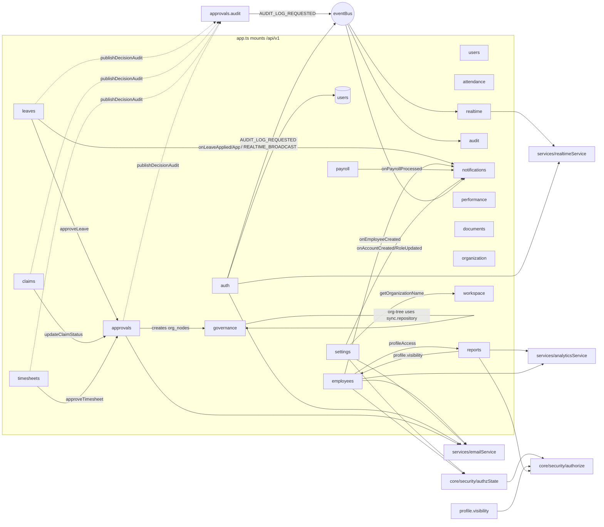

# Ozofi Nexus EMS: Pre-implementation Dependency Analysis (v3)

Snapshot: branch `feat/profile-visibility-by-viewer`, HEAD `42aaace` **plus the dirty working tree** (24 modified files, see 0.3).
Method: static reading + `python docs/audit/tools/route_contract_check.py` (read-only) + `npm run typecheck`, `npm test` (unit project, DB-safe, see 0.2), client `tsc --noEmit` and `vitest run`. No server started, no database connection, no `.env` read, no application file modified. This is the only file written.
Reused and re-verified: `docs/audit/v2/*.md`, `docs/audit/PERMISSION_MATRIX.md`. Where v2 is stale or wrong it is called out in section 8.

## 0. Evidence legend, baseline, working-tree caveats

| Tag | Meaning |
|---|---|
| **C** `path:line` | Confirmed by reading that line (paths relative to `server/src/` unless prefixed `client/`, `server/test/`, `docs/`). |
| **I** | Inferred from code; depends on data or deployment not visible. |
| **U** | Unknown: not enough evidence in the repository. |

### 0.1 Baseline results (executed, exact)

| Check | Result |
|---|---|
| `server: npm run typecheck` (= `tsc --noEmit -p tsconfig.json && tsc -p tsconfig.test.json`) | **FAILS, exit 2.** Step 1 (src) passes. Step 2 reports exactly one error: `test/unit/tenant.isolation.test.ts(58,39): error TS2835: Relative import paths need explicit file extensions in ECMAScript imports when '--moduleResolution' is 'node16' or 'nodenext'. Did you mean '../../src/config/db.js'?` The file is **unmodified** in the working tree (last commit `42aaace`), so this is a pre-existing HEAD failure, caused by `await import('../../src/config/db')` inside the `withTransaction` mock (C `test/unit/tenant.isolation.test.ts:57-59`). Vitest does not type-check, so tests still run. Any new test that copies this mock pattern must use a static import or `.js` suffix, otherwise it adds a second typecheck error. |
| `server: npm test` (= `vitest run --project unit`) | **PASS: 15 test files, 301 tests passed, exit 0.** |
| `client: npx tsc --noEmit` | **PASS, exit 0, no output.** |
| `client: npx vitest run` | **PASS: 12 test files, 95 tests passed, exit 0.** |
| `python docs/audit/tools/route_contract_check.py` | `126 backend routes; 18 unmatched client calls` (listed in section 4). |

### 0.2 Why running the unit project was safe (checked before running)

`server/vitest.config.ts` (C `:33-40`) sets for the **unit** project `DATABASE_URL`/`DIRECT_URL` to `postgresql://nobody@127.0.0.1:1/unreachable`, plus inert JWT secrets, empty SMTP/Sentry. `dotenv` never overrides pre-set vars, so `server/.env` cannot reach the unit run. Unit tests mock `config/db` or the repositories. The **integration** project is not runnable: `test/setup/integration.global.ts` throws unless `TEST_DATABASE_URL` is a disposable local DB **and** `server/db/baseline/0000_live_schema.sql` exists; that file does **not** exist (C `ls server/db/baseline` = `README.md diagnostics.sql loadSnapshot.ts`; `integration.global.ts:25-30`). Without `TEST_DATABASE_URL` the two integration files are `describe.skipIf`. Consequence for every plan below: **unit tests with a mocked `pool` are the only executable harness today**; integration rows are written but blocked on baseline B0-01.

### 0.3 Dirty working tree overlaps with Phase 1 targets (merge risk)

Modified-but-uncommitted files that Phase 1 would touch or depend on: `server/src/modules/employees/employees.repository.ts` (ARC-02: the delete path was refactored, +39/-4: reporting-line hand-up, `user_id` in select), `client/src/modules/employees/components/EmployeeTable.tsx` (ARC-02 caller + ARC-08 EventSource caller), `client/src/hooks/useSessionSync.ts` (ARC-03 area), `server/test/unit/authz.closure.test.ts` (test file to extend). All line numbers below for `employees.repository.ts` refer to the **working-tree** version. Commit or stash those before starting ARC-02 so the diff is clean. Files are CRLF on disk (git warns); keep line endings when editing.

---

## 1. Module dependency graph

Source: import graphs read from every `*.routes/controller/service/repository` file (C). `core/*`, `config/*`, `types` are shared and omitted from edges except where noted.



Notable couplings (C): `leaves/claims/timesheets.service` instantiate `ApprovalsService` and call `updateApprovalAction` (`leaves.service.ts:5,10,59`, `claims.service.ts:5,10,40`, `timesheets.service.ts:4,9,66`); `reports.controller` imports `employees/profile.visibility`; `approvals.repository` writes the governance tables `org_nodes`/`org_governance` (`:180-223`); `settings/user-assignments.service` imports `workspace/workspace.service`; `notifications` has two parallel router trees (`notifications.routes.ts` dead, `core/core.routes.ts` mounted). `services/notificationService.ts`, `services/auditService.ts` are re-export shims over `modules/notifications` / `modules/audit`. Three DB access paths coexist: `config/db` `pool`, `database/client` pool via `withTransaction`, `db/connection` `query` (audit + notifications) (v2 API doc 1.9, re-checked via imports).

### 1.1 Dead or duplicate files (mounted tree is what matters)

| File | Status | Evidence |
|---|---|---|
| `modules/settings/settings.routes.ts` (≈440 lines of inline SQL routes, includes `GET /users/:id/temp-password` at `:303`) | **Not mounted.** `app.ts` imports `./modules/settings` = `settings/index.ts`, which mounts `rbac/configuration/user-assignments`. Still compiled. | C `app.ts:30`, `settings/index.ts:5-15` |
| `modules/performance/performance.routes.ts` (+controller/service/repository at module root) | Dead duplicate of `performance/reviews/*` (mounted via `performance/index.ts:5`) | C |
| `modules/notifications/notifications.routes.ts` (+controller/service/repo) | Dead duplicate of `notifications/core/*` | C `notifications/index.ts:10` |
| `modules/realtime/realtime.routes.ts` + `realtime.controller.ts` | `index.ts` mounts `connections/connections.routes.ts`; controller in `connections/` is the live one but delegates to `services/realtimeService` | C `realtime/index.ts:8`; note `realtime/realtime.controller.ts:2-9` is the one that calls `RealtimeService.addClient`, check `connections.controller.ts` before editing ARC-08 (U: not opened) |
| `modules/governance/governance.routes.ts` (+controller/service/repo) | Dead monolith; live = `org-tree/`, `sync/`, `shared/` | C `governance/index.ts:8-10` |
| `modules/departments/*` | Router **never mounted** (`app.ts` has no `/departments`) | C `app.ts:104-124` |
| `middleware/authMiddleware.ts`, `middleware/errorHandler.ts` | Unused older copies | I |

---

## 2. Route → controller → service → repository map (every mounted route)

`app.ts` mounts (C `app.ts:104-124`): `/auth` (authLimiter 10/15min/IP), all others behind `apiLimiter` 300/min. Plus `GET /api/v1/health`, `GET /`, static `/public`. **126 module routes** (checker count, re-derived list has no duplicates). v2 said 127; the difference is the health route counted inside (I).
Legend: ctl/svc/repo function names; `R` = repository class in same module; `inline` = SQL in the route file; `AS` = `services/analyticsService`. Guard `auth` = authenticate only (any signed-in user). `P:` = permission string, `RN:` = role-name guard (expanded through `ROLE_TO_PERMISSIONS`, see 3.1).

### 2.1 Auth (`auth/auth.{routes,controller,service,repository}.ts`; all under authLimiter)

| Route | Guard | ctl | svc | repo |
|---|---|---|---|---|
| GET /auth/repair-identity | none | repairIdentity | none (static text) | none |
| POST /auth/login | none | login | login | findUserByEmail, findRolePermissions, updateRefreshToken |
| POST /auth/refresh | none | refresh | refresh | findUserById, findRolePermissions, updateRefreshToken |
| POST /auth/forgot-password | none | forgotPassword | requestPasswordReset | findUserForPasswordReset, hasRecentPasswordReset, createPasswordResetToken |
| POST /auth/reset-password | none | resetPassword | resetPasswordWithToken | findPasswordResetByTokenHash, consumePasswordReset |
| POST /auth/logout | auth | logout | logout | updateRefreshToken(null) |
| GET /auth/me | auth | getProfile | getProfile | findUserProfile |
| PUT /auth/me | auth | updateProfile | updateProfile | updateProfile |
| PUT /auth/me/preferences | auth | updatePreferences | updatePreferences | updatePreferences |
| PUT /auth/status | auth | updateStatus | updateStatus | updateStatus |
| PUT /auth/me/password | auth | changePassword | changePassword | findUserById, updatePassword |

### 2.2 Users, attendance, leave, timesheets

| Route | Guard | ctl | svc | repo |
|---|---|---|---|---|
| GET /users | auth | getUsers | getUsers | users R.getUsers |
| PUT /users/profile | auth (**no authorize**) | updateProfile | updateProfile | users R.updateProfile |
| GET /attendance/today | requireSelfOrAdmin | getTodayStatus | getTodayStatus | resolveEmployeeId, getOpenSession, getTodayStats |
| GET /attendance/history | requireSelfOrAdmin | getHistory | getHistory | resolveEmployeeId, getHistory |
| GET /attendance/weekly-hours | requireSelfOrAdmin | getWeeklyHours | getWeeklyHours | resolveEmployeeId, getWeeklyHours |
| GET /attendance/summary/:userId | requireSelfOrAdmin | getSummary | getSummary | resolveEmployeeId, getSummary |
| POST /attendance/check-in | auth | checkIn | checkIn | resolveEmployeeId, getOpenSession, checkIn |
| POST /attendance/check-out | auth | checkOut | checkOut | resolveEmployeeId, checkOut |
| POST /attendance/regularize | auth | regularize | requestRegularization | resolveEmployeeId, hasPendingRegularization, createRegularizationRequest |
| GET /leave/types | auth | getLeaveTypes | getLeaveTypes | getLeaveTypes |
| POST /leave/apply | auth | applyLeave | applyLeave (+NotificationService.onLeaveApplied) | applyLeave, getUserAndLeaveTypeName |
| GET /leave, GET /leave/requests | auth (+`hasAccess leave:approve` in svc) | getLeaveRequests | getLeaveRequests | getLeaveRequests |
| PUT /leave/requests/:id, PUT /leave/:id | auth (owner in repo) | updateLeaveRequest | updateLeaveRequest | updateLeaveRequest |
| DELETE /leave/requests/:id, DELETE /leave/:id | auth (owner) | deleteLeaveRequest | deleteLeaveRequest | leaveBelongsToUser, deleteLeaveRequest |
| GET /leave/balance | requireSelfOrAdmin | getLeaveBalance | getLeaveBalance | getLeaveBalance |
| PUT /leave/:id/approve | P:leave:approve | approveLeave (+publishDecisionAudit) | approveLeave → ApprovalsService.updateApprovalAction(`leave-<id>`) + notify | approvals R.lockApproval/setDecision, getUserAndLeaveTypeName |
| GET /timesheets/week | requireSelfOrAdmin | getTimesheetByWeek | getTimesheetByWeek | getTimesheet, createTimesheet (GET writes) |
| GET /timesheets/history | requireSelfOrAdmin | getTimesheetHistory | getTimesheetHistory | getTimesheetHistory |
| GET /timesheets/pending | P:timesheet:approve | getPendingTimesheets | getPendingTimesheets | getPendingTimesheets |
| PUT /timesheets/:id/entries | auth (owner) | saveTimesheetEntries | saveTimesheetEntries | getOwnTimesheet, clearEntries, insertEntry, updateTimesheetHours |
| PUT /timesheets/:id/submit | auth (owner) | submitTimesheet | submitTimesheet | getOwnTimesheet, submitTimesheet |
| PUT /timesheets/:id/approve | P:timesheet:approve | approveTimesheet (+audit) | approveTimesheet → ApprovalsService | approvals R |

### 2.3 Employees, payroll, claims, approvals, documents, performance

| Route | Guard | ctl | svc | repo |
|---|---|---|---|---|
| GET /employees/check-email | auth | checkEmail | checkEmailAvailability | findByAnyEmail, findByEmail, findUserByEmail |
| GET /employees/roles | auth | **inline in routes (`employees.routes.ts:31-42`)** | none | raw `pool.query` on `roles` |
| GET /employees/me | auth | getMyProfile | getEmployeeProfileByUserIdOrEmail | raw pool |
| GET /employees | RN:[admin,super_admin,hr,manager,employee] P:[employees:read,employees:manage] (≈ everyone, finding S-04) | getEmployees | getEmployees | findMany |
| POST /employees | RN:[admin,super_admin,hr] P:employees:manage | createEmployee | createEmployee (+authzState role resolve, email, notify) | createEmployee, createUserAccount, createPayrollProfile |
| GET /employees/:id/education\|experience\|emergency-contacts | auth + owner/`profileAccess` in ctl | getEducation / getExperience / getEmergencyContacts | same | findEducation / findExperience / findEmergencyContacts |
| PUT /employees/:id/education\|experience, POST …/emergency-contacts | auth + `isHrOrAdmin` role-name or owner in ctl | saveEducation / saveExperience / saveEmergencyContacts | same (assertEmployeeInTenant) | replaceEducation / replaceExperience / replaceEmergencyContacts |
| PUT /employees/:id | auth + `isHrOrAdmin` role-name or owner (arg-shift bug, section 8) | updateEmployee | updateEmployee (authzState) | findById, update, updateEmployeeProfile, updateUserRole, updatePayrollProfile, updateUserEmail |
| POST /employees/bulk-upload | RN:[admin,super_admin,hr] P:employees:manage | bulkUpload | bulkUpload | findMany + createEmployee per row |
| DELETE /employees/:id | RN:[admin,super_admin,hr] P:employees:manage | deleteEmployee | deleteEmployee | delete |
| GET /payroll/employees | P:payroll:view | getPayrollEmployees | same | getPayrollEmployees |
| PUT /payroll/employees/:id | P:payroll:manage | updatePayrollProfile | same | getEmployeeById, getPayrollProfile, insertPayrollProfile, updatePayrollProfile |
| GET /payroll/history/:employeeId | P:payroll:view \| payroll:view_own | **inline stub (`payroll.routes.ts:19`)** | none | none |
| GET /payroll/runs, /activity | P:payroll:view | getPayrollRuns / getPayrollActivity | same | getPayrollRuns |
| GET /payroll/pending-approvals | P:payroll:view | getPendingApprovals | same | countPendingClaims |
| GET /payroll/live-summary, /tax-summary | P:payroll:view | getLiveSummary / getTaxSummary | same | getAllPayrollProfiles |
| GET /payroll/deadlines | P:payroll:view | getPayrollDeadlines | static | none |
| POST /payroll/process | P:payroll:run | processPayroll | processPayroll (tx, notify) | createPayrollRun, getAllPayrollProfiles, insertPayrollEntry, upsertPayrollHistory |
| POST /claims | auth | submitClaim | submitClaim | claims R.submitClaim |
| GET /claims/employee/:employeeId | auth (+`hasAccess claims:approve` in svc) | getEmployeeClaims | same | getEmployeeClaims |
| GET /claims | P:claims:approve | getAllClaims | same | getAllClaims |
| PUT /claims/:id/status | P:claims:approve | updateClaimStatus (+audit) | updateClaimStatus → ApprovalsService(`claim-<id>`) | approvals R |
| GET /approvals | auth (rows scoped by role-name `manager`/`employee`, `approvals.repository.ts:33`) | getApprovals | getApprovals | approvals R.getApprovals, getReportingManagerUserIds, getRoleName |
| POST /approvals | P:approvals:approve | createApprovalRequest | same | createApprovalRequest, employeeExistsInTenant |
| POST /approvals/request | auth | createSelfServiceRequest | same | createSelfServiceRequest |
| POST /approvals/:id/action | P: any of `ANY_APPROVER_PERMISSIONS` then per-type `permissionsForType` (`approvals.policy.ts:38-61`) | updateApprovalAction (+audit) | updateApprovalAction | lockApproval, resolveActorEmployeeId, setDecision, applySelfServiceChange, applyAttendanceRegularization, executeDepartmentCreation, executeTeamCreation |
| GET /documents/:employeeId | auth; svc blocks only role-name `employee` unless owner (`documents.service.ts:13`) | getEmployeeDocuments | same | getEmployeeUserId, getEmployeeDocuments |
| POST /documents | auth | uploadDocument | same | uploadDocument |
| PUT /documents/:id/verify | RN:[hr,admin,super_admin] | verifyDocument | same | verifyDocument |
| DELETE /documents/:id | RN:[hr,admin,super_admin] | deleteDocument | same | deleteDocument |
| GET /performance, PUT /performance/:id | auth | get/updatePerformanceReview | same | reviews R |
| POST /performance | RN:[manager,hr,admin,super_admin] | createPerformanceReview | same | createPerformanceReview |
| DELETE /performance/:id | RN:[admin,super_admin] + svc role check (`reviews.service.ts:27`) | deletePerformanceReview | same | deletePerformanceReview |

### 2.4 Reports, audit, notifications, realtime, workspace

| Route | Guard | ctl | svc | repo |
|---|---|---|---|---|
| GET /reports/admin, /reports/dashboard | P:reports:view | getAdminDashboard | AS.getAdminDashboard | inline SQL in AS |
| GET /reports/manager, /reports/employee, /reports/dashboard/manager\|employee | auth + `assertMayViewUser` (own, or `employees:view`) | getManagerDashboard / getEmployeeDashboard | AS.* | inline in AS |
| GET /reports/team | auth + assertMayViewUser | getTeamEmployees | AS.getTeamEmployees | AS |
| GET /reports/profile/:employeeId | auth + `assertMayViewEmployeeProfile` + field filter | getEmployeeProfile | AS.getEmployeeProfile | AS |
| GET /reports/analytics | P:reports:view | getAnalytics | AS | AS |
| GET /reports/summary, /reports/departments | P:reports:view | getReportSummary | AS.getAdminDashboard | AS |
| GET /audit-logs | P:audit:view | getLogs | read.service getLogs | audit/read R (`db/connection`) |
| GET /notifications | auth | core getNotifications | core getNotifications | core R (`db/connection`) |
| PUT /notifications/read-all, PUT /notifications/:id/read | auth | markAllAsRead / markAsRead | same | same |
| GET /realtime/stream | authenticate (header or `?token=`) | getStream | `RealtimeService.addClient` | none (in-memory) |
| GET /workspace | auth | inline route | getWorkspace | workspace R |

### 2.5 Settings, organization, governance

| Route | Guard | ctl | svc | repo |
|---|---|---|---|---|
| (all /settings/*) | router-wide `authorize(['admin','super_admin','hr','settings:manage'])` (`settings/index.ts:11`) | | | |
| GET /settings/permissions | router gate only | getPermissions | rbac getPermissions | getPermissions |
| GET /settings/roles | router gate only | getRoles | getRoles (fallback variant) | getRoles, getRolePermissions, getRolesFallback |
| GET /settings/roles/:id/members, /candidates | P: roles:assign \| roles:manage \| users:manage (members); roles:assign (candidates) | getRoleMembers / getRoleCandidates | listRoleMembers | findRoleMembers |
| POST /settings/roles | P:roles:manage + authzState | createRole | createRole | createRole, getPermissionId, addRolePermission |
| PUT /settings/roles/:id | P:roles:manage + authzState | updateRole | updateRole | updateRole |
| DELETE /settings/roles/:id | P:roles:manage + authzState | deleteRole | deleteRole | deleteRole |
| PUT /settings/roles/:id/permissions | P:permissions:grant + authzState | updateRolePermissions | same | checkRoleExists, clearRolePermissions, getPermissionId, addRolePermission |
| GET/PUT /settings/config, POST /settings/test-email | router gate only | getConfig / updateConfig / testEmail | config svc | getConfig, ensureAppConfigTable, updateConfig |
| GET /settings/users | router gate only | getUsers | getUsers (fallback) | getUsers, getUsersFallback |
| POST /settings/users | P:users:manage + authzState | createUser | createUser | checkEmailExists, createUser (**writes temp_password**) |
| POST /settings/users/:id/send-welcome | P:users:manage | sendWelcome | sendWelcome | getUser, updatePassword |
| POST /settings/users/:id/reset-password | P:users:manage + may-manage-target | resetPassword | resetPassword | updatePassword (**returns plaintext temp password**) |
| PUT /settings/users/:id/password | P:users:manage + may-manage-target | updatePassword | updatePassword | updatePassword (**stores plaintext in temp_password**) |
| PUT /settings/users/:id/role | P:roles:assign + authzState | updateUserRole | updateUserRole | getUser, updateUserRole |
| PUT /settings/users/:id/status, DELETE /settings/users/:id | P:users:manage + may-manage-target | updateUserStatus / deleteUser | same | updateUserStatus / deleteUser (soft) |
| GET /organization/team-status | auth (role-name scope `organization.repository.ts:83`) | getTeamStatus | same | getTeamStatus |
| GET /organization/departments, /teams | auth | getDepartments / getTeams | same | same |
| POST /organization/departments, /teams | `adminOnly` = RN:[admin,super_admin] P:[organization:manage,employees:manage] | createDepartment / createTeam | createDepartmentRequest / createTeamRequest | getEmployeeIdByUserId, insertApproval (202) |
| PUT /organization/departments/:id, /teams/:id; DELETE both | adminOnly | update/delete Department/Team | same | same |
| GET /governance/tree, /search | auth | org-tree getOrgTree / searchNodes | org-tree svc (calls `sync.repository.syncGraph` first) | org-tree R, sync R |
| PUT /governance/:nodeId | RN:[admin,hr,super_admin] | updateGovernance | same | org-tree R.updateGovernance (upsert by node_id, no ownership check) |
| POST /governance/sync | RN:[admin,hr,super_admin] | syncGraph | same | sync R.syncGraph |
| GET /governance/resolve/:nodeId | auth | resolveOwnership | same | shared R |

---

## 3. Authorization inventory

### 3.1 Primitives (C `core/security/authorize.ts`)

| What | Where | Behaviour |
|---|---|---|
| `authenticate` | `authorize.ts:5-53` | Bearer header, **else `?token=`** (`:13-17`); verify access JWT; `req.user` from claims only, no DB read per request |
| `ROLE_TO_PERMISSIONS` | `:69-75` | role-name guard to "any one of these perms" map (`admin`→settings:manage, employees:view/create/update, payroll:manage, reports:view; `hr`→employees:*, leave:approve, onboarding:manage, attendance:manage; `manager`→employees:view, leave:approve, reports:view, attendance:view; `employee`→attendance/leave/profile/dashboard basics) |
| `isSuperAdminIdentity` | `:91` | `role === 'super_admin'` (JWT role name) |
| `hasDashboardAdminBypass` | `:92` | `dashboard_type === 'admin'` |
| `hasAccess` | `:94-130` | super_admin, then dashboard admin, then exact perm if entry has `:`, then role-name expansion, then role-name equality |
| `authorize` | `:132-159` | wraps `hasAccess`; logs email + full perm list on 403 |
| `enforceTenantIsolation` | `:161-176` | exported, used by **no** route (C: grep) |
| `ELEVATED_ROLES` / `requireSelfOrAdmin` | `:187-236` | role-name set {super_admin, admin, hr, manager}; custom roles denied cross-user access even with permissions |

### 3.2 Permission-string checks (route and in-code), with file:line

| Permission string(s) | Where |
|---|---|
| `approvals:approve` | `approvals.routes.ts:14`; `approvals.policy.ts:54` (generic type) |
| `ANY_APPROVER_PERMISSIONS` = union of type perms + `approvals:approve` | `approvals.routes.ts:18`, `approvals.policy.ts:59-61` |
| `leave:approve` | `leaves.routes.ts:37`; `leaves.service.ts:44`; `approvals.policy.ts:39` |
| `timesheet:approve` | `timesheets.routes.ts:25,30`; `approvals.policy.ts:40` |
| `claims:approve` | `claims.routes.ts:15,16`; `claims.service.ts:28`; `approvals.policy.ts:41` |
| `onboarding:manage` | `approvals.policy.ts:42` |
| `organization:manage`, `employees:manage` | `organization.routes.ts:11` (adminOnly); `approvals.policy.ts:44-45`; client `NewRequestModal.tsx:25-26` |
| `settings:manage` | `settings/index.ts:11`; `approvals.policy.ts:48` |
| `attendance:regularize`, `attendance:manage` | `approvals.policy.ts:50` |
| `payroll:view`, `payroll:manage`, `payroll:run`, `payroll:view_own` | `payroll.routes.ts:15,16,19,23-29`; `profile.visibility.ts:39` (`payroll:view`,`payroll:manage`) |
| `employees:read`, `employees:manage` | `employees.routes.ts:47,50,68,71`; `profile.visibility.ts:29` (`employees:update`,`employees:manage` as `PERSONAL_GRANTS`) |
| `employees:view` | `reports.access.ts:25,34`; via `ROLE_TO_PERMISSIONS` expansion of `admin`/`hr`/`manager` guards |
| `reports:view` | `reports.routes.ts:13,18,21,25,26` |
| `audit:view` | `audit/read/read.routes.ts:11` (seeded vocabulary also has `audit:read`, v2 F-10: U which seed ran in production) |
| `roles:assign`, `roles:manage`, `permissions:grant`, `users:manage` | `rbac.routes.ts:10-15`, `user-assignments.routes.ts:9-15`, `authzState.ts:107,174,190,200,206` |

### 3.3 Role-NAME checks, server (every one, file:line). These are the HF-9B/9A debt.

| Check | file:line |
|---|---|
| Legacy role-name guards through `authorize([...])`: `'admin','super_admin','hr','manager','employee'` | `employees.routes.ts:47,50,68,71`; `governance/governance.routes.ts:13,16`, `org-tree.routes.ts:14`, `sync.routes.ts:10`; `settings/index.ts:11`; `organization.routes.ts:11`; `documents.routes.ts:15,16` (`UserRole.HR/ADMIN/SUPER_ADMIN`); `performance/reviews/reviews.routes.ts:14,16` (+ dead `performance.routes.ts:14,16`) |
| `['admin','super_admin','hr'].includes(user.role)` in handlers | `employees.controller.ts:48,81,99,117` |
| `WRITE_ROLES = ['admin','super_admin','hr']` | `profile.visibility.ts:29,40` |
| `ELEVATED_ROLES` (super_admin, admin, hr, manager) | `authorize.ts:187-191,232` |
| `role === 'manager' \|\| role === 'employee'` inbox scoping | `approvals.repository.ts:33` |
| `actor.role === 'admin' \|\| 'super_admin'` approver / role-grant rules | `approvals.service.ts:59,69,74` |
| `userRole === UserRole.EMPLOYEE` documents | `documents.service.ts:13` |
| `role !== ADMIN && !== SUPER_ADMIN` perf delete | `performance.service.ts:27`, `reviews.service.ts:27` |
| `'admin'/'super_admin'/'hr'/'administrator'` team-status scope | `organization.repository.ts:83` |
| `users.role` string used as identity/filter | `users.repository.ts:21,24-25` (GET /users?role=); `notifications/channels/channels.repository.ts:27-29` (`WHERE role = ANY($2)`), roles passed from `templates.service.ts:6,37,43,52,61`; `settings/user-assignments.repository.ts:8,41,70`; `employees.repository.ts:13,114,140-145`; `analyticsService.ts:619`; `auth.repository.ts:19-26` (`row.role = row.role_name`); JWT `role` claim from it (`auth.service.ts:55,95`) |
| `BASELINE_ROLE_NAME='employee'` default role | `employees.service.ts:21`, `user-assignments.service.ts:7` |
| Promotion detection by substring `['manager','admin','lead','super_admin','director','head']` | `employees.service.ts:279` |
| `RESERVED_ROLE_NAMES={'super_admin'}`, `ALLOWED_DASHBOARD_TYPES`, `gradeOf` (super / unbounded / ordinary) | `authzState.ts:35,37,42-45` |
| Hard-coded account exception `admin@company.com` | `employees.repository.ts` delete: `empEmail !== 'admin@company.com'` (working tree ≈`:379`) |
| Tenant-level default role id 4 fallback | `auth.repository.ts:7,11,32,34,79`; `authzState.repository.ts:68-69` |

### 3.4 Role-name checks, client (route guards, Sidebar, searchAccess)

| Check | file:line |
|---|---|
| `ProtectedRoute allowedRoles` → `hasAnyRole` | `client/src/modules/auth/components/ProtectedRoute.tsx:27`; used `App.tsx:65,70,75,97,104,109,114,119,127` (routes: onboarding, employees, reports, payroll, approvals, organization(+deep-dive), audit-logs, settings) |
| `hasAnyRole` implementation (literal role name, **`user.name==='System Admin'` / `admin@company.com` safety net**, dashboard_type mapping, `'administrator'`) | `client/src/store/authStore.ts` `hasAnyRole` (≈`:99-121`) |
| `hasPermission` (role `super_admin`/`admin`/`administrator` or `dashboard_type==='admin'` bypass) and `hasModule` (same bypass + core modules always visible) | `authStore.ts` (≈`:88-97,123-134`) |
| Sidebar `roles: [...]` arrays + `isAuthorized` | `components/layout/Sidebar.tsx:40-76,100-111` |
| `searchAccess` pages: `roles` arrays; `EMPLOYEE_SEARCH_ROLES` | `utils/searchAccess.ts:10-23,27-35` |
| `Can` component: `user.role !== role`, `permissions.includes` | `modules/auth/components/Can.tsx:17,22` |
| Dashboard branch by dashboard_type / role | `modules/dashboard/pages/Dashboard.tsx:47-49` |
| Payroll admin tabs by `user.role === 'admin' \|\| 'hr'` (**excludes super_admin**) | `modules/payroll/pages/GeneratePayroll.tsx:30` |
| Timesheet approvals tab by role names | `modules/timesheet/pages/Timesheets.tsx:126` |
| Profile edit by role names | `modules/profile/pages/Profile.tsx:92` |
| Topbar settings link by role / dashboard_type | `components/layout/Topbar.tsx:371` |
| Role dropdown filters `super_admin`/`admin` | `modules/approvals/components/NewRequestModal.tsx:26,180` |
| Permission-based (the target model): approvals sidebar | `modules/approvals/components/ApprovalSidebar.tsx:40,76` |
| Role-grant UI: dashboard types | `settings/components/PermissionMatrix.tsx:90`, `RolesTab.tsx:42,70` |

Note: client and server disagree on who counts as admin (client treats `'administrator'` and a hard-coded email as admin; server does not). Server is the authority; client checks are UX only (C by comparison of 3.3/3.4).

---

## 4. Frontend/backend contract mismatches

`route_contract_check.py` scans only `api.(get|post|put|delete|patch)('literal'` calls under `client/src` (C script `:34-41`). It does not see `EventSource`, `fetch`, or non-literal URLs; every `${...}` becomes `X`; it does not flag calls to **dead** backend routes.

### 4.1 The 18 unmatched client calls (all re-verified in client source)

| # | Client call | Caller (file:line) | Live? | What the server actually has / effect |
|---|---|---|---|---|
| 1 | `DELETE /X/X` | `modules/organization/hooks/useOrganizationForm.ts:111` | live | **False positive**: URL is `${endpoint}/${id}` with endpoint `/organization/departments` or `/teams` (`:80,110`); server routes exist |
| 2 | `PUT /X/X` | same hook `:87` | live | **False positive** (same reason) |
| 3 | `GET /approvals/pending` | `modules/settings/components/ApprovalsTab.tsx:33` | **dead** (component imported nowhere, C grep) | server: `GET /approvals?status=pending`, returns `{success,data}` not an array |
| 4 | `PUT /approvals/X/X` | `ApprovalsTab.tsx:49` | dead | server: `POST /approvals/:id/action {action:'approve'\|'reject', type}` |
| 5 | `GET /claims/admin` | `modules/payroll/sections/Approvals.tsx:28` | live (payroll Approvals tab) | server: `GET /claims` (`claims:approve`). **404 at runtime** |
| 6 | `GET /payroll/deadlines/latest` | `payroll/sections/Approvals.tsx:29` | live | server only has `GET /payroll/deadlines` (static dates). 404 |
| 7 | `POST /payroll/deadlines` | `payroll/sections/Approvals.tsx:61` | live | no such route. 404 |
| 8 | `PUT /claims/X/approve` | `payroll/sections/Approvals.tsx:43` | live | server: `PUT /claims/:id/status {status:'approved'\|'rejected'}`. 404 |
| 9 | `PUT /claims/X/reject` | `payroll/sections/Approvals.tsx:52` | live | same. 404 |
| 10 | `GET /payroll/documents/bulk-payslips` | `payroll/sections/DocumentsPayslips.tsx:53` | live | not implemented. 404 |
| 11 | `GET /payroll/payslip/X/monthly` | `DocumentsPayslips.tsx:76`, `EmployeePayroll.tsx:96` | live | not implemented (no PDF route; `pdfGenerator.ts` util unused by routes: I). 404 |
| 12 | `GET /payroll/payslip/X/yearly` | `DocumentsPayslips.tsx:101` | live | not implemented. 404 |
| 13 | `GET /payroll/tax-statutory/summary` | `payroll/sections/TaxStatutory.tsx:32` | live | server has `GET /payroll/tax-summary`. 404 |
| 14 | `GET /reports/holidays` | `dashboard/components/widgets/OrgCalendarWidget.tsx:16` | live | not implemented. 404 |
| 15 | `GET /timesheets` | `timesheet/pages/Timesheets.tsx:195` | live (History tab) | server has `GET /timesheets/history` (and expects `{items}`); History tab is empty |
| 16 | `POST /payroll/profiles` | `payroll/components/CreateProfileModal.tsx:22` | live | server creates profiles via `PUT /payroll/employees/:id` (upsert). 404 |
| 17 | `POST /payroll/run` | `payroll/sections/PayRuns.tsx:37` | live | server: `POST /payroll/process {month,year}`. 404 |
| 18 | `GET /payroll/deadlines` family counted above | n/a | n/a | (the 18th checker line is #14; list above has 18 rows counting the two `X/X`) |

Correction note: the checker prints exactly 18 lines; rows 1-17 above plus `PUT /approvals/X/X` listed as #4 account for them (the table numbers are for readability; the set is identical to the tool output).

### 4.2 Field and shape mismatches (decision vocabulary and response keys)

| Contract | Client sends / expects | Server expects / returns | Verdict |
|---|---|---|---|
| Leave approve | Client never calls `PUT /leave/:id/approve` (C grep). The Approvals page uses `POST /approvals/${id}/action {action:'approve'\|'reject', type}` (`modules/approvals/pages/Approvals.tsx:67`) | `PUT /leave/:id/approve` body `{action:'approved'\|'rejected'}` (`leaves.schema.ts:21-23`); central path `{action:'approve'\|'reject', type}` (`approvals.schema.ts:8-11`) | **Four vocabularies for one verb**: leave `action=approved/rejected`, timesheet `action=approved/rejected` (`timesheets.schema.ts:19`), claims **`status`**=approved/rejected (`claims.schema.ts:12`), approvals `action=approve/reject`. Plan to unify behind `/approvals/:id/action`. Behaviour gap: the UI path (`approvals.controller.ts:25-32`) passes no options, so **approver is not recorded and the applicant is not notified**; only the direct leave route does (`leaves.service.ts:59-65`) |
| Timesheet approve | `PUT /timesheets/:id/approve {action:'approved'\|'rejected', approved_by:userId}` (`Timesheets.tsx:1261`) | `{action}`; `approved_by` is stripped (identity from token) | Works; client sends a dead field |
| Notifications unread count | `Topbar.tsx:81-82` reads `res.data.data` and **`res.data.unreadCount`** | **Mounted** router (`notifications/core/core.controller.ts:15-23`) returns `{success,data,meta:{unreadCount,page,limit}}`; the **dead** `notifications.controller.ts:13` returns top-level `unreadCount` | **Confirmed mismatch: badge is always 0** (`res.data.unreadCount` is undefined). Fix by reading `res.data.meta.unreadCount` (or emit both). Client test `Topbar.test.tsx:26` mocks the old shape, so it cannot catch it |
| `PUT /users/profile` | `{id:user.id, name,email,phone,address,emergency}` and `setAuth(data.user, token)` (`PersonalInfo.tsx:46-54`) | returns a partial `{id,name,email,role,phone,address,emergency}` (no permissions/dashboard_type) | Only caller is dead code (3.4/ARC-01); would wipe permissions in the store if revived |
| `GET /approvals` | expects `data` | `{success,data}` | ok for live Approvals page; dead `ApprovalsTab` expects raw array |
| Login | uses `accessToken`/`refreshToken`/`mustChangePassword`/`user.*` | also returns duplicate `token` (`auth.controller.ts:24`) | ok |
| SSE base URL | `EmployeeTable.tsx:119` uses `VITE_API_URL \|\| 'http://localhost:4000/api/v1'` | `api.ts:37-54` has hostname/relative fallback | SSE breaks silently in production when `VITE_API_URL` is unset (I) |

---

## 5. Tenant-boundary violations by repository query

Principle: `tenantId` always comes from the verified JWT (C). The leaks are in query predicates. Severity is for **cross-tenant** effect only.

| ID | File:line | Query / pattern | Effect | Severity |
|---|---|---|---|---|
| T-1 | `employees.repository.ts:326-340` (working tree), delete | 15 `DELETE FROM <child> WHERE employee_id=$1` with **no tenant predicate**, executed **before** the tenant-scoped parent lookup (`:343-347`) | Any HR/"admin-guard" caller of tenant A can destroy another tenant's payroll history, claims, leave, timesheets for a known/guessed id. Employee ids are `EMP###` from a **global** sequence (`employees.service.ts:96`), so guessing is trivial | **Critical** (ARC-02) |
| T-2 | `employees.repository.ts:369` | `UPDATE employees SET manager_id=$2 WHERE manager_id=$1` no tenant | cross-tenant `manager_id` rewrite (new in working tree) | High |
| T-3 | `employees.repository.ts:19,117,119,125,135,144,151,165,172` | `tenant_id = $n OR tenant_id IN ('tenant_default','default')` on employees, users (incl. `UPDATE users SET email`, `avatar_url`), `payroll_profiles` | Rows of the pseudo-tenants are readable/writable by every tenant; email update can hit another account of the shared pseudo-tenant | High |
| T-4 | `governance/org-tree/org-tree.repository.ts:9-11,18,45,52`; `shared/shared.repository.ts:9,16,20,21`; `sync/sync.repository.ts:9,11,15,17,33,37,39,44` | `tenant_id = $1 OR 'tenant_default' OR 'default'` for `org_nodes`, `org_governance`, `departments`, `teams`, joined `users` | Every tenant sees (and `POST /governance/sync` copies) pseudo-tenant departments/teams/owner names | High |
| T-5 | `org-tree.repository.ts:28-38` | `INSERT INTO org_governance … ON CONFLICT (node_id) DO UPDATE SET owner_id, ruler_id…` with **no check that `node_id` belongs to the caller's tenant**; `node_id` PK is global; owner/ruler ids not tenant-checked | HR of tenant A can overwrite governance (owner/ruler) of tenant B's node | High |
| T-6 | `approvals.repository.ts:187,191,219,223` (`INSERT org_nodes / org_governance` without `tenant_id`) + DDL default `tenant_id TEXT DEFAULT 'default'` (`initDb.ts:190,202`) | Nodes created when a department/team approval is approved get tenant `'default'`; reads at `:180,183` (`SELECT id FROM org_nodes WHERE entity_type=$1 AND entity_id=$2`) have no tenant either | Each tenant's new departments/teams appear in the shared `'default'` bucket that T-4 exposes to all tenants; parent-node lookup can resolve to another tenant's node | High (v2 ARC-05) |
| T-7 | `approvals.repository.ts:30,208,225` | `WHERE (ap.tenant_id=$1 OR ap.tenant_id IS NULL OR ap.tenant_id='')` for read and for `UPDATE approvals SET status` | NULL-tenant approvals visible/decidable by any tenant | Medium |
| T-8 | `settings/rbac/rbac.repository.ts:17,58,68`; `core/security/authzState.repository.ts:6,27` | roles `OR 'tenant_default' OR IS NULL` | Intentional shared **role templates**; the HF-10 policy bounds grants. Keep, but note shared templates are visible to all | Info |
| T-9 | `settings/configuration/configuration.repository.ts:20`; `workspace/workspace.repository.ts:15`; `services/emailService.ts:117`; `analyticsService.ts:228,538` | `OR tenant_id IS NULL` | global config rows and NULL-tenant attendance rows leak into every tenant's view (config merge by design: Info; analytics counts: Medium) | Medium |
| T-10 | `settings/user-assignments/user-assignments.repository.ts:12,14` | `e.tenant_id=$1 OR e.tenant_id IS NULL`, `u.tenant_id IS NULL` | NULL-tenant employees listed in every tenant's users page | Medium |
| T-11 | controllers: `settings/configuration/configuration.controller.ts:6,9,19` (`'default'`), `rbac/rbac.controller.ts:6,14`, `user-assignments/user-assignments.controller.ts:6,9` (`'default'`/`'tenant_default'`), `sync.repository.ts:9` | `req.user?.tenantId \|\| DEFAULT` | unreachable while `authenticate` guarantees a tenant claim, but a token without `tenantId` would silently act as the shared tenant | Low |
| T-12 | `auth/auth.repository.ts:4-15` (`findUserByEmail`), `employees.service.ts:199,205` | login e-mail looked up globally (users.email UNIQUE globally per v2 DB analysis); `personal_email` also matches | by design; consequence: no two tenants can share an e-mail, and `personal_email` of tenant A can sign in as a user | Info/Medium |
| T-13 | `leaves.repository.ts:5,88,93` (`leave_types` global); `permissions` global; `employees.repository.ts:64` `countTotalEmployees` (unused); `approvals.repository.ts:7` (`employees WHERE user_id=$1`) | no tenant column or ids are globally unique | Info |
| T-14 | `core/security/authzState.repository.ts:42` | `roles WHERE id=$1 AND VISIBLE` (tenant-aware) | ok | none |

Positive controls verified: `reports.access.ts:8-35` (tenant-bound lookups), documents/claims/leave repositories carry `tenant_id` predicates, `employees` sub-record routes assert tenant (`employees.service.ts:562-590`), `payroll` repository carries tenant on all statements (C scan).

Scan method: python over all `*.repository.ts`, `*service*.ts`, `core/security/*.ts` flagged every static SQL string lacking the word `tenant` (results above are those flagged; dynamic template SQL for `findMany`/`update` clause builders was read manually).

---

## 6. Audit gaps: every mutating route vs an audit row

Audit mechanism: `EventPublisher.publish(AUDIT_LOG_REQUESTED)` → `audit.listeners.ts:7-23` → `AuditWriteRepository.log` (`audit/write/write.repository.ts`, **errors swallowed**, `:22`). `AuditAction` enum has only CREATE, UPDATE, DELETE, LOGIN, LOGOUT, PAYROLL_RUN, LEAVE_*, ATTENDANCE_REGULARIZE, APPROVAL_* (`types/index.ts:48-60`); `PAYROLL_RUN`, `LEAVE_APPROVE/REJECT`, `ATTENDANCE_REGULARIZE` are **never emitted**. `audit_logs.action` is TEXT, so new action strings need no migration.

**Routes that write an audit row (7):** POST /auth/login (`auth.controller.ts:15`), POST /auth/logout (`:72`), PUT /auth/me (`:91`; note it puts the body under `details.newValues` but the listener reads `payload.newValues`, `audit.listeners.ts:15`, so the **body is not stored**: v2 claim "logs the whole body" is wrong), POST /approvals/:id/action (`approvals.controller.ts:32`), PUT /claims/:id/status (`claims.controller.ts:27`), PUT /leave/:id/approve (`leaves.controller.ts:32`), PUT /timesheets/:id/approve (`timesheets.controller.ts:35`).

**Mutating routes with NO audit row (65 of 72 mutating routes):**

| Module | Routes | Priority |
|---|---|---|
| auth | POST /refresh, /forgot-password, /reset-password (security event: password reset completion), PUT /me/preferences, /status, /me/password (password change) | reset + change password: High |
| users | PUT /users/profile (**identity change, no audit**) | Critical (ARC-01) |
| attendance | POST /check-in, /check-out, /regularize | Low/Med |
| leave | POST /apply, PUT /requests/:id, PUT /:id, DELETE /requests/:id, DELETE /:id | Med |
| timesheets | PUT /:id/entries, /:id/submit | Low |
| employees | POST / (create account + payroll profile), PUT /:id, PUT education/experience, POST emergency-contacts, POST /bulk-upload, **DELETE /:id** (hard delete of payroll history) | **Critical** for DELETE (ARC-02), High for create/update/bulk |
| payroll | PUT /employees/:id (salary, bank), POST /process (`PAYROLL_RUN` enum exists, unused) | High |
| claims, approvals | POST /claims; POST /approvals, POST /approvals/request | Med |
| performance | POST, PUT, DELETE | Med |
| documents | POST, PUT /verify, DELETE | Med/High |
| settings | POST/PUT/DELETE roles, PUT roles/:id/permissions, PUT config, POST test-email, POST /users, send-welcome, reset-password, PUT password, PUT role, PUT status, DELETE user | **High** (privilege and credential changes) |
| organization | POST/PUT/DELETE departments and teams | Med |
| governance | PUT /:nodeId, POST /sync | Med |
| notifications | PUT read-all, PUT :id/read | none needed |

Other audit quality gaps (C): no `old_values` captured anywhere; IP taken from raw `x-forwarded-for` (spoofable, `auth.controller.ts:19`, no `trust proxy`); `audit_logs.tenant_id NOT NULL REFERENCES tenants` (`db/schema.ts:236`) vs the `initDb.ts:376-384` shape without tenant (drift); `AuditWriteService.fromRequest` falls back to tenant `'unknown'` (`write.service.ts:13`).

---

## 7. Notification gaps

Mechanism: `NotificationService.*` in-app inserts via `db/connection.query` (failures swallowed, `channels.repository.ts:20-22`); `notifyByRole` resolves recipients by **users.role name** (`channels.repository.ts:27-29`), so custom roles (e.g. `team_lead`) and permission holders are never notified. The `NOTIFICATION_CREATED` listener only logs (`notifications.listeners.ts:6-14`). No push, no email for notifications, no SSE push of notifications (realtime carries only `STATUS_UPDATE`).

| Event | Notification today? | Evidence |
|---|---|---|
| Leave applied | role names admin/hr/manager (not the requester's reporting manager, not `leave:approve` holders); not awaited | `templates.service.ts:6-12`, `leaves.service.ts:32` |
| Leave approved/rejected **via Approvals UI** | **No**: central path has no notify and records no approver | `approvals.service.ts` (no NotificationService import), `approvals.controller.ts:25-32` |
| Leave approved/rejected via `PUT /leave/:id/approve` (unused by client) | yes (`leaves.service.ts:64-65`) | |
| Timesheet submitted / approved | **Templates exist, never called** (`onTimesheetSubmitted`, `onTimesheetApproved`) | `templates.service.ts:60-78` vs grep of callers |
| Claim submitted / decided | none | no calls in `claims.*` |
| Approval request created (`/approvals`, `/approvals/request`), department/team request | none; approvers learn only by opening the inbox | |
| Approval decided (any non-leave kind: claim, role change, promotion, regularization, department/team) | none to the requester (only onboarding approval sends an email, `approvals.service.ts:195-210`) | |
| Attendance regularization requested / decided | none | |
| Password reset requested / completed, password changed, admin password reset | email link only for request; no in-app/audit/notice on completion or change | `auth.service.ts:179` |
| Employee created | admin/hr by role name; not awaited | `employees.service.ts:176` |
| Employee updated / role-changed / deleted | email to the employee only (`sendEmployeeActionNotification`); no in-app; delete: none | `employees.service.ts:327` |
| Account created / role updated (settings) | to the target user | `user-assignments.service.ts:45,120` |
| Payroll processed | role names employee/manager and admin/hr; **recipients are all users of those role names, not the paid employees** | `templates.service.ts:36-49`, `payroll.service.ts:251` |
| Document verified/rejected, performance review posted, org change | none | |
| Client | **Unread badge always 0** (shape mismatch, 4.2); polls every 60 s (`Topbar.tsx:86`); `Topbar.test.tsx` mocks the wrong shape | |

---

## 8. Re-verification against v2 (stale or wrong claims)

| v2 claim | Verdict now |
|---|---|
| API doc AU-05: "existing refresh tokens/sessions are not revoked after a reset" | **Partly stale.** `consumePasswordReset` already runs `refresh_token = NULL` (`auth.repository.ts:281-282`) and a unit test asserts it (`auth.passwordReset.test.ts:259-262`). It is **ineffective** because `refresh()` never reads the column (`auth.service.ts:75-111`) |
| API doc AU-08: audit logs the whole body | Wrong: stored `newValues` is empty (listener reads `payload.newValues`, controller sets `details.newValues`) |
| Route count 127 | 126 module routes (tool) |
| Bug B-1 (PUT /employees/:id own-profile arg shift) | **Still present**: `employees.controller.ts:50` calls `isEmployeeOwner(targetId, user?.email, user?.userId)`; other call sites pass `(id, tenantId, email, userId)` (`:69,83,101,119`) |
| ARC-01, ARC-02, ARC-03, ARC-07, ARC-08 | All **confirmed present** in current code (details in section 9) |
| `authorize.ts` line refs | All matched |

---

# PHASE 1 implementation plans

Recommended order and dependencies (rationale at the end of this section): **ARC-01 → ARC-08 → ARC-02 → ARC-03 → ARC-07**. ARC-07 step A (remove plaintext acceptance and API/email exposure) can run in parallel with ARC-03 once diagnostics `U1` is read; ARC-07 "admin reset revokes sessions" needs ARC-03.

Shared test pattern (C, available today): unit tests build the real `app` or a router with `vi.mock('../../src/config/db')` capturing `{sql, params}` (see `tenant.isolation.test.ts:20-66`, `settings.secrets.test.ts`, `auth.passwordReset.test.ts` for repository mocks with an in-memory store), sign tokens with `JwtService.generateAccessToken`. Integration: extend `server/test/integration/authz.matrix.test.ts` `MATRIX` rows (empty today) and add files beside `harness.test.ts`; **blocked on `0000_live_schema.sql`**. Do not copy the dynamic-import mock line that currently breaks `typecheck` (0.1).

---

## ARC-01: `PUT /users/profile` must use the authenticated identity

**Confirmed (C):** `users.controller.ts:9` reads `id` from body → `users.service.ts:39-43` → `users.repository.ts:4-18` `UPDATE users SET name,email,phone,address,emergency … WHERE id=$6 AND tenant_id=$7`. Route has no `authorize` (`users.routes.ts:13`), body schema requires `id` (`users.schema.ts:21-28`). Any signed-in user can rewrite another user's name, **login email** and contact fields in the tenant (including admins), then use forgot-password on the new address. No audit, no uniqueness pre-check (23505 echoes the value).

**Client callers (C):** exactly one: `client/src/modules/profile/components/PersonalInfo.tsx:46` (`api.put("/users/profile", {id: user?.id, ...form})`). `PersonalInfo` is **imported nowhere** (`grep PersonalInfo client/src` returns only its own file), so the UI does not reach the endpoint today. The live self-edit path is `PUT /auth/me` via `hooks/index.ts:94` (also unused) / profile screens that use `auth/me`. The server tests do not touch this route (C grep of `server/test`).

**Affected files (exact):**
- `server/src/modules/users/users.controller.ts` (use `req.user!.userId`, `tenantId`; ignore `req.body.id`)
- `server/src/modules/users/users.schema.ts` (remove required `id`; accept-and-reject mismatch or drop it; stop accepting `email`)
- `server/src/modules/users/users.service.ts`, `users.repository.ts` (drop `email` from the SET list; keep `WHERE id AND tenant_id`)
- `server/src/modules/users/users.routes.ts` (optionally mount an audit emit)
- `client/src/modules/profile/components/PersonalInfo.tsx` (switch to `PUT /auth/me`, send no `id`/`email`, do not `setAuth` with the partial row: use `updateUser`) or delete the dead component
- new test `server/test/unit/users.profile.test.ts`

**Design (recommended):** keep `PUT /users/profile` as a thin alias of the self-service update: identity = token; if a body `id` is present and differs from `userId`, respond 403 (visible, defence in depth, instead of silent ignore); **never write `users.email`** (changing the login email also breaks the `employees.email` join used by login, reset and role resolution; email change needs its own verified flow). Emit an `UPDATE` audit event with the changed field names (not values). Alternative with less surface: delete the route and `PersonalInfo.tsx` (no live caller): the plan should pick this unless an external consumer exists (U: no external API consumers known).

**Dependency impact:** callers = only the dead component. Downstream readers of `users.name/phone/address/emergency`: `/auth/me`, employees joins, reports. No other module calls `UsersService.updateProfile`.

**Migration impact:** none. **Rollback:** revert one commit; no data change. **Security impact:** closes a Critical account-takeover path (v2 S-02); removes a login-email rewrite vector; adds an audit trail. **Risks:** if any out-of-repo client still sends `id`, it gets 403 when the id is another user's, and works when it is its own; email changes through this route stop silently (document it).

**Test plan (unit, new `users.profile.test.ts`, pattern of `auth.profile.fresh.test.ts`):** (1) token user 5 body `id:9` → 403 and **no `UPDATE` issued**; (2) body `id` equals own → 200, SQL params contain the token's id and tenant, never `9`; (3) `email` in body is not in the SET clause and the stored email is unchanged; (4) unauthenticated → 401; (5) empty `phone` behaviour documented; (6) audit event published once with `entityId` = own id. **Integration:** add a `MATRIX` row `{put,/api/v1/users/profile,{name:'x'},expect:{employee:200,manager:200,…}}` plus a two-user cross-write assertion (blocked on B0-01).

---

## ARC-02: employee delete must verify tenant ownership first, abort on 0 parent rows, and audit

**Confirmed (C, working tree):** `employees.repository.ts:320-402`. `BEGIN` → 15 child `DELETE`s by `employee_id` only (`:326-340`: employee_education, employee_experience, employee_emergency_contacts, employee_documents, employee_roles, performance_reviews, timesheets, leave_requests, approvals, payroll_profiles, payroll_entries, payroll_history, reimbursement_claims, claims, loans) → only then `SELECT … FROM employees WHERE id=$1 AND tenant_id=$2` (`:343-347`) → reporting-line hand-up (`UPDATE employees SET manager_id=$2 WHERE manager_id=$1` **no tenant**, `:369`) → `DELETE FROM employees WHERE id=$1 AND tenant_id=$2` → deactivates the login by e-mail (`:379-382`, hard-coded `admin@company.com` exception) → `COMMIT` and returns `rowCount>0` (`:384-386`), so with **0 parent rows it commits the child deletions**. `catch` rolls back and silently **falls back to a soft delete** (`:390-401`) which does not deactivate the user and masks the failure. Controller returns 404 only after the commit (`employees.controller.ts:143-152`). Route guard is the legacy name/permission list (`employees.routes.ts:71`), reachable by any role holding `employees:view` (F-1). No audit.

**Client callers:** `client/src/modules/employees/components/EmployeeTable.tsx:252` (`api.delete('/employees/${showDelete.id}')`); the working tree already filters the row locally afterwards. Handles non-2xx via catch; success body `{success,message}` unchanged by this plan.

**Affected files (exact):**
- `server/src/modules/employees/employees.repository.ts` (`delete`, lines ≈320-402; plus `findByIdForUpdate` helper)
- `server/src/modules/employees/employees.service.ts:593-595` (return the removed employee snapshot or throw `AppError.notFound`)
- `server/src/modules/employees/employees.controller.ts:143-153` (emit audit; keep 404 contract)
- `server/src/types/index.ts` (optional `EMPLOYEE_DELETE` enum entry; `DELETE` already exists, no DB change)
- `server/test/unit/tenant.isolation.test.ts` (extend the existing `W.sql` capture) or new `server/test/unit/employees.delete.test.ts`

**Design:** inside the transaction first run `SELECT id, email, user_id, manager_id, reporting_manager_id FROM employees WHERE id=$1 AND tenant_id=$2 FOR UPDATE` (drop the pseudo-tenant forms). If no row: `ROLLBACK` and signal not found **before any child statement**. Only then run the 15 child deletes (ids are globally unique and ownership is proven; add `AND tenant_id=$2` on tables known to have the column: payroll_* and claims-family; **U:** whether `employee_education/experience/emergency_contacts/documents/roles/loans` carry `tenant_id`, confirm in the production baseline before adding predicates). Add `AND tenant_id=$3` to the `manager_id` update (`:369`) and to the user-deactivate (already tenant-bound). Replace the silent soft-delete fallback with: rethrow the error (500) so nothing is half-done, **or** an explicit soft-delete branch that also deactivates the linked user and is audited. Null the linked user's refresh credential and (after ARC-03) revoke its sessions in the same transaction. Audit: publish `AUDIT_LOG_REQUESTED` with `action:'DELETE'`, `entityType:'employee'`, `entityId:id`, `oldValues` limited to `{name,email,department,position}` (no pay data), after commit, from the controller (pattern `approvals.audit.ts`). Consider also refusing self-delete and removing the `admin@company.com` special case (U: product decision).

**Dependency impact:** callers = `EmployeeTable.tsx` only; DB readers of the removed rows: payroll, approvals inbox, reports (a hard delete also wipes statutory `payroll_history`: policy question, see section 8 v2 DB analysis §5); users soft-deleted by email join affects login and ARC-03 revocation.

**Migration impact:** none required. Optional follow-up: switch to soft delete with retention (`employees.deleted_at` exists, `employees.repository.ts:394`) instead of hard delete. **Rollback:** revert the repository/controller commit; no data to restore other than what a delete already destroyed (take a DB snapshot before shipping because a wrong delete is unrecoverable). **Security impact:** removes a cross-tenant destructive path (Critical), adds the first audit row for deletion, makes failure atomic. **Risks:** (a) merge conflict with the uncommitted refactor (0.3); (b) behaviour change: previously a failed hard delete silently soft-deleted, now it errors, so the UI shows a failure where it used to "succeed"; (c) unknown tenant columns on child tables.

**Test plan (unit):** extend the `tenant.isolation.test.ts` mock (it already returns `{query, release}` from `pool.connect()`): (1) cross-tenant id → statements after `BEGIN` are only the `SELECT … FOR UPDATE` then `ROLLBACK`; **assert no statement matches `/^DELETE FROM/`**; response 404; no audit event; (2) same-tenant id → every child `DELETE` index is greater than the ownership `SELECT`, the manager update carries the tenant param, `COMMIT`, 200, audit event emitted exactly once with the actor; (3) error injected in a child delete → `ROLLBACK`, 500, and **no `UPDATE employees SET deleted_at`**; (4) manager (custom role holding `employees:view`) still follows today's gate (documents F-1; regression anchor for HF-9B). **Integration (blocked on B0-01):** two-tenant seed, delete A's employee as B, assert A's `payroll_history` count unchanged.

---

## ARC-03: refresh tokens validated against the database, rotated, revocable

**Confirmed current state (C):**
- Storage: one raw refresh **JWT** per user in `users.refresh_token TEXT` (`initDb.ts:287`, `db/schema.ts:96`); written on login and refresh by `updateRefreshToken` (`auth.repository.ts:97-102`, also bumps `last_login`), nulled by logout (`auth.service.ts:113-115`) and by password reset (`auth.repository.ts:281-282`).
- Validation: `AuthService.refresh` verifies the JWT signature/expiry only, then loads the user and issues a new pair (`auth.service.ts:75-111`). **It never compares the submitted token to `users.refresh_token`**, so rotation does not invalidate the old token and logout/reset revoke nothing. TTLs: access 15 m, refresh 7 d (`jwt.service.ts:5-6`). Refresh claims are only `{userId, tenantId}` (no `jti`), so two refreshes in the same second produce identical tokens.
- `changePassword` (`auth.service.ts:140-157`, repo `:138-143`) and admin `updatePassword`/`resetPassword`/`updateUserStatus`/`deleteUser` (`user-assignments.repository.ts:56,76-90`) do not touch the session. Employee delete deactivates the user without revoking.
- Rate limit: `authLimiter` (10/15 min/IP) covers `/auth/refresh`, `/auth/me`, `/auth/logout`, `/auth/status` too (`app.ts:108`).
- Frontend: tokens live in `sessionStorage` (the comment says they are not persisted but `partialize` persists them, `authStore.ts` persist block). **UI logout never calls the server**: `Topbar.tsx:123` (`logout(); navigate('/login')`), `ChangePasswordPage.tsx:87`, and `api.ts:162` (refresh failure) only clear the store; `useAuth().logout` (`hooks/index.ts:84-91`) does call `POST /auth/logout` but `useAuth` has **no consumers** (C grep). Two independent refresh senders exist: the axios interceptor (`api.ts:129-146`, queued by `isRefreshing`) and `sessionSync.ts:59` (own `inflight`), with no mutual exclusion.

**Proposed additive migration (no destructive change):** new file `server/db/migrations/0001_auth_sessions.sql` (folder does not exist yet: the repo has no migration runner; `db:setup` runs `initDb`/`schema.ts`/`migration_v3`, and the baseline README defines "numbered migrations after `0000_live_schema.sql`". U: how production applies migrations; owner runs it like the baseline scripts).

```sql
CREATE TABLE IF NOT EXISTS auth_sessions (
  id            uuid PRIMARY KEY,                 -- sid, also the refresh JWT jti
  family_id     uuid NOT NULL,                    -- one login = one family
  user_id       integer NOT NULL,                 -- no FK needed (users.id type per live schema: U)
  tenant_id     text NOT NULL,
  token_hash    text NOT NULL,                    -- sha256 of the refresh JWT, never the token
  issued_at     timestamptz NOT NULL DEFAULT now(),
  expires_at    timestamptz NOT NULL,
  rotated_at    timestamptz,
  replaced_by   uuid,
  revoked_at    timestamptz,
  revoke_reason text,                             -- logout | password_change | password_reset | admin | reuse | account_disabled
  user_agent    text,
  ip            text
);
CREATE UNIQUE INDEX IF NOT EXISTS auth_sessions_token_hash_uq ON auth_sessions(token_hash);
CREATE INDEX IF NOT EXISTS auth_sessions_user_idx   ON auth_sessions(user_id) WHERE revoked_at IS NULL;
CREATE INDEX IF NOT EXISTS auth_sessions_family_idx ON auth_sessions(family_id);
```
Keep `users.refresh_token` untouched and **dual-write during rollout** so the previous release still works after a rollback; drop it in a later migration. Add the same `CREATE TABLE IF NOT EXISTS` to `db/schema.ts` NEW_TABLES_SCHEMA so fresh installs get it (U: whether `schema.ts` is in scope; the baseline snapshot rule says production snapshot is the source of truth).

**Affected files (exact):**
- Server: `core/security/jwt.service.ts` (add `jti`/`sid` to refresh; optional `sid` on access token, `types/index.ts:64-71` `JwtPayload` gets an optional `sid`); `modules/auth/auth.service.ts` (`login`, `refresh`, `logout`, `changePassword`, new `revokeAllForUser`); `modules/auth/auth.repository.ts` (new `createSession`, `findSessionForUpdate`, `rotateSession`, `revokeFamily`, `revokeUserSessions`; extend `consumePasswordReset` `:255-304` and `updatePassword` `:138-143` to revoke in the same transaction); `modules/auth/auth.controller.ts` (`refresh` `:48-65`, `logout` `:67-82`: accept optional `refreshToken` in body to revoke that session, else revoke all); `modules/auth/auth.schema.ts`; `modules/settings/user-assignments/user-assignments.repository.ts:56,76-90` and `user-assignments.service.ts:82-133` (revoke on admin reset/password/disable/delete); `modules/employees/employees.repository.ts` delete (revoke on ARC-02); `app.ts:53,108` (decision: move `/me`, `/status`, `/logout` out of `authLimiter`, or raise it, otherwise rotation retries lock users out).
- Client: `src/services/api.ts` (single-flight refresh shared with `sessionSync.ts`), `src/services/sessionSync.ts:59`, `components/layout/Topbar.tsx:123`, `modules/auth/pages/ChangePasswordPage.tsx:87`, `hooks/index.ts:84-91` (make `logout` the one implementation and use it everywhere), `store/authStore.ts` (add a `logout` that returns the refresh token to revoke first).

**Behaviour spec:** login creates family F and session S1 (`token_hash`). `POST /auth/refresh {refreshToken}`: verify JWT; `SELECT … FROM auth_sessions WHERE id=jti FOR UPDATE`; require `token_hash` match (constant-time), `revoked_at IS NULL`, `rotated_at IS NULL`, not expired, user active in the same tenant (`findUserById`, re-read role/permissions as today); mark S1 rotated, insert S2 in family F, return the new pair. **Reuse of a rotated token** (rotated_at set) → revoke family F and 401 (theft signal), but with a short grace (≈10-15 s) that only returns 401 without family revocation to absorb the client double-send and duplicated tabs (see risks). Legacy tokens (no `jti`): accept **once** only if the string equals `users.refresh_token` (strictly stronger than today), then issue the new format; remove the legacy branch after one refresh TTL (7 days). Logout: revoke the presented session (or all if none presented). Password change/reset, admin password change, deactivate/delete, employee delete: revoke all of the user's sessions. Role changes keep today's behaviour (refresh re-reads role/permissions).

**Dependency impact:** `AuthRepository` is **mocked with a fixed method list** in several unit tests (e.g. `auth.backdoor.test.ts:24-30` exposes only `findUserByEmail, findRolePermissions, updateRefreshToken`); any new repo call in `login` breaks those mocks, so they must be updated in the same change. Client consumers: `LoginPage.tsx:78` (stores refresh token), `api.ts`, `sessionSync.ts`, `useSessionSync.ts` (dirty file). Duplicated browser tabs copy `sessionStorage`, so two tabs can hold the same refresh token: under rotation the second tab's refresh hits the reuse path (grace/decision above).

**Migration impact:** additive table + indexes, no locks on hot tables, no backfill (old sessions fall to the legacy branch). **Rollback:** deploy previous build (still reads/writes `users.refresh_token`; keep dual-write); table stays and is harmless; no data loss. **Security impact:** fixes v2 S-09 (stolen refresh token valid 7 d after logout/reset/rotation); stored value becomes a hash. **Risks:** (1) multi-device: today a second login overwrites the single column, with sessions table each device keeps its own family: improvement, but note behaviour change; (2) refresh races (interceptor vs `sessionSync`) will cause false reuse signals until the client uses one single-flight function; (3) 10/15 min `authLimiter` shared with `/me` polling; (4) clock/grace tuning; (5) legacy-branch window.

**Test plan:** *Unit* (new `server/test/unit/auth.refresh.test.ts`, in-memory session store behind a mocked `AuthRepository`, same technique as `auth.passwordReset.test.ts:30-100`): unknown/forged refresh → 401; refresh after logout → 401; second use of a rotated token → 401 and family revoked; password reset / change / admin reset / user disable each revoke; deactivated user → 401 even with a valid token; tenant mismatch → 401; legacy token accepted once then rejected; rotation returns a different refresh token even within the same second (`jti`); refresh does not need an `Authorization` header. *Update existing:* `auth.backdoor.test.ts` mock shape, `auth.passwordReset.test.ts:62,75,244,259-262` (store refresh state → session rows), `auth.profile.fresh.test.ts` (login helper). *Client (vitest):* `api` interceptor single-flight (two concurrent 401s → one `/auth/refresh`), Topbar logout calls `POST /auth/logout` with the refresh token then clears the store even if the call fails. *Integration* (blocked on B0-01): login → refresh → refresh(old) → 401; logout → refresh → 401.

---

## ARC-07: remove plaintext `temp_password`

**Confirmed inventory (C):**

| Kind | Site |
|---|---|
| **Write plaintext** | `user-assignments.repository.ts:39-41` (`INSERT … temp_password` and `RETURNING … temp_password`); `:56-57` (`UPDATE users SET password, temp_password, is_password_temp`); callers `user-assignments.service.ts:36-43` (create: stores plaintext only when auto-generated), `:65-68` (`sendWelcome` with body `temp_password`), `:85-87` (`resetPassword`), `:97` (`updatePassword`: stores the **admin-chosen password** in `temp_password`, `isTemp=true`) |
| **Read** | `user-assignments.repository.ts:48` (`getUser` selects `temp_password`, no consumer uses the value); `auth.repository.ts:6` / `:32` `SELECT u.*` loads it into every login/refresh user object |
| **Accept at login** | `auth.service.ts:38-40` (`user.temp_password === passwordRaw` grants login) |
| **Clear** | `auth.repository.ts:140` (change password) and `:281` (reset consume) set `temp_password=NULL` |
| **API exposure** | `POST /settings/users` returns the inserted row including `temp_password` (`user-assignments.repository.ts:40` → `controller.ts:14-17`); `POST /settings/users/:id/reset-password` returns `{temp_password}` (`user-assignments.controller.ts:25-26`); `POST …/send-welcome` and `PUT …/password` accept plaintext in the body; client shows it (`client/…/UsersTab.tsx:85` toast, `:104-118` batch reset). `GET /settings/users` no longer selects it (HF-7, `settings.secrets.test.ts:145-152`) |
| **Email** | `emailService.buildWelcomeEmail` prints `opts.tempPassword` (`emailService.ts:226-281`); callers `user-assignments.service.ts:53` (**bug: passes the request `password`, which is undefined when auto-generated**), `:76`; employee creation `employees.service.ts:128-156` → `offer-letter/email.template.ts:160` (`${data.tempPassword \|\| 'Auto-Generated'}`) via `sendCandidateWelcomeAndOffer` |
| **Generation** | `Math.random().toString(36).slice(-10)` (non-CSPRNG, ~10 chars): `user-assignments.service.ts:37,65,85`, `employees.service.ts:128`, client `UsersTab.tsx:97` |
| **Employee create** | `employees.repository.ts:93` writes only the bcrypt hash + `is_password_temp`, **not** `temp_password`; the plaintext is only emailed |
| **Dead code** | `settings/settings.routes.ts:232,257-299,303-317,326` (includes a `GET /users/:id/temp-password` read-back route), not mounted |
| **Scripts** | `server/scratch/backfill_passwords.js:11`, `scratch/check_passwords.js:3` (read/write plaintext; remove) |
| **Schema/diagnostics** | `initDb.ts:290-291` adds the column; `db/baseline/diagnostics.sql:123,207-208` (U1 counts non-null rows) |
| **Flow dependency** | `mustChangePassword` = `is_password_temp` (`auth.controller.ts:30`) drives `ProtectedRoute.tsx:19-25` and `ChangePasswordPage.tsx:33`; keep it |

**Onboarding via reset link (design):** the HF-3 machinery already issues single-use, hashed, expiring tokens in `approvals` (`type='password_reset'`, `auth.service.ts:163-192`, `auth.repository.ts:184-304`) and the client already consumes `/login#reset_token=…` (`modules/auth/utils/resetToken.ts`, `ForgotPasswordModal.tsx:102`). Add `AuthService.issuePasswordSetupLink(userId, tenantId, {ttlHours})` (reuse `createPasswordResetToken`, TTL 72 h for first-time setup, bypass the 60 s cooldown for admin-initiated) and use it in: `UserAssignmentsService.createUser` (store a random unusable bcrypt hash of `crypto.randomBytes(32)`, `is_password_temp=true`, mail a setup link instead of a password), `sendWelcome` (drop the `temp_password` body field), `resetPassword` (return `{sent:true}`, no secret), employee creation (`employees.service.ts:128-156`, pass `setupUrl` instead of `tempPassword`; update `offer-letter/email.template.ts:150-162` and `types.ts:20`, and `buildWelcomeEmail`). `PUT /settings/users/:id/password` (admin sets a known password): keep only if product wants it; store hash only, `temp_password` NULL, `is_password_temp=true`, revoke sessions (ARC-03). Replace remaining random generators with `crypto.randomBytes`.

**Affected files (exact):** `modules/auth/auth.service.ts` (`:36-41` remove plaintext acceptance; add setup-link method); `modules/auth/auth.repository.ts` (nothing to read; keep NULL-ing until column drop); `modules/settings/user-assignments/user-assignments.{service,repository,controller}.ts`; `modules/employees/employees.service.ts:126-160`; `services/emailService.ts:226-300`; `services/offer-letter/{email.template,types}.ts`; delete `modules/settings/settings.routes.ts` and `server/scratch/{backfill,check}_passwords.js`; client `modules/settings/components/UsersTab.tsx` (`:84-86`, `:104-120`, `:97`); tests below.

**Dependency impact:** `buildWelcomeEmail` callers (2), offer-letter service (1 caller), `UsersTab` (reset/batch/create), anyone relying on `data.temp_password` in the create response (client reads `res.data.temp_password` only for reset). Existing tests that encode the old behaviour must change: `settings.secrets.test.ts:40-47` (mock rows with `temp_password`), `authz.state.test.ts:408` (`send-welcome` with `temp_password: 'Temp0rary!pw'`) and the M-05/M-07 blocks, `auth.passwordReset.test.ts:97` (`temp_password:'TempPass1'` fixture), `auth.backdoor.test.ts:17`.

**Migration impact:** *Step 1 (code release):* stop writing/returning/accepting. *Pre-check (owner):* run diagnostics `U1` (`diagnostics.sql:207`) to count rows, and verify offline that for accounts with `temp_password` the bcrypt `password` matches it (service created both from the same value, `user-assignments.service.ts:36-43`, so dropping acceptance should lock nobody out; **U:** production rows created by other paths). *Step 2 (separate migration `0002_clear_temp_password.sql`):* `UPDATE users SET temp_password=NULL WHERE temp_password IS NOT NULL;` irreversible by design, run after Step 1 soaks and after taking a backup. *Step 3 (a later release):* `ALTER TABLE users DROP COLUMN temp_password` (only after no deployed code selects `u.*` expecting it; old code writes it, so do not drop while rollback to the old build is possible). Also purge from backups/exports.

**Rollback:** Step 1 is a code revert (column still exists); Step 2 cannot be rolled back (that is the point), so gate it on explicit owner sign-off; users who never completed first login need an admin-issued setup link afterwards. **Security impact:** removes cleartext credentials at rest, in API responses and in email; removes a second password-acceptance path; fixes non-CSPRNG generation; removes a retrievable-secret route (dead `GET …/temp-password`). **Risks:** setup-link email must be deliverable (no SMTP → `sendEmail` returns false, `user-assignments.service.ts:79` message "No SMTP config"): admin needs a fallback ("copy setup link" returned once to an authorised admin is a plaintext-equivalent: decide product-wise); employees created with an offer letter currently expect a password in the mail; link TTL vs offer validity (7 d, `employees.service.ts:164`); `Math.random` replacement changes password alphabet.

**Test plan (unit):** extend `auth.backdoor.test.ts`: login with an account whose `temp_password` equals the typed password but whose hash differs → **401**; extend `settings.secrets.test.ts`: create/reset/send-welcome responses contain no `temp_password` key and no password-like value, SQL strings for those routes never mention `temp_password` except a `NULL`-ing update, welcome email HTML contains a `#reset_token=` URL and **not** a password; extend `auth.passwordReset.test.ts` for setup-link TTL (72 h), single use, and that completion clears `is_password_temp`; new test for employee creation email payload (`sendCandidateWelcomeAndOffer` receives a setup URL, no `tempPassword`) following the `emailService` mock in `tenant.isolation.test.ts:63-64`. Update the fixtures listed above. *Integration* (blocked on B0-01): create user → mail captured → follow link → set password → login works; plaintext never accepted.

---

## ARC-08: restrict `?token=` query auth to the SSE endpoint

**Confirmed (C):** `authenticate` accepts `?token=` on **every** route that uses it (`core/security/authorize.ts:13-17`); that is all authenticated routers (`router.use(authenticate)` in every module). Tokens in URLs reach access logs, proxies, history, Referer; Sentry is already configured to strip query strings (`instrument.ts:20`, `client/src/main.tsx:11`) but infrastructure logs are not.

**Client callers relying on it (C grep of `client/src`):** exactly **one**: `modules/employees/components/EmployeeTable.tsx:126` `new EventSource(\`${sseUrl}?token=${token}\`)` against `GET /realtime/stream` (`:120`). No other `EventSource`, `fetch`, `window.open`, download or `` use authenticates through the URL: payslip downloads use axios `responseType:'blob'` with the Authorization header (`DocumentsPayslips.tsx:53,76,101`, `EmployeePayroll.tsx:96`), avatars are plain `` of stored URLs, `window.open` targets are external policy URLs (`PoliciesWidget.tsx:90`) or the unauthenticated `/tax/slabs` (`TaxStatutory.tsx:199`, route does not exist), `/public/*` is unauthenticated static. Server tests: none send `?token=` (C grep). Note the SSE base URL fallback `localhost:4000` (4.2).

**Affected files (exact):** `server/src/core/security/authorize.ts` (split: header-only `authenticate`; a new `authenticateStream` or an option allowing `?token=`); `server/src/modules/realtime/connections/connections.routes.ts:7` (the mounted route) and dead `realtime/realtime.routes.ts:7` (keep consistent or delete); optionally `client/src/modules/employees/components/EmployeeTable.tsx:119-126` (base URL fallback, ticket flow); new test `server/test/unit/auth.querytoken.test.ts`.

**Design:** minimal: `authenticate` ignores `req.query.token`; only the stream route uses `authenticateStream`, which accepts the header **or** `?token=` and only for `GET`. Preferred hardening (separate step): `POST /realtime/ticket` (header-auth) returns a 30-60 s single-use opaque ticket, `EventSource` uses `?ticket=`; the 15-min access JWT never appears in a URL, and expired-token reconnect loops (an `EventSource` stops on 401 and never refreshes the token, I) are fixed by minting a new ticket on reconnect.

**Dependency impact:** only the realtime stream and `EmployeeTable` live-status updates (`STATUS_UPDATE` events from `PUT /auth/status`, `auth.controller.ts:110`). **Migration impact:** none. **Rollback:** revert the one change. **Security impact:** removes JWT-in-URL on ~125 routes (v2 S-11, BUG-6) and the CSRF-adjacent GET-with-credentials surface. **Risks:** any undocumented consumer (mobile app, scripts, e2e tests under `docs/audit/v2/e2e`) using `?token=` on non-stream routes breaks (U: external consumers); the connections controller file was not opened (`realtime/connections/connections.controller.ts`, U) so confirm it only reads `req.user`.

**Test plan (unit, new):** (1) `GET /api/v1/employees?token=<valid>` with no header → **401** (also `/auth/me`, `/leave`); (2) same token in `Authorization` → 200/expected; (3) `GET /api/v1/realtime/stream?token=<valid>` → authenticates (mock `services/realtimeService.addClient` to end the response, as `availability.status.test.ts:34` mocks the module); (4) expired/invalid token on the stream → 401; (5) a POST with `?token=` on the stream path is refused (if method restriction adopted). Integration row for the matrix: protected route with query token → 401 (blocked on B0-01).

---

## Ordering, cross-item dependencies and top risks

1. **ARC-01** (smallest, independent, Critical; no migration). Do first. Prereq: none.
2. **ARC-08** (single-file auth change + one client check). Independent; do early because every later test uses header tokens and it removes URL-token exposure before ARC-03 introduces more session handling.
3. **ARC-02** (Critical, single repository). Prereq: resolve the uncommitted `employees.repository.ts` diff (0.3). Add "revoke sessions" hook as a TODO to be wired when ARC-03 lands.
4. **ARC-03** (largest: migration + auth service + client single-flight logout). Do before ARC-07 step "admin reset revokes sessions" and before ARC-02's revoke hook is finalised. Needs the owner to run the new SQL and decide the migrations folder convention (no runner exists).
5. **ARC-07** step A (remove acceptance, stop returning/emailing plaintext, setup links) can be developed in parallel with ARC-03 after checking diagnostics `U1`; step B/C (data clear, column drop) strictly after release soak and backup, with owner approval.

Top cross-cutting risks: (a) unit-test mock shapes (`AuthRepository` fixed method lists, `settings.secrets`, `authz.state`) must be updated in the same PRs or `npm test` goes red; (b) `npm run typecheck` is already red on HEAD (0.1): fix `tenant.isolation.test.ts:58` first (one-line `.js`/static import) so Phase 1 PRs can use typecheck as a gate; (c) integration tests cannot run until `0000_live_schema.sql` exists (B0-01), so "integration" items in each plan are specifications, not executable gates; (d) the legacy-role-name guards (3.3) keep ARC-02/ARC-08-adjacent routes reachable by any `employees:view` holder until HF-9B; (e) `authLimiter` is shared with `/me` and `/refresh`; (f) every plan assumes `tenant_id` columns on child tables that are only confirmed for payroll/claims-family (U).

---

## Files opened (read, in whole or in part)

Server source: `src/app.ts`, `src/index.ts`, `src/initDb.ts` (lines 180-215, 283-291, 374-392), `src/db/schema.ts` (lines 40-100, 232-252), `src/types/index.ts`, `src/core/security/{authorize,jwt.service,authzState,authzState.repository}.ts`, `src/core/errors` (via v2), `src/modules/*/{*.routes,*.controller,*.service,*.repository,*.schema}.ts` for approvals, attendance, auth, claims, documents, employees, leaves, organization, payroll, performance (+reviews), reports (+access), timesheets, users, workspace, governance (org-tree, sync, shared), settings (index, rbac, configuration, user-assignments, settings.routes), notifications (index, core, channels, templates, listeners), realtime, audit (read, write, listeners), `src/modules/employees/profile.visibility.ts`, `src/services/{notificationService,auditService,emailService,realtimeService,offer-letter/email.template}.ts`, `src/utils`, `src/modules/approvals/{approvals.audit,approvals.policy}.ts`.
Server infra/tests: `server/package.json`, `vitest.config.ts`, `tsconfig.test.json`, `test/setup/{db-guard,integration.global,seed,tokens}.ts`, `test/integration/{harness,authz.matrix}.test.ts`, `test/unit/{auth.backdoor,tenant.isolation,auth.passwordReset (grep),settings.secrets (grep),authz.state (grep)}.test.ts`, `db/baseline/{README.md,diagnostics.sql}`, `scripts/db-setup.ts`.
Client: `src/App.tsx`, `src/main.tsx`, `src/services/{api,sessionSync}.ts`, `src/store/authStore.ts`, `src/hooks/{index,useSessionSync}.ts`, `src/components/layout/{Topbar,Sidebar}.tsx`, `src/utils/searchAccess.ts`, `src/modules/auth/{components/ProtectedRoute,components/Can,pages/LoginPage (grep),utils/resetToken}.tsx|ts`, `src/modules/profile/components/PersonalInfo.tsx`, `src/modules/settings/components/{UsersTab,ApprovalsTab}.tsx`, `src/modules/approvals/pages/Approvals.tsx`, `src/modules/employees/components/EmployeeTable.tsx`, `src/modules/payroll/{pages,sections}/*` (grep), `src/modules/timesheet/pages/Timesheets.tsx` (grep), `src/modules/organization/hooks/useOrganizationForm.ts`.
Docs/tools: `docs/audit/v2/{API_DOCUMENTATION,BUG_REPORT}.md` (full), `docs/audit/v2/{DATABASE_ANALYSIS,SYSTEM_ARCHITECTURE_REPORT}.md` (grep), `docs/audit/EMS_REMEDIATION_BASELINE.md` and `docs/audit/MASTER_COMPLETION_PLAN.md` (grep), `docs/audit/tools/route_contract_check.py`.
Not opened: `.env` files (deliberately), `realtime/connections/connections.controller.ts`, `PERMISSION_MATRIX.md` (not needed for this analysis; v2 already cross-references it), `SECURITY_AUDIT.md`, `END_TO_END_FLOW_MAP.md`.
